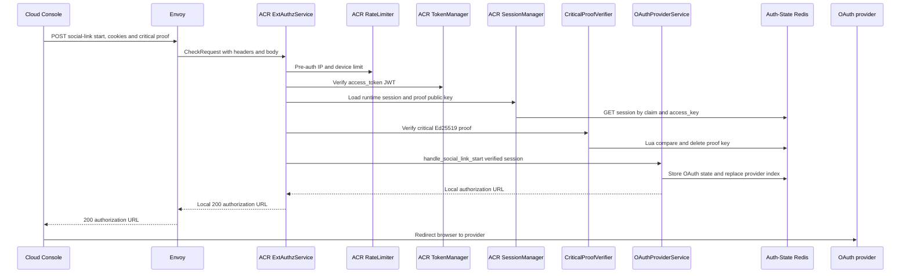
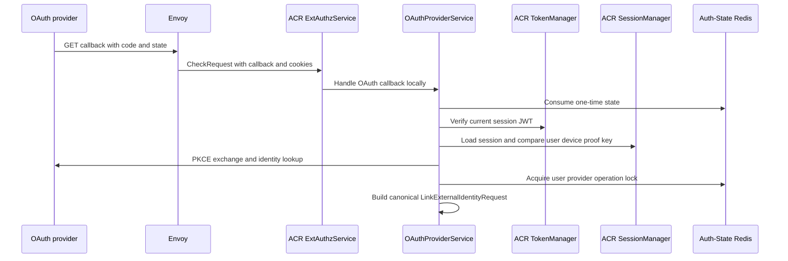
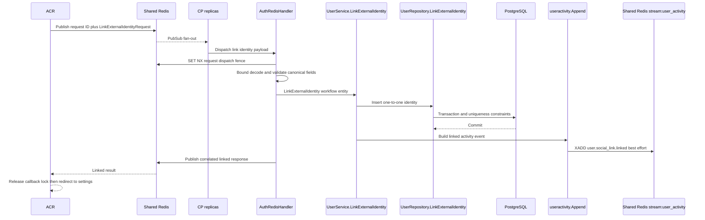

# User Social Link — God View (Master SoT)

This workflow attaches one verified Google or GitHub identity to the current
`/me` user. A user has at most one live identity per provider and a provider
subject belongs to at most one user. It does not create a session, tenant,
workspace or Zone. The current tenant context never selects the link target:
the target is always the verified self user.

## API scope and edge-routing contract

Social link is a `/me` self workflow. Its start route is ACR-local and its
callback is ACR-local before the internal Redis request/reply handoff; neither
is rewritten to `/personal` or `/tenant`, and ACR never emits `x-original-path`.
The link target is the verified session user in OAuth state, not a permission or
role-level `Authorize` decision. It is critical-session-proof gated at ACR.

| Phase | Owner | Output |
|---|---|---|
| 1. ACR authorizes link start | Console → ACR | One provider authorization URL and one short-lived state |
| 2. ACR verifies callback | Provider → ACR | Canonical verified provider identity bound to the same user and device |
| 3. Persist one-to-one link | ACR → IAM → PostgreSQL | Live identity row and best-effort account timeline event |

## Phase 1 — ACR authorizes link start

### REST input and output

| Part | Contract |
|---|---|
| Method/path | `POST /api/v1/me/critical/iam/social-link/{google|github}/start` |
| Headers used | Session cookies and session-proof challenge ID, timestamp and signature |
| Payload | `{"return_to":"/personal/settings/social-links"}` |
| Success | `200` JSON with HTTPS `authorization_url` and `expires_in` |
| Failure | Invalid proof, session, provider, body or return path fails closed |

ACR consumes the one-time critical proof before it accepts the start. It derives
user and device from the verified session, creates PKCE verifier, nonce and an
operation ID, then atomically replaces an earlier pending state for the same
user/provider. Zone and tenant are runtime-session lookup context only; neither
is carried in OAuth state or IAM identity ownership. A user may begin this
`/me` workflow while viewing a tenant, but the tenant never becomes link
authority or a return destination.

### Client → Envoy → ACR processing and local output

| Boundary | What it receives or does |
|---|---|
| Client → Envoy | Critical start path, `return_to` JSON, session cookies, and proof challenge ID, timestamp and Ed25519 signature. Client identity headers are untrusted. |
| Envoy → ACR | ExtAuthz `CheckRequest` with method, provider path, bounded body, headers and edge address. |
| ACR local | Applies CORS/rate limit, verifies JWT/key/secret/runtime session, validates and consumes the exact critical proof, validates provider and personal `return_to`, then creates operation ID, PKCE verifier, nonce and one-time OAuth state/index. |
| ACR → Envoy | Returns local `200` only with `authorization_url` and `expires_in`. No request or ACR identity headers are forwarded to IAM in this phase. Raw proof signature/timestamp are consumed and never forwarded. |

### Key contract

| Key | Store | Operation / TTL |
|---|---|---|
| `iam:session_proof:critical:{access_key}:{challenge_id}` | Auth-State Redis | Lua consume once, 60 seconds |
| OAuth state key | Auth-State Redis | Encrypted/serialized link state, at most 300 seconds |
| `iam:oauth:link:{sha256(user_id)}:{provider}` | Auth-State Redis | Pending-state index in same hash slot |

## Phase 2 — ACR verifies provider callback

The provider callback consumes state once. ACR re-verifies the current browser
session and requires the same user ID, client device ID and session proof public
key captured at start. It then performs PKCE exchange, nonce and provider claim
validation locally. Provider tokens, authorization code and raw provider JSON
never reach IAM.

### Provider → Envoy → ACR processing and internal forward

| Boundary | What it receives or does |
|---|---|
| Provider → Envoy | Callback query containing `state` and authorization `code`; browser retains the current session cookies. |
| Envoy → ACR | ExtAuthz `CheckRequest` with callback path, query, browser headers/cookies and no business-backend route yet. |
| ACR local | Consumes state once; re-verifies JWT/key/secret/session against state user, device ID and proof public key; uses tenant only to locate the current runtime session; exchanges code with PKCE; validates nonce and provider claims; acquires the per-user/provider callback lock. |
| ACR → Shared Redis/IAM | Sends `LinkExternalIdentityRequest` with `operation_id`, `user_id`, `provider`, canonical provider subject, verified-email timestamp, display name and avatar URL. Authorization code, provider tokens, nonce, PKCE verifier, raw provider JSON and browser headers do not cross. |

### Key contract

| Key | Store | Operation |
|---|---|---|
| OAuth state | Auth-State Redis | Consume once while retaining the provider index for Phase 3 fencing |
| `iam:oauth:link:{sha256(user_id)}:{provider}:lock` | Auth-State Redis | Callback lock, 15 seconds |

## Phase 3 — Persist the unique identity

ACR sends only `operation_id`, user ID and canonical identity fields in
`LinkExternalIdentityRequest` over bounded Shared Redis request/reply. IAM uses
one PostgreSQL statement. `external_identities_provider_subject_uk` prevents one
provider account from serving two users; `external_identities_user_provider_uk`
prevents two Google or two GitHub accounts for one user. A different provider
may coexist.

### Controlplane processing

This is not HTTP, so Phase 3 begins at `AuthRedisHandler` rather than Gin.
Every Controlplane replica receives `iam.auth.link_external_identity`, but only
the `SET NX iam:auth:dispatch:link_external_identity:{request_id}` winner
continues. The handler bounds/unmarshals and canonical-validates the protobuf,
then calls `UserService.LinkExternalIdentity`; the service calls
`UserRepository.LinkExternalIdentity` for the PostgreSQL uniqueness/transaction
and appends the timeline best effort before publishing the correlated reply.

After the identity transaction, `UserService.LinkExternalIdentity` calls
`useractivity.Append`, which serializes `user.social_link.linked` onto Shared
Redis `stream:{user_activity}`. This is a best-effort projection handoff:
stream failure is logged and never changes an already committed link result.

## Security and code map

- A new start is possible after a completed unlink. An unlink that holds the
  same lock invalidates pending state, so an older callback cannot link after it.
- Account identifier email and password never change. Social login never creates
  or links an account implicitly.
- Sources: `acr/src/user/oauth.rs`, `acr/src/user/session_proof.rs`,
  `proto/iam/authentication/v1/social_link.proto`, `controlplane/internal/iam/transport/pubsub/handler/auth.go`,
  `service/user_service.go`, `repository/user_repo.go`.
