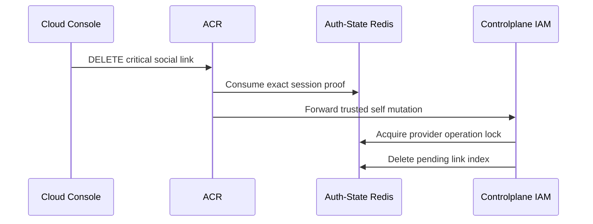
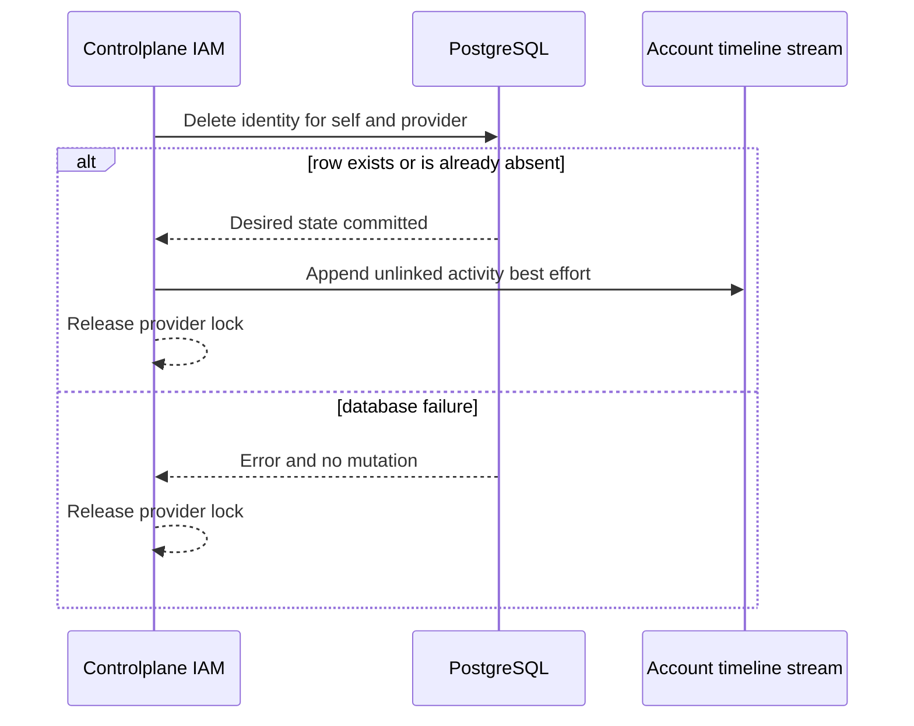

# User Social Unlink — God View (Master SoT)

This workflow removes exactly one current Google or GitHub sign-in identity
from `/me`. It hard-deletes the row. After success the provider slot is empty,
so the user may start a new link for that provider.

| Phase | Owner | Output |
|---|---|---|
| 1. Authorize and fence | Console → ACR → IAM | One consumed critical proof and provider operation lock |
| 2. Delete identity and record activity | IAM → PostgreSQL → Timeline | Absent identity row and best-effort unlink activity |

## Phase 1 — Authorize unlink and invalidate pending callback

### REST input and output

| Part | Contract |
|---|---|
| Method/path | `DELETE /api/v1/me/critical/iam/social-link/{google|github}` |
| Headers used | Session cookies and exact DELETE session-proof headers |
| Payload | Empty |
| Success path | ACR verifies and consumes proof, then IAM receives trusted proof marker |
| Failure | Missing, replayed or invalid proof is denied before IAM |

IAM acquires the same 15-second per-user/provider lock used by callbacks and
deletes the pending link index before its database mutation. Thus an already
in-flight old callback is fenced. The lock releases after the delete; a new
explicit link start is then allowed.

### Key contract

| Key | Store | Operation / TTL |
|---|---|---|
| `iam:session_proof:critical:{access_key}:{challenge_id}` | Auth-State Redis | Atomic one-time proof consume |
| `iam:oauth:link:{sha256(user_id)}:{provider}` | Auth-State Redis | Delete pending callback index |
| `iam:oauth:link:{sha256(user_id)}:{provider}:lock` | Auth-State Redis | `SET NX EX 15s`, compare-delete release |

## Phase 2 — Hard-delete link and append timeline

The repository deletes by `(user_id, provider)`. A missing row is desired-state
idempotent success. It never deletes another provider or another user's row.
After the PostgreSQL result, IAM appends `user.social_link.unlinked` to the
account timeline stream. Stream failure is logged and does not turn the durable
delete into an error.

### REST output

| Result | Headers | Payload |
|---|---|---|
| Success | `Content-Type: application/json` | `200`, `{ "provider": "google", "state": "not_linked" }` |
| Invalid provider | `Content-Type: application/json` | `400` |
| Lock or Auth-State Redis unavailable | `Content-Type: application/json` | `503`, no database mutation |

## Security and code map

- Hard delete means a detached provider subject is no longer reserved. The live
  database uniqueness constraints still enforce one-to-one ownership.
- No tenant, workspace or Zone enters the database mutation.
- Sources: `acr/src/gateway/ext_authz.rs`, `acr/src/user/session_proof.rs`,
  `controlplane/internal/iam/service/user_service.go`,
  `repository/user_repo.go`, `internal/useractivity/activity.go`.
