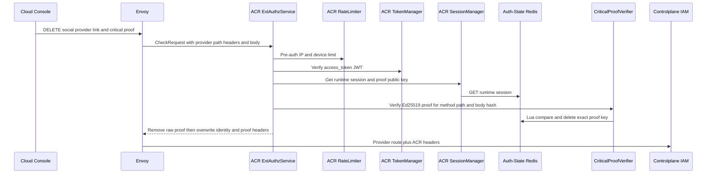
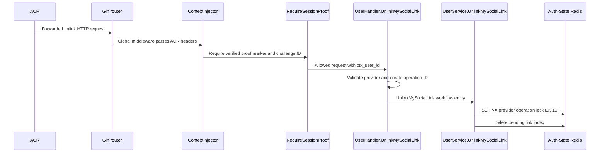
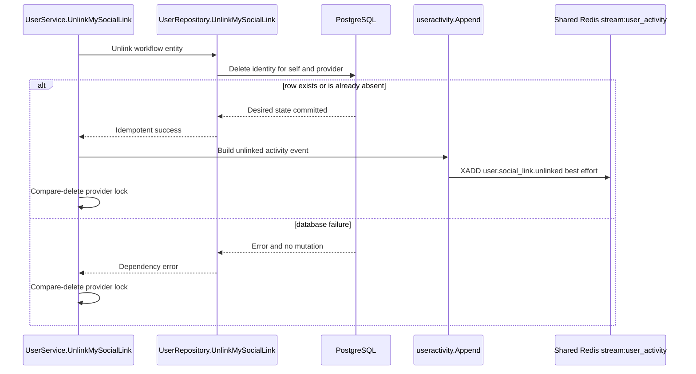

# User Social Unlink — God View (Master SoT)

This workflow removes exactly one current Google or GitHub sign-in identity
from `/me`. It hard-deletes the row. After success the provider slot is empty,
so the user may start a new link for that provider.
The currently rendered tenant, workspace and Zone never select the unlink
target: it is always the verified self user.

## API scope and edge-routing contract

This is `/me` self unlink. ACR keeps the path unchanged, does not set
`x-original-path`, and never selects `/personal` or `/tenant`. Controlplane
does not run permission/role-level `Authorize`; it uses verified `x-user-id` as
the only target. Because it is critical, ACR consumes the proof and the route
runs `RequireSessionProof` before the handler.

| Phase | Owner | Output |
|---|---|---|
| 1. ACR authorizes unlink | Console → ACR | Verified self user ID, validated provider and consumed-proof result |
| 2. IAM fences callback work | IAM → Auth-State Redis | Locked provider slot with prior pending callback invalidated |
| 3. IAM deletes identity and records activity | IAM → PostgreSQL → Timeline | Absent identity row and best-effort unlink activity |

## Phase 1 — ACR authorizes critical unlink

### REST input and output

| Part | Contract |
|---|---|
| Method/path | `DELETE /api/v1/me/critical/iam/social-link/{google|github}` |
| Headers used | Session cookies and exact DELETE session-proof headers |
| Payload | Empty |
| Success path | ACR verifies and consumes proof, then IAM receives user ID, provider and consumed-proof result |
| Failure | Missing, replayed or invalid proof is denied before IAM |

### Client → Envoy → ACR processing and forward

| Boundary | What it receives or does |
|---|---|
| Client → Envoy | Critical unlink route, session cookies and proof challenge ID, timestamp and Ed25519 signature. Client identity headers are untrusted. |
| Envoy → ACR | ExtAuthz `CheckRequest` with method, provider path, headers and empty body. |
| ACR local | Applies CORS/rate limit; verifies JWT, key/secret and session; validates exact critical proof and atomically consumes its Redis key. Invalid/replayed proof is denied locally. |
| ACR → IAM | Preserves the validated provider route and empty body; removes raw signature, timestamp and proof headers; overwrites `x-user-id`, `x-user-name`, `x-user-level`, `x-tenant-id`, `x-zone-id`, `x-client-device-id`, optional `x-workspace-id`, `x-session-proof-verified=true`, and verified `x-session-proof-challenge-id`. |

The provider must be `google` or `github`. IAM receives the ACR-overwritten
identity/proof markers, never a client-selected user or raw signature. Tenant,
workspace and Zone headers are runtime provenance only; the `/me` handler never
uses them as unlink authority or target selection.

### Key contract

| Key | Store | Operation / TTL |
|---|---|---|
| `iam:session_proof:critical:{access_key}:{challenge_id}` | Auth-State Redis | Atomic one-time proof consume |

## Phase 2 — Controlplane admits unlink and fences pending callback work

IAM acquires the same 15-second per-user/provider lock used by callbacks and
deletes the pending link index before any database mutation. Thus an already
in-flight old callback is fenced. The lock releases after Phase 3, then a new
explicit link start is allowed.

Gin routes the forwarded request through global middleware, which parses ACR
headers; route-local `RequireSessionProof` then fails closed unless ACR set the
verified marker and valid challenge ID. `UserHandler.UnlinkMySocialLink` reads
`ctx_user_id`, validates the provider and creates an operation ID before
calling `UserService.UnlinkMySocialLink`. The service alone acquires/releases
the hash-slot lock and deletes the pending callback index.

### Key contract

| Key | Store | Operation / TTL |
|---|---|---|
| `iam:oauth:link:{sha256(user_id)}:{provider}` | Auth-State Redis | Delete pending callback index |
| `iam:oauth:link:{sha256(user_id)}:{provider}:lock` | Auth-State Redis | `SET NX EX 15s`, compare-delete release |

## Phase 3 — Controlplane hard-deletes link and appends timeline

The repository deletes by `(user_id, provider)`. A missing row is desired-state
idempotent success. It never deletes another provider or another user's row.
After the PostgreSQL result, `UserService.UnlinkMySocialLink` calls
`useractivity.Append`, which serializes `user.social_link.unlinked` onto Shared
Redis `stream:{user_activity}`. Stream failure is logged and does not turn the
durable delete into an error.

### REST output

| Result | Headers | Payload |
|---|---|---|
| Success | `Content-Type: application/json` | `200`, `{ "provider": "google", "state": "not_linked" }` |
| Invalid provider | `Content-Type: application/json` | `400` |
| Lock or Auth-State Redis unavailable | `Content-Type: application/json` | `503`, no database mutation |

## Security and code map

- Hard delete means a detached provider subject is no longer reserved. The live
  database uniqueness constraints still enforce one-to-one ownership.
- No tenant, workspace or Zone enters the database mutation.
- Sources: `acr/src/gateway/ext_authz.rs`, `acr/src/user/session_proof.rs`,
  `controlplane/internal/iam/service/user_service.go`,
  `repository/user_repo.go`, `internal/useractivity/activity.go`.
