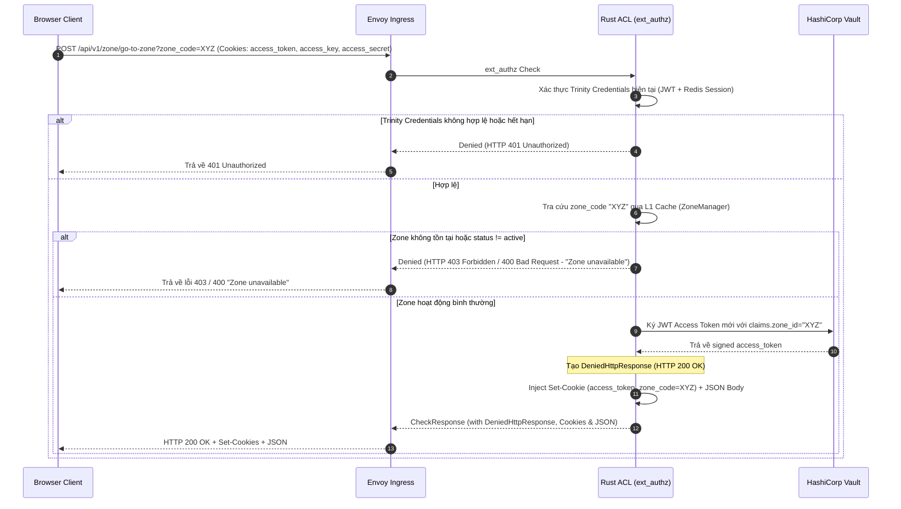

# Workflow God View: Phân Giải & Chuyển Đổi Ngữ Cảnh Vùng Dữ Liệu (User Zone Context & Switch Workflow)

## 📌 1. Tổng Quan Kiến Trúc (Architecture & Cloud-Native HA)

Hệ thống được thiết kế để hoạt động ổn định và có tính sẵn sàng cao (High Availability) trên môi trường Cloud-Native. Nhằm giảm thiểu độ trễ tối đa (Low Latency) tại cổng biên (Ingress Gateway), toàn bộ quá trình phân giải và kiểm tra Zone được xử lý bất đồng bộ/stateless tại tầng Rust ACL (`ext_authz`) thông qua bộ nhớ đệm cục bộ L1 Cache.

### 🛡️ Ràng Buộc Bảo Mật & Phòng Chống Race Condition

1. **Loại bỏ tự động ký lại JWT ngầm (No Implicit Resigning)**:
   - Các request nghiệp vụ thông thường gửi kèm mã zone không khớp với zone hiện tại trong JWT Claims sẽ bị từ chối trực tiếp với lỗi `403 Forbidden`.
   - Hệ thống **tuyệt đối không tự động ký lại JWT** trên các đường dẫn API thông thường để ngăn chặn lỗi race condition (tranh chấp token) khi client gửi nhiều request song song cùng lúc.
2. **Quy trình chuyển đổi ngữ cảnh tường minh (Explicit Context Switch)**:
   - Client bắt buộc phải gọi API `/api/v1/zone/go-to-zone?zone_code=...` để yêu cầu đổi zone.
   - Quá trình này được xử lý hoàn toàn tại tầng biên (Edge Termination) mà không cần chuyển tiếp request về các microservices phía sau hoặc gửi gRPC kiểm tra sang Go Controlplane, tiết kiệm tài nguyên mạng và tăng tốc độ xử lý.
3. **Mô hình Cookies & Token**:
   - `access_token` (JWT): Lưu trữ claim `zone_id` đã được ký số bằng HashiCorp Vault. Cookie này được bảo vệ bằng các cờ `HttpOnly`, `Secure`, `SameSite=Lax`.
   - `zone_code`: Được lưu dưới dạng cookie thông thường (không có `HttpOnly`) giúp Client UI có thể đọc trực tiếp để hiển thị trạng thái vùng dữ liệu hiện tại của người dùng.

---

## 🔄 2. Sơ Đồ Kiến Trúc & Luồng Dữ Liệu (System Architecture)

```mermaid
graph TD
    classDef client fill:#332244,stroke:#8844ff,stroke-width:2px;
    classDef gateway fill:#112233,stroke:#3388ff,stroke-width:2px;
    classDef edgeService fill:#113322,stroke:#33cc88,stroke-width:2px;
    classDef storage fill:#333311,stroke:#cccc33,stroke-width:2px;
    classDef control fill:#331111,stroke:#ff5555,stroke-width:2px;

    Client["💻 Client (Browser/UI)"]:::client
    Envoy["🛡️ Envoy Ingress Gateway"]:::gateway
    ACL["🦀 Rust ACL (ext_authz)"]:::edgeService
    Vault["🔑 HashiCorp Vault"]:::control
    Redis[("⚡ Redis L2 (Session Store)")]:::storage

    Client -- "1. Yêu cầu chuyển zone (POST /api/v1/zone/go-to-zone)" --> Envoy
    Envoy -- "2. ext_authz intercept" --> ACL
    ACL -- "3. Xác thực JWT & Redis L2" --> Redis
    ACL -- "4. Phân giải zone_code -> zone_id (L1 Cache)" --> ACL
    ACL -- "5. Ký JWT mới (Claims updated)" --> Vault
    ACL -- "6. Response 200 OK + Set-Cookie (access_token, zone_code)" --> Envoy
    Envoy -- "7. Trả cookie mới & JSON cho Client" --> Client
```

---

## 🔍 3. Chi Tiết Các Nhánh Xử Lý (Processing Branches)

### 📌 Nhánh 1: Xác Thực & Ràng Buộc Zone Trên Request Thông Thường (Route Interception)

Mỗi request nghiệp vụ đi qua Envoy Ingress sẽ được chuyển đến Rust ACL qua Ext-Authz. Rust ACL thực hiện kiểm tra đối chiếu zone tĩnh:

#### 1. Sơ đồ trình tự (Sequence Diagram - Branch 1)

```mermaid
sequenceDiagram
    autonumber
    participant UI as Browser Client
    participant Envoy as Envoy Ingress
    participant ACL as Rust ACL (ext_authz)
    participant CP as Go Control Plane (gRPC)

    UI->>Envoy: Request API (GET /api/v1/data) với cookie/header zone_code
    Envoy->>ACL: ext_authz Check (access_token, zone_code)
    ACL->>ACL: Giải mã & Verify JWT (đọc claims.zone_id)
    
    rect rgb(20, 30, 40)
        Note over ACL: Quá trình Phân giải zone_code (ZoneManager.resolve_code_to_id)
        ACL->>ACL: 1. Đọc L1 Cache (RAM HashMap)
        alt L1 Cache Hit
            Note over ACL: Trả về target_zone_id trực tiếp (Fast Path)
        else L1 Cache Miss
            ACL->>ACL: 2. Kiểm tra Negative Cache (bad_codes)
            alt Negative Cache Hit (Còn trong hạn 5 phút)
                Note over ACL: Trả về None trực tiếp (Fast Fail chống Spam)
            else Negative Cache Miss / Hết hạn
                ACL->>ACL: 3. Chờ Single Flight lock (tokio::Mutex) để tránh bão Request
                ACL->>CP: 4. Gọi gRPC get_zone_list() đồng bộ (Tần suất tối đa 5 phút/lần)
                CP-->>ACL: Trả về danh sách zone mới hoạt động
                alt Zone tìm thấy trong danh sách mới
                    ACL->>ACL: Lưu L1 Cache & cập nhật last_sync
                else Không tìm thấy
                    ACL->>ACL: Ghi vào Negative Cache (bad_codes) hạn 5 phút
                end
            end
        end
    end
    
    alt Phân giải zone_code thất bại (None)
        ACL-->>Envoy: Denied (HTTP 403 Forbidden - "Zone unavailable")
        Envoy-->>UI: Trả về lỗi 403 Forbidden ("Zone unavailable")
    else Phân giải thành công (target_zone_id)
        alt target_zone_id != claims.zone_id (Mismatch)
            ACL-->>Envoy: Denied (HTTP 403 Forbidden - "Zone unavailable")
            Envoy-->>UI: Trả về lỗi 403 Forbidden ("Zone unavailable")
        else target_zone_id == claims.zone_id (Khớp)
            Note over ACL: Thực hiện kiểm tra Ràng buộc:
            Note over ACL: - User thường không được truy cập Zone "global"
            Note over ACL: - Trạng thái của Zone phải là "active"
            alt Vi phạm ràng buộc
                ACL-->>Envoy: Denied (HTTP 403 Forbidden - "Zone unavailable")
                Envoy-->>UI: Trả về lỗi 403 Forbidden ("Zone unavailable")
            else Hợp lệ
                ACL-->>Envoy: Ok (Inject x-zone-id header)
                Envoy->>UI: Forward request to Upstream microservices
            end
        end
    end
```

#### 2. Mô tả nghiệp vụ chi tiết

- **So khớp tĩnh**: Hệ thống giải mã JWT từ cookie `access_token` để lấy `claims.zone_id`, đồng thời thực hiện phân giải `zone_code` được yêu cầu sang `target_zone_id`.
- **Cơ chế L1 Cache & gRPC Sync**:
  - **L1 Cache Hit**: Đọc trực tiếp từ HashMap bộ nhớ RAM của Rust ACL.
  - **Negative Cache Hit (Chống Spam)**: Nếu zone code không hợp lệ đã được xác định trước đó và lưu trong `bad_codes` (hạn 5 phút), hệ thống lập tức từ chối và chặn spam (Fast Fail).
  - **RPC Sync (Cache Miss & Rate-Limiting)**: Khi xảy ra cache miss thực sự, Rust ACL sử dụng **Single Flight** (Mutex khóa cục bộ) đảm bảo chỉ có tối đa một task thực hiện gọi gRPC sang **Go Control Plane (CP)** để lấy danh sách zone cập nhật (`get_zone_list`). Tần suất gọi đồng bộ tối đa là 5 phút một lần để bảo vệ hiệu năng Control Plane.
  - **Negative Cache Write**: Nếu sau khi sync qua gRPC vẫn không tìm thấy zone, ghi nhận mã zone lỗi vào `bad_codes` trong 5 phút.
- **Ngăn chặn lệch zone**: Nếu `target_zone_id` phân giải được khác với `claims.zone_id` trong JWT, hệ thống từ chối trực tiếp và trả về lỗi generic `403 Forbidden` (`"Zone unavailable"`). Không tiến hành ký lại token ngầm nhằm bảo vệ hệ thống khỏi race condition.
- **Ràng buộc an toàn**: User thường tuyệt đối bị cấm truy cập vào zone `global` (UUID rỗng) hoặc zone có trạng thái khác `active`.

---

### 📌 Nhánh 2: API Chuyển Đổi Zone Tường Minh (`POST /api/v1/zone/go-to-zone`)

Client gọi API này khi người dùng chủ động chọn chuyển đổi ngữ cảnh Zone hoạt động trên thanh Navigation Bar của giao diện UI.

#### 1. Sơ đồ trình tự (Sequence Diagram - Branch 2)

#### 2. Mô tả nghiệp vụ chi tiết

- **Xác thực phiên làm việc**: Rust ACL kiểm tra tính toàn vẹn của request thông qua bộ xác thực Trinity (JWT hợp lệ, session còn hạn trên Redis L2, hash của access_secret chính xác).
- **Phân giải Zone cục bộ**: Tra cứu và ánh xạ `zone_code` sang `zone_id` thông qua L1 cache (không gọi gRPC sang Go CP). Nếu không tìm thấy hoặc zone inactive (đối với user thường), hệ thống ghi log chi tiết lý do và trả về lỗi generic `403 Forbidden` / `400 Bad Request` với nội dung `"Zone unavailable"` để bảo mật.
- **Phát hành Token mới**: Ký lại token JWT thông qua Vault Transit Engine, cập nhật `claims.zone_id` sang ID của zone mới. Trả về cho client dưới dạng cookie để thay đổi ngữ cảnh an toàn.
- **Edge Termination**: Kết thúc luồng xử lý và phản hồi trực tiếp `200 OK` kèm JSON body `)]}',\n{"zone_code": "xyz"}` tại Envoy Gateway (Ext-Authz Denied Response), không chuyển tiếp request đến bất kỳ backend microservice nào.

---

## 🏛️ 4. Bản Đồ Tham Chiếu File Mã Nguồn (Implementation References)

- **Định nghĩa Ext-Authz gRPC Server**: [ext_authz.rs](../../acl/src/service/ext_authz.rs#L54-L404) - Lắng nghe request, định tuyến các API đặc biệt và ủy quyền xử lý phân giải zone.
- **Dịch vụ Phân giải & Xác thực Ràng buộc Zone**: [zone_resolution.rs](../../acl/src/service/zone_resolution.rs#L61-L198) - Đối chiếu `claims_mismatch` và thực thi các ràng buộc bảo mật đối với Zone.
- **Bộ quản lý Zone Cache cục bộ (L1 Cache)**: [zone.rs](../../acl/src/core/zone.rs) - Lưu trữ danh sách map giữa `zone_code` và `zone_id`/`status`.
- **API Chuyển đổi Zone tường minh**: [zone_switch.rs](../../acl/src/service/zone_switch.rs) - File mới triển khai hàm xử lý `handle_zone_switch` phục vụ API `/api/v1/zone/go-to-zone`.
