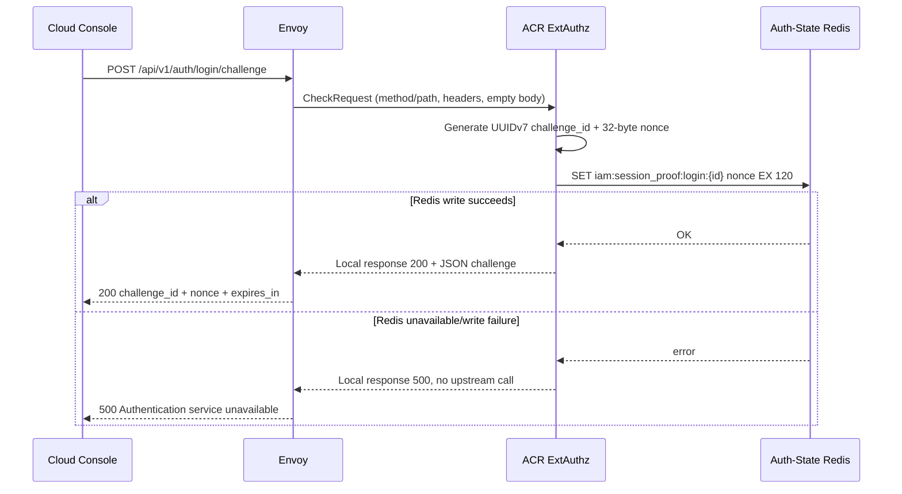
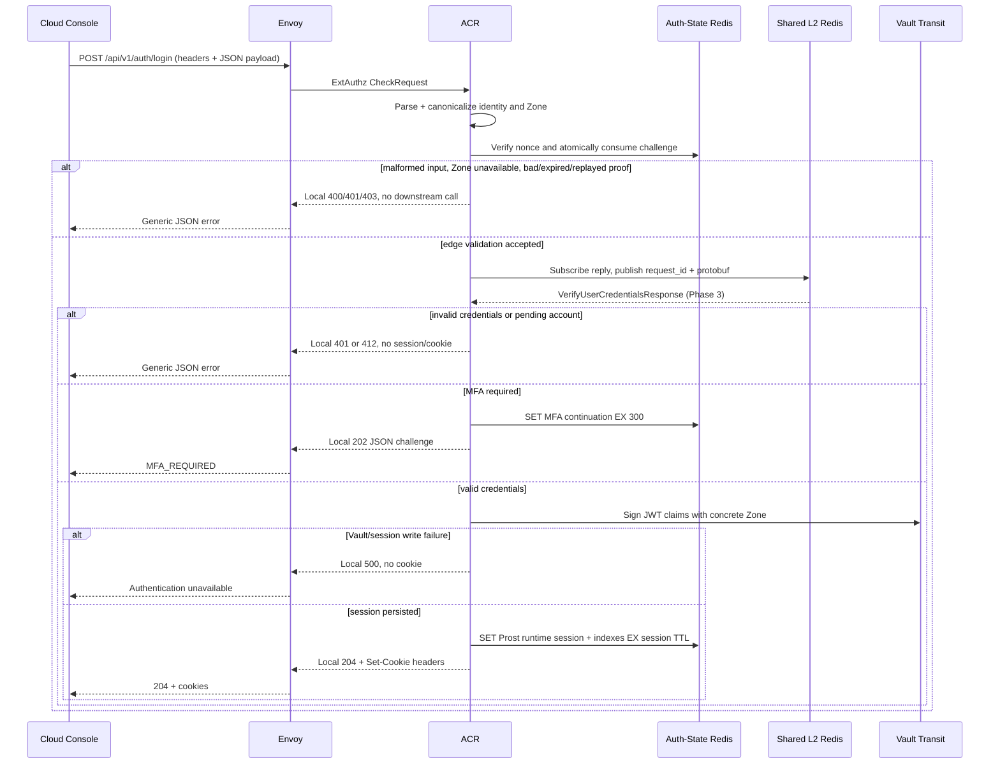
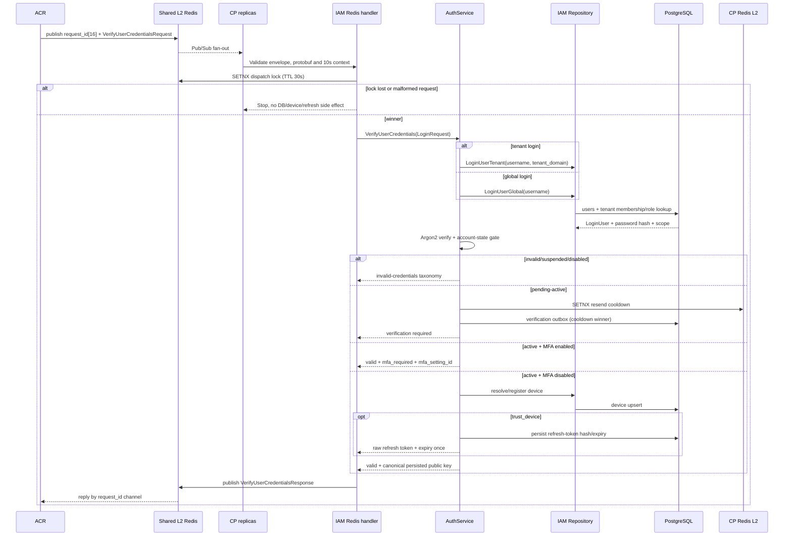

# Username Login — God View (Master SoT)

SoT cho đăng nhập bằng `username` + password. Tài liệu chỉ giữ trace cần thiết
để refactor: REST boundary ở ACR, transport boundary và các layer IAM ở
Controlplane. [Social OAuth login](social_login_god_view_workflow.md) và MFA
enrollment là workflow riêng; MFA gate trong login chỉ được ghi ở điểm chuyển
trạng thái.

## Contract at a glance

| Phase | Owner | Input | Output |
|---|---|---|---|
| 1. Challenge | Envoy + ACR | REST request không body | REST `200` challenge hoặc `500` |
| 2. ACR login | Envoy + ACR | REST headers + canonical JSON payload | Internal protobuf handoff hoặc REST `204/202/4xx/5xx` |
| 3. Controlplane IAM | Redis handler + IAM service/repository | `request_id[16] || VerifyUserCredentialsRequest` | `VerifyUserCredentialsResponse` trên reply channel |

**Durable SoT:** Controlplane PostgreSQL (`users`, tenant membership/domain,
devices, refresh tokens, IAM outbox).

**Runtime SoT:** ACR Auth-State Redis (nonce, MFA continuation, runtime
session).

**Transport:** Shared L2 Redis Pub/Sub, channel
`iam.auth.verify_credentials`, timeout 10s.

**Identity:** `username` không chứa `@`; `tenant_domain` là field riêng.

**Zone:** user session bắt buộc Zone UUID cụ thể, trạng thái `active` hoặc
`draining`; không fallback sang `global`.

**JWT:** ACR dựng claims và ký qua Vault Transit; Controlplane không phát
cookie và không giữ raw signing key.

## Phase 1 — Issue login proof challenge (Client → ACR)

Login proof challenge là nonce ngắn hạn do ACR phát trước khi nhận password.
Mục đích là để client chứng minh đang giữ private key tương ứng và chặn replay
trước khi request được chuyển sang Controlplane.

### REST input

| Part | Contract |
|---|---|
| Method/path | `POST /api/v1/auth/login/challenge` |
| Headers | `Origin` dùng cho CORS/allowed-origin enforcement; `Cookie` chỉ được đọc để lấy `client_device_id` cho pre-auth rate limit |
| Payload | Không có body |

### Processing and REST output

ACR tạo `challenge_id` UUIDv7 và nonce 32 byte, sau đó ghi
`iam:session_proof:login:{challenge_id}` vào Auth-State Redis với `EX 120`.

#### Response headers

| Result | Headers |
|---|---|
| `200` / `500` | `Content-Type: application/json` |

#### Response payload

| Result | Payload fields |
|---|---|
| `200` | `challenge_id`, `nonce`, `expires_in` |
| `500` | `error_message` |

Không có request nào được chuyển tới Controlplane trong Phase 1.

### Key contract

`{challenge_id}` là UUIDv7 vừa trả cho client. Challenge không dùng L1 cache;
chỉ edge rate limiter có L1 block cache. Challenge phải được ghi trực tiếp vào
Auth-State Redis để mọi ACR replica cùng nhìn thấy.

| Key/pattern | Store | Type/operation | TTL / timeout | Owner / invariant |
|---|---|---|---|---|
| `iam:session_proof:login:{challenge_id}` | Auth-State Redis | String nonce; `SET` khi issue, `GET` rồi Lua compare-and-delete khi verify | `EX 120s` | ACR; single-use, replay hoặc missing key phải fail-closed |
| `pre:ip:{client_ip}:auth_public` → `ratelimit:pre:ip:{client_ip}:auth_public` | ACR Moka L1 → Auth-State Redis L2 | L1 chỉ giữ block marker; L2 `INCR` + `EXPIRE` | L1 block `30s`; L2 window `60s` (tối đa `30` request/IP) | Edge pre-auth limiter; Redis lỗi hiện tại fail-open |
| `pre:device:{device_id}:auth_public` → `ratelimit:pre:device:{device_id}:auth_public` | ACR Moka L1 → Auth-State Redis L2 | L1 chỉ giữ block marker; L2 `INCR` + `EXPIRE` | L1 block `30s`; L2 window `60s` (tối đa `8` request/device) | Edge pre-auth limiter; chỉ có khi cookie có `client_device_id` |
| Không có workflow-specific L1 key cho nonce | ACR process memory | Không cache challenge/nonce | — | Không được suy luận nonce từ local state hoặc replica khác |



## Phase 2 — Process username login at ACR (Client → ACR)

Phase này nhận REST payload đã ký, kiểm tra toàn bộ input ở trust boundary ACR,
canonicalize identity/Zone và chỉ handoff request hợp lệ sang Controlplane.
ACR cũng nhận CP result để issue runtime session và trả HTTP response.

### REST input

#### Headers

| Header | Use |
|---|---|
| `User-Agent` | Forward vào CP làm device/audit metadata; có thể rỗng |
| `X-Forwarded-For` | Envoy-provided client IP; không lấy từ JSON |
| `Origin` | CORS/allowed-origin enforcement ở edge |
| `Cookie` | Đọc `client_device_id` để áp dụng pre-auth rate limit; không dùng làm credential |

#### JSON payload

```json
{
  "username": "alice",
  "password": "<secret>",
  "tenant_domain": "acme.example",
  "zone_code": "vn",
  "device_name": "Chrome",
  "device_type": "browser",
  "device_public_key": "<base64-ed25519-32-bytes>",
  "session_proof_challenge_id": "<uuid-v7>",
  "session_proof_timestamp": 1784450000,
  "session_proof_signature": "<base64-ed25519-signature>",
  "trust_device": false
}
```

`username` và `tenant_domain` được trim/lowercase; UI có thể cho nhập
`username@domain` nhưng wire payload phải tách hai field. ACR tự tạo
`client_device_id`; client không được quyết định user/tenant/Zone UUID.

#### Username/domain split

| UI input | Wire `username` | Wire `tenant_domain` | Result |
|---|---|---|---|
| `alice` | `alice` | empty | Global identity lookup |
| `alice@acme.example` | `alice` | `acme.example` | Tenant membership lookup |
| Raw wire `username: "alice@acme.example"` | Contains `@` | any | ACR rejects with `400` |

`tenant_domain` rỗng chỉ chọn global lookup; nó không làm session trở thành
global. Session user vẫn phải có Zone UUID cụ thể.

### ACR processing and outputs

1. Parse body, canonicalize username/domain/Zone.
2. Resolve Zone từ Shared Redis + Auth Redis; chỉ nhận UUID khác nil với trạng
   thái `active` hoặc `draining`.
3. Load nonce, verify Ed25519 signature, rồi atomic compare-and-delete challenge.
4. Subscribe reply trước, publish `request_id[16] || protobuf` sang Phase 3.
5. Map CP response; khi success ký JWT qua Vault Transit, ghi Prost runtime
   session vào Auth-State Redis và set cookies.

#### Response headers

| Result | Headers |
|---|---|
| `400/401/403/412/202/500` | `Content-Type: application/json` |
| Success `204` | `Set-Cookie: access_token`, `access_key`, `access_secret`, `client_device_id`, `tenant_id`, `zone_code`; optional `refresh_token` |

#### Response payload

| Result | Payload fields |
|---|---|
| `400/401/403/500` | `error_message`; optional `error_code` |
| Pending `412` | `error_code=ACCOUNT_VERIFICATION_REQUIRED`, `error_message`, `verification_email_queued` |
| MFA `202` | `error_code=MFA_REQUIRED`, `mfa_required`, `challenge_id`, `expires_in`, `methods` |
| Success `204` | Empty body |

When `trust_device=true`, the refresh token and expiry come from CP; ACR only
writes the HttpOnly cookie and never mints a second token.

### ACR forward contract to Phase 3

| Forwarded item | Source at ACR | Constraint |
|---|---|---|
| Canonical `username`, optional `tenant_domain` and concrete `zone_code` | Strict parsed body and ACR Zone resolution | Raw `username@domain`, global Zone and invalid Zone never cross this boundary |
| Password | Original bounded JSON body | Sent only in `VerifyUserCredentialsRequest`; never logged, cached or returned |
| Verified public key, generated `client_device_id`, device name/type, trust flag, client IP and user agent | Verified proof, ACR generation and edge metadata | Client cannot choose another user's identity, tenant UUID or device ID |
| Correlation request ID | ACR | Binds one Shared L2 request/reply exchange to one proof consume |
| Raw session-proof nonce/signature and browser cookie | ACR/Auth-State Redis and browser | Consumed or read locally; never forwarded to Controlplane |

### Key contract

`{normalized_zone_code}` là `trim().to_ascii_lowercase()`; các placeholder UUID
giữ dạng canonical string. Các channel bên dưới là tên transport, không phải
Redis key/value, nhưng được ghi cùng bảng để trace request/reply end-to-end.

| Key / transport name | Store | Type/operation | TTL / timeout | Owner / purpose |
|---|---|---|---|---|
| `iam:session_proof:login:{challenge_id}` | Auth-State Redis | String nonce; `GET` + atomic compare-and-delete | `EX 120s` từ Phase 1 | ACR; proof hợp lệ chỉ được dùng một lần |
| `pre:ip:{client_ip}:auth_public` → `ratelimit:pre:ip:{client_ip}:auth_public` | ACR Moka L1 → Auth-State Redis L2 | L1 chỉ giữ block marker; L2 `INCR` + `EXPIRE` | L1 block `30s`; L2 window `60s` (tối đa `30` request/IP) | Edge pre-auth limiter; chạy trước login handler |
| `pre:device:{device_id}:auth_public` → `ratelimit:pre:device:{device_id}:auth_public` | ACR Moka L1 → Auth-State Redis L2 | L1 chỉ giữ block marker; L2 `INCR` + `EXPIRE` | L1 block `30s`; L2 window `60s` (tối đa `8` request/device) | Edge pre-auth limiter; key lấy từ cookie nếu có |
| `code_to_id[{normalized_zone_code}]` | ACR process-local L1 | Found/negative entry; lookup + refresh | Found `30s`; negative `180s` | ACR zone resolver; logical L1 key, không phải Redis key |
| `id_to_status[{zone_id}]` | ACR process-local L1 | Zone status entry | Found `30s` | ACR zone resolver |
| `id_to_name[{zone_id}]` | ACR process-local L1 | Zone name entry | Found `30s` | ACR zone resolver |
| `zone:code:{normalized_zone_code}` | Shared L2 Redis | String `zone_id:status`; `GET`, positive `SET EX`, negative value `NOT_FOUND` | Positive `86400s`; negative `180s` | ACR zone resolver; L2 fallback/source for L1 |
| `iam.auth.verify_credentials` | Shared L2 Redis Pub/Sub | Request channel; publish protobuf envelope | Request context `10s` | ACR publishes to CP replicas |
| `iam.auth.verify_credentials.reply.{request_id}` | Shared L2 Redis Pub/Sub | Per-request reply channel; subscribe/publish protobuf | Waiter timeout `10s` | ACR waits; CP winner replies once |
| `iam:mfa:challenge:{challenge_id}` | Auth-State Redis | JSON MFA continuation; `SET NX`, later `GET` | `EX 300s` | ACR; binds user, tenant, Zone, MFA setting and device context |
| `iam:user_session:{zone_id}:{tenant_id}:{user_id}:{access_key}` | Auth-State Redis | Prost `UserAccessSession` bytes; `SET` + `EXPIRE` | `SESSION_TTL_SECS` | ACR runtime session authority |
| `iam:user_access_index:{user_id}` | Auth-State Redis | Set of full session keys; `SADD` + `EXPIRE` | `3 × SESSION_TTL_SECS` | ACR device-cap/eviction index |
| `iam:device_access_index:{device_id}` | Auth-State Redis | Set of full session keys; `SADD` + `EXPIRE` | `3 × SESSION_TTL_SECS` | ACR device session index |



## Phase 3 — Controlplane IAM processing (ACR → Controlplane)

Đây không phải REST API. Controlplane nhận request/reply qua Shared L2 Redis;
chỉ replica thắng dispatch lock được phép chạm PostgreSQL hoặc phát refresh
side effect.

### Internal input/output

| Part | Contract |
|---|---|
| Channel | `iam.auth.verify_credentials`; reply `iam.auth.verify_credentials.reply.{request_id}` |
| Envelope | 16-byte UUID `request_id` + protobuf bytes |
| Request protobuf | `VerifyUserCredentialsRequest` |
| Response protobuf | `VerifyUserCredentialsResponse` |
| Timeout | Handler context 10s; dispatch lock TTL 30s |

Request fields used:

| Field | Meaning |
|---|---|
| `username`, `tenant_domain` | ACR canonical identity/context |
| `password` | Client secret, bounded request memory only |
| `public_key` | ACR-verified Ed25519 key |
| `client_device_id` | ACR-generated UUID |
| `device_name`, `device_type`, `client_ip`, `user_agent` | Device/audit metadata |
| `trust_device` | Refresh-token decision only |

Response fields consumed by ACR: `valid`, `user_id`, `level`, `tenant_id`,
`client_device_id`, `username`, `client_proof_public_key`,
`refresh_token`, `refresh_token_expires_at`, `mfa_required`, `mfa_setting_id`,
`error_message`.

### Layer processing

1. **Redis transport handler** — validate envelope/protobuf/required fields,
   acquire `SETNX iam:auth:dispatch:verify_credentials:{request_id}`, map
   domain errors to generic protobuf response, never log password.
2. **IAM application service** — choose `LoginUserGlobal` or
   `LoginUserTenant`, verify Argon2, apply account state, check MFA before
   device/refresh side effects, coordinate device and refresh services.
3. **Repository/domain boundary** — enforce user lookup, tenant membership and
   role scope; global login must not infer tenant from client input.
4. **PostgreSQL persistence** — own user state, password hash, device binding,
   refresh-token hash/expiry and verification outbox. Redis is only transport,
   cooldown and runtime state.
5. **Reply adapter** — marshal `VerifyUserCredentialsResponse` and publish once;
   ACR remains JWT/session/cookie owner.

### Key contract

`{request_id}` là UUID lấy từ 16-byte envelope; `{user_id}` là UUID của user
đã resolve từ PostgreSQL. Controlplane không có workflow-specific L1 key cho
username login: repository/DB vẫn là authority cho identity, membership và
password hash.

| Key / transport name | Store | Type/operation | TTL / timeout | Owner / purpose |
|---|---|---|---|---|
| `iam.auth.verify_credentials` | Shared L2 Redis Pub/Sub | Request channel; handler nhận envelope + protobuf | Handler context `10s` | CP Redis handler nhận fan-out từ ACR |
| `iam.auth.verify_credentials.reply.{request_id}` | Shared L2 Redis Pub/Sub | Reply channel; publish `VerifyUserCredentialsResponse` | ACR waiter `10s` | CP winner trả lời về đúng request |
| `iam:auth:dispatch:verify_credentials:{request_id}` | Shared L2 Redis | String dispatch lock; `SETNX` value `1` | `30s` | CP handler; chỉ winner được chạm DB/phát side effect |
| `iam:account_verify:resend_cooldown:{user_id}` | CP Redis L2 | String cooldown; `SETNX` value `1` | `60s` | IAM service; chỉ nhánh `pending_active`, publish lỗi thì `DEL` best-effort |
| Không có workflow-specific L1 key | CP process-local L1 | Không cache credential, membership hoặc role trong login path | — | Không được dùng local cache để thay authority PostgreSQL |
| `users`, tenant membership/domain, `devices`, `refresh_tokens`, verification outbox | Controlplane PostgreSQL | Durable rows/transactions; repository reads/writes | Theo domain retention | CP repository/service; durable source of truth |



## State and security invariants

- Login nonce lives only in Auth-State Redis with TTL 120s and is consumed by
  atomic compare-and-delete; replay never reaches Phase 3.
- Every user session contains one concrete, non-nil Zone UUID; no `global`
  fallback.
- Only the CP dispatch-lock winner may touch PostgreSQL or issue refresh state.
- Pending, suspended and disabled accounts never receive device, refresh,
  runtime session or cookie. Pending password success may trigger only one
  verification resend per cooldown window.
- MFA primary success returns `MFA_REQUIRED` before device/refresh persistence;
  continuation binds user, tenant, Zone and `mfa_setting_id`.
- CP returns the canonical persisted public key; ACR never stores an unverified
  browser key as runtime proof state.
- Shared Redis, CP, Vault or Auth-State failure is fail-closed: no authenticated
  response and no cookies.
- Public errors are generic; logs/metrics use reason classes and correlation
  IDs, never username, password, raw token, signature or key material.

## Code map

| Layer | Source |
|---|---|
| UI challenge/login/signing | [`cloud-console/src/features/auth/api.ts`](../../cloud-console/src/features/auth/api.ts), [`cloud-console/src/lib/security/deviceKey.ts`](../../cloud-console/src/lib/security/deviceKey.ts) |
| Envoy/ACR interception | [`acr/src/gateway/ext_authz.rs`](../../acr/src/gateway/ext_authz.rs), [`acr/src/user/login.rs`](../../acr/src/user/login.rs) |
| ACR proof/session/Vault | [`acr/src/user/session_proof.rs`](../../acr/src/user/session_proof.rs), [`acr/src/user/session.rs`](../../acr/src/user/session.rs), [`acr/src/token.rs`](../../acr/src/token.rs) |
| Shared contract | [`proto/iam/authentication/v1/login.proto`](../../proto/iam/authentication/v1/login.proto) |
| CP Redis handler | [`controlplane/internal/iam/transport/pubsub/handler/auth.go`](../../controlplane/internal/iam/transport/pubsub/handler/auth.go) |
| CP service | [`controlplane/internal/iam/service/auth_service.go`](../../controlplane/internal/iam/service/auth_service.go) |
| CP repository/device/refresh | [`controlplane/internal/iam/repository/auth_repo.go`](../../controlplane/internal/iam/repository/auth_repo.go), [`controlplane/internal/iam/service/device_self_service.go`](../../controlplane/internal/iam/service/device_self_service.go) |

## Change rule

Khi đổi username/tenant canonicalization, REST payload/header, proof message,
protobuf field, Zone gate, device/refresh transaction hoặc session issuance:

1. cập nhật file này cùng change-set;
2. trace lại đủ ba phase và ba sequence diagram;
3. cập nhật UI, ACR, protobuf và Controlplane contract tests;
4. không thêm alias `username@domain` hoặc fail-open fallback nếu chưa có
   migration/removal date rõ ràng.
