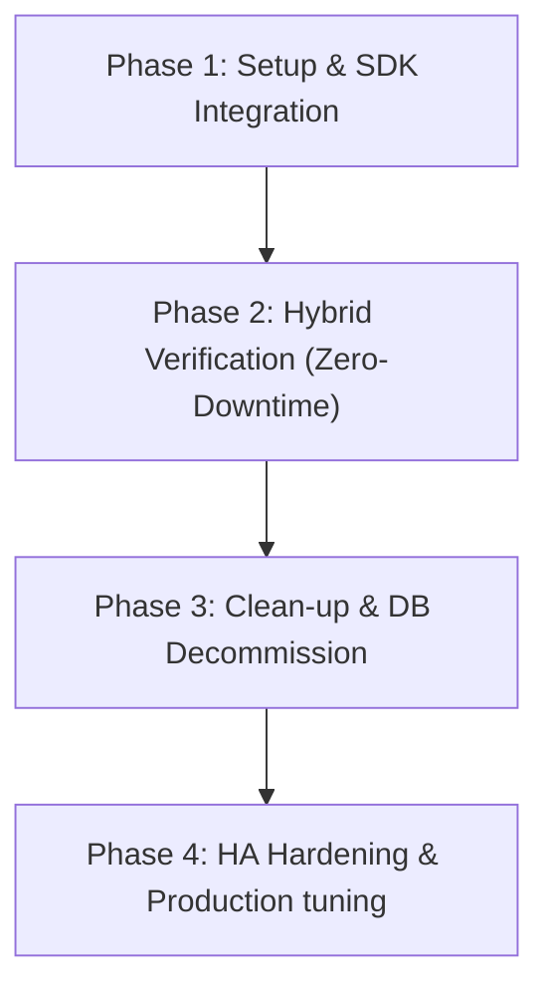

# Secret Migration Plan: PostgreSQL Active-Standby to HashiCorp Vault

> [!NOTE]
> Tài liệu này đóng vai trò là **Source of Truth (SoT)** cho quy trình dịch chuyển cơ chế quản lý khóa ký JWT từ Database (Active-Standby) sang HashiCorp Vault.
> Tất cả các bước triển khai, thiết lập code, và kịch bản rollback phải tuân thủ đặc tả này để bảo đảm tính sẵn sàng cao (HA) và không làm gián đoạn người dùng (Zero-Downtime).

---

## 🗺️ Bản Đồ Lộ Trình (Migration Roadmap)

Quy trình dịch chuyển được chia làm **4 Phase** rõ rệt:

---

## 🏗️ Chi Tiết Từng Phase

### 📍 Phase 1: Setup & SDK Integration (Hạ tầng & Kết nối Vault)

* **Mục tiêu**: Thiết lập kết nối ổn định từ Controlplane đến Vault, kích hoạt Transit Engine và chuẩn bị sẵn các khóa ký.
* **Các bước thực hiện**:
  1. **Cấu hình Môi trường**: Thêm các biến môi trường vào `.env` của controlplane:
     * `VAULT_ADDR=http://vault:8200`
     * `VAULT_TOKEN=myroot` (Token dev mặc định)
  2. **Tích hợp SDK**: Khởi tạo client kết nối Vault trong Go (`controlplane/internal/security/vault.go`).
  3. **Auto Bootstrap Transit Engine**: Khi controlplane khởi động, kiểm tra xem `transit` secrets engine đã được enable chưa. Nếu chưa -> tự động kích hoạt và tạo khóa đối xứng đặt tên là `jwt-signer`.
  4. **Health Check & Telemetry**: Thêm Vault Healthcheck vào hệ thống giám sát để phát hiện sớm lỗi kết nối.

---

### 📍 Phase 2: Hybrid Verification & Coexistence (Xác thực lai - Tránh Logout người dùng)

* **Mục tiêu**: Ký mới bằng Vault nhưng cho phép giải mã song song bằng cả Vault và khóa cũ từ Database để tránh logout toàn bộ người dùng đang online.
* **Cơ chế xử lý**:
  * **Khi Ký Mới (Sign)**:
    * Tất cả các JWT token được tạo ra tại `/login` sẽ sử dụng API `/transit/encrypt/jwt-signer` hoặc gọi trực tiếp khóa từ Vault Transit để ký.
  * **Khi Xác Thực (Verify)**:
    * Khi middleware `access` (ACL) nhận token:
      1. Thử gửi chữ ký JWT lên Vault Transit để kiểm chứng trước.
      2. Nếu Vault báo thành công -> Tiếp tục xử lý.
      3. Nếu Vault báo lỗi (do token cũ được ký bằng khóa cũ của DB) -> Tự động chuyển hướng verify bằng cặp khóa `Active/Standby` được lấy từ Postgres (Fallback path).
  * **Phòng chống Race Condition**:
    * Việc nạp khóa cũ từ DB vẫn duy trì cache L1 để giảm tải cho DB.
    * Thời gian chạy chế độ lai (Hybrid) bắt buộc phải kéo dài ít nhất **30 phút** (bằng thời gian sống lớn nhất của Access Token) để đảm bảo toàn bộ token cũ hết hạn tự nhiên.

---

### 📍 Phase 3: Clean-up & DB Decommission (Dọn dẹp & Loại bỏ Database Storage)

* **Mục tiêu**: Gỡ bỏ hoàn toàn mã nguồn cũ liên quan đến việc lưu trữ khóa ở DB và dọn dẹp hệ thống.
* **Các bước thực hiện**:
  1. Gỡ bỏ fallback path kiểm tra khóa từ Database trong ACL middleware.
  2. Xóa bảng `core.core_secrets` khỏi cơ sở dữ liệu Postgres.
  3. Xóa các helper mã hóa cục bộ cũ (`security.EncryptSecretBytes`, `security.DecryptSecretBytes`) nhằm tinh gọn codebase, tránh rác kỹ thuật (technical debt).
  4. Tích hợp nạp các cấu hình nhạy cảm khác như mật khẩu SMTP, OTP Secret vào Vault **KV Secrets Engine** (Key-Value) thay vì lưu DB mã hóa AES thủ công.

---

### 📍 Phase 4: HA Hardening & Production Tuning (Tối ưu hóa HA & Bảo mật Production)

* **Mục tiêu**: Nâng cấp hệ thống lên mức chịu tải cao, an toàn bảo mật tuyệt đối cho môi trường live.
* **Các bước thực hiện**:
  1. **Vault AppRole Authentication**: Thay thế root token tĩnh bằng cơ chế AppRole (phân cấp RoleID và SecretID động cho từng replica) trước khi deploy live.
  2. **Token Verification Cache (L1 Cache)**:
     * Để tránh nghẽn cổ chai (Bottleneck) khi mọi request API đều phải gọi REST API sang Vault để verify chữ ký, ta có thể lưu kết quả kiểm chứng chữ ký token (chỉ lưu hash chữ ký và trạng thái hợp lệ, không lưu payload nhạy cảm) vào in-memory cache L1 trong thời gian ngắn (ví dụ: 10 giây).
  3. **HA Failover handling**: Cấu hình cơ chế tự động thử lại (Retry with Exponential Backoff) trên SDK Vault client khi gặp sự cố mạng (HTTP 5xx).

---

## 🔒 Phân Tích An Toàn Bảo Mật & Concurrency (Zero-Trust Guard)

1. **Ủy thác ký (Signing Delegation)**:
   * Go backend không bao giờ được lưu giữ khóa JWT thô trong memory. Mọi thao tác ký/xác thực đều gửi payload lên Vault qua gRPC/REST.
2. **Khóa tạm thời lúc khởi động (Bootstrapping Locks)**:
   * Trong quá trình tự động khởi tạo khóa Transit lúc container startup, tất cả replica sẽ khởi động song song. Ta cần dùng Postgres Advisory Lock hoặc Vault Check-and-Set (CAS) để đảm bảo chỉ có duy nhất một replica thực hiện lệnh `enable engine` và `create key` tránh lỗi `resource already exists` hoặc overwrite khóa mới làm mất khóa cũ.
3. **Cơ chế Fail-Closed**:
   * Nếu Vault Cluster không phản hồi (Network Partition), hệ thống sẽ trả về lỗi `503 Service Unavailable` thay vì cho qua request, đảm bảo an toàn tuyệt đối cho dữ liệu.
