<!-- markdownlint-disable MD033 -->
# Zone Catalog Matrix - Workflow God View

> [!NOTE]
> Tài liệu này đóng vai trò là **Source of Truth (SoT) / God View** cho luồng lấy danh mục Zone (Zone Catalog API Interception) theo Ma trận phân quyền.
> Toàn bộ logic lọc dữ liệu dựa trên vai trò (Role), trạng thái đăng nhập, và trạng thái vận hành của Zone được thực thi trực tiếp tại **acr Service (Rust - Edge Gateway Authz)** để đảm bảo hiệu năng cực hạn, Zero-DDoS Controlplane, và tính sẵn sàng cao (High Availability).

---

## 🗺️ 1. Giới Thiệu & Đột Phá Kiến Trúc

### Canonical Hierarchy contract

Zone Catalog thuộc domain **Hierarchy**. Route admin canonical là
`/admin/hierarchy/zones/catalog`, Protobuf descriptor package là
`hierarchy.rpc`, và Controlplane observability dùng namespace `hierarchy`.
Không có compatibility alias `/admin/core/...` hoặc `core.rpc`: ACR,
Controlplane và các client phải cut over đồng thời. Các field number/wire type
của message Zone không đổi nên Protobuf binary trên Shared Redis vẫn tương
thích; chỉ descriptor và full gRPC method name thay đổi.

### ❓ Phân hệ Zone Catalog tại Biên là gì?

Trước đây, khi client (Browser/App) gọi API lấy danh sách các Zone hoạt động để hiển thị ở Dropdown/Select UI, yêu cầu phải đi qua Envoy Gateway, chuyển tiếp tới Control Plane (Go), kích hoạt middleware xác thực, và truy vấn thông qua L1 sharded cache hoặc PostgreSQL DB. Luồng này tạo ra gánh nặng không cần thiết lên Controlplane và làm tăng độ trễ (latency).

**Đột phá kiến trúc mới:**

1. **Local Intercept (Đánh chặn tại biên)**: Envoy Ext_Authz (acr Service) trực tiếp đánh chặn các HTTP requests dạng `GET /admin/hierarchy/zones/catalog` và `GET /api/v1/zones/catalog`.
2. **L1 RAM Cache & Single Flight (Đồng bộ bất đối xứng)**: acr Service tự quản lý L1 cache và refresh bằng Protobuf request/reply qua Shared Redis nội vùng Central. Single-flight có recheck freshness sau lock để một burst chỉ tạo tối đa một refresh.
3. **Local Response (Không Upstream HTTP)**: acr biên dịch JSON và trả trực tiếp `200 OK` bằng Local Denial payload của Envoy. Cache hit không chạm Controlplane; cache miss/stale chỉ dùng bounded Shared Redis refresh, không forward HTTP request sang Controlplane.

---

## 🔑 2. Ma Trận Phân Quyền & Hiển Thị (Access Matrix Catalog)

Dưới đây là ma trận phân bổ hiển thị danh sách Zone dựa trên trạng thái xác thực và quyền hạn của client:

| Trạng thái Đăng nhập | Phân quyền (Role trong JWT) | Route HTTP Path | Zones hiển thị | Có Zone `global`? |
| :--- | :--- | :--- | :--- | :--- |
| **Đã đăng nhập** | `sub == "sre"` | `/admin/hierarchy/zones/catalog` | Toàn bộ Zones trong DB (Active, Planned, Draining, Maintenance, Disabled) | **Có** (Virtual Zone code `"global"`) |
| **Đã đăng nhập** | `sub == uuid` | `/api/v1/zones/catalog` | Chỉ các Zone có status: `active` hoặc `draining` | **Không** (Bắt buộc vào zone cụ thể) |
| **Chưa đăng nhập** | **Khách hàng vãng lai (Anonymous)** | `/admin/hierarchy/zones/catalog` (Trang login admin) | Các Zone có status: `active` hoặc `draining` | **Có** (Virtual Zone code `"global"`) |
| **Chưa đăng nhập** | **Khách hàng vãng lai (Anonymous)** | `/api/v1/zones/catalog` (Trang login user) | Các Zone có status: `active` hoặc `draining` | **Không** |

### 🛠️ Chi tiết Virtual Zone "global" (Admin Only)

- **Zone Code**: `"global"`
- **Zone Name**: `"Global Zone"`
- **Zone ID ảo (Internal ID)**: `00000000-0000-0000-0000-000000000000`
- **Mục đích**: Cho phép Admin/SRE có quyền quản trị toàn cục không bị bó hẹp trong phạm vi địa lý hay cụm vật lý.

---

## 🌐 3. Sơ Đồ Kiến Trúc Tổng Quan (System Architecture)

Sơ đồ dưới đây mô tả cách Envoy Gateway định tuyến ext_authz và cách acr Service trả local response hoặc refresh cache qua Shared Redis:

```mermaid
graph TD
    classDef client fill:#332244,stroke:#8844ff,stroke-width:2px;
    classDef gateway fill:#112233,stroke:#3388ff,stroke-width:2px;
    classDef edgeService fill:#113322,stroke:#33cc88,stroke-width:2px;
    classDef storage fill:#333311,stroke:#cccc33,stroke-width:2px;
    classDef control fill:#331111,stroke:#ff5555,stroke-width:2px;

    UI["💻 Browser / App UI"]:::client
    Envoy["🛡️ Envoy Gateway (Edge Proxy)"]:::gateway
    acr["🛡️ acr Service (Rust - Ext_Authz)"]:::edgeService
    L1Cache["⚡ L1 Cache (RwLock HashMap)"]:::edgeService
    Redis["Shared L2 Redis request/reply"]:::storage
    CP["⚙️ Controlplane (Hierarchy)"]:::control
    DB["🗄️ PostgreSQL (Hierarchy schema)"]:::storage

    UI -- "1. GET /api/v1/zones/catalog" --> Envoy
    Envoy -- "2. ext_authz Check" --> acr
    acr -- "3. Read & Filter (Ma trận)" --> L1Cache
    
    L1Cache -. "4. Cache Miss / Expired (TTL 30s)" .-> acr
    acr -- "5. Protobuf GetZoneList (Single Flight, timeout 1s)" --> Redis
    Redis -- "6. Fan-out request; SETNX chọn một CP replica" --> CP
    CP -- "7. Read database" --> DB
    CP -- "8. Publish Protobuf reply" --> Redis
    Redis -- "9. Correlated reply" --> acr
    
    acr -- "10. Direct HTTP 200 OK + JSON Body" --> Envoy
    Envoy -- "11. Return JSON payload" --> UI
```



---

## 🏛️ 4. Sơ Đồ Tuần Tự & Trình Tự Điều Phối (Sequence Flows)

### Phase 1: Client gửi yêu cầu lấy Catalog (Đánh chặn & Trả về trực tiếp)

**Mã nguồn liên quan:**

- [acr/src/gateway/ext_authz.rs](../../acr/src/gateway/ext_authz.rs): Điểm nhận gRPC Check của Envoy và điều phối local interceptor.
- [acr/src/user/zone_catalog.rs](../../acr/src/user/zone_catalog.rs): Lọc user catalog theo `active | draining` và serialize local HTTP 200.
- [acr/src/sre/zone_catalog.rs](../../acr/src/sre/zone_catalog.rs): Tạo admin catalog theo access matrix.
- [acr/src/infra/zone.rs](../../acr/src/infra/zone.rs): Quản lý L1, single-flight và Shared Redis request/reply refresh.


### Phase 2: Refresh danh sách Zone qua Shared Redis (Bảo vệ Thundering Herd)

Khi L1 cache stale (TTL 30 giây), acr refresh danh sách Zone bằng Protobuf request/reply qua Shared Redis. ACR recheck refresh deadline sau khi lấy **Single Flight Mutex Lock**, nên các waiter của cùng burst dùng snapshot vừa refresh thay vì tuần tự tạo thêm request.

```mermaid
sequenceDiagram
    autonumber
    participant L1 as ⚡ L1 Cache (ZoneManager)
    participant SF as 🔒 Single Flight Mutex
    participant Redis as Shared L2 Redis
    participant CP as ⚙️ Control Plane (Go)
    participant DB as 🗄️ PostgreSQL

    Note over L1: sync_zones_from_controlplane() được kích hoạt
    L1->>L1: Kiểm tra next_catalog_refresh_at
    L1->>SF: Lock Mutex (Chờ luồng đầu tiên hoàn thành)
    
    alt Luồng đầu tiên (First Flight)
        SF->>Redis: PUBLISH hierarchy.zone.get_zone_list<br/>UUID 16 byte + Protobuf payload
        Note over Redis,CP: Empty GetZoneListRequest có payload Protobuf 0 byte;<br/>envelope UUID-only 16 byte vẫn hợp lệ
        Redis->>CP: Fan-out tới các replica
        CP->>Redis: SETNX theo request_id; một replica thắng
        CP->>DB: Query `id, code, name, status` từ bảng `hierarchy.zones`
        DB-->>CP: Trả dữ liệu SQL
        CP->>Redis: Publish correlated ZoneEntry Protobuf reply
        Redis-->>SF: Reply theo request_id
        SF->>L1: Cập nhật code_to_id, id_to_status, id_to_name
        SF->>L1: next_catalog_refresh_at = now + 30s
    else Các luồng tiếp theo (Coalescing Flights)
        Note over SF: Recheck thấy refresh chưa đến hạn
        SF-->>L1: Đọc trực tiếp snapshot vừa refresh
    end
    
    L1->>L1: Giải phóng Mutex Lock
```

> [!TIP]
> **Tối ưu hóa AcrListZones**:
> Thay vì sử dụng `ListZones` (lấy toàn bộ thông tin chi tiết bao gồm mô tả, vị trí địa lý, thời gian khởi tạo...), Shared Redis responder gọi `AcrListZones` chỉ truy vấn đúng 4 trường tối giản (`id, code, name, status`). Việc này giảm băng thông và RAM trên hot refresh path.

> [!NOTE]
> **Timeout và failure semantics**:
> Envoy có ngân sách ext_authz 2 giây; Shared Redis refresh bên trong ACR chỉ được chờ tối đa 1 giây. Khi timeout, ACR log lỗi, áp failure cooldown 1 giây để chặn retry amplification và trả bounded L1 snapshot (có thể là `[]`) bằng local HTTP 200. Không biến outage của cache refresh thành HTTP 403 giả.

## 🔒 5. Các Case Race Condition & An Toàn Bảo Mật (Fail-Safe & Security)

### 1️⃣ Tránh Đổi Zone Trái Phép & Trạng Thái Hoạt Động (Zone Lockout)

- **Ràng buộc bảo mật**: Khi user thực hiện cuộc gọi API nghiệp vụ bất kỳ, acr không chỉ xác thực token và còn đối chiếu `zone_id` (nếu user không phải Admin).
- **Validation**: Nếu `zone_id` của user đang truy cập có trạng thái không hoạt động (`disabled` hoặc `planned`), acr sẽ lập tức trả về `HTTP 403 Forbidden`. Điều này ngăn chặn việc user đã đăng nhập cố tình ở lại cụm server đã bị tắt hoặc chưa triển khai.

### 2️⃣ Đồng bộ dữ liệu bất đối xứng (Cache Stale & Eventual Consistency)

- **Vấn đề**: Shared Redis Pub/Sub invalidation có thể mất khi ACR reconnect; L1 không được stale vô hạn.
- **Giải pháp HA**:
  1. Khi mutation Zone commit thành công, Controlplane publish `hierarchy.zone.invalidated` để cập nhật L1 sớm.
  2. ACR tự phục hồi tối đa trong TTL 30 giây bằng full catalog refresh ngay cả khi invalidation bị mất.
  3. Single-flight, post-lock recheck và failure cooldown giới hạn fan-out/backpressure trên mọi replica.

---

## 🛠️ 6. Nhật ký kiểm tra (Execution Log & Audit Verification)

- **Go controlplane**: Build thành công và pass toàn bộ **157/157 tests**. Các API GetZoneCatalog cũ đã được gỡ bỏ hoàn toàn khỏi Controller/Router và mock tests để giải phóng bộ nhớ.
- **Metrics & Telemetry**: Metrics của Hierarchy Service và downstream nằm tại `controlplane/internal/hierarchy/metrics/metrics.go`, dùng namespace `aurora_controlplane_hierarchy_*`.
- **Rust acr (ext_authz)**: Cấu hình intercept thành công hai endpoint `/admin/hierarchy/zones/catalog` và `/api/v1/zones/catalog`. Biên dịch ổn định không cảnh báo (Zero Warnings).
