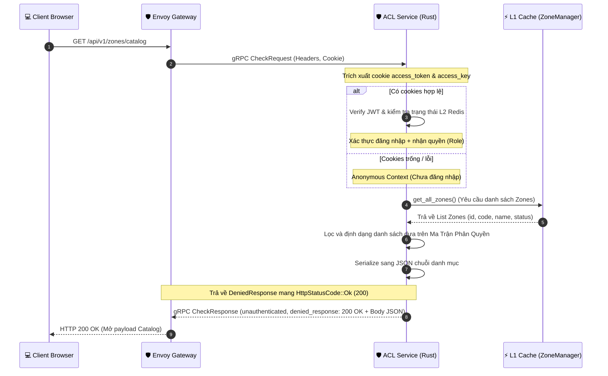
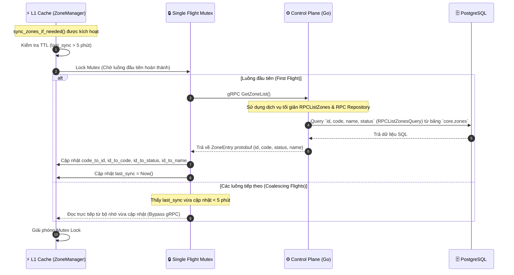

<!-- markdownlint-disable MD033 -->
# Zone Catalog Matrix - Workflow God View

> [!NOTE]
> Tài liệu này đóng vai trò là **Source of Truth (SoT) / God View** cho luồng lấy danh mục Zone (Zone Catalog API Interception) theo Ma trận phân quyền.
> Toàn bộ logic lọc dữ liệu dựa trên vai trò (Role), trạng thái đăng nhập, và trạng thái vận hành của Zone được thực thi trực tiếp tại **ACL Service (Rust - Edge Gateway Authz)** để đảm bảo hiệu năng cực hạn, Zero-DDoS Controlplane, và tính sẵn sàng cao (High Availability).

---

## 🗺️ 1. Giới Thiệu & Đột Phá Kiến Trúc

### ❓ Phân hệ Zone Catalog tại Biên là gì?

Trước đây, khi client (Browser/App) gọi API lấy danh sách các Zone hoạt động để hiển thị ở Dropdown/Select UI, yêu cầu phải đi qua Envoy Gateway, chuyển tiếp tới Control Plane (Go), kích hoạt middleware xác thực, và truy vấn thông qua L1 sharded cache hoặc PostgreSQL DB. Luồng này tạo ra gánh nặng không cần thiết lên Controlplane và làm tăng độ trễ (latency).

**Đột phá kiến trúc mới:**

1. **Local Intercept (Đánh chặn tại biên)**: Envoy Ext_Authz (ACL Service) trực tiếp đánh chặn các HTTP requests dạng `GET /admin/core/zones/catalog` và `GET /api/v1/zones/catalog`.
2. **L1 RAM Cache & Single Flight (Đồng bộ bất đối xứng)**: ACL Service tự quản lý L1 cache đồng bộ qua gRPC Client từ Control Plane với cơ chế **Single Flight** (tránh Thundering Herd).
3. **Local Response (Không Upstream)**: ACL biên dịch JSON và trả về trực tiếp mã HTTP `200 OK` (thông qua cơ chế Local Denial mang payload của Envoy) về cho Client. Yêu cầu **hoàn toàn không chạm đến Control Plane Go** tại thời điểm truy vấn.

---

## 🔑 2. Ma Trận Phân Quyền & Hiển Thị (Access Matrix Catalog)

Dưới đây là ma trận phân bổ hiển thị danh sách Zone dựa trên trạng thái xác thực và quyền hạn của client:

| Trạng thái Đăng nhập | Phân quyền (Role trong JWT) | Route HTTP Path | Zones hiển thị | Có Zone `global`? |
| :--- | :--- | :--- | :--- | :--- |
| **Đã đăng nhập** | `sub == "sre"` | `/admin/core/zones/catalog` | Toàn bộ Zones trong DB (Active, Planned, Draining, Maintenance, Disabled) | **Có** (Virtual Zone code `"global"`) |
| **Đã đăng nhập** | `sub == uuid` | `/api/v1/zones/catalog` | Chỉ các Zone có status: `active` hoặc `draining` | **Không** (Bắt buộc vào zone cụ thể) |
| **Chưa đăng nhập** | **Khách hàng vãng lai (Anonymous)** | `/admin/core/zones/catalog` (Trang login admin) | Các Zone có status: `active` hoặc `draining` | **Có** (Virtual Zone code `"global"`) |
| **Chưa đăng nhập** | **Khách hàng vãng lai (Anonymous)** | `/api/v1/zones/catalog` (Trang login user) | Các Zone có status: `active` hoặc `draining` | **Không** |

### 🛠️ Chi tiết Virtual Zone "global" (Admin Only)

- **Zone Code**: `"global"`
- **Zone Name**: `"Global Zone"`
- **Zone ID ảo (Internal ID)**: `00000000-0000-0000-0000-000000000000`
- **Mục đích**: Cho phép Admin/SRE có quyền quản trị toàn cục không bị bó hẹp trong phạm vi địa lý hay cụm vật lý.

---

## 🌐 3. Sơ Đồ Kiến Trúc Tổng Quan (System Architecture)

Sơ đồ dưới đây mô tả cách Envoy Gateway định tuyến ext_authz và cách ACL Service tự động xử lý trả về cục bộ hoặc đồng bộ không đồng bộ qua gRPC:

```mermaid
graph TD
    classDef client fill:#332244,stroke:#8844ff,stroke-width:2px;
    classDef gateway fill:#112233,stroke:#3388ff,stroke-width:2px;
    classDef edgeService fill:#113322,stroke:#33cc88,stroke-width:2px;
    classDef storage fill:#333311,stroke:#cccc33,stroke-width:2px;
    classDef control fill:#331111,stroke:#ff5555,stroke-width:2px;

    UI["💻 Browser / App UI"]:::client
    Envoy["🛡️ Envoy Gateway (Edge Proxy)"]:::gateway
    ACL["🛡️ ACL Service (Rust - Ext_Authz)"]:::edgeService
    L1Cache["⚡ L1 Cache (RwLock HashMap)"]:::edgeService
    CP["⚙️ Control Plane (Go Core)"]:::control
    DB["🗄️ PostgreSQL (Core DB)"]:::storage

    UI -- "1. GET /api/v1/zones/catalog" --> Envoy
    Envoy -- "2. ext_authz Check" --> ACL
    ACL -- "3. Read & Filter (Ma trận)" --> L1Cache
    
    L1Cache -. "4. Cache Miss / Expired (TTL 5m)" .-> ACL
    ACL -- "5. gRPC GetZoneList (Single Flight)" --> CP
    CP -- "6. Read database" --> DB
    
    ACL -- "7. Direct HTTP 200 OK + JSON Body" --> Envoy
    Envoy -- "8. Return JSON payload" --> UI
```

---

## 🏛️ 4. Sơ Đồ Tuần Tự & Trình Tự Điều Phối (Sequence Flows)

### Phase 1: Client gửi yêu cầu lấy Catalog (Đánh chặn & Trả về trực tiếp)

**Mã nguồn liên quan:**

- [acl/src/service/ext_authz.rs](../../acl/src/service/ext_authz.rs): Điểm đón nhận request gRPC Check của Envoy, điều phối xử lý sang module `zone_catalog`.
- [acl/src/service/zone_catalog.rs](../../acl/src/service/zone_catalog.rs): Giải mã cookie, nhận diện phân quyền, lọc danh sách từ L1 Cache và serialize JSON trả về HTTP 200.
- [acl/src/core/zone.rs](../../acl/src/core/zone.rs): Quản lý dữ liệu bộ nhớ đệm sharded L1 map và trigger sync gRPC khi cần thiết.

### Phase 2: Đồng bộ hóa danh sách Zone từ Controlplane (Bảo vệ Thundering Herd)

Khi L1 cache của ACL bị trống (hoặc hết hạn TTL 5 phút), ACL sẽ đồng bộ danh sách Zone thông qua giao thức gRPC gãy gọn. Để tránh nghẽn luồng (Thundering Herd) when có hàng ngàn request cùng lúc, ACL áp dụng cơ chế **Single Flight Mutex Lock**.

> [!TIP]
> **Tối ưu hóa RPCListZones**:
> Thay vì sử dụng `ListZones` (lấy toàn bộ thông tin chi tiết bao gồm mô tả, vị trí địa lý, thời gian khởi tạo...), luồng RPC sử dụng một cặp Service và Repository riêng biệt mang tên `RPCListZones`. Phương thức này chỉ truy vấn đúng 4 trường thông tin tối giản (`id, code, name, status`) từ cơ sở dữ liệu giúp nâng cao đáng kể băng thông và giảm mức sử dụng RAM khi đồng bộ cụm Edge.

> [!NOTE]
> **Distributed Tracing (Bám Vết Phân Tán)**:
> Hệ thống áp dụng chuẩn W3C Distributed Tracing cho toàn bộ luồng truyền thông RPC:
>
> - **Rust ACL Client** tự động nạp định danh `traceparent` vào gRPC Metadata khi thực hiện gọi đồng bộ.
> - **Go Controlplane Server** sử dụng cặp Unary/Stream Server Interceptors được đăng ký lúc khởi tạo gRPC server để trích xuất `traceparent`, kế thừa trace context và ghi nhận span tracing một cách nhất quán (không làm đứt gãy trace chain).

## 🔒 5. Các Case Race Condition & An Toàn Bảo Mật (Fail-Safe & Security)

### 1️⃣ Tránh Đổi Zone Trái Phép & Trạng Thái Hoạt Động (Zone Lockout)

- **Ràng buộc bảo mật**: Khi user thực hiện cuộc gọi API nghiệp vụ bất kỳ, ACL không chỉ xác thực token và còn đối chiếu `zone_id` (nếu user không phải Admin).
- **Validation**: Nếu `zone_id` của user đang truy cập có trạng thái không hoạt động (`disabled` hoặc `planned`), ACL sẽ lập tức trả về `HTTP 403 Forbidden`. Điều này ngăn chặn việc user đã đăng nhập cố tình ở lại cụm server đã bị tắt hoặc chưa triển khai.

### 2️⃣ Đồng bộ dữ liệu bất đối xứng (Cache Stale & Eventual Consistency)

- **Vấn đề**: Khi SRE cập nhật trạng thái zone hoặc tạo mới một zone tại Controlplane, L1 cache của ACL có thể bị lệch pha tối đa 5 phút (TTL).
- **Giải pháp HA**:
  1. Khi Admin thực hiện thay đổi trạng thái Zone thành công, hệ thống Controlplane gửi tín hiệu đồng bộ.
  2. ACL tự động phục hồi trong vòng 5 phút (self-healing) nhờ cơ chế kiểm tra thời gian hết hạn của bộ đệm.
  3. Mọi thay đổi về định danh, mã code hoặc trạng thái sẽ được đồng bộ nhất quán khi chu kỳ TTL kết thúc hoặc khi cache miss xảy ra.

---

## 🛠️ 6. Nhật ký kiểm tra (Execution Log & Audit Verification)

- **Go controlplane**: Build thành công và pass toàn bộ **157/157 tests**. Các API GetZoneCatalog cũ đã được gỡ bỏ hoàn toàn khỏi Controller/Router và mock tests để giải phóng bộ nhớ.
- **Rust ACL (ext_authz)**: Cấu hình intercept thành công hai endpoint `/admin/core/zones/catalog` và `/api/v1/zones/catalog`. Biên dịch ổn định không cảnh báo (Zero Warnings).
