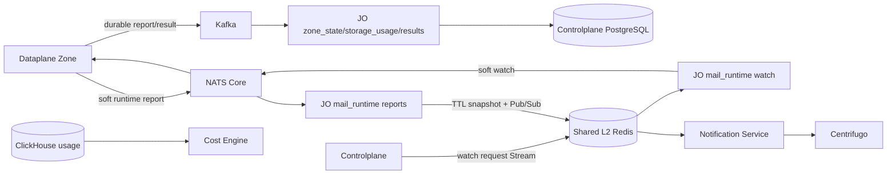

# Job Orchestrator Runtime Workers — God View

## Ownership and module boundaries

`reverse_provider` không còn là một ownership hợp lệ. JO chia runtime theo workflow:

| Workflow | Source | Durable/soft sink | Code owner |
|---|---|---|---|
| Zone report | Kafka `aurora.zone.reports.v1` | Controlplane PostgreSQL actual health | `src/zone_state/` |
| Zone metadata repair | Kafka query | Kafka compacted Zone metadata | `src/zone_state/metadata.rs` |
| Storage current usage | Kafka Zone snapshot | Controlplane PostgreSQL + best-effort Shared Redis notification | `src/storage_usage/` |
| Mail runtime watch | Shared Redis Stream | NATS Core Zone watch | `src/mail_runtime/watch.rs` |
| Mail runtime report | NATS Core | Shared Redis TTL snapshot + Pub/Sub | `src/mail_runtime/{ingest,reports}.rs` |
| Mail projection repair | PostgreSQL snapshot | Kafka Zone command | `src/reconcile/mail/` |
| Job result settlement | Kafka result | PostgreSQL outbox/aggregate transaction | `src/results/{mail,storage}/` |

Generated Protobuf contracts nằm tại `src/contracts.rs`; result handler, outbox và
reconciler không phụ thuộc ngược vào runtime worker.

## Transport topology

Storage bucket snapshots không publish billing event. Cost Engine tính usage từ ClickHouse
và ownership projection; Kafka/NATS/Shared Redis notification không là billing SoT.

## HA and failure semantics

- Kafka consumer manual commit chỉ sau PostgreSQL side effect hoặc durable DLQ.
- Zone report worker không bootstrap heartbeat của mọi Zone vào RAM và không cache SRE-owned
  lifecycle/desired state; mỗi report đọc một policy snapshot, tránh stale state và false-down
  khi Kafka đổi partition owner.
- Mỗi report advance `actual_observed_at` với timestamp fence. `zone_state/watchdog.rs` giữ
  Shared Redis lease `leader:{zone-health-watchdog}` rồi scan durable timestamps; lease handoff
  có thể overlap nhưng SQL predicate và no-op state guard giữ side effect idempotent.
- Worker futures do `RuntimeWorkers` sở hữu trực tiếp. SIGTERM drop toàn bộ future/connection;
  restart dùng exponential backoff tối đa 30 giây và deterministic per-pod jitter.
- Storage DB update dùng `IS DISTINCT FROM`; replay sau crash không phát duplicate UI wake-up.
- Shared Redis Pub/Sub và Centrifugo là best effort. PostgreSQL API hoặc mail TTL snapshot là
  recovery source; Pub/Sub failure không rollback durable business side effect.
- Mail Lua/MGET key dùng cùng hash tag `{consumer_id}`. Mail reconcile key dùng hash tag
  `{zone_id}` để chạy hợp lệ trên Redis Cluster.
- Poison payload vào DLQ chỉ giữ prefix tối đa 4 KiB; schema, UUID, timestamp, metric range,
  node count và string size được validate trước side effect.

## Security boundary

- JO không có Zone KV credential; Dataplane không có Shared Redis/PostgreSQL credential.
- NATS Core chỉ Central↔Zone soft state. Notification Service và Cost Engine không cần NATS.
- Không log/publish customer broker credential, rendered mail, recipient hoặc plaintext secret.
- Zone lifecycle/owner/routing lấy từ trusted Kafka envelope và PostgreSQL; client field không
  trở thành authority.
