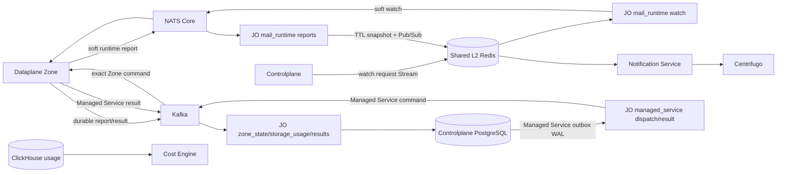

# Job Orchestrator Runtime Workers — God View

## Ownership and module boundaries

`reverse_provider` không còn là một ownership hợp lệ. JO chia runtime theo workflow:

| Workflow | Source | Durable/soft sink | Code owner |
|---|---|---|---|
| Zone report | Kafka `aurora.zone.reports.v1` | Controlplane PostgreSQL actual health | `src/zone_state/` |
| Zone metadata repair | Kafka query | Kafka compacted Zone metadata | `src/zone_state/metadata.rs` |
| Storage current usage | Kafka Zone snapshot | Controlplane PostgreSQL + best-effort Shared Redis notification | `src/storage_usage/` |
| Mail runtime watch | Shared Redis Stream | NATS Core Zone watch | `src/mail_runtime/watch.rs` |
| Mail runtime report | NATS Core | Shared Redis TTL snapshot + Pub/Sub | `src/mail_runtime/{ingest,reports}.rs` |
| Managed Service dispatch/result | PostgreSQL WAL → Kafka / Kafka result | Controlplane desired/observed settlement + job timeline | `src/results/managed_service/`, `src/reconcile/managed_service.rs` |
| Mail projection repair | PostgreSQL snapshot | Kafka Zone command | `src/reconcile/mail/` |
| Job result settlement | Kafka result | PostgreSQL outbox/aggregate transaction | `src/results/{mail,storage,hypervisor,managed_service}/` |

Generated Protobuf contracts nằm tại `src/contracts.rs`; result handler, outbox và
reconciler không phụ thuộc ngược vào runtime worker.

## Transport topology

Storage bucket snapshots không publish billing event. Cost Engine tính usage từ ClickHouse
và ownership projection; Kafka/NATS/Shared Redis notification không là billing SoT.

## HA and failure semantics

- Kafka consumer manual commit chỉ sau PostgreSQL side effect hoặc durable DLQ.
- Managed Service terminal result locks the authoritative outbox/operation/instance
  fence and settles a personal or tenant transaction directly; no Controlplane inbox
  exists. Notification failure keeps the result offset unsettled so stable-ID timeline
  projection can recover on redelivery.
- Managed Service reconciler claims bounded stale PENDING/PROCESSING batches with
  `FOR UPDATE SKIP LOCKED`, resets only the delivery marker and relies on WAL/CDC to
  republish the exact immutable command. It never publishes Kafka directly.
- Zone report worker không bootstrap heartbeat của mọi Zone vào RAM và không cache SRE-owned
  lifecycle/desired state; mỗi report đọc một policy snapshot, tránh stale state và false-down
  khi Kafka đổi partition owner.
- Mỗi report advance `actual_observed_at` với timestamp fence. `zone_state/watchdog.rs` giữ
  Shared Redis lease `leader:{zone-health-watchdog}` rồi scan durable timestamps; lease handoff
  có thể overlap nhưng SQL predicate và no-op state guard giữ side effect idempotent.
- Worker futures do `RuntimeWorkers` sở hữu trực tiếp. SIGTERM drop toàn bộ future/connection;
  restart dùng exponential backoff tối đa 30 giây và deterministic per-pod jitter.
- Storage DB update dùng `IS DISTINCT FROM`; replay sau crash không phát duplicate UI wake-up.
- Shared Redis Pub/Sub và Centrifugo là best effort. PostgreSQL API hoặc mail TTL snapshot là
  recovery source; Pub/Sub failure không rollback durable business side effect.
- Mail Lua/MGET key dùng cùng hash tag `{consumer_id}`. Mail reconcile key dùng hash tag
  `{zone_id}` để chạy hợp lệ trên Redis Cluster.
- Poison payload vào DLQ chỉ giữ prefix tối đa 4 KiB; schema, UUID, timestamp, metric range,
  node count và string size được validate trước side effect.

## Security boundary

- JO không có Zone KV credential; Dataplane không có Shared Redis/PostgreSQL credential.
- PostgreSQL capability tách ba Vault record/role: `role-cdc-read` cho snapshot/WAL,
  `role-job-dispatch-rw` cho post-ACK marker + bounded redispatch và
  `role-job-result-rw` cho các result-settlement CTE đã cấp quyền. Startup fail-close
  nếu result role read-only; không dùng CDC identity làm write fallback.
- NATS Core chỉ Central↔Zone soft state. Notification Service và Cost Engine không cần NATS.
- Managed Service V1 không tạo NATS subject hay runtime consumer tại JO. Customer
  Logs/Metrics đi từ Zone OTel Collector/Victoria qua Zone Public Edge, không qua JO,
  Shared Redis, Notification hoặc Centrifugo; terminal lifecycle chỉ đi Kafka result
  → Controlplane settlement → job notification timeline.
- Không log/publish customer broker credential, rendered mail, recipient hoặc plaintext secret.
- Zone lifecycle/owner/routing lấy từ trusted Kafka envelope và PostgreSQL; client field không
  trở thành authority.

## Downstream connection contract

`src/config/` là contract typed duy nhất cho bootstrap connection và được chia theo ownership:
`postgres.rs`, `shared_redis.rs`, `kafka.rs`, `nats_core.rs`, `otel.rs` và `workflows.rs`.
Cả SQL connection và logical replication dùng cùng `PostgresConfig`/TLS identity; không được
để WAL path quay về `NoTls` khi query path đã bật TLS. Connection factory chỉ nhận config của
đúng downstream, không nhận toàn bộ secret-bearing JO `Config`.

| Downstream | Development | Production invariant |
|---|---|---|
| PostgreSQL | explicit `POSTGRES_TLS_MODE=disable` trong private Compose network | explicit `verify_full`, trust source `system\|file`, client auth `none\|mutual`; SNI/hostname phải được verify |
| Shared L2 Redis | `redis://`, single-node nên AOF replica ACK bằng `0` | `rediss://`, TLS/mTLS khi ACL yêu cầu; connect/response timeout và reconnect backoff bị chặn biên |
| Kafka | `plaintext` cho local broker | `ssl` hoặc `sasl_plain_ssl`; CA/mTLS/SNI; producer luôn idempotent, `acks=all`, bounded retry |
| NATS Core | anonymous `nats://` local | auth mode chỉ được chọn một trong token, user/password hoặc credentials file; TLS/mTLS không fallback xuống plaintext |
| OTel Collector | explicit `OTEL_ENABLED=true` và `http://` local | explicit enablement; `https://` với trust/client-auth rõ ràng; lỗi exporter chỉ làm mất diagnostic data, không đổi business outcome |

Các path private key chỉ được đọc tại connection factory và `Config` cố ý không implement
`Debug`, tránh vô tình serialize DSN/password/token. File
`controlplane/dev/job-orchestrator.env` là profile development được Compose nạp bằng
`env_file`; production phải inject cùng contract qua ConfigMap/Secret và volume certificate,
không dùng hoặc copy credential development.

JO chụp process environment đúng một lần trước khi spawn task và không tự đọc `.env`.
Endpoint, TLS/security/auth mode, routing identity, replication slot/publication/CDC sources
và Redis AOF replica ACK không có default. TLS-enabled downstream bắt buộc khai báo
`*_TLS_TRUST_SOURCE=system|file` và `*_TLS_CLIENT_AUTH=none|mutual`; mode `file` bắt buộc CA,
mode `mutual` bắt buộc cert/key. Alias environment cũ và first-wins resolution bị cấm.

Chỉ timeout/retry/backoff/buffer/batch/sampling/reconcile interval có bounded default.
Startup fail-fast với protocol/scheme không khớp, TLS material mâu thuẫn, auth chồng lấn hoặc
Kafka heartbeat không đủ khoảng an toàn so với session timeout; không có silent TLS downgrade,
trust-store fallback hoặc broker/endpoint fallback.
