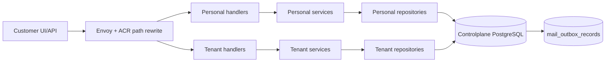
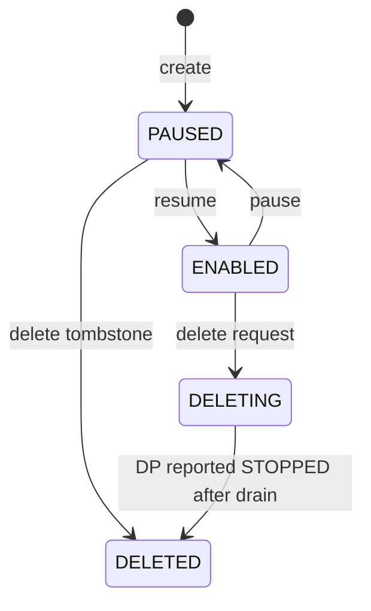

# Controlplane Mail Configuration — God View (Master SoT)

> [!IMPORTANT]
> Đây là Source of Truth cho phần Controlplane của Mail: consumer desired state, immutable template,
> ownership authorization. Controlplane **không giữ broker connection, không
> consume customer message, không render template và không gọi Stalwart**.

## 0. Control header

| Thuộc tính | Giá trị |
|---|---|
| Trạng thái | Phase 0-8 implemented trong code; broker runtime activation vẫn gated tại Dataplane |
| Controlplane owns | Consumer config, template/version và outbox |
| Dataplane owns | Broker connection, consume, fixed-envelope decode, render, offset, JMAP delivery |
| Authorization scope | Personal và Tenant là hai flow tách riêng từ handler → service → repository; consumer thuộc đúng một `workspace_id` |
| Placement | Consumer row không lưu Zone; outbox ghi `routing_scope=zone:<uuid>` từ trusted `X-Zone-ID` sau cross-check Workspace |
| Contract | `controlplane/internal/mail/transport/rpc/proto/mail_runtime.proto` |
| Schema | `controlplane/internal/mail/migrations/000001..000005` |
| Related SoT | `mail_configuration_projection_god_view.md`, `dataplane_broker_mail_execution_god_view.md` |
| Verified against | Working tree, 2026-07-21 |

## 1. Non-negotiable boundaries

1. Controlplane chỉ lưu **desired state**; `RUNNING/ERROR/DRAINING` là reported state từ Dataplane.
2. Controlplane không thử mở socket tới customer broker trong create/update/test API.
3. Broker connection config là business data: CP lưu `source_config_envelope` đã mã hóa trong PostgreSQL và projection đóng gói vào generic `MailStreamSourceV1.payload`.
4. Zone không phụ thuộc Vault. Broker-resource flow tạo envelope bằng zone-local encryption contract; DP Phase 6 mới giải mã trong memory khi mở connection, không ghi plaintext vào Redis/log/result.
5. `sender_profile_id`, `template_id` và version được bind trong consumer config; customer message không được chọn tùy ý.
6. Template content version chỉ gồm subject + HTML và là immutable. Update luôn tạo row version mới; Dataplane tự detect `{{placeholder}}` khi render.
7. Broker message dùng fixed envelope `{ "to": "...", "parameter": {...} }`; Controlplane không lưu JSONPath/message mapping.
8. Một broker message tương ứng một recipient ở phase đầu.
9. Delivery history chưa thuộc scope hiện tại; hot path chỉ trả JMAP accepted/rejected cho job lifecycle.
10. Client không được tự chọn routing Zone: Envoy/ACR strip header bên ngoài rồi inject `X-Zone-ID`; handler chỉ đọc UUID đã parse từ context.
11. Mail module có đúng một `mail_outbox_records`; `routing_scope` định tuyến như các module khác và `job_topic` chọn dispatcher.
12. Mail outbox giữ đúng transport shape chung; aggregate/version/hash và lifecycle data nằm trong protobuf `payload`, không thêm cột theo từng event type.

## 2. Component ownership



| Thành phần | Có quyền quyết định | Không được làm |
|---|---|---|
| Consumer handler | Normalize và validate HTTP input, UUID, pagination, broker/template binding | Business transition |
| Consumer service | Tạo desired config/version, deterministic event và outbox | Normalize/validate lại HTTP input, kết nối customer broker |
| Template handler | Normalize và validate HTTP shape, subject/HTML size limit, header injection | Detect placeholder |
| Template service | Canonicalize subject + HTML, publish immutable version và outbox | Parse variables, render production mail |
| Repository | Query, authorization fail-close, optimistic concurrency và atomic aggregate + outbox CTE | Normalize/validate transport input |
| Projection outbox | Durable CP → Zone intent; một protobuf BYTEA tự chứa `stream_type` + opaque adapter payload | Chứa plaintext credential hoặc discriminator column thừa |

## 3. Consumer aggregate

### 3.1 Required logical fields

| Nhóm | Fields |
|---|---|
| Identity | `consumer_id`, `workspace_id` |
| Stream binding | `source_type`, `broker_resource_id`, `source_config_envelope`; hai business columns `topic/consumer_group` mang nghĩa suite-specific ở bảng dưới |
| Message contract | Không lưu mapping; mọi broker record dùng fixed envelope `{to, parameter}` |
| Mail binding | `template_id/version`, `sender_profile_id/version` |
| Runtime controls | desired state, parallelism |
| Concurrency | monotonic `config_version`, timestamps |

Hai tên cột `topic`/`consumer_group` được giữ ở business schema hiện tại, nhưng API/Console diễn giải rõ theo discriminator:

| `source_type` | `topic` mang nghĩa | `consumer_group` mang nghĩa | Adapter protobuf |
|---|---|---|---|
| `kafka` | topic | consumer group | `KafkaStreamPayloadV1` |
| `redis_stream` | stream key | consumer group | `RedisStreamPayloadV1` |
| `nats_jetstream` | stream name | durable name | `NatsJetStreamPayloadV1` |
| `rabbitmq` | queue name | consumer tag prefix | `RabbitMqPayloadV1` |

Service và JO reconciler đều match đủ bốn branch rồi encode adapter protobuf. Không được mặc định mọi row thành Kafka.

### 3.2 Creation authorization

```mermaid
sequenceDiagram
    autonumber
    participant C as Client
    participant CP as Consumer Service
    participant R as Scoped Repository
    participant DB as PostgreSQL

	C->>CP: Create JSON có immutable code + rewritten trusted scope
    CP->>CP: Decode bounded encrypted envelope; không nhận plaintext credential
    CP->>R: Guard caller + Workspace + Tenant/Personal + Zone
    R-->>CP: scoped mutation result
    CP->>CP: Validate template belongs Workspace/platform + sender versions
	CP->>CP: Validate topic/group, template/sender binding and bounded parallelism
	CP->>DB: BEGIN transaction; KEY SHARE template identity
	DB->>DB: authorize scope + bind immutable template version
	DB->>DB: INSERT consumer(version=1, desired=PAUSED)
	DB->>DB: INSERT mail_outbox_records; COMMIT
    CP-->>C: 201 desired=PAUSED, reported=STOPPED/UNKNOWN
```

Client không gửi `owner_id`, `owner_type`, private endpoint hoặc runtime status. `X-Workspace-ID` và
`X-Zone-ID` chỉ được tin sau ACR authorization; CP vẫn cross-check Zone với authoritative Workspace/Broker
để chặn confused-deputy hoặc proxy misconfiguration. Consumer row không duplicate `zone_id`; transaction
snapshot `routing_scope=zone:<uuid>` vào outbox envelope để event không đổi hướng nếu Workspace placement thay đổi sau commit.
CP không dựa vào thứ tự delivery giữa template và consumer events: khi bind một version vào Zone mới,
transaction phải bảo đảm có idempotent template projection intent. DP vẫn hydrate consumer binding trước;
template chỉ được lazy-load khi message cần render và dependency đến trễ sẽ đi retry/degraded path, không làm hỏng L1 config.

> [!NOTE]
> AS-IS Phase 2-3 không dùng generic repository tự chọn scope. Personal repository chỉ JOIN
> `personal_workspaces.owner_id`; Tenant repository bắt buộc `tenant_id` + active membership + Workspace Zone.
> Mỗi nhánh dùng đúng một entity xuyên handler → service → repository: `PersonalConsumer`,
> `TenantConsumer`, `PersonalTemplate`, hoặc `TenantTemplate`. Service chỉ nhận entity của nhánh đó;
> mutation repository nhận thêm `MailOutboxRecord` do service tạo và commit aggregate + outbox trong cùng PostgreSQL transaction.
> API nhận `source_config_envelope` dạng base64, tối đa 16 KiB, do broker-resource flow đã mã hóa;
> API đọc không bao giờ echo ciphertext mà chỉ trả `source_configured`. Update không gửi envelope sẽ giữ nguyên
> ciphertext hiện tại chỉ khi `source_type + broker_resource_id` không đổi. Vì AES-GCM AAD bind hai identity này,
> đổi một trong hai bắt buộc gửi envelope mới; optimistic `config_version` đóng race giữa lần đọc-giữ và UPDATE. Consumer `ENABLED`
> bắt buộc có envelope ở cả service và database constraint. DP Phase 6 giải mã bằng zone-local key material;
> Vault chỉ phục vụ authentication subsystem, không tham gia Mail Zone runtime.

> Mỗi consumer pin đúng **một** `template_id + template_version`; broker payload không có template selector.
> Template catalog có thể được nhiều consumer tham chiếu, nhưng một message của consumer không được fan-out qua nhiều template.

### 3.3 Desired state



- Mỗi transition tăng `config_version` và insert outbox trong cùng data-modifying CTE statement.
- Delete từ `ENABLED` không hard-delete row; CP phát tombstone và chờ reported stop.
- Create nhận `code` chuẩn hóa dạng kebab-case. Unique partial index `(workspace_id, code) WHERE deleted_at IS NULL`
  chặn hai active resource trùng code; sau khi tombstone, cùng code có thể tạo lại với UUID runtime mới.

### 3.4 Desired state khác reported state

| Desired | Reported ví dụ | Ý nghĩa UI |
|---|---|---|
| `PAUSED` | `STOPPED`/`PAUSED` | Đúng desired state |
| `ENABLED` | `STARTING` | Đang thiết lập broker suite |
| `ENABLED` | `RUNNING` | Hoạt động |
| `ENABLED` | `DEGRADED` | Một phần runtime/partition lỗi nhưng vẫn còn khả năng xử lý |
| `ENABLED` | `ERROR` | Desired vẫn enabled nhưng runtime lỗi |
| delete requested | `DRAINING` | Không nhận message mới, đang xử lý outstanding |

CP không được tự đổi reported state sang `RUNNING` ngay sau khi ghi DB.
Reported state được lưu theo từng Dataplane `instance_id`; CP chỉ derive aggregate từ các heartbeat
còn fresh của đúng desired config version. `runtime_generation/report_sequence` chỉ có thứ tự trong cùng instance.

## 4. Template aggregate

### 4.1 Identity và immutable version

```text
personal_mail_templates / tenant_mail_templates
  template_id
  workspace_id
  code
  current_version
  template_revision

personal_mail_template_versions / tenant_mail_template_versions
  template_id + template_version
  subject_template
  html_template
  content_sha256
  created_by + created_at
```

- `template_version` định danh immutable content.
- `template_revision` là optimistic concurrency clock, tăng khi publish version mới.
- Không có cột `scope`: table Personal/Tenant là authorization namespace vật lý. IAM system mail dùng `system_mail_templates`, không giả ownership customer.
- Personal template không lưu `created_by/updated_by`; Tenant template và version giữ actor audit.
- Version không bị UPDATE riêng lẻ. Hard-delete hợp lệ xóa toàn bộ identity + versions trong một transaction có explicit session-scoped bypass.
- PostgreSQL trigger chặn `UPDATE/DELETE` version ngoài transaction hard-delete aggregate.

### 4.2 Publish flow

```mermaid
sequenceDiagram
    participant C as Client
    participant TS as Template Service
    participant DB as PostgreSQL

    C->>TS: Publish(subject, html, expected_revision)
    TS->>TS: Canonicalize subject + HTML; placeholder discovery thuộc Dataplane
    TS->>TS: Canonicalize and SHA-256 content
    TS->>DB: one guarded data-modifying CTE
    TS->>DB: CAS expected_revision + INSERT immutable version N
    TS->>DB: UPDATE head + INSERT outbox from updated row
```

### 4.3 Hard-delete semantics

- API từ chối hard-delete với `409 template in use` nếu còn consumer chưa-xóa tham chiếu template.
- Consumer create/update giữ `FOR KEY SHARE` trên template identity; delete giữ `FOR UPDATE`, loại race bind-vs-delete.
- Khi không còn consumer active, identity + toàn bộ immutable versions + outbox `mail.template.deleted` commit nguyên tử.
- Code template được giải phóng ngay sau commit và có thể dùng lại; lần create mới nhận UUID mới.

## 5. Delivery history (deferred)

Mail result inbox, submission head, delivery-attempt tables, history APIs và execution-result protobuf chưa thuộc production scope hiện tại. Khi mở phase tương lai phải thiết kế riêng retention, PII encryption, idempotency và replay contract; JMAP submission ID hiện chỉ là kết quả transport của job, không phải lịch sử CP.

## 6. API surface target

### Consumer

```text
POST   /api/v1/{personal|tenant}/mail/consumers
GET    /api/v1/{personal|tenant}/mail/consumers
GET    /api/v1/{personal|tenant}/mail/consumers/:id
PATCH  /api/v1/{personal|tenant}/mail/consumers/:id
POST   /api/v1/{personal|tenant}/mail/consumers/:id/pause
POST   /api/v1/{personal|tenant}/mail/consumers/:id/resume
DELETE /api/v1/{personal|tenant}/mail/consumers/:id
```

### Template

```text
POST /api/v1/{personal|tenant}/mail/templates
GET  /api/v1/{personal|tenant}/mail/templates
GET  /api/v1/{personal|tenant}/mail/templates/:id
POST /api/v1/{personal|tenant}/mail/templates/:id/versions
GET  /api/v1/{personal|tenant}/mail/templates/:id/versions
DELETE /api/v1/{personal|tenant}/mail/templates/:id
```

## 7. Race and failure controls

| Tình huống | Guard |
|---|---|
| Hai UI update cùng consumer | `expected_config_version` optimistic concurrency |
| Template publish đồng thời | Lock identity + expected revision + unique version |
| Upsert cũ đến sau delete | DP tombstone version cao hơn; bỏ event cũ |
| Runtime report từ pod cũ | So sánh config version + runtime generation |
| CP commit nhưng relay crash | Durable outbox + WAL resume |
| Workspace/Broker đổi Zone | Header mismatch bị từ chối; reconciler phát config mới/tombstone sang Zone đúng |
| Workspace placement đổi giữa resolve và commit | Guarded transaction cross-check authoritative workspace; zero row → not found/conflict |
| Hai create cùng code | Unique workspace/code index; một transaction thắng, transaction còn lại nhận `409` |
| Create/update consumer đồng thời delete template | Consumer mutation giữ `KEY SHARE`; delete giữ `FOR UPDATE` và kiểm tra reference trước khi xóa |

## 8. Security requirements

- Envoy/ACR phải strip mọi client-supplied `X-Zone-ID`/`X-Workspace-ID`, authorize rồi inject lại; direct CP ingress bị NetworkPolicy chặn.
- Authorization luôn dựa authenticated caller + authoritative Workspace membership/ownership; consumer query luôn scope theo Workspace.
- Service tự derive exact secret-reference namespace/scope; request không nhận locator và response chỉ trả `source_configured`.
- Dataplane chỉ thay thế placeholder `{{...}}` từ message variables; template content không mang schema/function/code executable.
- Error message của job phải sanitized và bounded; không lưu delivery history tại CP.
- Audit log chứa aggregate ID/version/action, không chứa recipient/template body/JSON variables.
- CP database role của mail module không có quyền đọc secret store.

## 9. Phase ownership

| Phase | Thực hiện |
|---|---|
| 0 | God View + protobuf contract |
| 1 | Migrations/schema — implemented |
| 2 | Personal/Tenant domain/repository/service + transactional outbox — implemented |
| 3 | Rewritten Personal/Tenant HTTP API, bounded body/cursor, resource code, error mapping — implemented |
| 4 | Projection/reconciliation |
| 5 | Zone KV COW registry + lazy template |
| 6 | Fenced supervisor + stream dispatcher |
| 7 | Fixed envelope + render/JMAP processor |
| 8 | Kafka/Redis Stream/JetStream/RabbitMQ suites + native settlement, activation gated |
| 9 | Delivery history (future, chưa triển khai) |

## 10. Cloud Console contract

- Console chỉ render hai surface đã có backend thật: `Consumers` và `Templates`; không hiển thị
  throughput, Dataplane node, runtime health hoặc delivery history bằng dữ liệu giả.
- Browser luôn gọi public path `/api/v1/mail/...`. ACR xác minh session/context rồi rewrite sang
  `/api/v1/personal/mail/...` hoặc `/api/v1/tenant/mail/...`; UI không tự gửi owner, Tenant, Zone header.
- TanStack Query key bắt buộc chứa Personal/Tenant context và `workspace_id`. Khi đổi context,
  request cũ bị abort và cache cũ không được render sang Workspace mới.
- Create form đề xuất `code` từ name, cho phép sửa trước create và hiển thị read-only sau create.
- Consumer update/pause/resume/delete gửi `expected_config_version`; template publish/delete gửi
  `expected_revision`. HTTP `409` không được auto-retry hoặc overwrite, UI yêu cầu reload latest.
- Consumer mới luôn hiển thị `PAUSED`. Desired state không được trình bày như reported runtime state.
- Consumer form không có JSONPath mapper; Console hiển thị fixed broker envelope
  `{ "to": "alice@example.com", "parameter": {"name": "Alice"} }` và nhắc parameter key phải khớp placeholder.
- Console cho chọn đúng bốn `source_type`; nhãn hai field binding đổi theo suite: topic/group,
  stream/group, stream/durable hoặc queue/consumer-tag-prefix.
- System template không xuất hiện trong customer Console; published customer version không edit trực tiếp. Hard-delete yêu cầu
  xóa hoặc chuyển mọi consumer đang tham chiếu trước.
- Action create/update/delete được gate riêng theo render-context capability; repository vẫn authorize
  fail-close, vì UI permission không phải security boundary.

Broker suites đã có trong code nhưng production activation vẫn fail-closed mặc định. Delivery history chưa được triển khai.
