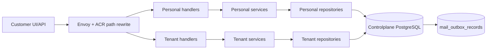
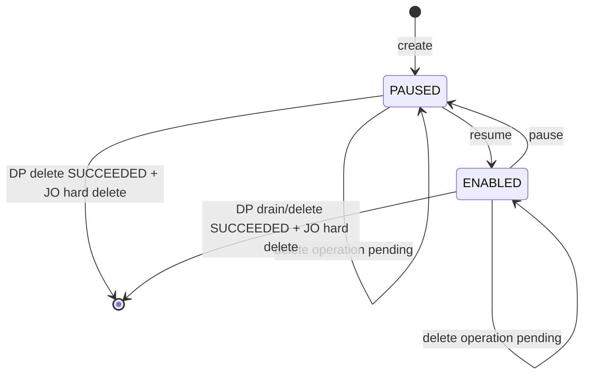

# Controlplane Mail Configuration — God View (Master SoT)

> [!IMPORTANT]
> Đây là Source of Truth cho phần Controlplane của Mail: consumer desired state, immutable template,
> ownership authorization. Controlplane **không giữ broker connection, không
> consume customer message, không render template và không gọi Stalwart**.

## API scope and edge-routing contract

Mail configuration có personal và tenant owner workflow riêng. Browser gọi
neutral Mail API for reads/runtime watch. Every consumer/template mutation calls
`/api/v1/critical/mail/**`; ACR consumes an Ed25519 session proof bound to the
exact method, path and raw body before choosing the verified owner and rewriting
nội bộ sang `/api/v1/personal/critical/mail/**` hoặc `/api/v1/tenant/critical/mail/**`.
The Controlplane route runs `RequireSessionProof` before authorization. Read and
runtime-watch traffic remains `/api/v1/{owner}/mail/**`,
overwrite `:path` và set `x-original-path`. Direct owner-prefixed browser route
bị từ chối. Personal `user_role` hoặc tenant `membership_role` authorizer kiểm
tra route permission và required level trước handler; repository rechecks
workspace, ownership và Zone facts. Không phải `/me` self-user API.

## 0. Control header

| Thuộc tính | Giá trị |
|---|---|
| Trạng thái | Phase 0-9 implemented trong code; broker runtime activation vẫn gated tại Dataplane |
| Controlplane owns | Consumer config, template/version, outbox và current runtime read model |
| Dataplane owns | Broker connection, consume, fixed-envelope decode, render, offset, JMAP delivery |
| Authorization scope | Personal và Tenant là hai flow tách riêng từ handler → service → repository; consumer thuộc đúng một `workspace_id` |
| Placement | Consumer row không lưu Zone; outbox snapshot `zone_id UUID` từ authorized request context sau DB cross-check Workspace |
| Contract | `proto/controlplane/mail/mail_runtime.proto` |
| Schema | `controlplane/internal/mail/migrations/000001..000008` |
| Related SoT | `mail_configuration_projection_god_view.md`, `dataplane_broker_mail_execution_god_view.md` |
| Verified against | Working tree, 2026-07-22 |

## 1. Non-negotiable boundaries

1. Controlplane chỉ lưu **desired state**; `RUNNING/ERROR/DRAINING` là reported state từ Dataplane.
2. Controlplane không thử mở socket tới customer broker trong create/update/test API.
3. Broker connection config là business data: CP lưu `source_config_envelope` đã mã hóa trong PostgreSQL và projection đóng gói vào generic `MailStreamSourceV1.payload`.
4. Zone không phụ thuộc Vault. Broker-resource flow tạo envelope bằng zone-local encryption contract; DP Phase 6 mới giải mã trong memory khi mở connection, không ghi plaintext vào Redis/log/result.
5. `sender_profile_id`, `template_id` và version được bind trong consumer config; customer message không được chọn tùy ý.
6. Template content version chỉ gồm subject + HTML và là immutable. Update luôn tạo row version mới; Dataplane tự detect `{{placeholder}}` khi render.
7. Broker message dùng fixed envelope `{ "to": "...", "parameter": {...}, "not_after_unix_ms": optional }`; Controlplane không lưu JSONPath/message mapping.
8. Một broker message tương ứng một recipient ở phase đầu.
9. Delivery history chưa thuộc scope hiện tại; hot path chỉ trả JMAP accepted/rejected cho job lifecycle.
10. Client không được tự khai ownership/routing trong body; handler chỉ đọc Zone UUID đã được edge đưa vào authenticated context.
11. Mail module có đúng một `mail_outbox_records`; `zone_id UUID` chọn Kafka Zone command topic và `job_topic` chọn dispatcher.
12. Mail outbox giữ đúng transport shape chung; aggregate/version/hash và lifecycle data nằm trong protobuf `payload`, không thêm cột theo từng event type.

## 2. Component ownership



| Thành phần | Có quyền quyết định | Không được làm |
|---|---|---|
| Consumer handler | Normalize và validate HTTP input, UUID, pagination, broker/template binding | Business transition |
| Consumer service | Tạo desired config/version, deterministic event và outbox | Normalize/validate lại HTTP input, kết nối customer broker |
| Template handler | Normalize và validate HTTP shape, subject/HTML size limit, header injection | Detect placeholder |
| Template service | Canonicalize subject + HTML, publish immutable version và outbox | Parse variables, render production mail |
| Repository | Query, authorization fail-close, optimistic concurrency và atomic aggregate + outbox CTE | Normalize/validate transport input |
| Projection outbox | Durable CP → Zone intent; một protobuf BYTEA tự chứa `stream_type` + opaque adapter payload | Chứa plaintext credential hoặc discriminator column thừa |

## 3. Consumer aggregate

### 3.1 Required logical fields

| Nhóm | Fields |
|---|---|
| Identity | `consumer_id`, `workspace_id` |
| Stream binding | `source_type`, `broker_resource_id`, `source_config_envelope`; hai business columns `topic/consumer_group` mang nghĩa suite-specific ở bảng dưới |
| Message contract | Không lưu mapping; mọi broker record dùng fixed envelope `{to, parameter}` |
| Mail binding | `template_id/version`, `sender_profile_id/version` |
| Runtime controls | desired state, parallelism |
| Concurrency | active `config_version`, monotonic `next_config_version`, timestamps |

Hai tên cột `topic`/`consumer_group` được giữ ở business schema hiện tại, nhưng API/Console diễn giải rõ theo discriminator:

| `source_type` | `topic` mang nghĩa | `consumer_group` mang nghĩa | Adapter protobuf |
|---|---|---|---|
| `kafka` | topic | consumer group | `KafkaStreamPayloadV1` |
| `redis_stream` | stream key | consumer group | `RedisStreamPayloadV1` |
| `nats_jetstream` | stream name | durable name | `NatsJetStreamPayloadV1` |
| `rabbitmq` | queue name | consumer tag prefix | `RabbitMqPayloadV1` |

Service và JO reconciler đều match đủ bốn branch rồi encode adapter protobuf. Không được mặc định mọi row thành Kafka.

### 3.2 Creation authorization

```mermaid
sequenceDiagram
    autonumber
    participant C as Client
    participant CP as Consumer Service
    participant R as Scoped Repository
    participant DB as PostgreSQL

	C->>CP: Create JSON có immutable code + rewritten trusted scope
    CP->>CP: Decode bounded encrypted envelope; không nhận plaintext credential
    CP->>R: Guard caller + Workspace + Tenant/Personal + Zone
    R-->>CP: scoped mutation result
    CP->>CP: Validate template belongs Workspace/platform + sender versions
	CP->>CP: Validate topic/group, template/sender binding and bounded parallelism
	CP->>DB: BEGIN transaction; KEY SHARE template identity
	DB->>DB: authorize scope + bind immutable template version
	DB->>DB: INSERT consumer(version=1, desired=PAUSED)
	DB->>DB: INSERT mail_outbox_records; COMMIT
	CP-->>C: 202 + operation_id; desired row is PAUSED, Zone result pending
```

Client không gửi `owner_id`, `owner_type`, private endpoint hoặc runtime status. Workspace và
Zone context chỉ được tin sau edge authorization; CP vẫn cross-check Zone với authoritative Workspace/Broker
để chặn confused-deputy hoặc proxy misconfiguration. Consumer row không duplicate `zone_id`; transaction
snapshot typed `zone_id UUID` vào outbox envelope để event không đổi hướng nếu Workspace placement thay đổi sau commit.
CP không dựa vào thứ tự delivery giữa template và consumer events: khi bind một version vào Zone mới,
transaction phải bảo đảm có idempotent template projection intent. DP vẫn hydrate consumer binding trước;
template chỉ được lazy-load khi message cần render và dependency đến trễ sẽ đi retry/degraded path, không làm hỏng L1 config.

> [!NOTE]
> AS-IS Phase 2-3 không dùng generic repository tự chọn scope. Personal repository chỉ JOIN
> `personal_workspaces.owner_id`; Tenant repository bắt buộc `tenant_id` + active membership + Workspace Zone.
> Mỗi operation Consumer dùng entity phẳng riêng (`Create/Get/List/Update/ChangeState/Delete`)
> và tách tiếp theo Personal/Tenant; không embed một runtime/base struct dùng chung. Service chỉ nhận entity đúng operation;
> mutation repository nhận thêm `MailOutboxRecord` do service tạo và commit aggregate + outbox trong cùng PostgreSQL transaction.
> API nhận `source_config_envelope` dạng base64, tối đa 16 KiB, do broker-resource flow đã mã hóa;
> API đọc không bao giờ echo ciphertext mà chỉ trả `source_configured`. Update không gửi envelope sẽ giữ nguyên
> ciphertext hiện tại chỉ khi `source_type + broker_resource_id` không đổi. Vì AES-GCM AAD bind hai identity này,
> đổi một trong hai bắt buộc gửi envelope mới; optimistic `config_version` đóng race giữa lần đọc-giữ và UPDATE. Consumer `ENABLED`
> bắt buộc có envelope ở cả service và database constraint. DP Phase 6 giải mã bằng zone-local key material;
> Vault chỉ phục vụ authentication subsystem, không tham gia Mail Zone runtime.

> Mỗi consumer pin đúng **một** `template_id + template_version`; broker payload không có template selector.
> Template catalog có thể được nhiều consumer tham chiếu, nhưng một message của consumer không được fan-out qua nhiều template.

### 3.3 Desired state



- Update/pause/resume allocate immutable candidate từ `next_config_version`, tăng riêng counter và insert outbox trong cùng transaction. Active row không đổi trước Zone ACK.
- `SUCCEEDED` promote candidate vào active row; `FAILED` hard-delete đúng candidate nhưng không lùi counter, vì vậy result cũ không va vào version mới.
- Delete request chỉ insert outbox với fence lấy từ monotonic `next_config_version`, nên lớn hơn cả active và mọi candidate FAILED có thể từng chạm Zone; không tăng version, không đổi desired state và không xóa business row trước Zone.
- JO chỉ hard-delete theo `resource_id` sau khi Dataplane trả `SUCCEEDED`; `FAILED` giữ nguyên business row để retry.
- `personal_mail_consumers` và `tenant_mail_consumers` là hai aggregate vật lý độc lập; candidate
  và projection tombstone cũng tách theo cùng scope để mọi FK đều typed. Runtime là Redis soft
  state theo watch lease, không có bảng PostgreSQL.
- Personal row/candidate không lưu `created_by` hoặc `updated_by`: actor chỉ dùng cho authorization và
  best-effort realtime notification sau khi business transaction đã commit.
  Tenant vẫn lưu actor audit vì nhiều membership có thể mutation cùng resource.
- Hai bảng Consumer không có `deleted_at` hoặc desired state `DELETED`. Durable projection tombstone nằm ở bảng riêng
  để reconciler không hồi sinh Zone KV sau khi outbox hết retention.
- Create nhận `code` chuẩn hóa dạng kebab-case. Unique index `(workspace_id, code)` chặn trùng code;
  hard-delete thành công giải phóng code, lần create sau bắt buộc dùng UUID runtime mới.

### 3.4 Desired state khác reported state

| Desired | Reported ví dụ | Ý nghĩa UI |
|---|---|---|
| `PAUSED` | `STOPPED`/`PAUSED` | Đúng desired state |
| `ENABLED` | `STARTING` | Đang thiết lập broker suite |
| `ENABLED` | `RUNNING` | Hoạt động |
| `ENABLED` | `DEGRADED` | Một phần runtime/partition lỗi nhưng vẫn còn khả năng xử lý |
| `ENABLED` | `ERROR` | Desired vẫn enabled nhưng runtime lỗi |
| delete requested | `DRAINING` | Không nhận message mới, đang xử lý outstanding |

CP không được tự đổi reported state sang `RUNNING` ngay sau khi ghi DB. Business
`GET /api/v1/{personal|tenant}/mail/consumers/:id` chỉ trả config.

Consumer Detail gọi `POST /api/v1/{personal|tenant}/mail/consumers/:id/runtime/watch`. Service kiểm tra
ownership/membership bằng PostgreSQL rồi renew lease Redis 30 giây và enqueue watch request vào Shared
Redis Stream. JO bridge request sang NATS Core; Dataplane chỉ đẩy pod-local state cho consumer đang
được watch. JO aggregate logical `slot:<n>` trong Redis bằng
`config_version + runtime_generation + report_sequence`. Response watch trả nullable `runtime`; null
nghĩa là chưa có snapshot cùng watch epoch, không được suy diễn thành `STOPPED`.

## 4. Template aggregate

### 4.1 Identity và immutable version

```text
personal_mail_templates / tenant_mail_templates
  template_id
  workspace_id
  code
  current_version
  template_revision
	next_version
	next_template_revision

personal_mail_template_versions / tenant_mail_template_versions
  template_id + template_version
	template_revision + event_id
  subject_template
  html_template
  content_sha256
  created_by + created_at
```

- `template_version` định danh immutable content. `html_template` lưu dưới dạng zstd compressed bytes tại PostgreSQL và Protobuf; canonical hash được tính `content_sha256 = SHA256(subject || 0x00 || raw_utf8_html)`. Zstd decode hoặc UTF-8 validation lỗi phải fail-close.
- `template_revision` là active optimistic concurrency clock; `next_*` là monotonic allocator không lùi khi candidate thất bại. Publish tạo candidate version/revision và chỉ promote thành current head sau Zone ACK.
- Không có cột `scope`: table Personal/Tenant là authorization namespace vật lý. Verification mail dùng ordinary root-owned Personal template/consumer, không có system-template namespace.
- Personal template không lưu `created_by/updated_by`; Tenant template và version giữ actor audit.
- Version không bị UPDATE riêng lẻ. Hard-delete hợp lệ xóa toàn bộ identity + versions trong một transaction có explicit session-scoped bypass.
- PostgreSQL trigger chặn `UPDATE/DELETE` version ngoài transaction hard-delete aggregate.

### 4.2 Publish flow

```mermaid
sequenceDiagram
    participant C as Client
    participant TS as Template Service
    participant DB as PostgreSQL

    C->>TS: Publish(subject, html, expected_revision)
    TS->>TS: Canonicalize subject + HTML; placeholder discovery thuộc Dataplane
    TS->>TS: Canonicalize and SHA-256 content
	TS->>DB: lock head + reject live resource operation
	TS->>DB: CAS expected_revision + INSERT immutable candidate N
	TS->>DB: advance next counters + INSERT outbox; current head unchanged
	Note over DB: Zone SUCCEEDED => JO promotes head; FAILED => JO deletes exact candidate
```

### 4.3 Hard-delete semantics

- API từ chối hard-delete với `409 template in use` nếu active consumer hoặc immutable update candidate chưa-promote còn tham chiếu template. Candidate history đã promote có version `<= active.config_version` nên không giữ template vĩnh viễn.
- Consumer create/update giữ `FOR KEY SHARE` trên template identity; delete giữ `FOR UPDATE`, loại race bind-vs-delete.
- Khi không còn consumer active, CP chỉ commit outbox `mail.template.deleted`; identity + versions vẫn là active business truth trong lúc Zone xử lý.
- Zone `SUCCEEDED` làm JO ghi durable projection tombstone rồi hard-delete identity + versions trong cùng transaction. `FAILED` giữ nguyên aggregate.
- Code template chỉ được giải phóng sau result transaction thành công; lần create mới nhận UUID mới.

## 5. Delivery history (deferred)

Mail result inbox, submission head, delivery-attempt tables, history APIs và execution-result protobuf chưa thuộc production scope hiện tại. Khi mở phase tương lai phải thiết kế riêng retention, PII encryption, idempotency và replay contract; JMAP submission ID hiện chỉ là kết quả transport của job, không phải lịch sử CP.

## 6. API surface target

### Consumer

```text
POST   /api/v1/{personal|tenant}/mail/consumers
GET    /api/v1/{personal|tenant}/mail/consumers
GET    /api/v1/{personal|tenant}/mail/consumers/:id
PATCH  /api/v1/{personal|tenant}/mail/consumers/:id
POST   /api/v1/{personal|tenant}/mail/consumers/:id/pause
POST   /api/v1/{personal|tenant}/mail/consumers/:id/resume
DELETE /api/v1/{personal|tenant}/mail/consumers/:id
```

### Template

```text
POST /api/v1/{personal|tenant}/mail/templates
GET  /api/v1/{personal|tenant}/mail/templates
GET  /api/v1/{personal|tenant}/mail/templates/:id
POST /api/v1/{personal|tenant}/mail/templates/:id/versions
GET  /api/v1/{personal|tenant}/mail/templates/:id/versions
DELETE /api/v1/{personal|tenant}/mail/templates/:id
```

## 7. Race and failure controls

| Tình huống | Guard |
|---|---|
| Hai UI update cùng consumer | `expected_config_version` optimistic concurrency |
| Template publish đồng thời | Lock identity + expected revision + unique version |
| Upsert cũ đến sau delete | DP tombstone version cao hơn; bỏ event cũ |
| Create V1 FAILED đến sau update V2 | JO chỉ hard-delete khi business row vẫn đúng V1 |
| Delete đồng thời update/publish | Row lock + chỉ một outbox `PENDING/PROCESSING` trên mỗi `resource_id`; request sau nhận `409` |
| Delete result cũ đến sau mutation mới | Không có mutation mới khi delete live; DP fence lấy từ `next_*` để vượt mọi allocated candidate và JO khóa outbox + aggregate |
| Result đến sau terminal FAILED | Mọi FAILED là terminal cho operation ID; create/update/publish cleanup candidate, còn delete giữ aggregate và retry bằng operation ID mới |
| PROCESSING/FAILED của attempt cũ đến sai thứ tự | `mail_outbox_records.result_attempt` fence theo attempt; `FAILED` và `SUCCEEDED` đều terminal cho operation ID, retry business operation phải dùng event ID mới |
| JO commit business transaction nhưng Shared Redis notification enqueue lỗi | Business result vẫn durable và Kafka result được commit; notification bị drop có metric/log, UI recover qua authoritative API. Không tạo notification outbox để tránh biến realtime UX thành completion boundary |
| Runtime report từ pod cũ | Ephemeral Redis slot + config version + fenced runtime generation + report sequence |
| CP commit nhưng relay crash | Durable outbox + WAL resume |
| Workspace/Broker đổi Zone | Authorized context mismatch bị từ chối; reconciler phát config mới/tombstone sang Zone đúng |
| Workspace placement đổi giữa resolve và commit | Guarded transaction cross-check authoritative workspace; zero row → not found/conflict |
| Hai create cùng code | Unique workspace/code index; một transaction thắng, transaction còn lại nhận `409` |
| Create/update consumer đồng thời delete template | Consumer mutation giữ `KEY SHARE`, rồi đọc live template outbox ở READ COMMITTED statement kế tiếp; delete giữ `FOR UPDATE` và kiểm tra cả active reference lẫn candidate có version mới hơn active trước khi phát command |

Các mutation cùng resource dùng row lock trước rồi đọc live outbox bằng statement kế tiếp trong cùng transaction.
Việc tách snapshot là bắt buộc: nếu statement đã lấy snapshot trước khi chờ row lock, nó có thể không nhìn thấy outbox
vừa commit bởi transaction thắng lock dù lock order trông có vẻ đúng.

## 8. Security requirements

- Envoy/ACR phải strip mọi client-supplied scope metadata rồi tạo authenticated context; direct CP ingress bị NetworkPolicy chặn.
- Authorization luôn dựa authenticated caller + authoritative Workspace membership/ownership; consumer query luôn scope theo Workspace.
- RBAC dùng business capability `email`, không dùng transport namespace `mail`. Consumer routes yêu cầu một trong
  `email:consumer:{create,read,update,delete}`; Template routes yêu cầu một trong
  `email:template:{create,read,publish,delete}`. Personal/Tenant route đều chạy `middleware.Authorize` trước handler.
- Operational infrastructure không có Controlplane HTTP surface hoặc RBAC permission; OTel/Grafana là read path nội bộ.
- Repository fail closed nếu `MailOutboxRecord.zone_id` khác Zone trên aggregate đã đi qua Workspace authorization guard.
- Service tự derive exact secret-reference namespace/scope; request không nhận locator và response chỉ trả `source_configured`.
- Dataplane chỉ thay thế placeholder `{{...}}` từ message variables; template content không mang schema/function/code executable.
- Error message của job phải sanitized và bounded; không lưu delivery history tại CP.
- Audit log chứa aggregate ID/version/action, không chứa recipient/template body/JSON variables.
- CP database role của mail module không có quyền đọc secret store.

## 9. Phase ownership

| Phase | Thực hiện |
|---|---|
| 0 | God View + protobuf contract |
| 1 | Migrations/schema — implemented |
| 2 | Personal/Tenant domain/repository/service + transactional outbox — implemented |
| 3 | Rewritten Personal/Tenant HTTP API, bounded body/cursor, resource code, error mapping — implemented |
| 4 | Projection/reconciliation |
| 5 | Zone KV COW registry + lazy template |
| 6 | Fenced supervisor + stream dispatcher |
| 7 | Fixed envelope + render/JMAP processor |
| 8 | Kafka/Redis Stream/JetStream/RabbitMQ suites + native settlement, activation gated |
| 9 | On-demand runtime watch + Redis TTL read model + Consumer Detail — implemented |
| 10 | Delivery history (future, chưa triển khai) |

## 10. Cloud Console contract

- Console chỉ render hai surface đã có backend thật: `Consumers` và `Templates`. Consumer Detail renew
  runtime watch khi đang mở và merge Centrifugo delta cùng epoch; không hiển thị Dataplane hostname
  hoặc delivery history bằng dữ liệu giả.
- Browser calls public `/api/v1/mail/...` only for reads/runtime watch. Consumer and template
  mutations call `/api/v1/critical/mail/...`; ACR consumes the exact session proof then rewrites
  only to `/api/v1/personal/critical/mail/...` or `/api/v1/tenant/critical/mail/...`.
- TanStack Query key bắt buộc chứa Personal/Tenant context và `workspace_id`. Khi đổi context,
  request cũ bị abort và cache cũ không được render sang Workspace mới.
- Create form đề xuất `code` từ name, cho phép sửa trước create và hiển thị read-only sau create.
- Consumer update/pause/resume/delete gửi `expected_config_version`; template publish/delete gửi
  `expected_revision`. HTTP `409` không được auto-retry hoặc overwrite, UI yêu cầu reload latest.
- Consumer mới luôn hiển thị `PAUSED`. Desired state không được trình bày như reported runtime state.
- Consumer form không có JSONPath mapper; Console hiển thị fixed broker envelope
  `{ "to": "alice@example.com", "parameter": {"name": "Alice"} }` và nhắc parameter key phải khớp placeholder.
- Console cho chọn đúng bốn `source_type`; nhãn hai field binding đổi theo suite: topic/group,
  stream/group, stream/durable hoặc queue/consumer-tag-prefix.
- System template không xuất hiện trong customer Console; published customer version không edit trực tiếp. Hard-delete yêu cầu
  xóa hoặc chuyển mọi consumer đang tham chiếu trước.
- Action create/update/delete được gate riêng theo render-context capability; repository vẫn authorize
  fail-close, vì UI permission không phải security boundary.
- Mutation response trả `operation_id = outbox.event_id`. Console tạo activity local-only ở chuông header;
  không có status URL, polling, localStorage audit hoặc history API trong phase này.
- Centrifugo terminal result mang `operation + resource_id + transaction_id`; header ghi đè activity cùng ID,
  còn màn hình đang mở chỉ invalidate/merge đúng consumer/template read model. Audit/history là phase riêng trong tương lai.

Broker suites đã có trong code nhưng production activation vẫn fail-closed mặc định. Delivery history chưa được triển khai.
