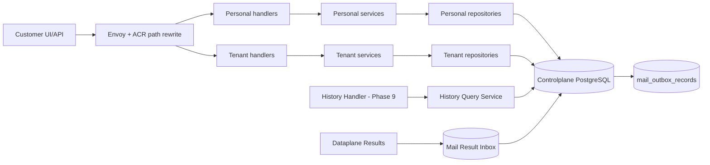
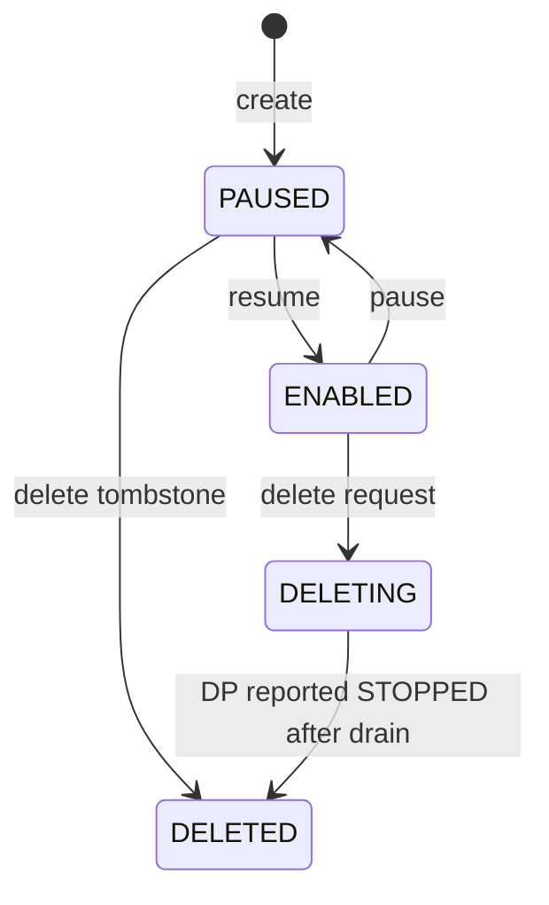

# Controlplane Mail Configuration — God View (Master SoT)

> [!IMPORTANT]
> Đây là Source of Truth cho phần Controlplane của Mail: consumer desired state, immutable template,
> ownership authorization và history read model. Controlplane **không giữ broker connection, không
> consume customer message, không render template và không gọi Stalwart**.

## 0. Control header

| Thuộc tính | Giá trị |
|---|---|
| Trạng thái | Phase 0-3 implemented: contract, schema, scoped domain/repository/service và HTTP API |
| Controlplane owns | Consumer config, template/version, outbox, submission/history projection |
| Dataplane owns | Broker connection, consume, mapping, render, offset, JMAP delivery |
| Authorization scope | Personal và Tenant là hai flow tách riêng từ handler → service → repository; consumer thuộc đúng một `workspace_id` |
| Placement | Consumer row không lưu Zone; outbox ghi `routing_scope=zone:<uuid>` từ trusted `X-Zone-ID` sau cross-check Workspace |
| Contract | `controlplane/internal/mail/transport/rpc/proto/mail_runtime.proto` |
| Schema | `controlplane/internal/mail/migrations/000001..000005` |
| Related SoT | `mail_configuration_projection_god_view.md`, `dataplane_broker_mail_execution_god_view.md` |
| Locked at | 2026-07-19 |

## 1. Non-negotiable boundaries

1. Controlplane chỉ lưu **desired state**; `RUNNING/ERROR/DRAINING` là reported state từ Dataplane.
2. Controlplane không thử mở socket tới Kafka trong create/update/test API.
3. Broker credential không nằm trong PostgreSQL hoặc projection payload; CP chỉ giữ `source_config_ref`.
4. Client chỉ gửi `broker_resource_id`; CP derive secret locator theo trusted scope, còn endpoint/credential thật chỉ zonal Dataplane resolve qua Vault.
5. `sender_profile_id`, `template_id` và version được bind trong consumer config; Kafka payload không được chọn tùy ý.
6. Template content version chỉ gồm subject + HTML và là immutable. Update luôn tạo row version mới; Dataplane tự detect `{{placeholder}}` khi render.
7. Một Kafka message tương ứng một recipient ở phase đầu.
8. History là projection từ durable Dataplane result; không tham gia hot path gửi mail.
9. Client không được tự chọn routing Zone: Envoy/ACR strip header bên ngoài rồi inject `X-Zone-ID`; handler chỉ đọc UUID đã parse từ context.
10. Mail module có đúng một `mail_outbox_records`; `routing_scope` định tuyến như các module khác và `job_topic` chọn dispatcher.
11. Mail outbox giữ đúng transport shape chung; aggregate/version/hash và lifecycle data nằm trong protobuf `payload`, không thêm cột theo từng event type.

## 2. Component ownership



| Thành phần | Có quyền quyết định | Không được làm |
|---|---|---|
| Consumer handler | Normalize và validate toàn bộ HTTP input, UUID, pagination, mapping path | Business transition |
| Consumer service | Tạo desired config/version, deterministic event và outbox | Normalize/validate lại HTTP input, kết nối Kafka |
| Template handler | Normalize và validate HTTP shape, subject/HTML size limit, header injection | Detect placeholder |
| Template service | Canonicalize subject + HTML, publish immutable version và outbox | Parse variables, render production mail |
| Repository | Query, authorization fail-close, optimistic concurrency và atomic aggregate + outbox CTE | Normalize/validate transport input |
| Projection outbox | Durable CP → Zone intent | Chứa plaintext credential |
| History ingestor | Idempotent apply result, monotonic state guard | Chọn retry/commit Kafka offset |
| History query | Owner-scoped read, masking, cursor pagination | Sửa execution outcome |

## 3. Consumer aggregate

### 3.1 Required logical fields

| Nhóm | Fields |
|---|---|
| Identity | `consumer_id`, `workspace_id` |
| Kafka binding | `broker_resource_id`, `source_config_ref`, `topic`, `consumer_group` |
| Message mapping | recipient JSONPath, external ID JSONPath, variable-name → JSONPath map |
| Mail binding | `template_id/version`, `sender_profile_id/version` |
| Runtime controls | desired state, parallelism |
| Concurrency | monotonic `config_version`, timestamps |

### 3.2 Creation authorization

```mermaid
sequenceDiagram
    autonumber
    participant C as Client
    participant CP as Consumer Service
    participant R as Scoped Repository
    participant DB as PostgreSQL

	C->>CP: Create JSON có immutable code + rewritten trusted scope
    CP->>CP: Derive zonal/workspace Vault ref from broker_resource_id
    CP->>R: Guard caller + Workspace + Tenant/Personal + Zone
    R-->>CP: scoped mutation result
    CP->>CP: Validate template belongs Workspace/platform + sender versions
    CP->>CP: Validate JSONPaths, topic/group and bounded parallelism
	CP->>DB: BEGIN transaction; KEY SHARE template identity
	DB->>DB: authorize scope + bind immutable template version
	DB->>DB: INSERT consumer(version=1, desired=PAUSED)
	DB->>DB: INSERT mail_outbox_records; COMMIT
    CP-->>C: 201 desired=PAUSED, reported=STOPPED/UNKNOWN
```

Client không gửi `owner_id`, `owner_type`, private endpoint hoặc runtime status. `X-Workspace-ID` và
`X-Zone-ID` chỉ được tin sau ACR authorization; CP vẫn cross-check Zone với authoritative Workspace/Broker
để chặn confused-deputy hoặc proxy misconfiguration. Consumer row không duplicate `zone_id`; transaction
snapshot `routing_scope=zone:<uuid>` vào outbox envelope để event không đổi hướng nếu Workspace placement thay đổi sau commit.
CP không dựa vào thứ tự delivery giữa template và consumer events: khi bind một version vào Zone mới,
transaction phải bảo đảm có idempotent template projection intent; DP giữ consumer `STARTING` nếu dependency đến sau.

> [!NOTE]
> AS-IS Phase 2-3 không dùng generic repository tự chọn scope. Personal repository chỉ JOIN
> `personal_workspaces.owner_id`; Tenant repository bắt buộc `tenant_id` + active membership + Workspace Zone.
> Mỗi nhánh dùng đúng một entity xuyên handler → service → repository: `PersonalConsumer`,
> `TenantConsumer`, `PersonalTemplate`, hoặc `TenantTemplate`. Service chỉ nhận entity của nhánh đó;
> mutation repository nhận thêm `MailOutboxRecord` do service tạo và commit aggregate + outbox trong cùng PostgreSQL transaction.
> Client không được gửi `source_config_ref`. Service tự derive exact namespace
> `vault://zones/{zone}/workspaces/{workspace}/mail/brokers/{broker_id}` từ trusted scope và API không echo locator này.
> Sự tồn tại/ACL thật của secret vẫn fail-close lần cuối bằng Vault service identity tại zonal Dataplane.

### 3.3 Desired state



- Mỗi transition tăng `config_version` và insert outbox trong cùng data-modifying CTE statement.
- Delete từ `ENABLED` không hard-delete row; CP phát tombstone và chờ reported stop.
- Create nhận `code` chuẩn hóa dạng kebab-case. Unique partial index `(workspace_id, code) WHERE deleted_at IS NULL`
  chặn hai active resource trùng code; sau khi tombstone, cùng code có thể tạo lại với UUID runtime mới.

### 3.4 Desired state khác reported state

| Desired | Reported ví dụ | Ý nghĩa UI |
|---|---|---|
| `PAUSED` | `STOPPED`/`PAUSED` | Đúng desired state |
| `ENABLED` | `STARTING` | Đang thiết lập Kafka consumer |
| `ENABLED` | `RUNNING` | Hoạt động |
| `ENABLED` | `DEGRADED` | Một phần runtime/partition lỗi nhưng vẫn còn khả năng xử lý |
| `ENABLED` | `ERROR` | Desired vẫn enabled nhưng runtime lỗi |
| delete requested | `DRAINING` | Không nhận message mới, đang xử lý outstanding |

CP không được tự đổi reported state sang `RUNNING` ngay sau khi ghi DB.
Reported state được lưu theo từng Dataplane `instance_id`; CP chỉ derive aggregate từ các heartbeat
còn fresh của đúng desired config version. `runtime_generation/report_sequence` chỉ có thứ tự trong cùng instance.

## 4. Template aggregate

### 4.1 Identity và immutable version

```text
personal_mail_templates / tenant_mail_templates
  template_id
  workspace_id
  code
  current_version
  template_revision

personal_mail_template_versions / tenant_mail_template_versions
  template_id + template_version
  subject_template
  html_template
  content_sha256
  created_by + created_at
```

- `template_version` định danh immutable content.
- `template_revision` là optimistic concurrency clock, tăng khi publish version mới.
- Không có cột `scope`: table Personal/Tenant là authorization namespace vật lý. IAM system mail dùng `system_mail_templates`, không giả ownership customer.
- Personal template không lưu `created_by/updated_by`; Tenant template và version giữ actor audit.
- Version không bị UPDATE riêng lẻ. Hard-delete hợp lệ xóa toàn bộ identity + versions trong một transaction có explicit session-scoped bypass.
- PostgreSQL trigger chặn `UPDATE/DELETE` version ngoài transaction hard-delete aggregate.

### 4.2 Publish flow

```mermaid
sequenceDiagram
    participant C as Client
    participant TS as Template Service
    participant DB as PostgreSQL

    C->>TS: Publish(subject, html, expected_revision)
    TS->>TS: Canonicalize subject + HTML; placeholder discovery thuộc Dataplane
    TS->>TS: Canonicalize and SHA-256 content
    TS->>DB: one guarded data-modifying CTE
    TS->>DB: CAS expected_revision + INSERT immutable version N
    TS->>DB: UPDATE head + INSERT outbox from updated row
```

### 4.3 Hard-delete semantics

- API từ chối hard-delete với `409 template in use` nếu còn consumer chưa-xóa tham chiếu template.
- Consumer create/update giữ `FOR KEY SHARE` trên template identity; delete giữ `FOR UPDATE`, loại race bind-vs-delete.
- Khi không còn consumer active, identity + toàn bộ immutable versions + outbox `mail.template.deleted` commit nguyên tử.
- Code template được giải phóng ngay sau commit và có thể dùng lại; lần create mới nhận UUID mới.

## 5. History model

### 5.1 Write model

```text
mail_result_inbox
  event_id unique
  payload/status/received_at

mail_submissions
  submission_id unique
  workspace + consumer
  Kafka coordinates
  template/sender versions
  current_status + current_state_version
  recipient_ciphertext/masked recipient

mail_delivery_attempts
  submission_id + attempt + state_version unique
  status/error/JMAP submission id/timestamp
```

### 5.2 Result apply transaction

1. Insert inbox by `event_id`; conflict means ACK idempotently.
2. Lấy Zone từ trusted result-stream envelope; resolve retained consumer → Workspace và cross-check Zone/config version.
3. Append attempt/state event if unique.
4. Update submission head only when incoming `state_version` is greater.
5. Mark inbox applied and commit.
6. ACK durable result only after commit.

History không lưu raw Kafka JSON, variables hoặc rendered body. `recipient` trong result là PII: encrypted hoặc retention-limited tại CP và tuyệt đối không log.

### 5.3 Status meaning

| Status | Terminal | Kafka offset eligible | Ý nghĩa |
|---|---:|---:|---|
| `CONSUMED` | No | No | DP đã nhận message |
| `RENDERED` | No | No | Mapping/schema/render thành công |
| `SUBMITTING` | No | No | Đã vào delivery attempt |
| `RETRY_SCHEDULED` | No | No | Transient failure, DP giữ offset |
| `SUBMITTED` | Yes | Yes | Stalwart accepted JMAP submission |
| `REJECTED` | Yes | Yes | Invalid message/template/recipient, không retry |
| `FAILED` | Yes | Yes | Retry exhausted hoặc permanent infrastructure failure |
| `AMBIGUOUS` | Yes | Yes | Không biết server đã nhận hay chưa; commit để tránh spam vô hạn |

`SUBMITTED` không có nghĩa `DELIVERED`. Bounce/delivery tracking là contract khác trong phase sau.

## 6. API surface target

### Consumer

```text
POST   /api/v1/{personal|tenant}/mail/consumers
GET    /api/v1/{personal|tenant}/mail/consumers
GET    /api/v1/{personal|tenant}/mail/consumers/:id
PATCH  /api/v1/{personal|tenant}/mail/consumers/:id
POST   /api/v1/{personal|tenant}/mail/consumers/:id/pause
POST   /api/v1/{personal|tenant}/mail/consumers/:id/resume
DELETE /api/v1/{personal|tenant}/mail/consumers/:id
```

### Template

```text
POST /api/v1/{personal|tenant}/mail/templates
GET  /api/v1/{personal|tenant}/mail/templates
GET  /api/v1/{personal|tenant}/mail/templates/:id
POST /api/v1/{personal|tenant}/mail/templates/:id/versions
GET  /api/v1/{personal|tenant}/mail/templates/:id/versions
DELETE /api/v1/{personal|tenant}/mail/templates/:id
```

### History

```text
GET /api/v1/{personal|tenant}/mail/history?cursor=&consumer_id=&status=&from=&to=
GET /api/v1/{personal|tenant}/mail/history/:submission_id
```

List APIs dùng cursor, bounded page size và `workspace_id` filter bắt buộc; không offset-scan bảng lớn.

## 7. Race and failure controls

| Tình huống | Guard |
|---|---|
| Hai UI update cùng consumer | `expected_config_version` optimistic concurrency |
| Template publish đồng thời | Lock identity + expected revision + unique version |
| Upsert cũ đến sau delete | DP tombstone version cao hơn; bỏ event cũ |
| Runtime report từ pod cũ | So sánh config version + runtime generation |
| Result retry/duplicate | Inbox unique event ID |
| Result đến sai thứ tự | `state_version` monotonic head update |
| CP commit nhưng relay crash | Durable outbox + WAL resume |
| Workspace/Broker đổi Zone | Header mismatch bị từ chối; reconciler phát config mới/tombstone sang Zone đúng |
| Workspace placement đổi giữa resolve và commit | Guarded transaction cross-check authoritative workspace; zero row → not found/conflict |
| Hai create cùng code | Unique workspace/code index; một transaction thắng, transaction còn lại nhận `409` |
| Create/update consumer đồng thời delete template | Consumer mutation giữ `KEY SHARE`; delete giữ `FOR UPDATE` và kiểm tra reference trước khi xóa |

## 8. Security requirements

- Envoy/ACR phải strip mọi client-supplied `X-Zone-ID`/`X-Workspace-ID`, authorize rồi inject lại; direct CP ingress bị NetworkPolicy chặn.
- Authorization luôn dựa authenticated caller + authoritative Workspace membership/ownership; consumer query luôn scope theo Workspace.
- Service tự derive exact secret-reference namespace/scope; request không nhận locator và response chỉ trả `source_configured`.
- Dataplane chỉ thay thế placeholder `{{...}}` từ message variables; template content không mang schema/function/code executable.
- Error message lưu history phải sanitized và bounded.
- Audit log chứa aggregate ID/version/action, không chứa recipient/template body/JSON variables.
- CP database role của mail module không có quyền đọc secret store.

## 9. Phase ownership

| Phase | Thực hiện |
|---|---|
| 0 | God View + protobuf contract |
| 1 | Migrations/schema — implemented |
| 2 | Personal/Tenant domain/repository/service + transactional outbox — implemented |
| 3 | Rewritten Personal/Tenant HTTP API, bounded body/cursor, resource code, error mapping — implemented |
| 4 | Projection/reconciliation |
| 9 | Result inbox/history APIs |

## 10. Cloud Console contract

- Console chỉ render hai surface đã có backend thật: `Consumers` và `Templates`; không hiển thị
  throughput, Dataplane node, runtime health hoặc delivery history bằng dữ liệu giả.
- Browser luôn gọi public path `/api/v1/mail/...`. ACR xác minh session/context rồi rewrite sang
  `/api/v1/personal/mail/...` hoặc `/api/v1/tenant/mail/...`; UI không tự gửi owner, Tenant, Zone header.
- TanStack Query key bắt buộc chứa Personal/Tenant context và `workspace_id`. Khi đổi context,
  request cũ bị abort và cache cũ không được render sang Workspace mới.
- Create form đề xuất `code` từ name, cho phép sửa trước create và hiển thị read-only sau create.
- Consumer update/pause/resume/delete gửi `expected_config_version`; template publish/delete gửi
  `expected_revision`. HTTP `409` không được auto-retry hoặc overwrite, UI yêu cầu reload latest.
- Consumer mới luôn hiển thị `PAUSED`. Desired state không được trình bày như reported runtime state.
- System template không xuất hiện trong customer Console; published customer version không edit trực tiếp. Hard-delete yêu cầu
  xóa hoặc chuyển mọi consumer đang tham chiếu trước.
- Action create/update/delete được gate riêng theo render-context capability; repository vẫn authorize
  fail-close, vì UI permission không phải security boundary.

Cho đến khi các phase tương ứng hoàn tất, tài liệu này mô tả **locked target contract**, không được dùng để tuyên bố runtime hiện tại đã có Kafka consumer/history.
