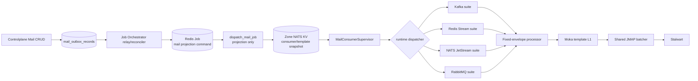

# Dataplane Broker Mail Execution — God View (Master SoT)

> [!IMPORTANT]
> Đây là Source of Truth cho customer broker → Dataplane → JMAP. Controlplane quản lý business config;
> Job Orchestrator chuyển projection; Dataplane trong đúng Zone mới giữ connection, consume, render và settlement.

## 0. Control header

| Thuộc tính | Giá trị AS-IS |
|---|---|
| Trạng thái | Phase 5–9 đã ship trong code; production activation vẫn gated |
| Stream suites | Kafka, Redis Stream, NATS JetStream, RabbitMQ |
| Runtime entry | `MailConsumerSupervisor::run_slot` → `runtime::dispatcher::dispatch_stream_runtime` |
| Không phải delivery entry | `dispatch_mail_job`; hàm này chỉ xử lý Redis Job projection commands |
| Config L2 | Zone-local NATS JetStream KV |
| Config L1 | Immutable `ArcSwap` consumer registry + byte-bounded Moka template cache |
| Rendering | Fixed JSON envelope + restricted placeholder renderer tại Dataplane |
| Delivery | Shared JMAP batcher, tối đa 50 mail hoặc 1000 ms/byte cap |
| Semantics | Best-effort bulk mail; không tuyên bố exactly-once |
| History | Deferred; không có mail history/event ledger trong phase này |
| Activation | `MAIL_STREAM_DELIVERY_ENABLED=false` mặc định |

## 1. End-to-end topology



Hai đường thực thi phải giữ tách biệt:

1. `dispatch_mail_job` nhận Aurora Redis Job. Với `mail.consumer.upsert/delete` và template events, nó ghi
   desired snapshot vào Zone KV; mọi direct/system mail action đều bị reject.
2. `MailConsumerSupervisor` quan sát L1 desired registry, claim một Zone lease cho từng logical slot rồi gọi
   `dispatch_stream_runtime`. Chỉ dispatcher này match `stream_type` và mở customer broker connection.

Không được cho `dispatch_mail_job` mở Kafka/Redis/NATS/Rabbit connection: một projection retry khi đó có thể
tạo thêm consumer session, phá lease ownership và nhân connection theo số job.

## 2. Projection contract

Outbox vẫn có một `payload BYTEA`. Business field hay thay đổi nằm trong protobuf, không thêm broker-specific
column vào outbox:

```proto
message MailStreamSourceV1 {
  MailStreamType stream_type = 1;
  uint32 payload_schema_version = 2;
  bytes broker_resource_id = 3;
  bytes payload = 4;
}

message KafkaStreamPayloadV1 {
  bytes source_config_envelope = 1;
  string topic = 2;
  string consumer_group = 3;
}

message RedisStreamPayloadV1 {
  bytes source_config_envelope = 1;
  string stream_key = 4;
  string consumer_group = 5;
}

message NatsJetStreamPayloadV1 {
  bytes source_config_envelope = 1;
  string stream_name = 6;
  string durable_name = 7;
}

message RabbitMqPayloadV1 {
  bytes source_config_envelope = 1;
  string queue_name = 8;
  string consumer_tag_prefix = 9;
}
```

Invariants:

- CP create/update và JO periodic reconciler đều match `source_type` một lần rồi encode đúng payload suite.
- JO/outbox/Redis Job/Zone KV không giải mã `source_config_envelope`.
- Projection Dataplane decode và bounded-validate đúng suite trước khi commit immutable snapshot vào KV.
- Runtime không suy broker type từ `topic`, URI hay convention string.
- Các suite dùng wire field tags khác nhau; payload của suite A gắn nhầm discriminator B fail validation thay vì decode thành chuỗi có nghĩa khác.
- Unknown type/version làm consumer đó fail-isolated; không panic projection/supervisor/pod.
- `NATS_JETSTREAM` là customer durable stream. Nó không phải NATS Core trung tâm và không dùng Zone KV
  như message queue của khách hàng.

## 3. Runtime ownership

| Component | Sở hữu | Không sở hữu |
|---|---|---|
| Config runtime | Bounded KV scan, hash/version validation, COW L1 | Customer broker socket |
| Supervisor | Desired slot set, jitter, Zone lease, generation fence | Broker ACK/commit |
| Stream dispatcher | Match `stream_type` đúng một lần | Generic ACK abstraction |
| Kafka suite | Group, rebalance epoch, poll, retry, contiguous offset commit | Redis/NATS/Rabbit settlement |
| Redis Stream suite | Group, PEL, `XAUTOCLAIM`, `XACK` | Kafka offsets |
| JetStream suite | Existing stream/durable pull consumer, Progress/Ack/Term | Zone NATS KV ledger |
| RabbitMQ suite | Channel, QoS/prefetch, delivery ACK/reject | Generic delivery-tag storage |
| Mail processor | Fixed envelope, template load/render, typed JMAP result | Broker coordinate |
| JMAP batcher | Count/time/byte batching, per-item result | Durable dedupe/history |

Việc lặp connect/consume/retry/close giữa bốn suite là chủ ý. Không gom chúng vào một interface settlement
giả vì Kafka offset, Redis PEL, JetStream ACK state và AMQP delivery tag có vòng đời khác nhau.

## 4. HA scheduling, leases và COW

Mỗi enabled consumer có `parallelism=N` logical slots:

```text
mail.consumer.slot.{consumer_id}.{slot}
```

Flow của một slot:

1. Supervisor dùng initial jitter và deterministic per-slot jitter để các pod không CAS cùng nhịp.
2. Pod claim `AURORA_ZONE_COORDINATION` lease; value có owner và fencing token tăng đơn điệu.
3. Fencing token trở thành `runtime_generation` của slot.
4. Supervisor tạo `RuntimeGenerationFence`, ghi health `STARTING`, rồi gọi stream dispatcher.
5. Suite renew lease mỗi `TTL/3`. Renew fail thì ngừng intake, fence JMAP submit và không settlement từ owner cũ.
6. Config version/hash đổi, pause/delete hoặc shutdown làm cancel generation cũ. Slot mới chỉ chạy từ immutable
   snapshot mới sau khi task cũ rời supervisor registry.

Supervisor không query KV mỗi 500 ms. Config runtime có central bounded scanner; supervisor chỉ reconcile khi
`ArcSwap` snapshot đổi hoặc bounded retry window tới hạn. Slot connect/claim fail giữ cooldown 5–7 giây có
per-instance jitter, nên task kết thúc không biến central tick thành CAS loop. `MAIL_STREAM_MAX_SLOTS_PER_POD`
chặn một pod claim vô hạn connection.

### 4.1 Generation fence

`RuntimeGenerationFence` có hai nhiệm vụ Aurora-only:

- Ngừng nhận JMAP submission mới ngay khi generation stale/mất lease.
- Chờ mọi request đã vào submit critical section nhận typed JMAP result trước khi generation đóng.
- Giữ monotonic local lease deadline; nếu executor/event loop stall quá TTL thì submit/settlement fail-closed
  trước cả khi renew tick kế tiếp kịp quan sát server lease đã hết.

Fence không thay thế broker settlement. Sau fence, từng suite tự quyết định để message redeliver hay settlement
dựa trên lease/rebalance state của chính broker.

## 5. Encrypted connection boundary

Mọi suite dùng envelope:

```text
"AMS1" | version=1 | AES-GCM nonce 12 bytes | ciphertext + tag
```

- KEK là `MAIL_STREAM_ENVELOPE_KEY_HEX`, đúng 32-byte hex, chỉ inject vào Dataplane Zone workload.
- AAD bind `zone_id + broker_resource_id + stream_type`; copy ciphertext sang Zone/resource/type khác fail auth.
- Ciphertext tối đa 16 KiB; plaintext sau decrypt cũng bị bound và deserialize bằng `deny_unknown_fields`.
- Plaintext credential được zeroize khi rời scope; không ghi vào log, metric, KV health hoặc job result.
- Connect/bootstrap/subscribe operations có bounded timeout 10–15 giây để config COW và pod shutdown không kẹt vô hạn trên customer endpoint.
- Customer không được truyền CA filesystem path. Optional Kafka `MAIL_STREAM_CA_CERT_PATH` thuộc trusted deployment;
  ba suite còn lại hiện dùng system trust roots và cần staging gate riêng nếu Zone dùng private CA.
- NetworkPolicy/egress allow-list theo broker resource vẫn là lớp bắt buộc để ngăn SSRF tới control network.

Connection config V1:

| Suite | Plaintext fields | Transport rule |
|---|---|---|
| Kafka | `bootstrap_servers`, `security_protocol`, optional user/password | chỉ `ssl` hoặc `sasl_plain_ssl` |
| Redis Stream | `url` | bắt buộc `rediss://` |
| NATS JetStream | `servers`, `auth_type`, token hoặc user/password | mọi server bắt buộc `tls://` |
| RabbitMQ | `uri` | bắt buộc `amqps://` |

## 6. Fixed customer message contract

Mọi suite đưa nguyên broker payload bytes vào cùng processor. V1 chỉ chấp nhận:

```json
{
  "to": "alice@example.com",
  "parameter": {
    "customer_name": "Alice",
    "order_code": "A001",
    "amount": 123,
    "paid": true
  },
  "not_after_unix_ms": 1784700000000
}
```

Rules:

- Top-level bắt buộc `to`, `parameter` và cho phép optional `not_after_unix_ms`; unknown/duplicate field bị permanent reject.
- `to` là đúng một mailbox, không có recipient array.
- `parameter` là flat object; value chỉ string, finite number hoặc boolean.
- Key theo identifier `^[A-Za-z_][A-Za-z0-9_]*$`; số key và byte key/value/tổng đều có hard cap.
- Không có JSONPath mapper. Sender/template/workspace/Zone không được lấy từ customer message.
- Consumer config pin đúng một `template_id + template_version` và verified sender identity/version.
- Missing hoặc thừa parameter đều reject; HTML variable luôn escape; subject cấm control character.
- `not_after_unix_ms` đã qua deadline bị permanent reject + source ACK/term; field absent nghĩa là ordinary bulk mail không có broker-level expiry.
- Raw recipient/payload/template parameter không được log hoặc dùng làm metric label.

Stable submission identity được derive bằng UUIDv5:

| Suite | Identity input |
|---|---|
| Kafka | consumer + topic + partition + offset |
| Redis Stream | consumer + stream key + entry ID |
| NATS JetStream | consumer + stream + stream sequence |
| RabbitMQ | consumer + AMQP `message_id` |

UUIDv5 giúp request retry dùng cùng client-side ID, nhưng Stalwart/JMAP không được coi là durable global
idempotency ledger. Crash sau accept nhưng trước broker settlement vẫn có thể gửi trùng.

## 7. Suite-specific runtime và settlement

### 7.1 Kafka suite

1. Join group với stable instance ID theo consumer/slot; auto-commit tắt.
2. Poll bounded records; capture rebalance epoch trên từng work item.
3. Processor retry tối đa 5 lần với exponential backoff + jitter cho typed retryable result.
4. Accepted, permanent reject, ambiguous hoặc retry exhausted là terminal theo bulk-mail policy.
5. Per partition giữ ordered terminal set và chỉ advance highest contiguous watermark.
6. Commit `next_offset` kèm generation/fencing metadata mỗi bounded tick.
7. Rebalance đổi epoch xóa settlement state cũ; completion epoch cũ không commit.
8. Mất Zone lease cấm final commit. Clean cancel chỉ commit terminal contiguous work của assignment còn hiệu lực.

### 7.2 Redis Stream suite

1. Dùng customer Redis riêng qua `rediss://`; tạo group idempotent bằng `XGROUP CREATE ... 0 MKSTREAM`.
2. New entry đọc bằng `XREADGROUP`; fixed transport field phải tên `payload`.
3. Mỗi 30 giây dùng bounded `XAUTOCLAIM` để nhận PEL của consumer chết.
4. Work đang sống reset PEL idle bằng `XCLAIM ... JUSTID` mỗi 15 giây trong cả thời gian chờ semaphore/JMAP;
   `XAUTOCLAIM` không được lấy cùng entry chỉ vì processing lâu.
5. Retryable result được retry local tối đa 5 lần.
6. Mọi terminal result dùng `XACK`; entry thiếu/sai field `payload` cũng terminal-ACK để không tạo poison PEL.
7. Generation fenced thì không `XACK`; entry ở PEL để owner mới reclaim.

### 7.3 NATS JetStream suite

1. Kết nối customer NATS qua TLS; attach existing stream và existing durable pull consumer.
2. Không tự tạo/mutate customer stream hoặc durable policy.
3. Trong lúc chờ semaphore/JMAP, task gửi `Progress` mỗi 5 giây; retry dài không để AckWait redeliver song song.
4. Accepted dùng confirmed `double_ack`.
5. Permanent reject, ambiguous hoặc retry exhausted dùng `Term` theo best-effort no-duplicate policy.
6. Generation fenced thì không ACK/Term; durable consumer redeliver theo policy của khách hàng.

### 7.4 RabbitMQ suite

1. Kết nối `amqps://`, tạo channel, đặt QoS/prefetch bằng max inflight của slot.
2. Consume existing queue bằng tag prefix + consumer ID + slot.
3. Message bắt buộc có AMQP `message_id`; delivery tag không được dùng làm stable identity qua reconnect.
4. Thiếu `message_id` bị reject không requeue.
5. Accepted dùng ACK; permanent reject, ambiguous hoặc retry exhausted dùng reject `requeue=false`.
6. Generation fenced thì không ACK/reject; broker redeliver sau channel/connection close.

## 8. Common processor và JMAP result taxonomy

Processor chỉ trả một trong bốn trạng thái, không mang broker coordinate:

| Status | Ý nghĩa |
|---|---|
| `Accepted` | Stalwart đã accept EmailSubmission; chưa nghĩa recipient nhận mail |
| `PermanentRejected` | Envelope/recipient/template/result bị reject ổn định |
| `Retryable` | Config dependency/JMAP lỗi có thể hồi phục |
| `Ambiguous` | Timeout/transport/response invalid sau khi side effect có thể đã xảy ra |

Mỗi suite tự map taxonomy vào native settlement. Policy hiện tại ưu tiên không gửi lại hàng loạt vô hạn:
ambiguous và exhausted retry đều terminal khi generation vẫn current. Đây là best-effort; muốn đảm bảo mạnh hơn
phải thiết kế durable submission ledger/history riêng, không nhét state vào Zone KV health.

ACK/Term/reject/XACK lỗi không bị nuốt: task trả low-cardinality error về suite loop, slot ghi `ERROR`, đóng
connection và chỉ retry sau supervisor cooldown. Kafka giữ dirty contiguous watermark khi commit lỗi và retry 2 lần/giây.

## 9. Backpressure và bounded resources

- `MAIL_STREAM_MAX_INFLIGHT_PER_SLOT` giới hạn broker work của từng claimed slot.
- Kafka poll/fetch bytes, Redis read/claim count, Rabbit prefetch và local `JoinSet` đều bounded.
- `MAIL_STREAM_PROCESSOR_CONCURRENCY` là semaphore toàn pod cho render/JMAP; không nhân theo số connection.
- JMAP batcher tiếp tục có bounded ingress/batch queue/count/time/byte caps.
- `MAIL_STREAM_MAX_SLOTS_PER_POD` giới hạn tổng slot connection trên một pod.
- Không có unbounded per-consumer ticker; suite chỉ tạo timer trong task của slot đang thực sự owned.

## 10. Race and failure matrix

| Tình huống | Guard | Outcome |
|---|---|---|
| Hai pod claim cùng slot | Zone KV CAS lease + fencing token | Một owner current |
| Owner cũ resume sau pause/GC | Server fencing token + local monotonic lease deadline | Không overwrite health/settlement mới |
| Config COW lúc JMAP đang submit | Generation write fence chờ read permit | Request cũ nhận typed result trước close |
| Kafka completion sau rebalance | Captured assignment epoch | Không commit stale offset |
| Kafka offset N+1 xong trước N | Per-partition ordered terminal set | Chỉ commit watermark contiguous |
| Redis pod chết với PEL | `XAUTOCLAIM` | Entry được node khác lấy lại |
| JetStream/Rabbit task bị fence | Không ACK sau fence | Broker chịu trách nhiệm redelivery |
| JMAP accepted, pod chết trước settlement | Không có durable submission ledger | Có thể duplicate; đã công bố best-effort |
| Invalid config từ projection | Suite-specific decode trước KV + runtime validation | Consumer fail-isolated |
| Broker/Zone KV tạm lỗi | Health error + supervisor bounded retry | Không crash pod, L1 last-known-good được giữ |

## 11. Shutdown order

1. Cancel supervisor intake.
2. Mỗi suite ngừng poll/pull/consume và fence generation.
3. JMAP request đã vào critical section nhận result.
4. Suite settlement chỉ khi lease/assignment/generation còn hợp lệ.
5. Kafka close group; Redis tasks dừng để PEL giữ work; JetStream/Rabbit bỏ ACK sau fence rồi close transport.
6. Config listener dừng.
7. Shared JMAP batcher flush/drain theo God View JMAP.

Không abort JMAP request rồi ACK broker. Không final-commit Kafka sau mất Zone lease.

## 12. Health and observability

Mỗi slot ghi snapshot fenced:

```text
AURORA_ZONE_HEALTH/mail.runtime.{consumer_id}.{slot}
```

Snapshot gồm state, consumer/config version, runtime generation, slot, fencing token, heartbeat và low-cardinality
error code. Snapshot còn có logical `instance_id=slot:<n>` và monotonic report sequence. Mail runtime reporter lease holder
chỉ XADD delta qua `mail:runtime:reports`; shared Redis gate coalesce heartbeat không đổi còn 60s nhưng phát state
transition ngay. Nó không gửi recipient, rendered content hay per-mail result. Metric processor chỉ label `zone_id + status + taxonomy code`; không label topic/queue/recipient/template.
Config runtime có apply/error/scan/L1 metrics. Broker-specific lag/rebalance/PEL/redelivery dashboards còn là deployment
gate, không được giả là đã có chỉ vì suite đã compile.

`consumer_lag` vẫn là field wire V1 nhưng bốn suite hiện chưa có sampler đồng nhất nên writer để `0`; Console
không trình bày nó như số đo thật. Chỉ được bật UI lag sau khi từng suite định nghĩa và test đúng native lag semantic.

## 13. Production gates

Code giữ `MAIL_STREAM_DELIVERY_ENABLED=false` cho tới khi môi trường staging hoàn tất:

1. E2E thật cho từng broker với TLS và credential envelope của Zone.
2. Kill pod ở ba điểm: trước JMAP, sau JMAP accepted, trước ACK/commit.
3. Kafka rebalance test với nhiều pod/partition và config COW đồng thời.
4. Redis PEL/XAUTOCLAIM, JetStream AckWait/redelivery và Rabbit channel-close tests.
5. NetworkPolicy egress chỉ tới broker resource đã authorize và Stalwart.
6. Alert cho slot `ERROR`, stale heartbeat, lease churn, retry/ambiguous rate và JMAP saturation.
7. Capacity test theo `max slots × inflight × max message bytes`; không chỉ benchmark happy path.

## 14. Code map

| Trách nhiệm | File |
|---|---|
| Slot scheduling/lease | `dataplane/src/executor/mail/runtime/consumer_supervisor.rs` |
| One-time type dispatch | `dataplane/src/executor/mail/runtime/dispatcher.rs` |
| Common fence/envelope/health | `dataplane/src/executor/mail/runtime/context.rs` |
| Kafka suite | `dataplane/src/executor/mail/runtime/kafka.rs` |
| Redis Stream suite | `dataplane/src/executor/mail/runtime/redis_stream.rs` |
| NATS JetStream suite | `dataplane/src/executor/mail/runtime/nats_jetstream.rs` |
| RabbitMQ suite | `dataplane/src/executor/mail/runtime/rabbitmq.rs` |
| Fixed envelope/render/JMAP taxonomy | `dataplane/src/executor/mail/processor/stream.rs` |
| Config COW/lazy template | `dataplane/src/executor/mail/runtime/configuration.rs` |
| Redis Job projection entry | `dataplane/src/executor/mail/executor.rs` |
| JO periodic reconcile | `job-orchestrator/src/reverse_provider/mail/reconciler.rs` |
| Zonal runtime report relay | `dataplane/src/executor/mail/supervisor/runtime_reporter.rs` |
| JO runtime report apply/settle | `job-orchestrator/src/reverse_provider/mail/runtime_report.rs` |
| Mail runtime/processor tests | `dataplane/src/executor/mail/test/` |

## 15. Phase status

| Phase | Status |
|---|---|
| 0–4 | CP aggregate/outbox, projection và Zone KV path đã ship |
| 5 | Bounded config COW + lazy template L1 đã ship |
| 6 | Fenced supervisor + generic stream source đã ship |
| 7 | Fixed envelope + restricted render + shared JMAP processor đã ship |
| 8 | Bốn broker suites và native settlement đã ship, activation gated |
| 9 | Zone health delta → Redis Job → guarded CP runtime read model + Consumer Detail đã ship |

Phase 9 hoàn tất ở code không đồng nghĩa production gate đã mở. Trước live E2E, runtime phải giữ disabled theo mặc định.
