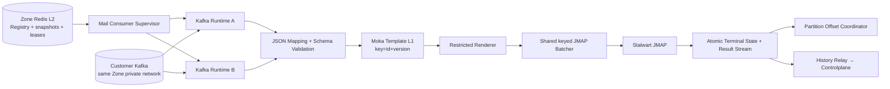
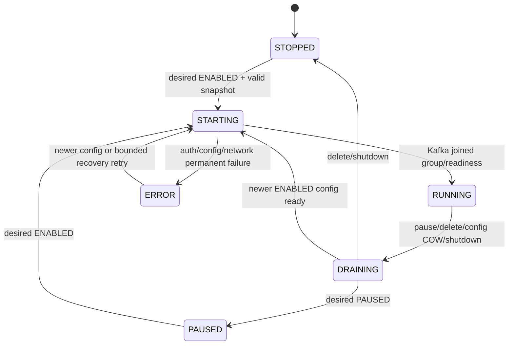
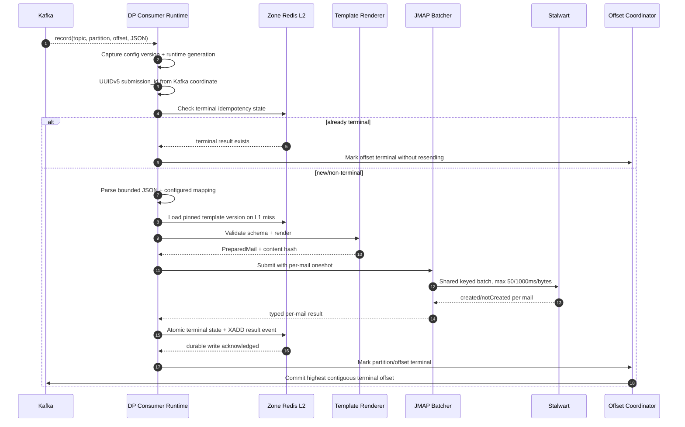

# Dataplane Broker Mail Execution — God View (Master SoT)

> [!IMPORTANT]
> Đây là Source of Truth cho mail data path tại Dataplane: giữ Kafka connection trong cùng Zone,
> consume customer JSON, mapping, validate, render immutable template, batch JMAP và quản lý offset.
> Controlplane chỉ cấp desired state/snapshot; không tham gia runtime path này.

## 0. Control header

| Thuộc tính | Giá trị |
|---|---|
| Trạng thái | Phase 0 — contract locked, runtime implementation thuộc Phase 5–8 |
| Broker phase đầu | Kafka cùng Zone |
| Runtime owner | Dataplane mail consumer supervisor |
| Template SoT runtime | Versioned Zone Redis L2 → bounded Dataplane L1 |
| Rendering | Dataplane, restricted template engine |
| Delivery | Shared JMAP batcher, tối đa 50 mail hoặc 1000ms/byte cap |
| Offset semantics | Commit sau durable terminal result; at-least-once |
| History | DP emits result; CP persists asynchronously |
| Existing delivery SoT | `dataplane_jmap_batch_delivery_god_view.md` |

## 1. Runtime topology



Mọi Dataplane pod trong Zone có thể quan sát cùng registry, nhưng chỉ pod claim được runtime slot lease mới
mở Kafka connection tương ứng. Kafka consumer group phân partition giữa các slot; CP không chọn pod và số
connection không tăng theo `pod_count × consumer_count`.

## 2. Runtime component ownership

| Component | Owns | Không owns |
|---|---|---|
| Config listener | Version/hash validation, L1 COW | CP authorization |
| Consumer supervisor | Runtime registry, lifecycle, fencing | Template rendering |
| Kafka adapter | Poll, rebalance, pause/resume, commit | JMAP retry policy |
| Mapper | Extract recipient/external ID/variables theo configured JSONPath | Chọn sender/template từ payload |
| Template runtime | Immutable snapshot compile/cache/render | Query CP PostgreSQL |
| JMAP batcher | Count/time/byte batching, per-mail result | Kafka offset commit |
| Offset coordinator | Contiguous terminal watermark per partition | Gửi email |
| Result writer | Durable idempotency state + result stream | CP history queries |

### 2.1 Registry discovery và anti-entropy

- `mail:consumer:registry` là Redis HASH `consumer_id → version/state/hash`; cold start và restart dùng bounded `HSCAN`.
- Một central Tokio task điều khiển ticker, timer, jitter và reconcile; không spawn timer riêng cho mỗi consumer.
- Invalidation là fast path đánh thức supervisor. Periodic reconcile là repair path và dùng `MissedTickBehavior::Skip`.
- Jitter deterministic theo pod identity phân tán scan; Redis error dùng exponential backoff có cap.
- `parallelism=N` tạo N logical slot leases. Lease chứa `instance_id`, `config_version` và fencing token tăng đơn điệu.
- Pod mất lease phải fence generation và ngừng poll/commit; pod khác chỉ start sau khi claim token mới.

## 3. Consumer runtime state machine

State machine dưới đây là **per Dataplane instance**. CP aggregate reported health từ nhiều fresh instance reports.



### 3.1 Runtime generation fencing

- Mỗi pod giữ `runtime_generation` tăng dần cho từng consumer và `report_sequence` tăng trong generation.
- Kafka callbacks, offset commits và result completion đều mang captured generation.
- Callback từ generation cũ sau COW swap bị bỏ; không được commit offset hoặc đổi reported state.
- `runtime_generation` chỉ so sánh trong cùng `instance_id`, không so sánh giữa các pod.

## 4. Config apply and COW swap

### 4.1 Upsert

```mermaid
sequenceDiagram
    participant L2 as Zone Redis L2
    participant S as Supervisor
    participant Old as Runtime generation N
    participant K as Kafka

    L2-->>S: Invalidate consumer config v8
    S->>L2: GET immutable snapshot v8
    S->>S: Validate UUID/version/hash/template/sender bindings
    alt processing-only update (mapping/template/sender/limits)
        S->>Old: Pause partitions + drain current config
        S->>S: Fence N; atomically swap immutable processing config to N+1
        S->>Old: Resume same Kafka session under N+1
        S-->>L2: RuntimeReported RUNNING v8
    else source update (broker/topic/group/credential)
        S->>Old: Fence + pause + drain + commit eligible offsets
        Old->>K: Leave group and close connection
        S->>S: Construct generation N+1 only after old is fenced
        S->>K: Resolve new secret + join new group
        alt new source ready
            S-->>L2: RuntimeReported RUNNING v8
        else new source failed
            S-->>L2: RuntimeReported ERROR observed v8
        end
    end
```

Không chạy old/new Kafka consumer chồng nhau để “test readiness”: member mới join cùng group có thể kích hoạt
rebalance trước khi generation cũ bị fence. Processing-only update tái sử dụng session; source update chấp nhận
một khoảng dừng ngắn để bảo toàn offset/config boundary. Config snapshot phải validate hoàn toàn trước khi pause old runtime.

### 4.2 Delete tombstone

1. Fence generation hiện tại.
2. Pause assigned partitions và ngừng poll message mới.
3. Drain outstanding đến timeout.
4. Commit highest contiguous offsets đã có durable terminal result.
5. Outstanding chưa terminal không commit, để Kafka redeliver.
6. Leave group, close connection, giữ tombstone version và report `STOPPED`.

## 5. Kafka message contract and mapping

Phase đầu: một Kafka message tạo đúng một mail/recipient.

Ví dụ customer payload:

```json
{
  "event_id": "order-019",
  "recipient": "alice@example.com",
  "data": {
    "customer_name": "Alice",
    "order_code": "A001"
  }
}
```

Consumer mapping snapshot:

```json
{
  "external_message_id_json_path": "$.event_id",
  "recipient_json_path": "$.recipient",
  "variable_json_paths": {
    "customer_name": "$.data.customer_name",
    "order_code": "$.data.order_code"
  }
}
```

### 5.1 Trust boundary

Kafka payload được xem là untrusted customer input:

- Không đọc `sender_profile_id`, template ID/version, workspace hoặc Zone từ message.
- Recipient chỉ lấy từ configured JSONPath và parse/canonicalize.
- Variable map chỉ gồm keys đã khai báo trong consumer mapping và template schema.
- External message ID chỉ dùng audit; dedupe authority là Kafka coordinate.
- Raw JSON không được log hoặc đưa vào metric label.

### 5.2 Bounded validation

Trước render phải giới hạn:

- Kafka record byte size.
- JSON nesting depth/token count.
- Số variable và độ dài key/value.
- JSONPath complexity/evaluation result count.
- Recipient count đúng một.
- Template rendered subject/body byte size.

Object/array bị reject; phase đầu normalize variables thành scalar strings và renderer tự đối chiếu các token `{{...}}` xuất hiện trong subject/HTML.

## 6. Immutable template runtime

Template ID là globally unique; cache key chỉ cần identity + immutable version:

```text
mail:template:{template_id}:v{version}
```

Flow:

1. Consumer config pin explicit `template_id + template_version`.
2. L1 hit trả compiled immutable template.
3. L1 miss đọc đúng version snapshot từ Zone L2.
4. Validate content hash; detect placeholder trong subject/HTML và yêu cầu message cung cấp đủ scalar variables.
5. Compile/coalesce concurrent miss rồi insert bounded Moka L1.
6. Render subject/text/HTML tại DP.

Rules:

- Subject renderer không HTML escape nhưng output cấm CR/LF.
- HTML variable phải context-safe; restricted engine không có file/network/function execution.
- Missing required variable là `REJECTED`, không thay bằng empty string.
- Template archive không mutate version snapshot đang được active consumer pin.
- DP không gọi CP template service trong hot path.

## 7. End-to-end execution sequence



## 8. JMAP batch partitioning

Existing JMAP runtime phase hiện tại có một static sender. Multi-consumer implementation phải key batch theo ít nhất:

```text
zone + sender_profile_id + sender_version + Stalwart account_id + identity_id
```

Không trộn hai sender/account/identity trong cùng `Email/set`/`EmailSubmission/set`. Mỗi mail vẫn nhận result riêng để offset coordinator xử lý partial batch success.

Chi tiết HTTP construction, retry, byte cap và shutdown nằm tại `dataplane_jmap_batch_delivery_god_view.md`.

## 9. Durable result and idempotency boundary

Sau terminal result, DP chạy một atomic Redis operation/Lua script:

```text
if submission terminal key absent:
    SET mail:submission:terminal:{submission_id} = terminal summary
    XADD mail:execution_results:{zone_id} = MailExecutionResultV1
else:
    return existing terminal summary
```

Chỉ sau Redis ACK mới cho offset coordinator commit.

`zone_id` trong tên stream lấy từ immutable pod/Zone deployment configuration, không lấy từ protobuf hoặc customer message.

Terminal idempotency key retention phải ít nhất bằng Kafka retention/replay window được nền tảng hỗ trợ.
Operator reset offset ra ngoài cửa sổ này được coi là explicit replay và có thể gửi lại mail.

### 9.1 Crash windows

| Crash window | Hành vi |
|---|---|
| Sau Kafka poll, trước JMAP | Offset chưa commit → redeliver |
| Sau render, trước JMAP | Offset chưa commit → redeliver/re-render same immutable version |
| Sau JMAP accepted, trước terminal Redis write | Có thể gửi trùng khi redeliver; unavoidable ambiguous window |
| Sau terminal Redis write, trước Kafka commit | Redelivery thấy terminal key → không gửi lại, chỉ commit |
| Sau Kafka commit, trước CP history apply | Result vẫn durable trong Zone stream và relay tiếp tục |

Không tuyên bố exactly-once. Mục tiêu là at-least-once với duplicate window được giới hạn và quan sát được.

## 10. Execution status policy

Để tránh write amplification ở tải lớn:

- Bắt buộc emit durable: `RETRY_SCHEDULED` và terminal `SUBMITTED/REJECTED/FAILED/AMBIGUOUS`.
- `CONSUMED/RENDERED/SUBMITTING` là internal state/metrics mặc định; chỉ emit khi audit tier bật rõ ràng.
- Error message được taxonomy + sanitize + bound; không nhét raw library error có endpoint/PII.
- `AMBIGUOUS` là terminal và offset eligible sau khi result durable, tránh gửi spam vô hạn.

## 11. Partition offset coordinator

Mỗi `(consumer_id, topic, partition, runtime_generation)` có coordinator riêng:

```text
committed watermark = 100
results completed: 101, 103, 104
commit eligible     = 101

when 102 terminal:
commit eligible     = 104
```

- Completion có thể out-of-order do batch/concurrency.
- Chỉ commit highest contiguous terminal offset.
- Retryable result giữ gap và gây backpressure/pause partition nếu vượt bounded window.
- Generation cũ không được commit sau rebalance/COW.
- Permanent validation rejection được ghi durable rồi coi terminal để poison message không khóa partition.

## 12. Rebalance and shutdown

### Partition revoke

1. Stop accepting new records cho partitions bị revoke.
2. Fence callbacks không thuộc generation/assignment hiện hành.
3. Drain bounded outstanding đến rebalance deadline.
4. Commit contiguous terminal watermark.
5. Không commit gaps; broker member mới sẽ redeliver.
6. Release assignment/resources.

### Pod shutdown

1. Stop config and Kafka intake.
2. Pause partitions.
3. Drain mapper/renderer/JMAP batcher.
4. Persist terminal results.
5. Commit eligible offsets.
6. Report runtime stop best-effort; CP heartbeat expiry vẫn sửa reported state nếu report mất.
7. Close Kafka/JMAP/Redis resources.

## 13. Reported state aggregation at CP

Mỗi pod report theo `(consumer_id, instance_id, config_version, runtime_generation)` và heartbeat timestamp. CP giữ per-instance rows rồi derive aggregate:

| Condition trên fresh reports của desired version | Aggregate reported state |
|---|---|
| Tất cả fresh members `RUNNING` | `RUNNING` |
| Có `RUNNING` nhưng cũng có member `ERROR`/stale assignment | `DEGRADED` |
| Không running, có `STARTING` | `STARTING` |
| Tất cả đang drain | `DRAINING` |
| Desired paused và không member running | `PAUSED` |
| Desired enabled nhưng tất cả fresh reports error/stale | `ERROR` |

Generation không so sánh giữa hai instance khác nhau. Expired heartbeat bị loại khỏi aggregation.

## 14. Security in same-Zone networking

Mạng nội bộ không được xem là trusted:

- DP resolve broker từ authorized resource ID, không từ message/customer host tùy ý.
- NetworkPolicy chỉ cho Mail runtime gọi broker cùng Zone, Zone Redis, zonal secret store và Stalwart.
- Kafka dùng per-consumer/resource ACL và SASL/mTLS theo platform policy.
- Validate resolved/advertised broker endpoints vẫn thuộc allowed private Zone ranges.
- Secret chỉ tồn tại trong runtime memory cần thiết; không cache vào Redis L2, log, trace hoặc result.
- Template/recipient/body không xuất hiện trong metrics.

## 15. Observability

Low-cardinality metrics:

- Active runtimes by state and Zone.
- Kafka assigned partitions, aggregate lag, rebalance count.
- Paused duration/backpressure count.
- Mapping/schema/render failure taxonomy.
- Template L1 hit/miss/hash failure.
- JMAP batch size/wait/latency/partial failures.
- Offset commit latency/gap window.
- Terminal result stream lag and ambiguous count.

Consumer ID/topic/workspace/recipient không dùng làm metric labels. Trace/log correlation dùng internal submission ID và sampled structured fields.

## 16. Phase implementation map

| Phase | Dataplane responsibility |
|---|---|
| 5 | L2 snapshots, L1 cache, config listener, COW registry |
| 6 | Kafka adapter + consumer supervisor |
| 7 | JSON mapping + strict renderer + PreparedMail integration |
| 8 | Offset coordinator + terminal Redis/result boundary |
| 9 | Result relay/history integration |
| 10–11 | Security, observability, chaos/load/E2E gates |

Cho đến khi Phase 5–8 hoàn tất, existing Dataplane chỉ có Redis-job → template → JMAP path; tài liệu này không được dùng để tuyên bố Kafka runtime đã tồn tại.
