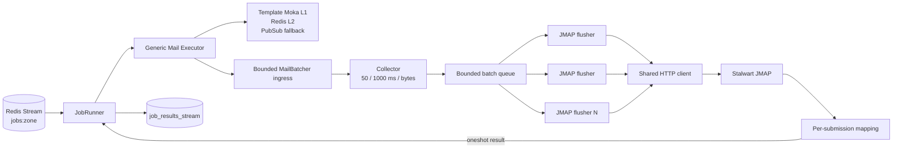
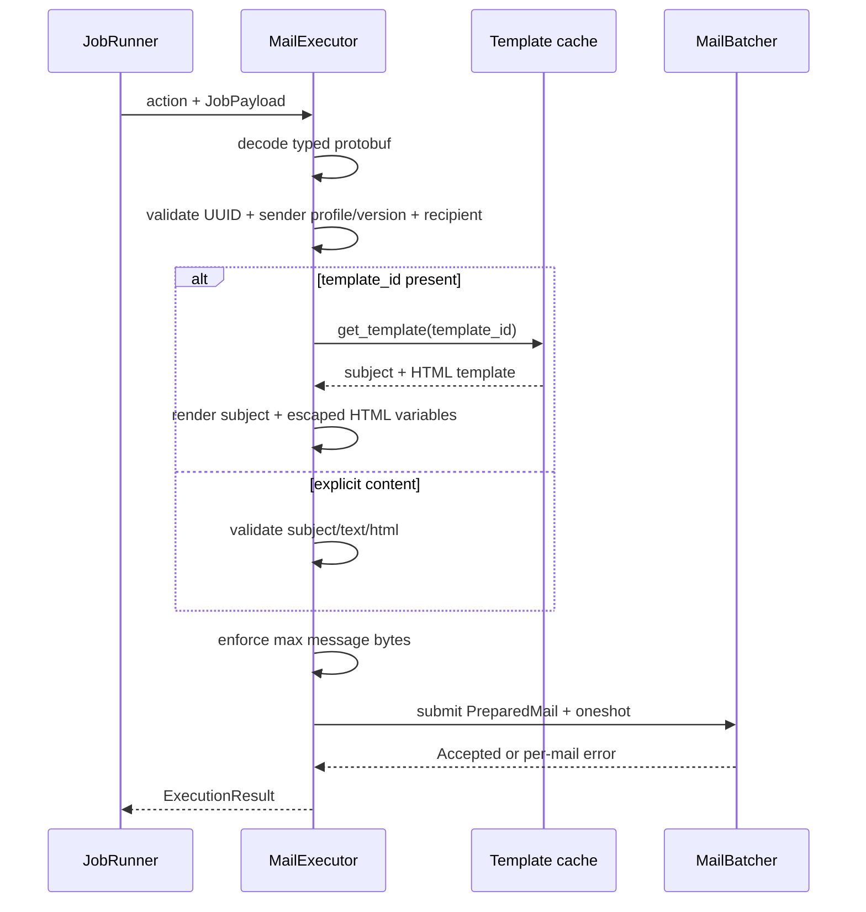
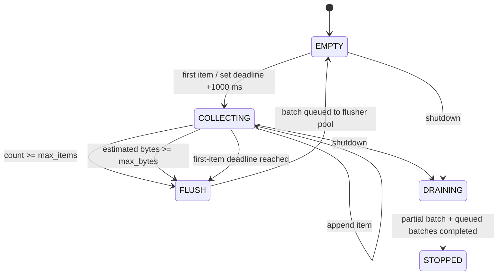

# Dataplane Bulk Mail JMAP Delivery — God View (Master SoT)

> **IMPORTANT — SINGLE SOURCE OF TRUTH**
> Tài liệu này là nguồn chuẩn cho đoạn workflow từ mail job tại Zone Redis Stream đến khi Stalwart chấp nhận JMAP EmailSubmission. Mọi thay đổi về mail protobuf, sender binding, batching, JMAP request, retry, backpressure, health hoặc shutdown phải cập nhật tài liệu này trong cùng change-set.

## 0. Control header

| Thuộc tính | Giá trị AS-IS |
|---|---|
| Domain | Dataplane bulk mail delivery |
| Input | Redis Stream `jobs:{zone_id}`, một job tương ứng một recipient |
| Transport | JMAP over HTTP(S), shared `reqwest::Client` |
| Batch policy | Tối đa 50 mail, 1000 ms từ item đầu, hoặc byte cap |
| JMAP operations | Một `Email/set` + một `EmailSubmission/set` cho mỗi batch |
| Sender registry | Static profile từ environment/Kubernetes Secret trong phase hiện tại |
| Delivery semantics | Best-effort; success nghĩa Stalwart accepted submission, không nghĩa recipient đã nhận |
| Runtime durability | Redis Stream/job outbox ở upstream; batch buffer là bounded memory |
| Removed transport | LMTP client và connection pool tự viết đã bị xóa |
| Future scope | Controlplane sender table, OTP/DNS verify và sender projection |
| Verified against | Working tree, 2026-07-19 |

### 0.1 Invariants

| Invariant | Hệ quả |
|---|---|
| Một job chỉ có một recipient | Result, retry và privacy tách riêng từng người nhận |
| Dataplane không tin arbitrary `From` trong payload | Job chỉ mang `sender_profile_id` + version; địa chỉ/identity lấy từ registry |
| Một HTTP 200 không đồng nghĩa cả batch thành công | Phải parse `created`/`notCreated` từng submission |
| Batcher dùng chung toàn pod | Không tạo HTTP client, timer hoặc queue theo từng job |
| Batch partition theo account/identity | Phase static chỉ có một profile; multi-sender phase sau phải giữ rule này |
| Batch buffer không phải durability boundary | Shutdown flush; crash trước submission để Redis/job lifecycle redeliver theo policy upstream |
| Email object không được giữ vĩnh viễn | `onSuccessDestroyEmail` cleanup source Email sau khi submission được tạo |

---

## 1. Component topology



### 1.1 Ownership

| Component | Owns | Không owns |
|---|---|---|
| Job lifecycle | Lease, PROCESSING/final result, Redis XACK | JMAP object construction |
| Mail executor | Decode, sender/profile validation, address/content/template validation | HTTP connection/concurrency |
| Template module | Bounded/coalesced L1, Redis L2, render | Sender authorization |
| Mail batcher | Time/count/byte boundary, bounded queues, per-job oneshot | Durable retry history |
| JMAP client | Authentication, request construction, transport retry, response mapping | Customer ownership |
| Stalwart | Accept submission và outbound queue | Aurora owner authorization |
| Mail monitor | JMAP health + local batch pressure projection | SMTP recipient delivery confirmation |

---

## 2. Job contract

`SendMailConfig` là typed protobuf:

```protobuf
message SendMailConfig {
  map<string, string> template_variables = 1;
  string sender_profile_id = 2;
  uint32 sender_version = 3;
  string recipient = 4;
  string template_id = 5;
  string subject = 6;
  string text_body = 7;
  string html_body = 8;
}
```

| Field | Rule AS-IS |
|---|---|
| `sender_profile_id` | Bắt buộc bằng static configured profile |
| `sender_version` | Bắt buộc khớp configured version; mismatch fail-closed |
| `recipient` | Parse thành một canonical email address |
| `template_id` | Nếu có, subject/body lấy từ template và variables |
| Explicit subject/body | Chỉ dùng khi `template_id` rỗng |
| `subject` | Required, không CR/LF, tối đa 998 bytes |
| Body | Cần text hoặc HTML; toàn message bị giới hạn byte |
| `template_variables` | Không chứa `from`, `to` hoặc `template_id` routing fields |

`job_id` phải là UUID và được dùng tạo stable JMAP client creation IDs trong request.

### 2.1 Sender phase hiện tại

Static sender profile gồm:

```text
profile_id
version
from_address
Stalwart account_id
Stalwart identity_id
mailbox_id
```

Controlplane IAM verify-account producer dùng `platform-default`, version `1`. Dataplane không query PostgreSQL Controlplane. Future sender verification sẽ thay static registry bằng projected registry nhưng không thay batch/JMAP contract.

---

## 3. Preparation flow



Moka L1 có capacity 10.000 và TTL một giờ. Concurrent miss cùng `template_id` được coalesce qua `try_get_with`; L2 Redis và PubSub fallback không bị gọi dồn theo số job.

---

## 4. Batch state machine



Defaults:

| Setting | Default |
|---|---:|
| Maximum items | 50 |
| Maximum wait from first item | 1000 ms |
| Maximum estimated batch size | 4 MiB |
| Ingress items | 5000 |
| Enqueue timeout | 1000 ms |
| Concurrent JMAP flush workers | 4 per pod |
| JMAP request timeout | 10 seconds |
| Transport retries | 2 |
| Maximum individual message | 1 MiB |

Collector và HTTP flusher tách riêng. Batch queue có capacity `2 × flush_workers`; Stalwart chậm sẽ block collector, rồi fill ingress queue và cuối cùng trả backpressure thay vì tăng RAM vô hạn.

---

## 5. JMAP request and response

Mỗi batch tạo:

1. Một `Email/set` với tối đa 50 create objects.
2. Một `EmailSubmission/set` với tối đa 50 submission objects tham chiếu `#mail-{job_id}`.
3. `onSuccessDestroyEmail` để không tích tụ mail trong service mailbox.

Request dùng capabilities Core, Mail và Submission. Envelope `mailFrom` lấy từ trusted sender profile; `rcptTo` lấy từ canonical recipient.

Response handling:

| JMAP result | Job result |
|---|---|
| Submission nằm trong `created` | Accepted, trả submission ID |
| Submission nằm trong `notCreated` | Failed riêng item đó |
| Method-level `error` | Failed toàn bộ item chưa có result |
| Missing/malformed response | Retryable transport-style failure |
| HTTP 429/5xx/network | Retry nguyên request với exponential backoff + jitter |
| HTTP 4xx khác | Không retry |

Retry request sau timeout có thể tạo duplicate vì batch buffer không có durable idempotency ledger. Đây là best-effort bulk-mail semantics đã chấp nhận; không được mô tả là exactly-once.

---

## 6. HA, races và shutdown

| Case | Control | Outcome |
|---|---|---|
| 50th item và timer cùng ready | Collector đơn owner của buffer | Một flush duy nhất |
| N worker submit đồng thời | Bounded MPSC | Không race mutate batch |
| Một item fail trong batch | Per-key response map | Không fail 49 item đã accepted |
| Stalwart chậm | Bounded batch + ingress queues | Backpressure tới active jobs/admission |
| Pod shutdown với partial batch | Worker intake bị cancel; tracked JobRunner hoàn tất trước khi đóng batcher | Không có submit chạy đua phía sau shutdown command |
| Pod crash trước response | Redis/job policy có thể redeliver | Duplicate có thể xảy ra |
| JMAP health fail | Monitor ghi `infra:mail status=down capacity=0` | Zone coordination thấy mail unavailable |
| Sender mismatch | Executor fail trước enqueue | Không gửi arbitrary From |

Graceful shutdown order:

1. Cancel worker intake.
2. Đợi worker receive-loop và mọi detached JobRunner trong cùng task barrier; batcher vẫn mở để các job đang chạy nhận per-mail result.
3. Đóng mail batcher sau khi chắc chắn không còn producer.
4. Flush partial batch rồi drain bounded batch queue và in-flight HTTP requests.
5. Hoàn tất shutdown runtime.

---

## 7. Configuration and secrets

| Variable | Purpose |
|---|---|
| `STALWART_JMAP_URL` | Direct `/jmap` endpoint |
| `STALWART_JMAP_ACCOUNT_ID` | Opaque service account ID do Stalwart cấp; required, không fallback từ username |
| `STALWART_JMAP_IDENTITY_ID` | Opaque authorized identity ID; required |
| `STALWART_JMAP_MAILBOX_ID` | Opaque draft/source mailbox ID; required |
| `STALWART_JMAP_BEARER_TOKEN` | OAuth bearer option |
| `STALWART_JMAP_USERNAME/PASSWORD` | Application-password option nếu không dùng bearer |
| `MAIL_SENDER_PROFILE_ID/VERSION/ADDRESS` | Static trusted sender binding |
| `MAIL_BATCH_*` | Queue/count/time/byte controls |
| `MAIL_JMAP_*` | Concurrency/timeout/retry controls |

Bearer hoặc username/password là bắt buộc; thiếu auth làm bootstrap fail. Secret phải đến từ Kubernetes Secret hoặc Vault Agent, không nằm trong image, protobuf, log hay metric label.

---

## 8. Observability

Monitor ghi `infra:mail`:

```text
status
capacity
pending_items
in_flight_batches
transport=jmap_batch
updated_at
```

Không log recipient, subject, body, template variables hoặc auth token. Correlation dùng `job_id`, batch size và trace metadata ở job lifecycle.

Metrics cần giữ cardinality thấp:

- Batch size histogram.
- Flush reason: count/time/bytes/shutdown.
- Queue depth và enqueue backpressure.
- JMAP request latency/status.
- Accepted/failed item count.
- Partial batch failure count.
- Ambiguous timeout/retry count.

---

## 9. Code map

| Concern | File |
|---|---|
| Runtime wiring | `dataplane/src/executor/mail/mod.rs` |
| Typed preparation | `dataplane/src/executor/mail/executor.rs` |
| Internal models/sender profile | `dataplane/src/executor/mail/model.rs` |
| Micro-batching/backpressure | `dataplane/src/executor/mail/batcher.rs` |
| JMAP HTTP contract | `dataplane/src/executor/mail/jmap.rs` |
| Template cache/render | `dataplane/src/executor/mail/template.rs` |
| Health/capacity projection | `dataplane/src/executor/mail/monitor.rs` |
| Pod lifecycle owner | `dataplane/src/workerpool/lifecycle.rs` |
| Mail protobuf | `dataplane/proto/mail_job.proto` |

---

## 10. Deferred sender-control phase

Chưa thuộc change-set này:

- PostgreSQL `mail_senders`.
- Owner ID/type và sender management API.
- Email OTP hoặc DNS ownership verification.
- DKIM/SPF/DMARC provisioning.
- Sender outbox/projector/reconciler.
- Hard-revocation projection vào Zone Redis/Moka.

Khi phase đó được triển khai, Dataplane nhận projected `SenderProfile` theo ID/version. Batcher và JMAP client không được query trực tiếp database Controlplane.

---

## 11. Deployment gates

Trước khi rollout production phải hoàn tất ngoài code:

1. Provision service account, submission identity, source mailbox và least-privilege credential trên Stalwart; inject opaque IDs/secret qua Kubernetes Secret hoặc Vault.
2. Đọc JMAP Session của đúng Stalwart deployment để xác nhận Mail/Submission capabilities và đặt `MAIL_BATCH_MAX_ITEMS/BYTES` không vượt `maxObjectsInSet`/`maxSizeRequest` của server.
3. Chạy integration test trên đúng Stalwart version cho `Email/set`, `EmailSubmission/set`, partial `notCreated` và `onSuccessDestroyEmail`.
4. Load test nhiều Dataplane replica cùng lúc, gồm 429/5xx, timeout mơ hồ, backpressure và pod termination giữa batch.
