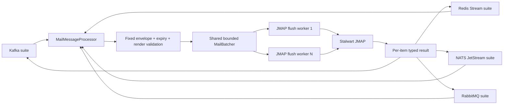

# Dataplane JMAP Batch Delivery — God View

> [!IMPORTANT]
> Đây là Source of Truth cho đoạn sau khi ordinary broker runtime đã decode fixed envelope và render
> template: `PreparedMail → shared batcher → Stalwart JMAP → typed per-item result`.
> Không có direct/system Mail job, LMTP hoặc Controlplane DB query trong đường này.

## 0. Control header

| Thuộc tính | Giá trị |
|---|---|
| Runtime owner | Dataplane pod trong đúng Zone |
| Entry | `MailMessageProcessor::process` |
| Shared transport | Một `MailBatcherHandle` + một `JmapClient` trên mỗi pod |
| Flush defaults/intent | Tối đa 50 items, 1000 ms hoặc byte cap cấu hình |
| Protocol | JMAP `Email/set` + `EmailSubmission/set` trong một HTTP request |
| Result | `MailSubmitResult` riêng cho từng broker message |
| Retry | Chỉ transport, HTTP 429/5xx và retryable JMAP error; exponential backoff + jitter |
| History | Không lưu delivery history trong phase hiện tại |
| Verified against | Working tree, 2026-07-22 |

## 1. Boundary

JMAP layer nhận `PreparedMail` đã được validate/render:

```text
job_id
recipient
subject
optional text_body
optional html_body
estimated_bytes
```

Layer này không được:

- Decode customer broker payload.
- Chọn template, sender, owner, Workspace hoặc Zone.
- Query Controlplane PostgreSQL/NATS KV.
- Commit Kafka offset, ACK Redis/JetStream/Rabbit delivery.
- Retry permanent recipient/template errors.

Mỗi broker suite giữ coordinate/settlement riêng. Processor chỉ trả typed outcome để suite quyết định
commit/ACK/requeue/term theo semantics của broker đó.

## 2. End-to-end flow



Processor giữ generation-fence submit permit xuyên suốt `batcher.submit().await`. Config COW hoặc mất lease
không hủy mù một HTTP request đã vào critical section; generation cũ chờ typed result rồi mới đóng.

## 3. Sender binding

Một pod bootstrap static sender profile từ deployment config:

```text
MAIL_SENDER_PROFILE_ID
MAIL_SENDER_VERSION > 0
MAIL_SENDER_ADDRESS
STALWART_JMAP_ACCOUNT_ID
STALWART_JMAP_IDENTITY_ID
STALWART_JMAP_MAILBOX_ID
```

Mỗi consumer snapshot pin `sender_profile_id + sender_version`. Processor so sánh exact với pod sender trước
khi render/submit. Mismatch là retryable configuration-unavailable; customer payload không được chọn From.

Account-verification cũng là ordinary root-owned consumer và bind sender theo cơ chế này. IAM không biết
sender profile nào được dùng.

## 4. Batcher contract

### 4.1 Queue and admission

`MailBatcherHandle` sở hữu bounded Tokio MPSC queue. `submit`:

1. Fail retryable nếu batcher đang shutdown.
2. Tăng `pending_items`.
3. Enqueue trong bounded timeout.
4. Chờ one-shot result đúng item.
5. Không tự suy settlement broker.

Queue đầy hoặc enqueue timeout trả `MAIL_BATCHER_BACKPRESSURE`. Không mở thêm batcher/HTTP client theo
consumer hoặc message vì sẽ phá global capacity control và nhân connection tới Stalwart.

### 4.2 Flush conditions

Current batch flush khi điều kiện đầu tiên xảy ra:

- `current.len() >= MAIL_BATCH_MAX_ITEMS`;
- tổng `estimated_bytes >= MAIL_BATCH_MAX_BYTES`;
- thời gian từ item đầu đạt `MAIL_BATCH_MAX_WAIT_MS`;
- item kế tiếp làm vượt byte cap, nên batch hiện tại flush trước;
- graceful shutdown, nên partial batch được flush.

`estimated_bytes` đã gồm recipient + subject + bodies + 1024-byte overhead estimate. Processor cũng enforce
per-message maximum trước khi enqueue.

### 4.3 Flush concurrency

Supervisor tạo bounded flush workers bằng `MAIL_JMAP_MAX_INFLIGHT_PER_POD`. Workers dùng chung receiver và
`Arc<JmapClient>`; số HTTP request song song không vượt cấu hình. Worker không spawn vô hạn theo batch.

## 5. JMAP request

Mỗi batch tạo đúng hai method calls:

1. `Email/set` tạo draft Email objects.
2. `EmailSubmission/set` tham chiếu `#mail-<creation_key>` và dùng `onSuccessDestroyEmail` để không giữ bản sao mailbox.

Request skeleton:

```json
{
  "using": [
    "urn:ietf:params:jmap:core",
    "urn:ietf:params:jmap:mail",
    "urn:ietf:params:jmap:submission"
  ],
  "methodCalls": [
    ["Email/set", {"accountId": "...", "create": {}}, "create-mails"],
    ["EmailSubmission/set", {
      "accountId": "...",
      "create": {},
      "onSuccessDestroyEmail": []
    }, "submit-mails"]
  ]
}
```

`creation_key` lọc `job_id` còn ASCII alphanumeric. `job_id` được từng broker suite derive deterministic từ
consumer + broker coordinate, giúp retry cùng message dùng stable client creation identity.

## 6. HTTP client and authentication

Một shared `reqwest::Client` được bootstrap với:

- connect timeout 3 giây;
- total request timeout cấu hình;
- idle pool timeout 90 giây;
- TCP keepalive 30 giây;
- bearer token hoặc Basic auth, bắt buộc một trong hai;
- không log auth header/token.

Endpoint rỗng hoặc sender/auth config thiếu làm Mail runtime fail bootstrap thay vì chạy half-configured.

## 7. Typed per-item result

Parser chỉ đọc `EmailSubmission/set` response call `submit-mails`:

| JMAP response | Per-item result |
|---|---|
| `created[submit-key]` | `MailAccepted`; phase hiện tại không persist submission ID/history |
| `notCreated[submit-key]` | `MAIL_JMAP_SUBMISSION_REJECTED` + typed retryability |
| Method-level `error` | `MAIL_JMAP_METHOD_ERROR` cho mọi item |
| Missing method/result | `MAIL_JMAP_RESULT_MISSING`, retryable |
| Invalid JSON/shape | `MAIL_JMAP_INVALID_RESPONSE`, retryable |

Không được coi HTTP `2xx` là toàn batch success: từng creation key phải có kết quả. Replies được zip đúng thứ
tự input; item A reject không biến item B thành failed.

## 8. Retry matrix

| Failure | Retry trong JMAP client? | Processor/suite outcome |
|---|---:|---|
| HTTP 429 | Có | Retryable nếu hết budget |
| HTTP 5xx | Có | Retryable nếu hết budget |
| Connect/timeout/transport | Có | Retryable nếu hết budget |
| HTTP 4xx khác | Không | Non-retryable JMAP result |
| JMAP `serverFail/serverPartialFail/rateLimit/tooManyRequests` | Typed retryable | Suite local-retry bounded rồi terminal theo bulk-mail policy nếu hết budget |
| JMAP validation/rejection khác | Không | Suite terminal settle theo source semantics |
| Queue full/shutdown | Không retry nội bộ | Retryable về suite để tránh hidden double-submit |

Backoff là exponential bounded theo attempt với random jitter 0–99 ms. Retry nằm ở HTTP request boundary;
không tạo một retry loop polling DB/Redis mỗi 500 ms.

## 9. HA, ambiguity and delivery semantics

JMAP timeout có thể xảy ra sau khi Stalwart đã nhận request nhưng trước khi Dataplane nhận response. Vì phase
hiện tại không có durable delivery ledger, hệ thống chỉ cam kết best-effort/at-least-once theo broker và có thể
duplicate trong ambiguous window.

Không được tuyên bố exactly-once chỉ dựa vào deterministic creation key. Cần staging test với Stalwart để xác
nhận idempotency behavior xuyên request/reconnect trước khi nâng contract.

Generation fence giảm duplicate do stale Zone owner:

- lease/config stale trước submit: không enqueue;
- stale trong khi HTTP đang chạy: chờ typed result, sau đó owner cũ dừng intake;
- không settlement nếu broker generation/rebalance state không còn hợp lệ.

## 10. Graceful shutdown

Order bắt buộc:

1. Supervisor dừng intake/claim slot mới.
2. Generation fences chặn submit mới và drain critical sections.
3. Configuration runtime dừng listener/reconciler.
4. Batcher nhận `Shutdown`, flush partial batch và đợi tất cả flush workers.
5. Chỉ sau đó process mới đóng shared HTTP runtime.

Nếu batch worker chết trước reply, submitter nhận `MAIL_BATCHER_RESULT_DROPPED`, không treo vô hạn.

## 11. Security and privacy

- Recipient, subject, HTML/text body, template parameters và JMAP auth không được log/metric-label.
- Subject đã bị reject CR/LF/control characters trước JMAP build.
- Recipient đã parse thành một canonical mailbox; không có recipient-array injection.
- HTML parameters đã escape; template không chạy code/function.
- Request byte caps và batch byte caps chặn oversized allocation/request.
- NetworkPolicy chỉ cho Mail Dataplane egress tới configured Stalwart endpoint.
- TLS certificate verification dùng trusted deployment roots; production credential phải được mount từ Secret.

## 12. Observability and backpressure

Low-cardinality state từ `MailWorkloadMetrics`:

| Signal | Ý nghĩa |
|---|---|
| `pending_items` | Queue + đang đợi JMAP result |
| `in_flight_batches` | HTTP batches đang chạy |
| `accepted_total` | Per-item JMAP accepted |
| `failed_total` | Per-item typed failure |

Mail workload monitor dùng các snapshot này để report Zone health/backpressure. Không dùng recipient,
consumer UUID hoặc submission ID làm metric label có cardinality cao.

## 13. Failure/race checklist

- [ ] Queue capacity, enqueue timeout, batch count/time/byte caps đều > 0 và bounded.
- [ ] `MAIL_JMAP_MAX_INFLIGHT_PER_POD` khớp capacity Stalwart và số Dataplane replicas.
- [ ] Partial batch flush khi shutdown đã có test.
- [ ] Per-item `created/notCreated/missing` mapping đã có test.
- [ ] Retry chỉ áp dụng 429/5xx/transport/retryable JMAP types.
- [ ] Processor giữ generation permit xuyên `batcher.submit().await`.
- [ ] Suite không ACK/commit khi generation/rebalance/lease đã stale.
- [ ] Không có direct/system `SendMailConfig` executor/protobuf.
- [ ] Không có mail history DB write trên hot path.

## 14. Code map

| Responsibility | File |
|---|---|
| Runtime composition/shutdown | `dataplane/src/executor/mail/mod.rs` |
| Fixed envelope/render/fence | `dataplane/src/executor/mail/processor/stream.rs` |
| Prepared/result models | `dataplane/src/executor/mail/processor/model.rs` |
| Bounded batcher | `dataplane/src/executor/mail/processor/batcher.rs` |
| JMAP request/retry/parser | `dataplane/src/executor/mail/processor/jmap.rs` |
| Centralized tests | `dataplane/src/executor/mail/test/batcher.rs`, `test/jmap.rs`, `test/stream_processor.rs` |
| Broker settlement | `dataplane/src/executor/mail/runtime/{kafka,redis_stream,nats_jetstream,rabbitmq}.rs` |
| Workload monitoring/report | `dataplane/src/executor/mail/supervisor/` |
