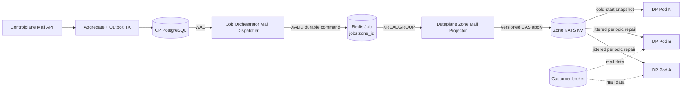
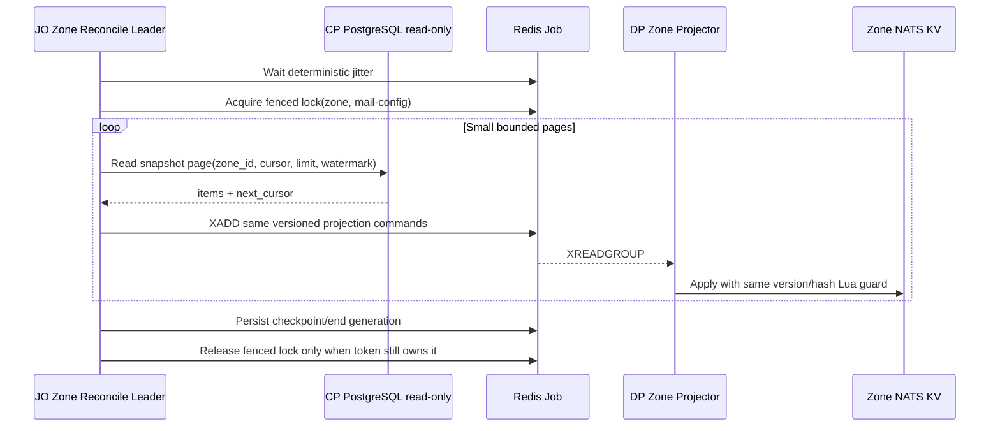
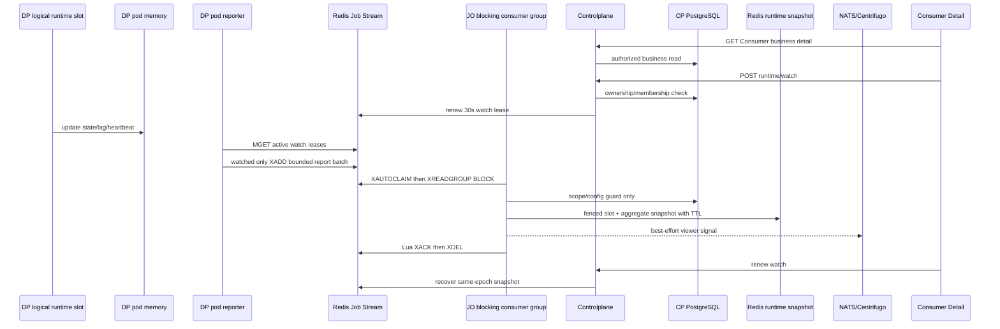

# Mail Configuration Projection CP → Zone — God View (Master SoT)

> [!IMPORTANT]
> Đây là Source of Truth cho việc đưa consumer desired state và immutable template từ PostgreSQL
> Controlplane xuống NATS JetStream KV của đúng Zone. Dataplane không query PostgreSQL Controlplane và
> projection không phụ thuộc polling 500ms.

## 0. Control header

| Thuộc tính | Giá trị |
|---|---|
| Trạng thái | Phase 4 projection + Phase 5 L2→L1 + Phase 6–8 broker runtime + Phase 9 runtime reverse report đã ship; activation gated |
| Authoritative source | Controlplane PostgreSQL aggregates + single `mail_outbox_records` |
| Real-time trigger | PostgreSQL WAL/logical replication |
| Projection transport | Redis Job Stream `jobs:<zone_id>` |
| Projection destination | NATS JetStream KV deployment riêng của đúng Zone, chỉ Dataplane Zone được ghi |
| Consistency | At-least-once transport, idempotent monotonic apply |
| Recovery | Cold-start + periodic small-batch snapshot reconciliation |
| Payload | `MailConsumer*V1`, `MailTemplate*V1` trong `mail_runtime.proto` |
| Không được phép | DP đọc CP DB; cross-Zone broadcast; plaintext secret; blind overwrite |

## 1. Control path, không phải mail data path



Customer broker payload không đi qua CP database, mail outbox hoặc Job Orchestrator.

## 2. Reliability boundaries

### Boundary A — PostgreSQL aggregate + outbox

Consumer/template mutation, projection tombstone khi có và outbox insert phải nằm trong cùng một
PostgreSQL transaction/commit boundary. Repository có thể dùng data-modifying CTE hoặc explicit
transaction khi workflow cần nhiều bước khóa/kiểm tra; cú pháp SQL không phải invariant:

```text
BEGIN
  authorize + lock aggregate
  mutate aggregate / retain projection tombstone
  insert mail_outbox_records
COMMIT
```

Typed `zone_id UUID` được snapshot từ authorized request context sau khi CP cross-check authoritative Workspace/Broker Zone.
Consumer row chỉ giữ `workspace_id`; payload không mang Workspace/owner/Zone. Không publish Redis/NATS trước
commit. Outbox row được giữ theo retention policy sau terminal state; không xóa ngay khi thành công.

### Boundary B — WAL relay → Redis Job

- JO chỉ có network/credential tới CP PostgreSQL, Redis Job và NATS Core trung tâm cho các domain liên quan; JO tuyệt đối không có endpoint/credential truy cập Zone JetStream KV.
- Logical replication slot chỉ giữ WAL đến khi JO `XADD` durable projection command thành công.
- JO advance/ack LSN sau `XADD`; không giữ WAL chờ Zone apply vì một Zone mất kết nối không được làm phình WAL của toàn PostgreSQL.
- Crash sau `XADD` nhưng trước LSN ack tạo duplicate command; `event_id` deterministic và monotonic Lua guard biến replay thành no-op.

### Boundary C — Redis Job → Zone NATS KV

- Dataplane Zone projector dùng consumer group đọc command, validate Zone/event/version/hash rồi mới apply L2.
- Projector chỉ `XACK` command sau khi NATS KV CAS được server acknowledge; delivery result/history hiện chưa thuộc scope.
- DB-reconciliation command không tương ứng outbox row nên không bắn PROCESSING/terminal result cho từng snapshot; L2 apply hoặc generation error marker là durability proof rồi mới `XACK`.
- Lỗi NATS KV tạm thời không `XACK`; pending entry được claim lại sau bounded idle time.
- `APPLIED`, `DUPLICATE`, `STALE` là success; `CONFLICT` hoặc payload/schema sai đi quarantine/FAILED và không overwrite L2.
- Zone NATS JetStream phải chạy 3 hoặc 5 node HA; KV vẫn là projection có thể rebuild từ CP snapshot.
- `NATS_ZONE_URL` không được fallback sang `NATS_URL`/`NATS_ADDR`; nhầm endpoint phải làm Dataplane fail bootstrap.

### Boundary D — L2 → Dataplane L1/runtime

- L2 là shared Zone snapshot.
- Mỗi DP pod reconcile consumer heads theo batch nhỏ lúc cold start và định kỳ, có jitter; không dùng Redis PubSub.
- Runtime COW swap chỉ xảy ra sau validation đầy đủ của snapshot mới.

## 3. Event catalogue

| Event | Direction | Aggregate clock | Hành vi đích |
|---|---|---|---|
| `MailConsumerUpsertV1` | CP → Zone | `config_version` | Store snapshot, update head, notify DP |
| `MailConsumerDeleteV1` | CP → Zone | `config_version` | Store tombstone, drain/remove runtime |
| `MailTemplateVersionPublishedV1` | CP → Zone | `template_revision` | Store immutable version + update catalog head |
| `MailTemplateDeletedV1` | CP → Zone | `template_revision` | Store durable tombstone; hard-delete identity cannot be resurrected |
| `MailConsumerRuntimeReportBatchV1` | DP → CP | config version + runtime generation | Bounded consumer delta batch |

### 3.1 Event identity

Configuration/template `event_id` là UUIDv5 deterministic:

```text
UUIDv5(mail_event_namespace,
       aggregate_type || aggregate_id || aggregate_version || event_type || target_zone_id)
```

Không hash serialized protobuf vì map ordering có thể khác nhau. Producer canonicalize domain fields rồi mới tính `config_sha256`/`content_sha256`.

Runtime heartbeat dùng công thức riêng để event ID vẫn xác định khi Redis replay:

```text
UUIDv5(mail_runtime_report_namespace,
       zone_id || consumer_id || instance_id || runtime_generation || report_sequence)
```

`report_sequence` tăng đơn điệu trong cùng instance generation. Delivery history/result event được deferred; JMAP submission ID chỉ trả về job transport.

### 3.2 UUID and version validation

- UUID byte fields phải đúng 16 bytes.
- SHA-256 fields phải đúng 32 bytes.
- `schema_version == 1`.
- Consumer/template/sender versions phải lớn hơn 0.
- `workspace_id`, owner và `zone_id` không được xuất hiện trong protobuf runtime payload.
- UUID trong outbox `zone_id` phải khớp Zone NATS KV connection mà projector đang ghi.

## 4. Zone L2 key model

```text
mail.consumer.head.{consumer_id}
  JSON version/event_id/config_sha256/desired_state/tombstoned

mail.consumer.snapshot.{consumer_id}.v{config_version}
  protobuf MailConsumerUpsertV1

mail.template.head.{template_id}
  JSON revision/current_version/event_id/content_sha256/tombstoned

mail.template.snapshot.{template_id}.v{template_version}
  protobuf MailTemplateVersionPublishedV1

zone.service.mail
  current health snapshot

lease.mail.health.observe
  CAS lease owner/fencing_token/expires_at/last_owner
```

- Consumer head keys là danh mục recoverable cho cold start/restart; mỗi tick chỉ hydrate bounded slice.
- Snapshot keys không overwrite immutable version.
- Head/tombstone update phải atomic.
- Runtime stream slot lease/fencing dùng Zone KV CAS + broker group generation; không dùng Redis lock.
- Không TTL consumer/template head đang active. Cleanup chỉ xóa unreachable snapshot sau retention và reconciliation proof.
- L1 có thể TTL/bounded vì luôn reload được từ L2.

## 5. Atomic apply rules

### 5.1 Consumer upsert

```text
incoming.version < head.version
    => STALE, no-op

incoming.version == head.version AND hashes equal
    => DUPLICATE, no-op

incoming.version == head.version AND hashes differ
    => CONFLICT, quarantine + alert; không overwrite

incoming.version > head.version
    => write immutable snapshot + swap head atomically
```

Nếu head/hash hợp lệ nhưng immutable snapshot bị mất riêng lẻ, projection tự repair bằng KV create/CAS và trả
`REPAIRED`, phục hồi phần thiếu nhưng không đổi aggregate clock. So sánh integrity dựa trên canonical
business hash; protobuf envelope có thể khác metadata giữa WAL event và reconciliation replay.

### 5.2 Consumer tombstone

- Chỉ apply khi delete version lớn hơn head version.
- Tombstone không được xóa ngay để upsert cũ không hồi sinh consumer.
- Re-create phải dùng consumer ID mới; không reset version về 1 trên ID cũ.
- Controlplane business table không có `deleted_at` hay desired state `deleting`: CP giữ active row trong lúc delete operation chạy; JO hard-delete theo resource ID sau Dataplane success,
  còn `personal_mail_consumer_projection_tombstones` hoặc
  `tenant_mail_consumer_projection_tombstones` giữ rebuild authority độc lập với business row.
  JO resolve đúng một physical namespace bằng consumer UUID dưới row lock; zero hoặc hai match đều fail-close.
- JO khóa outbox theo `event_id + job_topic` và dùng `result_attempt` để chặn PROCESSING/FAILED đến sai thứ tự.
  Mọi `FAILED` là terminal cho operation ID; upsert/publish cleanup candidate, còn delete giữ aggregate và retry phát operation ID mới với cùng `next_*` fence.

### 5.3 Template publish/delete

- Immutable version key có cùng version/hash: duplicate no-op.
- Cùng version nhưng khác hash: integrity violation.
- Catalog head so sánh `template_revision`, không chỉ content version.
- CP publish chỉ tạo candidate immutable; JO promote current head sau Zone `SUCCEEDED`, hoặc xóa exact candidate theo `event_id + version + revision` khi `FAILED`.
- Delete giữ head tombstone và `last_published_version`; authoritative CP projection tombstone tồn tại sau outbox retention để rebuild không hồi sinh identity cũ.

## 6. Real-time projection sequence

```mermaid
sequenceDiagram
    autonumber
    participant API as CP Mail Service
    participant DB as CP PostgreSQL
    participant JO as JO Mail Dispatcher
    participant RJ as Redis Job
    participant ZP as DP Zone Projector
    participant L2 as Zone NATS KV
    participant DP as Dataplane Pods

    API->>DB: guarded mutation + outbox data-modifying CTE
    DB-->>JO: Logical replication WAL row
    JO->>JO: Validate outbox envelope + target Zone
    JO->>RJ: XADD jobs:zone_id durable projection command
    RJ-->>ZP: XREADGROUP command
    ZP->>ZP: Decode protobuf + validate configured Zone/version/hash
    ZP->>L2: create immutable snapshot + CAS versioned head
    alt newer event
        L2-->>ZP: APPLIED
        L2-->>DP: jittered periodic scan
        DP->>L2: GET immutable snapshot
        DP->>DP: Validate + COW L1/runtime
    else replay/stale
        L2-->>ZP: DUPLICATE or STALE
    else same-version conflict
        L2-->>ZP: CONFLICT
        ZP->>ZP: Quarantine/FAILED; không overwrite
    end
    ZP->>RJ: XACK projection command
	ZP-->>JO: durable JobExecutionResult
	JO->>DB: lock outbox + promote candidate / hard-delete after success
	JO-->>UI: NATS Core -> notification service -> Centrifugo
```

JO ack WAL sau durable `XADD`; Zone projector chỉ `XACK` command sau KV server acknowledgement. Redis Job là durability bridge giữa hai network boundary.
Nếu terminal DB transaction đã commit nhưng NATS Core publish lỗi, JO không ACK Redis result. Lần redelivery cùng terminal status
chỉ đọc lại notification metadata và publish lại cùng `transaction_id`; nó không chạy lần hai promote/cleanup/hard-delete.

## 7. Cold start and reconciliation

### 7.1 Cold start

1. DP dùng một central ticker và chỉ hydrate bounded slice các key `mail.consumer.head.*` mỗi tick.
2. Mỗi tick dùng jitter theo pod identity và `MissedTickBehavior::Skip` để tránh thundering herd/tick backlog.
3. Phase-5 registry load snapshot nhỏ của các desired `ENABLED/PAUSED` consumer và COW-swap theo version/hash.
4. Phase-6 supervisor claim các runtime slots còn trống bằng lease + fencing token; không phải mọi pod mở mọi consumer.
5. Cold start **không preload template content**. Consumer L1 chỉ giữ đúng một pinned `template_id + version`.
6. Khi message đầu tiên cần render, Moka L1 miss mới đọc đúng immutable template snapshot từ L2, validate hash và singleflight concurrent miss.
7. Template dependency đến trễ làm message/partition đi bounded retry hoặc runtime `DEGRADED`; reconciler sửa revision drift, không full-hydrate mọi template.
8. `RUNNING` phản ánh lease + broker-suite readiness; template lỗi khi thực thi phải report riêng và không mutate consumer config generation.

Nếu L2 trống, DP không query CP DB. Nó yêu cầu zonal reconciliation và giữ mail broker runtime `STOPPED/STARTING` cho đến khi snapshot xuất hiện.

### 7.2 Periodic reconciliation



- CP chọn consumer theo Zone bằng cách join `workspace_id` sang Hierarchy; `zone_id` không bị duplicate vào consumer row.
- JO dùng PostgreSQL role read-only giới hạn đúng các bảng/view cần reconcile; Dataplane không bao giờ đọc CP DB.
- Page size có hard cap và cấu hình; không load toàn bộ Zone vào RAM.
- Reconcile sử dụng cursor ổn định + snapshot watermark để không xóa nhầm record được tạo giữa lúc scan.
- Một central scheduler chọn các Zone đến hạn; không tạo ticker riêng cho từng Zone/consumer.
- Mỗi JO instance chờ deterministic jitter theo `instance_id + zone_id + task_kind` trước đúng một lần thử lock; thua lock thì bỏ lượt, không spin retry.
- Lock có fencing generation. Mỗi lượt chỉ xử lý tối đa số page/thời gian đã cấu hình rồi lưu checkpoint và nhường lượt để Zone lớn không làm Zone nhỏ starvation.
- Tick trễ dùng `MissedTickBehavior::Skip`; lỗi dùng exponential backoff kèm random jitter.
- Chỉ một leader mỗi Zone chạy full scan; các pod khác vẫn phục vụ WAL/result path.
- Reconciliation chậm không block real-time WAL projection.
- Ở DP, invalidation đánh thức cùng supervisor; timer/reconcile dùng một scheduling loop chung thay vì spawn một ticker cho mỗi consumer.
- Reconcile interval có jitter và backoff khi Redis lỗi; tick bị trễ được skip, không chạy dồn để gây connection storm.

## 8. On-demand runtime watch reverse path

Runtime là soft state theo nhu cầu Consumer Detail, không tạo mail delivery history hoặc PostgreSQL projection:



1. `GET Consumer` không trả runtime. `POST .../runtime/watch` DB-authorize rồi tạo lease 30 giây bind active config + epoch.
2. Slot state nằm trong app memory của pod owner. Không có `mail.runtime.*` trong Zone NATS KV.
3. Mọi pod tự report local slots; không có rotating report leader. Consumer không được watch không tạo Central Redis write.
4. Redis stream giữ bounded batch; lỗi DB/Redis giữ entry trong PEL. NATS notification lỗi không giữ PEL vì snapshot Redis là recovery source.
5. Redis slot fence là `config_version + runtime_generation + report_sequence`; aggregate commit recheck exact watch lease/epoch.
6. Runtime keys có TTL, không cần CronJob/cleaner. Watch mới không đọc snapshot epoch cũ dù key chưa expire.
7. Centrifugo chỉ mang customer-safe aggregate; hostname/pod/broker credential không vượt boundary.

## 9. Race/failure matrix

| Failure window | Recovery |
|---|---|
| CP aggregate commit, process chết trước publish | Outbox WAL vẫn tồn tại |
| JO XADD Redis Job, chết trước ack LSN | WAL replay → duplicate command → same version/hash no-op |
| Zone projector apply L2, chết trước result/XACK | PEL reclaim → same version/hash no-op → durable result |
| Delete v7 đến trước upsert v6 | DP tombstone v7; v6 bị bỏ; JO chỉ xóa CP row sau success |
| Upsert v8 đến trước delayed delete v7 | Head v8; delete v7 bị bỏ |
| Same version/different payload | Không last-write-wins; quarantine integrity conflict |
| Pod bỏ lỡ revision trong một tick | Cold-start/periodic KV reconcile sửa lại |
| Pod chết khi đang giữ runtime slot | Lease hết hạn; pod khác claim với fencing token mới rồi mở đúng broker suite |
| Zone KV failover/stall làm holder cũ tưởng còn lease | Server fencing token + monotonic local deadline chặn submit/settlement generation cũ |
| Consumer upsert đến trước template snapshot | Consumer binding vẫn COW; first-message lazy load fail bounded/retry, template projection hoặc reconcile unblock |
| L2 failover mất projection mới | DB-backed snapshot reconciliation qua Redis Job rebuild |
| CP snapshot thay đổi giữa các page | Snapshot watermark tránh destructive sweep sai |
| UI rời resource page giữa operation | Activity vẫn ở in-memory header trong phiên; khi quay lại, terminal Centrifugo signal invalidate/merge read model, không poll status URL |
| JO commit terminal result nhưng notify lỗi | Redis result ở lại PEL; redelivery retry cùng notification ID, business mutation không chạy lại |
| Template delete đua với consumer update candidate | `FOR UPDATE`/`KEY SHARE` serialize identity; delete kiểm tra candidate version lớn hơn active nên không xóa dependency chưa-promote |
| Zone network partition | CP tiếp tục nhận config; outbox lag tăng, DP giữ last known good config |
| Credential rotation event lỗi | Runtime cũ giữ connection đến khi new config validated; không half-swap |
| JO chết sau DB commit trước Redis settle | PEL reclaim; guarded UPSERT no-op rồi ACK/XDEL |
| Pod takeover logical slot khi report ERROR cũ còn TTL | Cùng `slot:<n>`, generation mới overwrite row cũ |

## 10. Security and data minimization

- Projection payload không chứa plaintext broker username/password/token/TLS private key.
- Outbox row vẫn chỉ chứa `payload BYTEA`; bên trong `MailConsumerUpsertV1.stream` mang `stream_type`, adapter schema version, broker resource ID và adapter payload bytes.
- Mỗi suite payload mang `source_config_envelope` opaque tối đa 16 KiB. CP DB, outbox, JO và Zone NATS KV chỉ lưu/chuyển tiếp bytes; chỉ đúng DP suite giải mã bằng zone-local key material.
- JO chỉ dùng typed `zone_id` trong trusted outbox envelope để chọn Redis Job stream; protobuf không thể tự đổi Zone.
- Zone projector so sánh stream/configured `zone_id`; command không thể yêu cầu ghi sang Redis của Zone khác.
- Template body có thể chứa customer content: JetStream file-storage encryption/access policy và không log payload.
- Invalidation channel chỉ chứa aggregate ID/version, không template content hoặc source config envelope.
- Trace baggage từ customer không được đưa vào control event.

## 11. Observability

Metrics giữ low cardinality:

- Outbox unprojected count/oldest age.
- WAL/projector lag per Zone.
- Apply outcome: applied/repaired/duplicate/stale/conflict.
- Reconcile duration/items/differences.
- L2 snapshot/hash validation failures.
- DP observed config-version lag.

Không dùng consumer ID, workspace ID, topic hoặc template ID làm metric label. Chúng chỉ xuất hiện trong bounded structured diagnostics/audit.

## 12. Implementation ownership

| Concern | Target phase/component |
|---|---|
| Aggregate tables + single mail outbox schema | Phase 1, Controlplane Mail — implemented |
| Guarded Personal/Tenant Workspace/Zone aggregate + outbox CTE | Phase 2, Controlplane Mail — implemented |
| WAL decoder + Redis Job dispatcher | Phase 4, Job Orchestrator |
| Redis Job consumer + immutable snapshot/NATS KV CAS apply | Phase 4, Dataplane Zone projector |
| L2 loader + L1 COW | Phase 5, Dataplane |
| DB-backed zonal snapshot reconciler | Phase 4, Job Orchestrator → Redis Job |
| Mail result L2 + transactional hard-delete | Job Orchestrator `reverse_provider/mail/{l2_dispatcher,service}` |
| Consumer report reverse relay + CP Consumer Detail read model | Phase 9 — implemented |
| Zone health + OTel/Grafana | Mail operational observability God View — implemented without CP projection |

### 12.1 Code-shape invariant

- Consumer upsert, consumer delete, template publish và template delete là bốn flow riêng; không gom thành generic business handler.
- Cold-start reconciliation và periodic reconciliation là hai flow riêng; không điều khiển bằng một helper có nhiều cờ boolean.
- Ưu tiên transaction/ack/retry/lock boundary nhìn thấy ngay tại callsite. Duplicate code có chủ đích được chấp nhận để luồng minh bạch.
- Chỉ tách helper cho primitive hạ tầng không mang business decision như Redis connection, protobuf generated type, trace propagation và fenced-lock primitive.

Tài liệu này khóa semantics; tên Redis key có thể được gom vào constants khi implement nhưng không được thay đổi version/tombstone/hash/fencing invariants.
