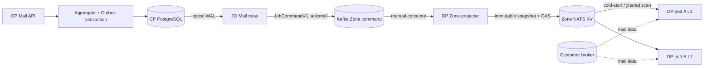
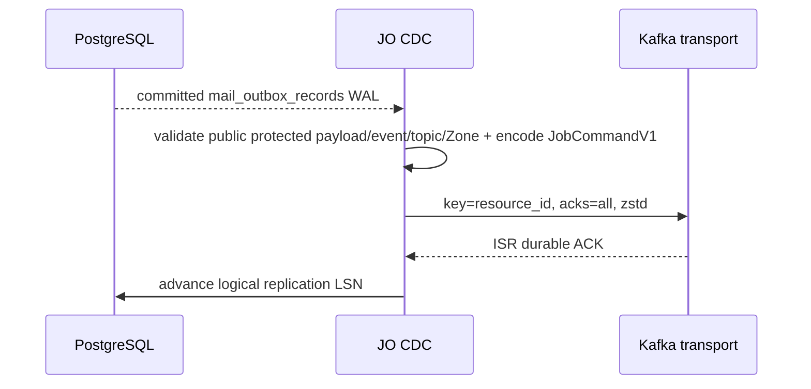
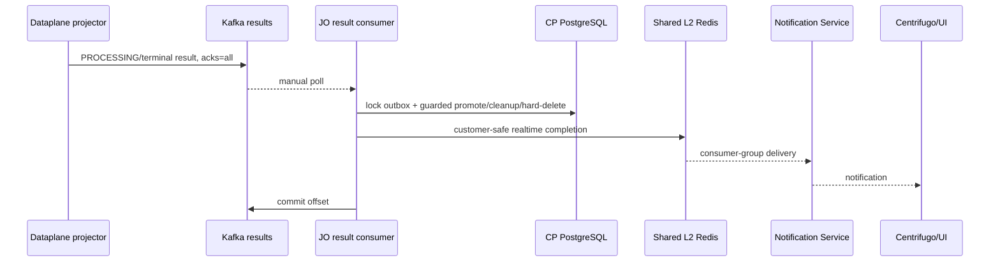
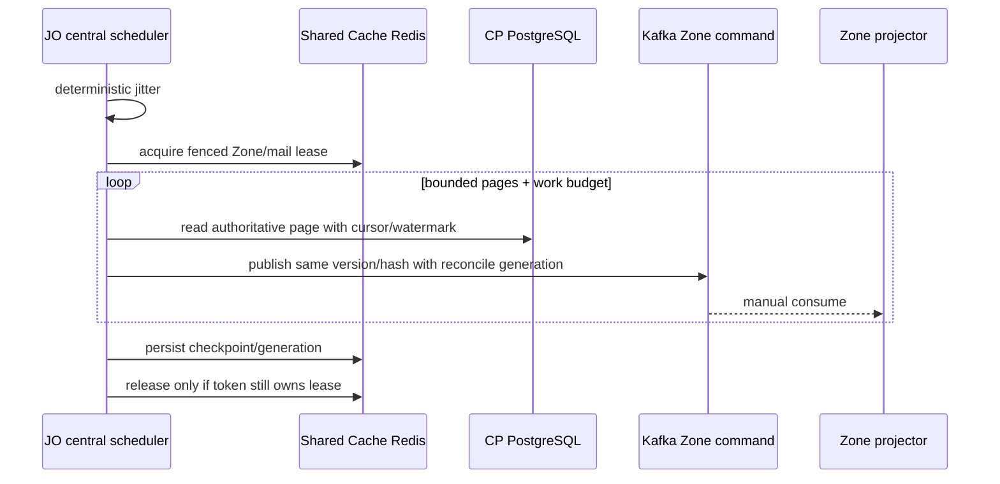
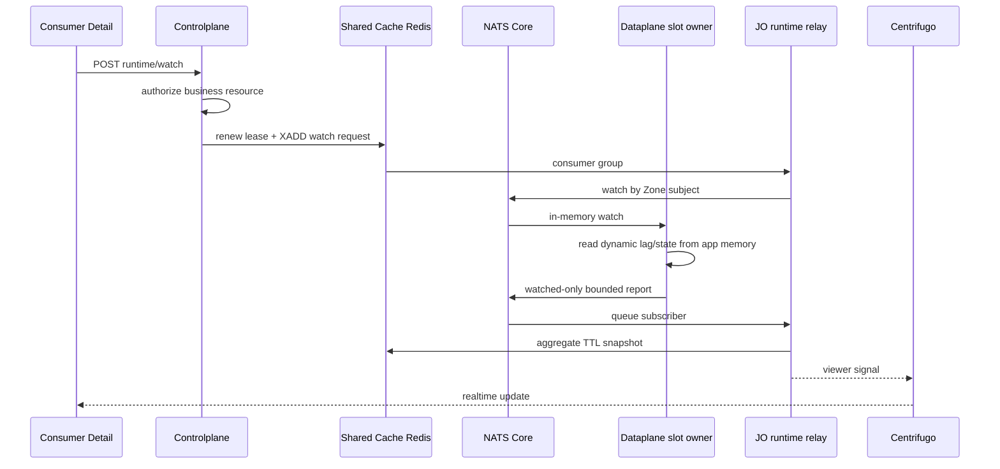

# Mail Configuration Projection CP → Zone — God View

> [!IMPORTANT]
> Đây là Source of Truth cho consumer/template desired state từ Controlplane PostgreSQL xuống NATS
> JetStream KV của đúng Zone. Durable projection transport là Kafka transport plane; không còn Redis Job.
> Kafka platform semantics nằm tại
> [`CENTRAL_ZONE_TRANSPORT.md`](../../architecture/CENTRAL_ZONE_TRANSPORT.md).

## 0. Control header

| Thuộc tính | Contract |
|---|---|
| Business SoT | CP PostgreSQL aggregate + một `mail_outbox_records` |
| Trigger | PostgreSQL WAL/logical replication |
| Transport | `aurora.jobs.commands.zone.<zone_uuid>.v1`, Protobuf `JobCommandV1` |
| Destination | `AURORA_ZONE_CONFIG` trên NATS JetStream cluster riêng Zone |
| Apply | At-least-once, monotonic version/hash, immutable snapshot + CAS head |
| Result | `aurora.jobs.results.v1` |
| Recovery | Cold start + periodic small-batch reconciliation có jitter/fenced generation |
| Không được phép | DP đọc CP DB; JO đọc Zone KV; cross-Zone topic; plaintext secret; blind overwrite |

## 1. Control path



Customer payload không đi qua CP database/outbox/JO. Projection chỉ mang configuration snapshot.

## 2. PostgreSQL aggregate/outbox boundary

Consumer/template mutation và outbox insert commit cùng transaction:

```text
BEGIN
  authorize + lock aggregate
  mutate Personal hoặc Tenant aggregate
  insert mail_outbox_records
COMMIT
```

- Mỗi Personal/Tenant create/update/delete/publish là flow riêng; không gom generic handler.
- Outbox row giữ stable columns của outbox chuẩn; dữ liệu thay đổi nằm trong versioned `payload`.
- `zone_id UUID` lấy từ trusted routing/ownership validation và được snapshot vào outbox để route.
- Consumer business row giữ `workspace_id`; runtime payload không cần workspace/owner.
- Không publish Kafka/NATS trước DB commit.
- Outbox giữ theo retention policy; không xóa ngay sau thành công.

## 3. WAL → Kafka durability boundary



- JO không có Zone KV credential.
- Crash sau Kafka ACK trước LSN advance sinh duplicate an toàn.
- `job_id`, aggregate version, event ID và business hash làm idempotency/version fence.
- Kafka ACK không chứng minh Zone apply; nó chỉ là boundary để giải phóng WAL.

## 4. Kafka → Zone KV boundary

Dataplane đúng Zone:

1. Consume exact Zone topic với manual commit.
2. Validate `JobCommandV1`: schema, UUID, source domain, resource, topic, `target_zone_id` và public `ProtectedPayloadV1` metadata.
3. Poison/cross-Zone command được publish `DeadLetterRecordV1` durable rồi settle source offset.
4. Acquire `lease.job.<sha256(job_id)>` trong `AURORA_ZONE_COORDINATION`.
5. HPKE-open full payload rồi decode `MailConsumer*V1` hoặc `MailTemplate*V1`.
6. Apply immutable snapshot + head/tombstone CAS trong `AURORA_ZONE_CONFIG`.
7. Publish `JobExecutionResultProto` durable.
8. Commit only highest contiguous terminal Kafka offset của assignment epoch.

NATS KV temporary failure không settle command. Lease contention republish cùng command/key bằng `acks=all`
trước khi settle original để không giữ partition vô hạn.

## 5. Event catalogue và validation

| Event | Clock | Target behavior |
|---|---|---|
| `MailConsumerUpsertV1` | `config_version` | Store snapshot, update head, invalidate L1 |
| `MailConsumerDeleteV1` | `config_version` | Tombstone, drain/remove runtime |
| `MailTemplateVersionPublishedV1` | `template_revision` + version | Store immutable version, update catalog head |
| `MailTemplateDeletedV1` | `template_revision` | Durable tombstone, prevent resurrection |

Validation:

- UUID fields đúng 16 bytes; SHA-256 đúng 32 bytes.
- `schema_version == 1`; version/revision lớn hơn zero.
- Kafka Zone topic, command `target_zone_id` và pod `ZONE_ID` phải trùng.
- Runtime payload không chứa workspace/owner/Zone.
- `source_config_envelope` opaque tối đa bounded size; CP/JO/KV không giải mã.
- Same version + different hash là integrity conflict, không last-write-wins.

## 6. Zone KV key model

```text
mail.consumer.head.<consumer_id>
mail.consumer.snapshot.<consumer_id>.v<config_version>
mail.template.head.<template_id>
mail.template.snapshot.<template_id>.v<template_version>
```

Head chứa version/revision, event ID, hash và tombstone state. Snapshot version là immutable.

Apply rules:

```text
incoming clock < head clock
  => STALE

incoming clock == head clock && hash equal
  => DUPLICATE

incoming clock == head clock && hash different
  => CONFLICT + quarantine

incoming clock > head clock
  => create immutable snapshot + CAS head
```

Nếu head đúng nhưng snapshot cùng hash bị mất, projector repair exact immutable key mà không tăng clock.

## 7. Publish/delete lifecycle

### Consumer

- Update dùng COW config version.
- Delete chỉ apply nếu version mới hơn head; tombstone không xóa ngay.
- Re-create dùng consumer ID mới.
- CP giữ business row cho đến DP delete success; JO mới hard-delete row theo resource ID.
- FAILED create/update xóa exact candidate version của operation; không xóa active version.
- Delete FAILED giữ business row để retry bằng operation ID mới.

### Template

- Publish tạo candidate immutable version; active head chưa đổi ngay.
- JO promote candidate chỉ sau Zone `SUCCEEDED`.
- FAILED publish xóa exact candidate theo event/version/revision.
- Delete bị chặn nếu active/candidate consumer còn reference.
- Projection tombstone sống lâu hơn outbox retention để reconciliation không hồi sinh deleted identity.

## 8. Result path



- Poison result → durable DLQ → commit.
- DB/Shared Redis transient failure dừng listener trước khi offset cao hơn được commit.
- Replay không lặp business mutation nhờ job/topic/attempt/terminal guards.
- UI không poll status URL; realtime notification merge với fresh business read.

## 9. Cold start và periodic reconciliation

### Dataplane cold start

1. Bounded scanner đọc `mail.consumer.head.*`.
2. Jitter theo pod identity; missed tick dùng `Skip`.
3. Consumer L1 COW theo version/hash.
4. Supervisor claim logical slots bằng Zone KV lease/fencing.
5. Template content lazy-load từ immutable KV snapshot khi message đầu tiên cần render.
6. Moka L1 byte-weight + TTL + singleflight concurrent miss.

Nếu Zone KV trống, DP không query CP DB. Nó publish `ZoneMetadataQueryV1` cho metadata và chờ JO mail
reconciler republish configuration pages.

### JO periodic reconciliation



- Cache Redis chỉ giữ lock/generation/checkpoint có thể rebuild; không giữ durable command.
- Một scheduler chọn Zone đến hạn; không ticker per consumer/Zone.
- Page size, pages/run và work budget có hard cap.
- Thua lock bỏ lượt; không spin.
- Retry dùng exponential backoff + jitter.
- Reconciliation không block WAL real-time path.

## 10. Runtime watch là soft state riêng

Consumer Detail runtime không đi qua Kafka và không ghi PostgreSQL/Zone KV:



- Dynamic lag/inflight/throughput không lưu Kafka, PostgreSQL hoặc NATS KV.
- Không có watch memory hợp lệ thì DP không phát NATS runtime report cho consumer đó.
- Keys có TTL; không cần history table/cleaner.
- Hostname, credential và rendered body không đi tới UI.

## 11. Failure/race matrix

| Failure | Guard/recovery |
|---|---|
| CP commit rồi pod chết | WAL/outbox còn durable |
| JO publish Kafka rồi chết trước LSN | Duplicate command; same version/hash no-op |
| DP apply KV rồi chết trước result/commit | Kafka replay; apply duplicate; publish result lại |
| Delete v7 đến trước upsert v6 | Tombstone v7 chặn resurrection |
| Same version/different bytes | Hash conflict quarantine |
| Rebalance khi task đang chạy | Assignment epoch fence |
| Kafka quorum mất | Không ACK producer; không advance LSN/settle source |
| Zone partition | CP vẫn nhận desired state; Kafka lag tăng; DP giữ last-known-good |
| KV failover | Command chưa settle; Kafka replay |
| Redis Cache outage | Reconciler/watch suy giảm; WAL/Kafka projection vẫn durable |
| Template chưa tới khi consumer chạy | Lazy load fail bounded; runtime degraded đến reconcile |
| Stale runtime report | config version + runtime generation + sequence fence |

## 12. Security và code shape

- JO route bằng trusted outbox `zone_id`; DP vẫn revalidate Kafka topic + command Zone.
- Kafka ACL giới hạn exact Zone topic/group.
- Chỉ DP đúng Zone giải mã encrypted customer broker envelope.
- Template/customer payload không log.
- Trace baggage từ customer không đưa vào control event.
- Không dùng cache/runtime metric làm business SoT.

Code shape:

- Personal/Tenant và create/update/delete/publish là các flow riêng.
- Cold-start và periodic reconciliation là flow riêng.
- Duplicate code có chủ đích được chấp nhận để transaction/ack/retry/lock nhìn rõ tại callsite.
- Chỉ tách primitive hạ tầng không mang business decision.

## 13. Code map

| Concern | File |
|---|---|
| Aggregate + outbox CTE | `controlplane/internal/mail/repository/` |
| WAL decode/publish | `job-orchestrator/src/changefeed/worker.rs` |
| Reconciler | `job-orchestrator/src/reconcile/mail/` |
| Kafka transport JO | `job-orchestrator/src/infra/kafka.rs` |
| Kafka command intake | `dataplane/src/job_runtime/intake.rs` |
| Mail projector | `dataplane/src/executor/mail/executor.rs` |
| Zone KV apply/L1 | `dataplane/src/executor/mail/{projection,configuration}.rs` |
| Result transaction | `job-orchestrator/src/results/mail/` |
| Runtime watch | `controlplane/internal/mail/`, `dataplane/src/executor/mail/supervisor/consumer_reporter.rs` |
