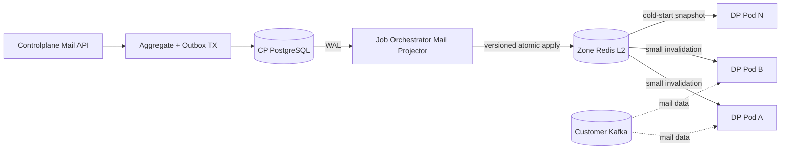
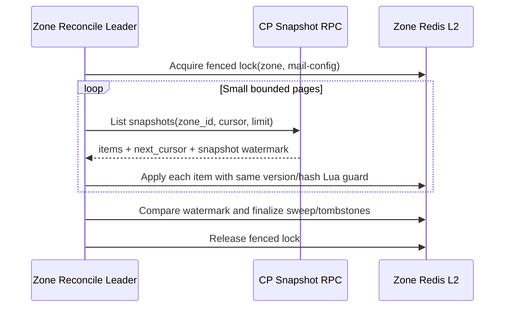

# Mail Configuration Projection CP → Zone — God View (Master SoT)

> [!IMPORTANT]
> Đây là Source of Truth cho việc đưa consumer desired state và immutable template từ PostgreSQL
> Controlplane xuống Redis L2 của đúng Zone. Dataplane không query PostgreSQL Controlplane và
> projection không phụ thuộc polling 500ms.

## 0. Control header

| Thuộc tính | Giá trị |
|---|---|
| Trạng thái | Phase 0 — contract locked, implementation thuộc Phase 4 |
| Authoritative source | Controlplane PostgreSQL aggregates + single `mail_outbox_records` |
| Real-time trigger | PostgreSQL WAL/logical replication |
| Projection destination | Redis L2 của đúng Zone |
| Consistency | At-least-once transport, idempotent monotonic apply |
| Recovery | Cold-start + periodic small-batch snapshot reconciliation |
| Payload | `MailConsumer*V1`, `MailTemplate*V1` trong `mail_runtime.proto` |
| Không được phép | DP đọc CP DB; cross-Zone broadcast; plaintext secret; blind overwrite |

## 1. Control path, không phải mail data path



Customer Kafka payload không đi qua CP database, mail outbox hoặc Job Orchestrator.

## 2. Reliability boundaries

### Boundary A — PostgreSQL aggregate + outbox

Consumer/template mutation và outbox insert xảy ra trong cùng một data-modifying CTE statement:

```text
WITH authorized AS (...),
     mutated AS (... INSERT/UPDATE ... RETURNING ...),
     outbox_inserted AS (
       INSERT INTO mail_outbox_records(...)
       SELECT ... FROM mutated
     )
SELECT authorization/result classification
```

`routing_scope=zone:<uuid>` được tạo từ trusted `X-Zone-ID` sau khi CP cross-check authoritative Workspace/Broker Zone.
Consumer row chỉ giữ `workspace_id`; payload không mang Workspace/owner/Zone. Không publish Redis/NATS trước
commit. Outbox row được giữ theo retention policy sau terminal state; không xóa ngay khi thành công.

### Boundary B — WAL relay → Zone L2

- Logical replication slot giữ WAL đến khi projector xác nhận apply.
- Projector chỉ advance/ack LSN sau khi Zone Redis trả kết quả apply/no-op hợp lệ.
- Crash sau Redis apply nhưng trước LSN ack tạo replay; monotonic Lua guard biến replay thành no-op.
- Zone Redis phải chạy HA/persistence phù hợp; dù vậy nó vẫn là projection có thể rebuild từ CP snapshot.

### Boundary C — L2 → Dataplane L1/runtime

- L2 là shared Zone snapshot.
- Invalidation chỉ là fast path và có thể mất.
- Mỗi DP pod reconcile registry/slot leases theo batch nhỏ lúc cold start và định kỳ, vì vậy PubSub không phải durability boundary.
- Runtime COW swap chỉ xảy ra sau validation đầy đủ của snapshot mới.

## 3. Event catalogue

| Event | Direction | Aggregate clock | Hành vi đích |
|---|---|---|---|
| `MailConsumerUpsertV1` | CP → Zone | `config_version` | Store snapshot, update head, notify DP |
| `MailConsumerDeleteV1` | CP → Zone | `config_version` | Store tombstone, drain/remove runtime |
| `MailTemplateVersionPublishedV1` | CP → Zone | `template_revision` | Store immutable version + update catalog head |
| `MailTemplateArchivedV1` | CP → Zone | `template_revision` | Mark catalog archived; retain version snapshots |
| `MailConsumerRuntimeReportedV1` | DP → CP | config version + runtime generation | Update reported state only |
| `MailExecutionResultV1` | DP → CP | per-submission `state_version` | Append history + monotonic submission head |

### 3.1 Event identity

Configuration/template `event_id` là UUIDv5 deterministic:

```text
UUIDv5(mail_event_namespace,
       aggregate_type || aggregate_id || aggregate_version || event_type || target_zone_id)
```

Không hash serialized protobuf vì map ordering có thể khác nhau. Producer canonicalize domain fields rồi mới tính `config_sha256`/`content_sha256`.

Runtime heartbeat dùng công thức riêng để mỗi heartbeat không bị inbox dedupe nhầm:

```text
UUIDv5(mail_runtime_report_namespace,
       consumer_id || instance_id || runtime_generation || report_sequence)
```

`report_sequence` tăng đơn điệu trong cùng instance generation. Execution result event dùng
`submission_id + state_version + status`; replay đúng cùng state có cùng event ID.

### 3.2 UUID and version validation

- UUID byte fields phải đúng 16 bytes.
- SHA-256 fields phải đúng 32 bytes.
- `schema_version == 1`.
- Consumer/template/sender versions phải lớn hơn 0.
- `workspace_id`, owner và `zone_id` không được xuất hiện trong protobuf runtime payload.
- UUID trong outbox `routing_scope=zone:<uuid>` phải khớp Zone Redis connection mà projector đang ghi.

## 4. Zone L2 key model

```text
mail:consumer:registry
  HASH consumer_id -> config_version | desired_state | config_sha256

mail:consumer:head:{consumer_id}
  version
  event_id
  config_sha256
  tombstoned
  snapshot_key

mail:consumer:snapshot:{consumer_id}:v{config_version}
  protobuf MailConsumerUpsertV1

mail:template:head:{template_id}
  revision
  current_version
  event_id
  content_sha256
  archived

mail:template:snapshot:{template_id}:v{template_version}
  protobuf MailTemplateVersionPublishedV1

mail:consumer:slot:{consumer_id}:{slot}
  lease owner instance_id + fencing_token + config_version
```

- Registry là danh mục recoverable cho cold start/restart; dùng bounded `HSCAN`, không dùng `KEYS`.
- Snapshot keys không overwrite immutable version.
- Head/tombstone update phải atomic.
- `parallelism=N` tạo tối đa N logical slots; pod chỉ mở Kafka connection sau khi giữ lease còn hạn.
- Lease takeover phải cấp fencing token mới; callback của holder cũ không được commit offset/result sau khi mất lease.
- Không TTL consumer/template head đang active. Cleanup chỉ xóa unreachable snapshot sau retention và reconciliation proof.
- L1 có thể TTL/bounded vì luôn reload được từ L2.

## 5. Atomic apply rules

### 5.1 Consumer upsert

```text
incoming.version < head.version
    => STALE, no-op

incoming.version == head.version AND hashes equal
    => DUPLICATE, no-op

incoming.version == head.version AND hashes differ
    => CONFLICT, quarantine + alert; không overwrite

incoming.version > head.version
    => write immutable snapshot + swap head atomically
```

### 5.2 Consumer tombstone

- Chỉ apply khi delete version lớn hơn head version.
- Tombstone không được xóa ngay để upsert cũ không hồi sinh consumer.
- Re-create phải dùng consumer ID mới; không reset version về 1 trên ID cũ.

### 5.3 Template publish/archive

- Immutable version key có cùng version/hash: duplicate no-op.
- Cùng version nhưng khác hash: integrity violation.
- Catalog head so sánh `template_revision`, không chỉ content version.
- Archive giữ `last_published_version` và version snapshots để active consumer drain.

## 6. Real-time projection sequence

```mermaid
sequenceDiagram
    autonumber
    participant API as CP Mail Service
    participant DB as CP PostgreSQL
    participant JO as JO Mail Projector
    participant L2 as Zone Redis L2
    participant DP as Dataplane Pods

    API->>DB: guarded mutation + outbox data-modifying CTE
    DB-->>JO: Logical replication WAL row
    JO->>JO: Decode protobuf + validate target Zone/version/hash
    JO->>L2: EVAL atomic versioned apply
    alt newer event
        L2-->>JO: APPLIED
        JO->>L2: PUBLISH compact invalidation(id, version)
        L2-->>DP: Invalidation fast path
        DP->>L2: GET immutable snapshot
        DP->>DP: Validate + COW L1/runtime
    else replay/stale
        L2-->>JO: DUPLICATE or STALE
    else same-version conflict
        L2-->>JO: CONFLICT
        JO->>JO: Do not ack LSN; quarantine/alert
    end
    JO->>DB: Mark outbox SUCCEEDED/completed_at (idempotent)
    JO->>JO: Ack/advance WAL position
```

`SUCCEEDED/completed_at` là observability/audit state; L2 versioned apply mới là proof projection.
Projector không được mark terminal trước L2 response.

## 7. Cold start and reconciliation

### 7.1 Cold start

1. DP dùng một central ticker và bounded `HSCAN mail:consumer:registry`; tuyệt đối không `KEYS`/full materialize.
2. Mỗi tick dùng jitter theo pod identity và `MissedTickBehavior::Skip` để tránh thundering herd/tick backlog.
3. Pod claim các runtime slots còn trống bằng lease + fencing token; không phải mọi pod mở mọi consumer.
4. Load snapshot của desired `ENABLED/PAUSED` consumers mà pod giữ slot.
5. Load đúng template/sender versions được các consumer đó pin rồi validate hashes/contracts.
6. Nếu dependency thiếu, giữ runtime `STARTING`, không poll Kafka và để reconciler repair.
7. Chỉ report `RUNNING` sau lease, dependency validation và Kafka readiness.

Nếu L2 trống, DP không query CP DB. Nó yêu cầu zonal reconciliation và giữ mail broker runtime `STOPPED/STARTING` cho đến khi snapshot xuất hiện.

### 7.2 Periodic reconciliation



- CP chọn consumer theo Zone bằng cách join `workspace_id` sang Hierarchy; `zone_id` không bị duplicate vào consumer row.
- Page size có hard cap và cấu hình; không load toàn bộ Zone vào RAM.
- Reconcile sử dụng cursor ổn định + snapshot watermark để không xóa nhầm record được tạo giữa lúc scan.
- Chỉ một leader mỗi Zone chạy full scan; các pod khác vẫn dùng L2.
- Reconciliation chậm không block real-time WAL projection.
- Ở DP, invalidation đánh thức cùng supervisor; timer/reconcile dùng một scheduling loop chung thay vì spawn một ticker cho mỗi consumer.
- Reconcile interval có jitter và backoff khi Redis lỗi; tick bị trễ được skip, không chạy dồn để gây connection storm.

## 8. Runtime report reverse path

Dataplane ghi `MailConsumerRuntimeReportedV1` vào durable Zone result stream. Relay về CP apply theo:

1. `event_id` inbox dedupe.
2. Report `config_version` thấp hơn desired version chỉ lưu diagnostics, không tham gia aggregate hiện hành.
3. Trong cùng `instance_id` và config version, `runtime_generation` cao hơn thắng; cùng generation thì `report_sequence` cao hơn thắng.
4. Generation/sequence của hai instance khác nhau không có thứ tự toàn cục; CP giữ per-instance heartbeat rồi aggregate.
5. Report từ generation đã bị fence không được đổi state của chính instance đó.
6. CP UI luôn hiển thị cả desired và aggregate reported state/timestamp.

## 9. Race/failure matrix

| Failure window | Recovery |
|---|---|
| CP aggregate commit, process chết trước publish | Outbox WAL vẫn tồn tại |
| Projector apply L2, chết trước ack LSN | Replay → same version/hash no-op |
| Delete v7 đến trước upsert v6 | Tombstone v7; v6 bị bỏ |
| Upsert v8 đến trước delayed delete v7 | Head v8; delete v7 bị bỏ |
| Same version/different payload | Không last-write-wins; quarantine integrity conflict |
| PubSub invalidation mất | Pod lookup/cold-start/periodic L2 reconcile sửa lại |
| Pod chết khi đang giữ runtime slot | Lease hết hạn; pod khác claim với fencing token mới rồi join cùng Kafka group |
| Redis failover làm holder cũ tưởng còn lease | Kafka group + fencing token chặn callback/offset commit từ generation cũ |
| Consumer upsert đến trước template snapshot | Runtime giữ `STARTING`, không poll Kafka; template event/reconcile unblock |
| L2 failover mất projection mới | WAL/outbox replay hoặc snapshot reconcile |
| CP snapshot thay đổi giữa các page | Snapshot watermark tránh destructive sweep sai |
| Zone network partition | CP tiếp tục nhận config; outbox lag tăng, DP giữ last known good config |
| Credential rotation event lỗi | Runtime cũ giữ connection đến khi new config validated; không half-swap |

## 10. Security and data minimization

- Projection payload không chứa Kafka username/password, SASL secret hoặc TLS private key.
- `source_config_ref` chỉ resolve được bởi zonal Dataplane service identity.
- Projector chỉ dùng `routing_scope` trong trusted outbox envelope để chọn Redis connection; protobuf không thể tự đổi Zone.
- Template body có thể chứa customer content: Redis L2 encryption-at-rest/access policy và không log payload.
- Invalidation channel chỉ chứa aggregate ID/version, không template content hoặc source config reference.
- Trace baggage từ customer không được đưa vào control event.

## 11. Observability

Metrics giữ low cardinality:

- Outbox unprojected count/oldest age.
- WAL/projector lag per Zone.
- Apply outcome: applied/duplicate/stale/conflict.
- Reconcile duration/items/differences.
- L2 snapshot/hash validation failures.
- DP observed config-version lag.

Không dùng consumer ID, workspace ID, topic hoặc template ID làm metric label. Chúng chỉ xuất hiện trong bounded structured diagnostics/audit.

## 12. Implementation ownership

| Concern | Target phase/component |
|---|---|
| Aggregate tables + single mail outbox schema | Phase 1, Controlplane Mail — implemented |
| Guarded Personal/Tenant Workspace/Zone aggregate + outbox CTE | Phase 2, Controlplane Mail — implemented |
| WAL decoder/projector | Phase 4, Job Orchestrator |
| Versioned Redis Lua apply | Phase 4, Job Orchestrator/Zone L2 |
| L2 loader + L1 COW | Phase 5, Dataplane |
| Snapshot RPC/reconciler | Phase 4–5 |
| Runtime report reverse relay | Phase 8–9 |

Tài liệu này khóa semantics; tên Redis key có thể được gom vào một constants module khi implement nhưng không được thay đổi version/tombstone/hash invariants.
