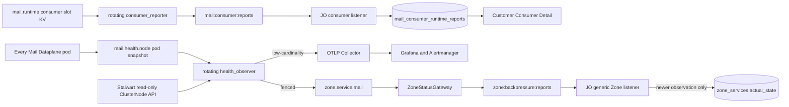

# Mail Consumer Reporting and Operational Observability — God View

> Source of Truth cho hai ranh giới khác nhau: customer-safe Consumer Runtime read model và
> operational Mail health dành riêng cho OTel/Grafana. Mail infrastructure không có Controlplane API,
> PostgreSQL projection hoặc Admin UI read model.

## 1. Ownership

| Luồng | Đích | Mục đích | Không được chứa |
|---|---|---|---|
| Consumer runtime report | Central Redis → JO → `mail_consumer_runtime_reports` | Customer Consumer Detail, config/generation diagnostics | Recipient, rendered body, credential, physical pod identity |
| Operational health | Zone NATS KV + OTLP metrics | Zone decision, Grafana, Alertmanager | Customer/workspace/consumer/template ID, payload, credential |

`hierarchy.zone_services.desired_state` vẫn là Controlplane business/control state. Grafana không ghi desired
state và không phải dependency của scheduling. `actual_state` được generic Zone report cập nhật bằng timestamp
fence; không còn dedicated `mail:infra:reports` writer.

## 2. End-to-end architecture



## 3. Consumer runtime reverse path

1. Mỗi logical slot ghi `mail.runtime.{consumer_id}.{slot}` bằng lease fencing token.
2. Rotating `consumer_reporter` scan bounded keys và validate key/value identity, generation, heartbeat TTL.
3. Stable heartbeat được coalesce; config/state/generation hoặc physical takeover phát delta ngay.
4. Relay gom tối đa 250 reports vào `MailConsumerRuntimeReportBatchV1` rồi XADD `mail:consumer:reports`.
5. JO validate trusted Zone envelope, protobuf và workspace placement trước guarded UPSERT.
6. COW fence là `(config_version, runtime_generation, report_sequence)`; report cũ là no-op.

Central contract không mang `runtime_node_id` hoặc `runtime_boot_id`. Physical process identity chỉ tồn tại
trong Zone KV/OTel resource attributes và không vượt customer read boundary.

## 4. Zonal health observer

Mỗi pod ghi key `mail.health.node.{node_id}` chứa boot UUID, queue pressure, JMAP probe gần nhất và observation
time. Các pod dùng jitter tranh `lease.mail.health.observe`:

1. Winner renew lease và chạy JMAP delivery health probe.
2. Winner dùng management identity read-only để gọi Stalwart `ClusterNode/query/get`.
3. Winner scan tối đa 512 fresh pod snapshots và các live `mail.runtime.*` slots.
4. Winner derive `healthy/degraded/down` và capacity từ reachability + bounded queue pressure.
5. Winner renew sát side effect, ghi `zone.service.mail` bằng fenced PUT.
6. Cùng winner record OTel gauges/histogram/counter; không XADD Central Redis.
7. Release giữ monotonic fencing token và rotating cooldown để pod khác có cơ hội probe chu kỳ sau.

Thiếu Stalwart management integration không chặn delivery. Nó phát bounded observation error; JMAP health và
queue pressure vẫn quyết định service state. Inventory vượt 512 node làm health degraded và metric error tăng.

## 5. OTel/Grafana metric contract

| Metric | Loại | Ý nghĩa |
|---|---|---|
| `mail_operational_observed_unix_seconds` | gauge | Fence để Grafana chọn rotating holder mới nhất |
| `mail_service_health_state` | gauge | `0=down`, `1=degraded`, `2=healthy` |
| `mail_service_capacity_percent` | gauge | Capacity còn lại 0..100 |
| `mail_pending_items` | gauge | Tổng item đang chờ trong zonal batch queues |
| `mail_in_flight_batches` | gauge | Tổng JMAP batch đang thực thi |
| `mail_active_consumer_slots` | gauge | Logical slot còn fresh trong Zone KV |
| `mail_dataplane_nodes{state}` | gauge | Chỉ ba state bounded: healthy/degraded/down |
| `mail_stalwart_nodes{state}` | gauge | Chỉ ba state bounded: active/stale/inactive |
| `mail_jmap_probe_success` | gauge | Kết quả rotating probe gần nhất |
| `mail_jmap_probe_duration_seconds` | histogram | Thời gian JMAP probe |
| `mail_jmap_probe_last_success_unix_seconds` | gauge | Dùng alert freshness |
| `mail_operational_observation_error_total{error_code}` | counter | Stable bounded taxonomy |

Zone và hostname là OTel resource attributes. Tuyệt đối không dùng consumer, recipient, tenant, workspace,
template, submission hoặc broker identifiers làm label để tránh cardinality explosion và data leakage.

## 6. Actual-state single-writer and HA fence

`ZoneStatusGateway` đọc `zone.service.mail`, phát `ZoneReport.timestamp` vào `zone:backpressure:reports`. JO chỉ
accept khi stream envelope Zone trùng payload Zone và timestamp nằm trong bounded clock window.

`hierarchy.zone_services.actual_observed_at` là DB fence:

```sql
UPDATE hierarchy.zone_services
SET actual_state = :state,
    actual_observed_at = to_timestamp(:observed_at)
WHERE zone_id = :zone_id
  AND service_type = :service
  AND (actual_observed_at IS NULL OR actual_observed_at < to_timestamp(:observed_at));
```

Hai JO replica xử lý Redis entries sai thứ tự không thể rollback health mới. Dead-man dùng observation time hiện
tại để hạ Mail/Storage về `down`; report cũ đang in-flight không thể resurrect service. `desired_state` và Zone
lifecycle không bị health writer thay đổi.

## 7. Failure and race matrix

| Failure/race | Guard | Outcome |
|---|---|---|
| Hai pod cùng probe | Rotating CAS lease + jitter | Một winner mỗi chu kỳ |
| Holder cũ hoàn tất chậm | Renew + fenced KV PUT | Không overwrite `zone.service.mail` |
| OTel/Grafana unavailable | Non-blocking metrics exporter | Delivery và Zone KV tiếp tục |
| Stalwart inventory unavailable | Read-only bounded error metric | Không reuse submission credential, không chặn delivery |
| Hai JO replica apply sai thứ tự | `actual_observed_at` predicate | Report cũ no-op |
| Zone report envelope giả/mismatch | Zone + timestamp validation | Không chạy decision/DB write |
| Zone im lặng | Generic dead-man | Chỉ hạ actual health, không đổi desired/lifecycle |
| Consumer heartbeat replay | Version/generation/sequence UPSERT | No-op report đã commit |

## 8. Code ownership

| Responsibility | File |
|---|---|
| Consumer relay | `dataplane/src/executor/mail/supervisor/consumer_reporter.rs` |
| Zonal probe/KV/OTel | `dataplane/src/executor/mail/supervisor/health_observer.rs` |
| OTel metric instruments | `dataplane/src/executor/mail/supervisor/metrics.rs` |
| Provisioned SRE dashboard | `controlplane/dev/grafana/provisioning/dashboards/mail-operational-health.json` |
| Consumer reverse apply | `job-orchestrator/src/reverse_provider/mail/reporter/consumer.rs` |
| Generic actual-state writer | `job-orchestrator/src/reverse_provider/zone/{listener,db.rs}` |
| Consumer runtime schema | `controlplane/internal/mail/migrations/000007_mail_runtime_report_idempotency.up.sql` |
| Actual-state timestamp fence | `controlplane/internal/hierarchy/migrations/000002_hierarchy_tables.up.sql` |

Không được tái tạo `mail:infra:reports`, `mail_infrastructure_reports`, `/admin/mail/infrastructure` hoặc
`email:infrastructure:read`. Operational history thuộc metrics backend retention, không thuộc business database.
