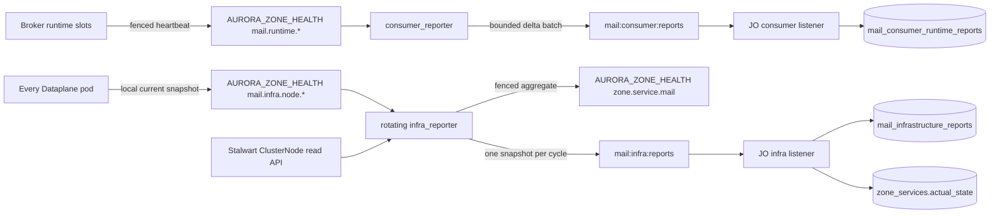

# Mail Consumer and Infrastructure Reporting — God View

> Source of Truth cho hai reverse paths từ Dataplane Zone về Controlplane PostgreSQL.
> Consumer state và infrastructure state tuyệt đối không chia stream, PEL hoặc database ownership.

## 1. Mục tiêu và ranh giới

| Luồng | Cardinality | Mục đích | Không được chứa |
|---|---:|---|---|
| Consumer report | Một record/logical slot | Consumer Detail và diagnostic config/generation | Recipient, rendered mail, broker credential, physical endpoint |
| Infrastructure report | Một atomic snapshot/Zone | Admin/SRE quan sát Dataplane Mail và Stalwart cluster | Credential, management URL, customer payload, delivery history |

Controlplane HTTP chỉ đọc projection. JO là writer duy nhất của report tables. SRE chỉ thay đổi
`hierarchy.zone_services.desired_state` qua critical Hierarchy route hiện có.

## 2. Topology



Generic `zone:backpressure:reports` có thể tiếp tục dùng Mail aggregate cho Zone decision/telemetry,
nhưng không được update Mail `actual_state`. Dedicated infra CTE là writer duy nhất.

## 3. Consumer reverse path

1. Logical slot ghi `mail.runtime.{consumer_id}.{slot}` bằng fencing token của slot lease.
2. Snapshot mang logical `instance_id=slot:<n>` cùng physical `runtime_node_id/runtime_boot_id`.
3. Một node lấy rotating `lease.mail.consumer.report`, scan heartbeat còn fresh và validate generation.
4. Shared Redis gate coalesce heartbeat ổn định 60 giây. State/config/generation/node/error đổi được gửi ngay.
5. Relay đóng gói tối đa 250 delta và 512 KiB vào `MailConsumerRuntimeReportBatchV1`.
6. Lua thực hiện `XADD` trước rồi mới SET gate; publish lỗi không thể làm mất delta.
7. JO dùng `XAUTOCLAIM` trước `XREADGROUP BLOCK`, apply từng item bằng guarded UPSERT.
8. DB lỗi ở bất kỳ item nào giữ cả batch trong PEL. Item đã commit được replay idempotently.
9. Chỉ sau khi mọi non-retryable/valid item đã xử lý, Lua `XACK` rồi `XDEL` entry.

Thứ tự thắng trong một logical slot:

```text
higher config_version
OR same config_version + higher runtime_generation
OR same config_version/generation + higher report_sequence
```

## 4. Infrastructure reverse path

Mỗi pod ghi key riêng `mail.infra.node.{node_id}`. Key mang boot UUID, queue pressure, JMAP probe gần nhất
và observation time. Các pod sau jitter tranh `lease.mail.infra.report`:

1. Winner chạy JMAP health check bằng delivery client hiện hành.
2. Winner dùng management identity riêng chỉ có ClusterNode `query/get` để lấy actual Stalwart registry.
3. Winner refresh local probe rồi scan physical node snapshots còn fresh.
4. Winner đếm active logical slots theo physical node từ `mail.runtime.*`.
5. Winner derive `healthy/degraded/unhealthy/down` và capacity; một node probe fail không che fresh success từ node khác.
6. Winner renew lease sát side effect, fenced PUT `zone.service.mail`.
7. Winner renew lần nữa rồi XADD một `MailInfrastructureSnapshotReportedV1` vào `mail:infra:reports`.
8. Release giữ monotonic fencing token và same-owner cooldown ưu tiên node khác ở chu kỳ kế tiếp.

Snapshot giới hạn 512 Dataplane node, 512 Stalwart node và 1 MiB. Vượt giới hạn phải đặt
`inventory_truncated=true`; không được silently coi inventory hoàn chỉnh.

## 5. Database projection

### `mail_consumer_runtime_reports`

- Primary key `(consumer_id, instance_id)`.
- Current state, không phải heartbeat history.
- Thêm `runtime_node_id`, `runtime_boot_id` cho Admin diagnostics.
- Customer Personal/Tenant Consumer Detail chỉ aggregate state và không expose physical identity.

### `mail_infrastructure_reports`

- Primary key `zone_id`, đúng một atomic current snapshot/Zone.
- Scalar status/pressure columns phục vụ filter nhanh.
- Validated `dataplane_nodes` và `stalwart_nodes` lưu JSONB arrays.
- Guard bằng `(report_generation, report_sequence)`.
- `reported_at/expires_at` tách last-known snapshot khỏi fresh operational truth.

JO apply bằng một CTE:

```text
validate trusted zone envelope and protobuf
  -> guarded UPSERT infrastructure snapshot
  -> only when UPSERT accepted and state changed: UPDATE mail actual_state
  -> commit
  -> XACK + XDEL
```

Report stale/duplicate không update snapshot và không update actual state. Zone/service không tồn tại là terminal
scope mismatch, không được tự tạo desired-state row bằng UPSERT.

## 6. Admin read API

```text
GET /admin/mail/infrastructure
```

Response gồm desired/actual state, freshness, generation, pressure, probe node, sanitized Dataplane nodes,
Stalwart registry và truncation/error taxonomy. Zone ID được trích xuất tự động từ Header context (`X-Zone-Id`). Không có infrastructure POST/PATCH/DELETE.

## 7. Failure and race matrix

| Failure/race | Guard | Outcome |
|---|---|---|
| Hai pod cùng muốn probe | Rotating CAS lease | Một winner/cycle |
| Holder cũ hoàn tất chậm | Renew + fencing token | Không ghi KV/stream sau mất lease |
| Consumer batch replay | Version/generation/sequence UPSERT | No-op item đã commit |
| Infra report cũ đến sau report mới | Generation/sequence CTE | Không rollback snapshot/actual state |
| Heartbeat mới nhưng state không đổi | `IS DISTINCT FROM` | Không phát WAL/CDC từ `zone_services` mỗi chu kỳ |
| DB commit, JO chết trước ACK | Redis PEL reclaim | Guarded no-op rồi settle |
| Redis XADD lỗi | Gate update nằm sau XADD trong Lua | Delta được thử lại |
| Một DP node không tới Stalwart | Per-node probe result + rotating probe | Node degraded; cluster chỉ down khi không còn fresh success |
| Management inventory chưa cấu hình | Stable error taxonomy | Delivery health vẫn quan sát được, Admin thấy inventory unavailable |
| Snapshot hết TTL | `fresh=false` | UI không coi last-known là live |

## 8. Security

- `STALWART_REPORTER_BEARER_TOKEN` tách khỏi submission credential và chỉ cấp read permissions.
- Token/URL không vào Zone health value, protobuf, Redis entry, PostgreSQL hoặc log.
- `zone_id` trong Redis field là routing scope, không phải chữ ký. Production phải giới hạn quyền
  `XADD` hai stream cho Dataplane workload identity qua private network, TLS và Redis ACL; không expose
  hai stream cho customer broker credential.
- JO validate UUID, enum, timestamp, size, count, control characters và error taxonomy trước JSON serialization.
- Customer Consumer Detail không expose node hostname/boot ID.
- Admin route chỉ read và nằm sau Admin ACR boundary.

## 9. Retention and load

- Consumer stable heartbeat tối đa một report/slot/60 giây; transition gửi ngay.
- Infra tối đa một report/Zone/chu kỳ.
- Hai Redis streams và consumer groups độc lập để consumer flood không starve SRE health.
- Stream entries là reconstructable current state, dùng time-window trimming khoảng một giờ.
- Kubernetes CronJob xóa expired report rows theo batch 200, `FOR UPDATE SKIP LOCKED`, timeout ngắn.

## 10. Implementation map

| Responsibility | File |
|---|---|
| Consumer relay | `dataplane/src/executor/mail/supervisor/consumer_reporter.rs` |
| Infra probe/aggregate/relay | `dataplane/src/executor/mail/supervisor/infra_reporter.rs` |
| Physical slot identity | `dataplane/src/executor/mail/runtime/context.rs` |
| Consumer reverse apply | `job-orchestrator/src/reverse_provider/mail/reporter/consumer.rs` |
| Infra reverse apply | `job-orchestrator/src/reverse_provider/mail/reporter/infrastructure.rs` |
| Infra schema | `controlplane/internal/mail/migrations/000008_mail_infrastructure_reporting.up.sql` |
| Admin read flow | `controlplane/internal/mail/{domain,repository,service,transport}` |
| Batched cleanup | `k8s/outbox-retention-cronjob.yaml` |

## 11. Production acceptance

- [x] Hai reporter dùng đúng hai stream và hai PEL độc lập.
- [x] Không còn `runtime_reporter.rs` hoặc `workload_monitor.rs`.
- [x] Generic Zone listener không ghi Mail actual state.
- [ ] Stale infra report không rollback DB trong out-of-order test.
- [ ] DB outage giữ entry pending; recovery settle idempotently.
- [ ] Rotating lease test chứng minh same-owner cooldown và stale holder fencing.
- [x] Proto copies byte-identical.
- [ ] Không có secret/customer payload trong report/log/database.
