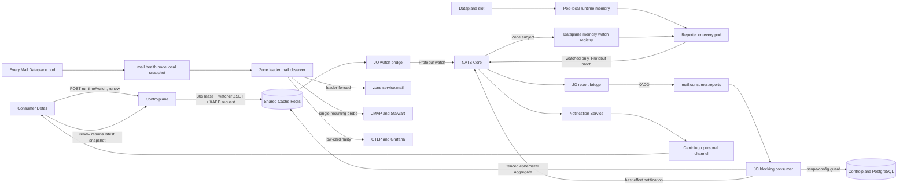

# Mail Consumer Runtime Watch and Operational Observability — God View

> Source of Truth cho hai ranh giới độc lập: customer-safe runtime chỉ được materialize trong
> watch window ngắn; operational Mail health chỉ đi Zone NATS KV aggregate + OTel/Grafana.
> Runtime động không phải business data và không được ghi PostgreSQL hoặc Zone NATS KV.

## 1. Ownership

| Luồng | Đích | Mục đích | Không được chứa |
|---|---|---|---|
| Consumer runtime watch | CP Shared Redis Stream → JO → NATS Core → Dataplane memory → NATS Core → JO Shared Redis snapshot → Centrifugo | Consumer Detail đang mở | Recipient, rendered body, credential, physical pod identity |
| Operational health | Zone NATS KV chỉ cho health/state-machine; runtime workload đi thẳng OTLP | Zone decision, Grafana, Alertmanager | Customer/workspace/consumer/template ID, lag, payload, credential |

`hierarchy.zone_services.desired_state` vẫn là Controlplane business/control state. Grafana không ghi
desired state và không phải dependency của scheduling. `actual_state` do generic Zone report cập nhật
bằng timestamp fence; không có Mail infrastructure Admin UI/API.

## 2. End-to-end architecture

## 3. Consumer runtime watch path

1. Business `GET /consumers/:id` chỉ đọc PostgreSQL config và không trả runtime.
2. `POST /consumers/:id/runtime/watch` kiểm tra Personal ownership hoặc Tenant membership bằng
   PostgreSQL rồi atomically:
   - set `mail:runtime:watch-active:{zone_id}:{consumer_id}` TTL 30 giây, value
     `{config_version}:{runtime_epoch}`;
   - upsert actor vào `mail:runtime:watchers:{zone_id}:{consumer_id}` ZSET bằng Redis server time;
   - XADD `MailConsumerRuntimeWatchRequestedV1` vào `mail:runtime:watch-requests`;
   - trả snapshot current cùng epoch nếu còn fresh.
3. JO consumer group publish watch lên subject
   `aurora.runtime.watch.{zone_id}.mail.consumer.v1`, rồi mới ACK/XDEL Redis entry.
4. Mọi Dataplane pod trong Zone subscribe cùng subject, validate Zone/config/epoch/expiry và giữ
   watch trong memory. Không Dataplane nào có Redis credential.
5. Browser renew lease khi Consumer Detail còn mở. Rời màn hình thì không renew; không có explicit
   stop correctness requirement vì lease tự hết hạn.
6. Mỗi Dataplane pod intersect watch memory với slot memory rồi publish tối đa 250 report/512 KiB
   qua `aurora.runtime.reports.{zone_id}.mail.consumer.v1`.
7. JO NATS queue subscriber validate subject/Zone rồi XADD vào `mail:consumer:reports`.
8. JO validate protobuf, đúng một Personal/Tenant aggregate, workspace placement,
   active `config_version` và `slot < parallelism`.
9. JO atomically fence Redis slot bằng `(config_version, runtime_generation, report_sequence)`, derive
   aggregate và commit `mail:runtime:snapshot:{scope}:{consumer_id}` chỉ khi watch lease/epoch còn đúng.
10. JO publish best-effort `mail.runtime.notifications.{actor_user_id}`. Notification Service lọc
   allowlist field rồi publish `mail.consumer.runtime.changed` vào `personal:{actor_user_id}`.

NATS Core là at-most-once soft-state data path Central↔Zone; Centrifugo chỉ là viewer wake-up signal.
Mất notification/report không làm sai business correctness: UI renew watch và Dataplane heartbeat kế tiếp
sẽ dựng lại Redis snapshot. NATS report lỗi không tạo durable retry backlog.

## 4. Runtime data boundaries

- Không có `personal_mail_consumer_runtime_reports` hoặc `tenant_mail_consumer_runtime_reports`.
- Không có key `AURORA_ZONE_HEALTH/mail.runtime.*`.
- Không có runtime outbox: viewer demand là soft-state lease, không phải durable business mutation.
- `runtime_node_id` và `runtime_boot_id` chỉ dùng reporter fence/signature nội bộ, không đi snapshot
  customer hoặc Centrifugo.
- Redis runtime slot/revision/snapshot đều có TTL; Dataplane không đọc các key này.
- Snapshot phải cùng `config_version + runtime_epoch` với lease mà Controlplane vừa renew; snapshot
  của watch cũ được coi là cache miss dù TTL chưa hết.
- `consumer_lag` chỉ được coi là số đo thật khi từng broker suite có native sampler đã test. Wire V1
  hiện cho phép field nhưng suite chưa có sampler tiếp tục báo `0`.

## 5. Zonal health observer

Mỗi pod ghi `mail.health.node.{node_id}` chứa boot UUID và queue pressure, không tự probe JMAP. Key này không
chứa bất kỳ runtime consumer field nào. `active_consumer_slots` là pod-local OTel gauge đi thẳng
collector/Grafana, không qua NATS KV.

Stable holder của `lease.zone.leader` thực hiện observer:

1. Leader verify current owner/fencing rồi chạy JMAP probe và Stalwart read-only `ClusterNode/query/get`.
2. Leader scan tối đa 512 fresh `mail.health.node.*` cho capacity/service state.
3. Leader derive `healthy/degraded/down` và fenced PUT `zone.service.mail` bằng leader token.
4. Leader record low-cardinality OTel metrics; không scan runtime customer, không XADD Central Redis.
5. Mất leader renew cancel observer; leader mới takeover với fencing token lớn hơn.

## 6. OTel/Grafana contract

| Metric | Ý nghĩa |
|---|---|
| `mail_operational_observed_unix_seconds` | Fence để Grafana chọn observation mới |
| `mail_service_health_state` | `0=down`, `1=degraded`, `2=healthy` |
| `mail_service_capacity_percent` | Capacity còn lại 0..100 |
| `mail_pending_items` / `mail_in_flight_batches` | Aggregate queue workload |
| `mail_active_consumer_slots` | Pod-local active slots đi thẳng OTel, Grafana sum theo Zone |
| `mail_dataplane_nodes{state}` | healthy/degraded/down |
| `mail_stalwart_nodes{state}` | active/stale/inactive |
| `mail_jmap_probe_*` | Reachability, duration và last success |

Zone/hostname là OTel resource attributes. Consumer, recipient, tenant, workspace, template, topic,
queue và broker identifier không được làm metric label.

## 7. Race and failure matrix

| Failure/race | Guard | Outcome |
|---|---|---|
| Unauthorized watch | DB ownership/membership check trước Redis | Không tạo lease/watcher |
| Update config trong watch | Lease value bind config version; NATS watch mang config/epoch | Runtime cũ bị bỏ |
| Pod cũ report sau takeover | Generation + sequence Lua fence | Không overwrite slot mới |
| Hai JO replica aggregate sai thứ tự | Runtime revision + lease compare khi commit | Snapshot mới không rollback |
| Watch hết hạn giữa report | Lua recheck active lease lúc slot và snapshot commit | Không materialize/publish |
| NATS/Centrifugo mất event | Redis snapshot + renew response | UI recover không cần status polling |
| Redis lỗi trước NATS watch publish | Không ACK watch Stream, PEL reclaim | Idempotent retry |
| NATS Core mất watch/report | At-most-once soft state, UI renew và heartbeat định kỳ | Tự phục hồi, không sai business |
| Redis/DB lỗi khi aggregate | Report sample hiện tại có thể mất; heartbeat sau gửi lại | Snapshot không rollback |
| Hai pod cùng infra probe | Stable `lease.zone.leader` CAS | Chỉ current leader probe |
| Leader cũ hoàn tất chậm | Current-owner check + fenced KV PUT | Không overwrite `zone.service.mail` |

## 8. Code ownership

| Responsibility | File |
|---|---|
| Watch HTTP/service | `controlplane/internal/mail/transport/http/handler/*_consumer_handler.go`, `service/*_consumer_service_impl.go` |
| Pod-local runtime registry | `dataplane/src/executor/mail/runtime/context.rs` |
| Watch-aware relay | `dataplane/src/executor/mail/supervisor/consumer_reporter.rs` |
| Redis aggregate/NATS signal | `job-orchestrator/src/reverse_provider/mail/reporter/consumer.rs` |
| Centrifugo bridge | `notification-service/src/service/mail/runtime.rs` |
| Pod-local health state | `dataplane/src/executor/mail/supervisor/local_observer.rs` |
| Zonal aggregate health | `dataplane/src/leader/infra/mail.rs` |
| OTel metrics | `dataplane/src/executor/mail/supervisor/metrics.rs` |

Không được tái tạo runtime PostgreSQL tables, `mail.runtime.*` Zone KV keys,
`mail:infra:reports`, `/admin/mail/infrastructure` hoặc delivery history trong luồng này.
