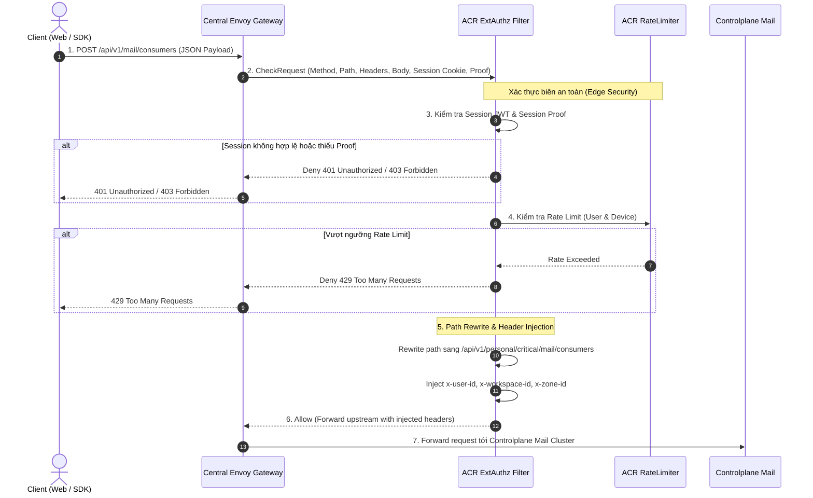
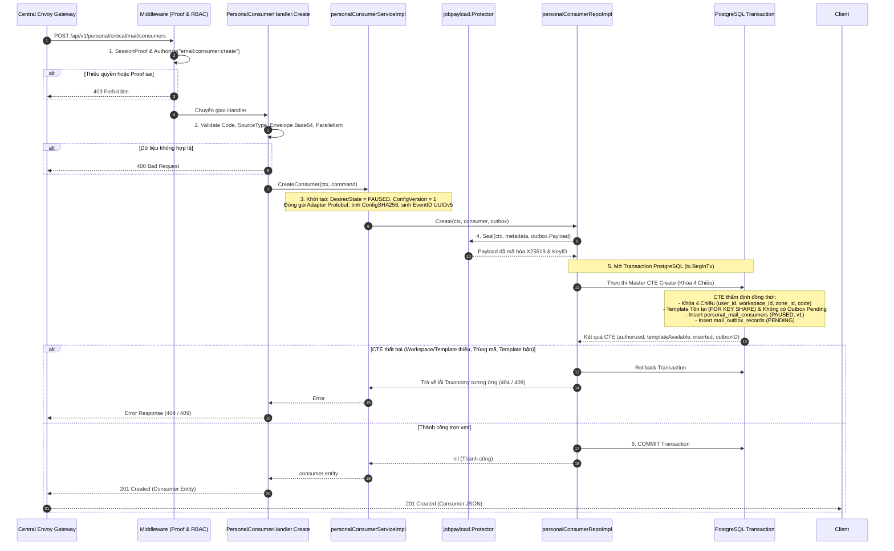
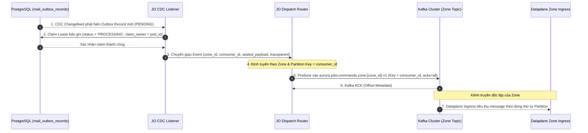
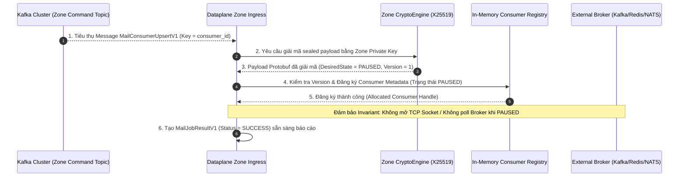
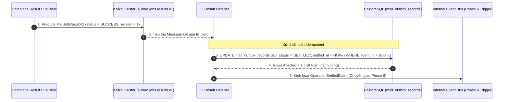
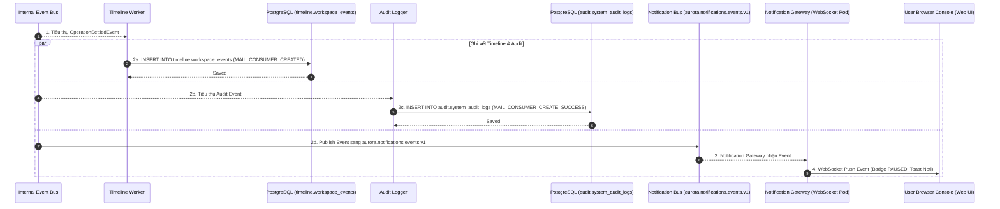

# Personal Mail Consumer Creation — Master God View

Workflow này là **Source of Truth (SoT) duy nhất** quản lý toàn bộ quy trình khởi tạo một Mail Consumer cá nhân (Personal Mail Consumer) mới trong hệ thống Aurora:
- Tiếp nhận yêu cầu tạo Consumer từ giao diện Web Console hoặc SDK qua route trung lập `POST /api/v1/mail/consumers`.
- Xác thực phiên làm việc, kiểm tra bằng chứng phiên (`Session Proof`), bảo vệ chống replay và rewrite URL sang nhánh nội bộ `/api/v1/personal/critical/mail/consumers` tại vùng biên ACR ExtAuthz.
- Xử lý toàn bộ logic nghiệp vụ tại Controlplane: thẩm định quyền hạn RBAC `email:consumer:create`, chuẩn hóa định danh và stream payload, tính mã băm `ConfigSHA256`, niêm phong mã hóa payload Outbox bằng X25519 (`jobpayload.Protector`), và thực thi giao dịch CTE nguyên tử (CTE-First) trên PostgreSQL với **Khóa Thẩm Quyền 4 Chiều**.
- Job Orchestrator (JO) quét Outbox qua CDC Changefeed, xử lý hàng đợi phân tán chống tranh chấp, định tuyến theo `ZoneID` và phát lệnh vào Kafka Zone Topic với Partition Key = `consumer_id`.
- Dataplane tại Zone tiêu thụ lệnh từ Kafka, giải mã mật mã X25519 bằng Zone Private Key, kiểm tra hàng rào phiên bản và đăng ký metadata consumer vào bộ nhớ ở trạng thái mặc định an toàn `PAUSED` (chưa mở kết nối broker).
- Dataplane đóng gói bản tin kết quả Protobuf `MailJobResultV1`, đẩy sang Kafka Result Topic; Job Orchestrator Result Listener tiêu thụ và thực hiện tất toán nguyên tử (`status = 'SETTLED'`) trên PostgreSQL, sau đó chuyển giao sang nhánh Timeline & Notification.
- Nhánh Timeline & Notification thực hiện lưu trữ dòng thời gian sự kiện (`timeline.workspace_events`), ghi nhật ký an ninh (`audit.system_audit_logs`) và đẩy thông báo thời gian thực (Real-time Notification qua WebSocket/SSE) tới giao diện Web Console của người dùng.

---

## 🏛️ API-Scope Contract & Boundary Matrix

| Ranh giới (Boundary) | Thẩm quyền xác thực (Authority) | Trạng thái bền vững (Durable State) |
|---|---|---|
| **Client Browser / SDK** | Cookie `aurora_session`, Header `X-Session-Proof`, Body JSON | Không lưu trữ (Ephemeral in-memory) |
| **Envoy / ACR ExtAuthz** | Xác thực Session Token, Session Proof, Rate Limit, Route Rewrite | Auth Redis (`iam:session:{id}`), Rate Limit Sliding Window |
| **Controlplane Mail Service** | Kiểm tra quyền RBAC `email:consumer:create`, Stream Normalization, CTE-First Tx | PostgreSQL (`mail.personal_mail_consumers`, `mail.mail_outbox_records`) |
| **Job Orchestrator (JO)** | Bắt sự kiện CDC, định tuyến phân vùng Kafka, tất toán Outbox | PostgreSQL (`status = 'SETTLED'`), Kafka Dispatcher |
| **Timeline & Audit Worker** | Lưu vết lịch sử Workspace và kiểm toán an ninh hệ thống | PostgreSQL (`timeline.workspace_events`, `audit.system_audit_logs`) |
| **Notification Gateway** | Chuyển giao Real-time Event tới WebSocket/SSE Client | Ephemeral WebSocket Connections |
| **Dataplane (Zone Worker)** | Giải mã X25519, đăng ký Consumer Adapter vào Registry | Zone In-Memory Consumer Registry |

---

## 🔑 Key & Transport Contract Table

| Khóa / Bảng / Kênh truyền | Vị trí lưu trữ | Thao tác (Operation) | Chủ sở hữu & Ràng buộc bất biến (Owner & Invariant) |
|---|---|---|---|
| `hierarchy.personal_workspaces` | PostgreSQL (Hierarchy DB) | `SELECT 1 WHERE id=$workspace_id AND zone_id=$zone_id AND owner_id=$user_id` | Ranh giới chủ quyền Workspace cá nhân của người dùng. |
| `mail.personal_mail_templates` | PostgreSQL (Mail DB) | `SELECT id ... FOR KEY SHARE` | Khóa chia sẻ Template; ngăn chặn việc tạo consumer trỏ vào template đang bị xóa. |
| `mail.personal_mail_consumers` | PostgreSQL (Mail DB) | `INSERT (desired_state='PAUSED', config_version=1)` | Lưu trữ thực thể Consumer; Unique `(workspace_id, code)`. Khởi tạo luôn ở trạng thái `PAUSED`. |
| `mail.mail_outbox_records` | PostgreSQL (Mail DB) | `INSERT (job_topic='mail.consumer.upsert', status='PENDING')` & `UPDATE SETTLED` | Bản ghi Outbox chứa Protobuf `MailConsumerUpsertV1` đã mã hóa niêm phong X25519. |
| `aurora.jobs.commands.zone.{zone_id}.v1` | Kafka Topic | `Publish` bởi Job Orchestrator | Kênh phát lệnh At-least-once tới Dataplane Zone mục tiêu (Key = `consumer_id`). |
| `aurora.jobs.results.v1` | Kafka Topic | `Publish` bởi Dataplane | Kết quả thực thi từ Zone Dataplane để JO cập nhật trạng thái outbox sang `SETTLED`. |
| `aurora.notifications.events.v1` | Kafka Topic | `Publish` bởi Job Orchestrator | Kênh phát sự kiện realtime cho Notification Gateway và Timeline Worker. |
| `timeline.workspace_events` | PostgreSQL (Timeline DB) | `INSERT` bởi Timeline Worker | Lưu trữ dòng thời gian hiển thị lịch sử hoạt động của Workspace trên UI. |
| `audit.system_audit_logs` | PostgreSQL (Audit DB) | `INSERT` bởi Audit Logger | Lưu vết kiểm toán bảo mật phục vụ Compliance và Security Audit. |

---

## 🌐 Phase 1 — Client → Central Envoy → ACR ExtAuthz Admission

### 1. Phase 1 Input Contract

#### HTTP Request từ Client (Browser / SDK)
- **Method & Path**: `POST /api/v1/mail/consumers`
- **Headers**:
  - `Cookie: aurora_session=<session_jwt>`
  - `X-Session-Proof: <proof_hash>`
  - `X-Client-Device-ID: <device_uuid>`
  - `Content-Type: application/json`
- **JSON Request Body**:
  ```json
  {
    "code": "order-events",
    "name": "Order Notifications Consumer",
    "source_type": "kafka",
    "broker_resource_id": "0194f83a-8b1e-7d34-92c1-382a1d820050",
    "source_config_envelope": "AQIDBAU=",
    "topic": "orders.created.v1",
    "consumer_group": "mail-order-notifier",
    "template_id": "order-confirmation-tpl",
    "template_version": 1,
    "sender_profile_id": "billing-noreply",
    "sender_version": 1,
    "parallelism": 4
  }
  ```

### 2. Phase 1 Processing & Local Output Contract

- **Envoy $\to$ ACR**: Envoy gửi `CheckRequest` chứa method, path, headers và JSON body sang ACR ExtAuthz.
- **ACR Kiểm tra & Phân quyền Biên**:
  1. Xác thực tính hợp lệ của Cookie `aurora_session` và giải mã User `user_id`.
  2. Xác thực tính hợp lệ của Header `X-Session-Proof` chống replay và tấn công chiếm quyền phiên.
  3. Kiểm tra hạn mức Rate Limit theo `(user_id, IP, device_id)`. Vượt ngưỡng $\to$ Trả về **Local 429 Too Many Requests**.
  4. **Path Rewrite**: Chuyển đổi đường dẫn công khai trung lập thành đường dẫn nội bộ nhánh Personal:
     `POST /api/v1/mail/consumers` $\to$ `POST /api/v1/personal/critical/mail/consumers`
  5. **Header Injection (Trusted Context)**:
     - `x-user-id: <user_uuid>`
     - `x-workspace-id: <workspace_uuid>`
     - `x-zone-id: <zone_uuid>`
     - Loại bỏ toàn bộ header giả mạo từ client.
- **Forward sang Controlplane**: Chuyển tiếp request đã rewrite và inject headers sang Controlplane Mail cluster.



---

## ⚡ Phase 2 — Controlplane Processing & Atomic PostgreSQL CTE Mutation

Toàn bộ quá trình tiếp nhận từ Envoy, xác thực RBAC, chuẩn hóa Protobuf, niêm phong mật mã X25519 và thực thi giao dịch CTE trên cơ sở dữ liệu được thực hiện nguyên tử tại Controlplane:

### 1. Khóa Thẩm Quyền 4 Chiều trong CTE (4-Dimension Authority Locking)

Mọi thao tác truy vấn và biến đổi trạng thái trong CTE bắt buộc phải xác lập và kiểm tra đồng thời trên **4 chiều thẩm quyền cô lập**:

| Chiều thẩm quyền (Dimension) | Nguồn trích xuất (Source) | Ràng buộc kiểm tra trong PostgreSQL (CTE Condition) | Mục đích bảo mật (Security Invariant) |
|---|---|---|---|
| **1. User ID** (`owner_id`) | Trusted Header `x-user-id` | `hierarchy.personal_workspaces.owner_id = $user_id` | Ngăn chặn hoàn toàn việc can thiệp tài nguyên của người dùng khác. |
| **2. Workspace ID** | Trusted Header `x-workspace-id` | `hierarchy.personal_workspaces.id = $workspace_id` | Ranh giới cô lập không gian làm việc cá nhân của người dùng. |
| **3. Zone ID** | Trusted Header `x-zone-id` | `hierarchy.personal_workspaces.zone_id = $zone_id` | Bảo đảm tài nguyên được gán đúng vùng hạ tầng vật lý của Workspace. |
| **4. Consumer ID / Code** | Request Body / Generated UUID | `(workspace_id, code)` Unique Constraint | Đảm bảo tính duy nhất và toàn vẹn của thực thể trong phạm vi Workspace. |

### 2. Bảng Ánh Xạ Lỗi Taxonomy (Taxonomy Error Mapping Table)

Khi câu lệnh CTE không chèn được bản ghi (`inserted == false`), tầng Repository phân loại kết quả và ánh xạ chính xác sang lỗi Taxonomy:

| Điều kiện CTE thất bại (Condition) | Mã lỗi Taxonomy (Domain Error) | HTTP Status | Thông điệp phản hồi Client (Client Response) |
|---|---|---|---|
| `!authorized` | `mailTaxonomy.ErrWorkspaceNotFound` | `404 Not Found` | Workspace không tồn tại hoặc không thuộc quyền sở hữu của User trong Zone. |
| `!template_available` | `mailTaxonomy.ErrTemplateNotFound` | `404 Not Found` | Template liên kết không tồn tại trong Workspace hoặc đã bị xóa. |
| `template_operation` | `mailTaxonomy.ErrOperationInProgress` | `409 Conflict` | Template đang trong tiến trình xuất bản phiên bản mới dở dang. |
| Trùng lặp `(workspace_id, code)` | `mailTaxonomy.ErrAlreadyExists` | `409 Conflict` | Mã consumer (`code`) đã tồn tại trong workspace này. |
| Dung lượng envelope $> 16\text{KB}$ | `mailTaxonomy.ErrInvalidArgument` | `400 Bad Request` | Cấu hình mã hóa `source_config_envelope` vượt quá giới hạn 16KB. |
| Mã `code` sai định dạng regex | `mailTaxonomy.ErrInvalidArgument` | `400 Bad Request` | Mã consumer không đúng định dạng `^[a-z][a-z0-9-]{1,61}[a-z0-9]$`. |



---

## 🚀 Phase 3 — Job Orchestrator CDC Outbox Dispatch

Phase 3 chịu trách nhiệm tiếp nhận sự kiện Outbox từ cơ sở dữ liệu, định tuyến lệnh theo vùng hạ tầng và đảm bảo chuyển giao tin cậy theo thứ tự nghiêm ngặt (**At-least-once Strictly-Ordered Dispatch**) sang Zone Dataplane:

### 1. Bắt sự kiện CDC & Quản lý Hàng đợi (CDC Capture & Queue Processing)
- **CDC Event Capture**: Job Orchestrator CDC Listener theo dõi changefeed trên bảng `mail.mail_outbox_records`, phát hiện ngay lập tức các bản ghi Outbox mới được commit ở trạng thái `PENDING`.
- **Phân tải Worker & Claim Lease**:
  - Các Job Orchestrator Worker Pod tranh chấp và nhận batch bản ghi outbox an toàn qua cơ chế lock phân tán (`SKIP LOCKED`), ngăn ngừa hoàn toàn double-dispatch.
  - Cập nhật trạng thái bản ghi sang `PROCESSING`, gắn nhãn `claim_owner` và thời điểm `claimed_at`.
- **Xử lý sự cố & Tự động Claim lại (Crash Recovery & Auto-Claim)**:
  - Nếu worker pod gặp sự cố hoặc timeout trong lúc phát lệnh sang Kafka, sau khoảng thời gian thuê (`claimed_at > 60s`), các worker khác sẽ tự động claim lại bản ghi để tái gửi.
  - Giới hạn thử lại tối đa (`max_retries = 5`); vượt quá số lần retry sẽ chuyển sang trạng thái `DEAD_LETTER` và kích hoạt cảnh báo hệ thống.

### 2. Chiến lược Định tuyến & Phân vùng Kafka (Routing & Partitioning Strategy)
- **Định tuyến theo Zone vật lý**:
  - Router trích xuất `zone_id` từ metadata bản ghi và điều hướng lệnh chính xác vào Kafka Topic của Zone mục tiêu: `aurora.jobs.commands.zone.{zone_id}.v1`.
  - Tuyệt đối không gửi chéo vùng; mỗi Zone sở hữu topic và phân vùng cách ly độc lập.
- **Phân vùng nghiêm ngặt theo thực thể (Partitioning Strategy)**:
  - **Partition Key = `consumer_id`**: Đảm bảo tất cả các sự kiện thay đổi vòng đời (Create $\to$ Resume $\to$ Update $\to$ Pause $\to$ Delete) của **cùng một Consumer** luôn được phân bổ vào **cùng một Kafka Partition duy nhất**, loại bỏ hoàn toàn tình trạng Out-of-Order Execution tại Dataplane.
- **Tính toàn vẹn & Niêm phong Mật mã (Wire Security & Invariants)**:
  - Kafka Producer sử dụng cấu hình `acks = all`, `enable.idempotence = true` và `max.in.flight.requests.per.connection = 1`.
  - Payload được bảo vệ nguyên vẹn dưới dạng mã hóa X25519; JO đóng vai trò Zero-Knowledge Relay và không thể giải mã hay sửa đổi nội dung cấu hình nhạy cảm.



---

## ⚙️ Phase 4 — Dataplane Stream Execution & Consumer Registration

Phase 4 chịu trách nhiệm tiếp nhận lệnh từ Kafka, giải mã bảo mật tại biên Zone, xác thực hàng rào phiên bản và đăng ký cấu hình Consumer vào bộ nhớ Zone mà không mở socket tải message:

### 1. Tiếp nhận Message & Giải mã Phong ấn Mật mã (Ingress & X25519 Decryption)
- **Ingress Consumption**: Dataplane Zone Ingress Worker tiêu thụ message từ topic `aurora.jobs.commands.zone.{zone_id}.v1`.
- **Giải mã X25519**:
  - Trích xuất payload đã mã hóa và chuyển cho `CryptoEngine`.
  - `CryptoEngine` sử dụng Zone Private Key nội bộ để giải mã phong ấn, phục hồi cấu trúc Protobuf gốc `MailConsumerUpsertV1`.
- **Hàng rào Khử trùng lặp & Phiên bản (Deduplication & Monotonic Fence)**:
  - Kiểm tra `ConfigVersion` trong payload so với trạng thái in-memory: nếu `ConfigVersion <= observed_version` (sự kiện phát lại/out-of-order cũ), Dataplane bỏ qua bước khởi tạo nhưng vẫn gửi ACK về Result topic để tất toán outbox.

### 2. Quản lý Vòng đời Adapter & Đăng ký Cấu hình (Adapter Lifecycle & State Setup)
- **Thiết lập trạng thái ban đầu (`DesiredState = PAUSED`)**:
  - `ConsumerRegistry` khởi tạo thực thể Consumer với `state = PAUSED`, `config_version = 1`, lưu trữ cấu hình `topic`, `consumer_group`, `parallelism`, `template_id`, `sender_profile_id`.
  - **Ràng buộc an toàn**: Tuyệt đối **không mở kết nối TCP socket** tới Kafka/Redis/NATS/RabbitMQ nguồn và **không khởi chạy vòng lặp poll message** cho đến khi nhận được lệnh Resume tường minh từ người dùng.
- **Chuẩn bị kết quả thực thi**:
  - Đóng gói bản tin `MailJobResultV1` (`job_id = event_id`, `resource_id = consumer_id`, `status = SUCCESS`, `observed_config_version = 1`).



---

## 🏁 Phase 5 — Dataplane Result Reporting & Job Orchestrator Settlement

Phase 5 chịu trách nhiệm hoàn tất vòng đời của tác vụ phân tán: Dataplane báo cáo kết quả thực thi về kênh kết quả tập trung, và Job Orchestrator thực hiện tất toán nguyên tử trên Outbox table:

### 1. Đóng gói Bản tin Báo cáo Kết quả (Result Packaging & Wire Schema)
- **Dataplane Result Publisher**: Đóng gói Protobuf `MailJobResultV1` với các trường dữ liệu tiêu chuẩn:
  - `job_id`: Khóa ngoại liên kết chính xác với `event_id` ban đầu trong `mail.mail_outbox_records`.
  - `resource_id`: Định danh `consumer_id`.
  - `status`: `JOB_STATUS_SUCCESS` (hoặc `JOB_STATUS_FAILED` nếu lỗi phần cứng/bộ nhớ).
  - `observed_config_version`: Phiên bản cấu hình thực tế đã được áp dụng (`version = 1`).
  - `settled_timestamp`: Thời điểm hoàn tất tại Zone (ISO 8601 UTC).
- **Phát tin lên Kafka Topic kết quả**:
  - Topic: `aurora.jobs.results.v1` (Topic chung toàn hệ thống).
  - Partition Key: `consumer_id`.

### 2. Quy trình Tất toán Outbox & Xử lý Phân nhánh Trạng thái (Idempotent Settlement & State Branching)
- **Job Orchestrator Result Listener** tiêu thụ message từ Kafka `aurora.jobs.results.v1`:
  - **Nhánh `status == SUCCESS`**:
    ```sql
    UPDATE mail.mail_outbox_records
    SET status = 'SETTLED',
        settled_at = NOW(),
        retry_count = retry_count
    WHERE event_id = $job_id
      AND status IN ('PENDING', 'PROCESSING');
    ```
    - Chuyển trạng thái hoạt động thực tế (`operational_status`) của consumer sang `IDLE_PAUSED`.
    - **Gọi chuyển giao sang Phase 6**: Kích hoạt phát tán sự kiện hoàn tất `OperationSettledEvent` sang Event Bus nội bộ.
  - **Nhánh `status == FAILED`**:
    ```sql
    UPDATE mail.mail_outbox_records
    SET status = 'FAILED',
        settled_at = NOW(),
        error_details = $error_message
    WHERE event_id = $job_id
      AND status IN ('PENDING', 'PROCESSING');
    ```
    - Giữ record consumer V1 và cấu hình paused; chỉ outbox thành FAILED. Không hard-delete resource từ provisioning failure. Lần apply thành công đầu tiên, kể cả revision COW sau đó, phải stage ownership RESOURCE_CREATED đúng một lần.
- **Bảo đảm Idempotency**: Nếu kết quả gửi về nhiều lần (do Dataplane retry), câu lệnh SQL chỉ tác động khi bản ghi chưa ở trạng thái `SETTLED` (`RowsAffected == 0` $\to$ Bỏ qua an toàn).



---

## 📡 Phase 6 — Timeline Projection, Audit Log & Real-time Notification Dispatch

Phase 6 chịu trách nhiệm phân tán các tác động phụ sau khi tất toán: cập nhật dòng thời gian Workspace, lưu vết kiểm toán và đẩy thông báo thời gian thực xuống trình duyệt của người dùng:

### 1. Lưu trữ Dòng thời gian & Kiểm toán An ninh (Timeline & Audit Persistence)
- **Timeline Worker**:
  - Tiêu thụ `OperationSettledEvent` và chèn bản ghi vào bảng `timeline.workspace_events`:
    ```sql
    INSERT INTO timeline.workspace_events (
        id, workspace_id, actor_id, event_type, entity_type, entity_id, payload, created_at
    ) VALUES (
        gen_random_uuid(), $workspace_id, $user_id, 'MAIL_CONSUMER_CREATED', 'mail_consumer', $consumer_id,
        jsonb_build_object('code', $code, 'status', 'PAUSED', 'config_version', 1), NOW()
    );
    ```
- **Audit Logger**:
  - Ghi bản ghi bất biến vào `audit.system_audit_logs` phục vụ tra cứu tuân thủ:
    `INSERT INTO audit.system_audit_logs (actor_id, action, resource_type, resource_id, status, created_at) VALUES ($user_id, 'MAIL_CONSUMER_CREATE', 'mail_consumer', $consumer_id, 'SUCCESS', NOW());`

### 2. Kênh truyền Real-time & Định tuyến WebSocket (Notification Dispatch & Client Routing)
- **Phát Event sang Notification Bus**:
  - JO đẩy bản tin thông báo vào topic `aurora.notifications.events.v1`:
    ```json
    {
      "event_type": "MAIL_CONSUMER_CREATED",
      "user_id": "<owner_user_uuid>",
      "workspace_id": "<workspace_uuid>",
      "consumer_id": "<consumer_uuid>",
      "code": "order-events",
      "status": "PAUSED",
      "config_version": 1,
      "settled_at": "2026-08-26T18:50:00Z"
    }
    ```
- **Notification Gateway & WebSocket Delivery**:
  - `Notification Gateway` tra cứu danh sách Active Session của `user_id` và `workspace_id` trong Redis (`ws:sessions:{user_id}`).
  - Đẩy thông điệp realtime qua kết nối WebSocket/SSE đang mở tới Web Console của người dùng để cập nhật Badge `PAUSED` và danh sách Consumer mà không cần reload trang.



---

## 🛡️ Exhaustive Failure and Security Rules Matrix

| Tình huống ngoại lệ (Failure Condition) | Hành vi thực tế của hệ thống (Actual System Behavior) | Cơ chế phục hồi (Recovery Mechanism) |
|---|---|---|
| **Người dùng truyền mã Consumer trùng lặp** | Ràng buộc Unique `(workspace_id, code)` trong PostgreSQL bị vi phạm $\to$ Trả về `409 Conflict` (`ErrAlreadyExists`). | Người dùng đổi tên mã `code` khác và gửi lại request. |
| **Template được gán không tồn tại trong Workspace** | `template_available` CTE trả về false $\to$ Giao dịch bị hủy và trả về `404 Not Found` (`ErrTemplateNotFound`). | Người dùng kiểm tra lại danh sách template hợp lệ trước khi tạo consumer. |
| **Template đang trong tiến trình xuất bản phiên bản mới** | `template_operation` CTE phát hiện có bản ghi outbox của template ở trạng thái `PENDING`/`PROCESSING` $\to$ Trả về `409 Conflict` (`ErrOperationInProgress`). | Người dùng đợi vài giây cho template publish hoàn tất rồi tạo lại. |
| **Cấu hình mã hóa Envelope bị hỏng hoặc vượt quá 16KB** | Handler kiểm tra độ dài Base64 và dung lượng byte $> 16\text{KB}$ $\to$ Trả về ngay `400 Bad Request ("invalid source_config_envelope")`. | Bảo vệ hệ thống trước tấn công làm tràn bộ nhớ (Memory Exhaustion). |
| **Mạng chập chờn khi gửi lệnh sang Dataplane** | Bản ghi trong `mail_outbox_records` vẫn ở trạng thái `PENDING`. | Job Orchestrator tự động quét lại (AutoClaim) và phát lại lệnh sau khoảng thời gian `idle` (60s). |

---

## Code map

### Phase 1 — Client Entry, Central Envoy & ACR ExtAuthz
- **ACR ExtAuthz Filter & Route Rewriting**: `acr/src/gateway/ext_authz.rs`
- **ACR Session Proof Verifier**: `acr/src/auth/proof.rs`

### Phase 2 — Controlplane Processing & Atomic PostgreSQL CTE Mutation
- **HTTP Route Registration**: `controlplane/internal/mail/route.go` (`POST /api/v1/personal/critical/mail/consumers`)
- **HTTP Handler**: `controlplane/internal/mail/transport/http/handler/personal_consumer_handler.go` (`Create`)
- **Domain Service**: `controlplane/internal/mail/service/personal_consumer_service_impl.go` (`CreateConsumer`)
- **Taxonomy Errors**: `controlplane/internal/mail/taxonomy/errors.go` (`ErrAlreadyExists`, `ErrTemplateNotFound`)
- **SQL Repository & CTE Master**: `controlplane/internal/mail/repository/personal_consumer_repo_impl.go` (`Create`)
- **X25519 Payload Protector**: `controlplane/internal/security/job_payload.go` (`Seal`)
- **Protobuf Wire Schema**: `controlplane/internal/mail/transport/proto/` (`MailConsumerUpsertV1`, `MailStreamSourceV1`)

### Phase 3 — Job Orchestrator CDC Outbox Dispatch
- **Job Orchestrator Changefeed Worker**: `job-orchestrator/src/workers/outbox_listener.rs`
- **Job Orchestrator Partition Dispatcher**: `job-orchestrator/src/dispatcher/kafka_producer.rs`

### Phase 4 — Dataplane Stream Execution & Consumer Registration
- **Dataplane Zone Ingress Consumer**: `dataplane/src/mail/ingress/command_consumer.rs`
- **Dataplane Zone Crypto Engine**: `dataplane/src/crypto/zone_payload.rs`
- **Dataplane In-Memory Consumer Registry**: `dataplane/src/mail/registry/consumer_state.rs`
- **Dataplane Stream Broker Adapter**: `dataplane/src/mail/broker/consumer.rs`

### Phase 5 — Dataplane Result Reporting & Job Orchestrator Settlement
- **Dataplane Result Publisher**: `dataplane/src/mail/broker/reporter.rs`
- **Job Orchestrator Result Settler**: `job-orchestrator/src/workers/result_listener.rs`

### Phase 6 — Timeline Projection, Audit Log & Real-time Notification Dispatch
- **Timeline Projection Worker**: `controlplane/internal/timeline/worker/event_listener.go`
- **Audit Logger**: `controlplane/internal/audit/service/audit_logger.go`
- **Notification Event Publisher**: `job-orchestrator/src/notifier/event_publisher.rs`
- **Realtime Notification Gateway**: `notification-hub/src/gateway/ws_server.rs`

## Resource-first failure boundary — 2026-08-27

`results/mail/consumer.rs` retains a failed V1 create record; the new database
delete trigger permits hard-delete only in deleting. Failed COW candidates may
be discarded without deleting the resource. The first later successful apply
stages billing ownership version 1 exactly once by (resource_id, source_version).
No rollback, second resource-state column or product-specific generic outbox fields
are introduced. Drain/Delete implementation lives in the same consumer file branch.
