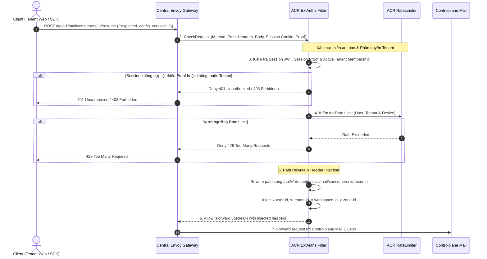
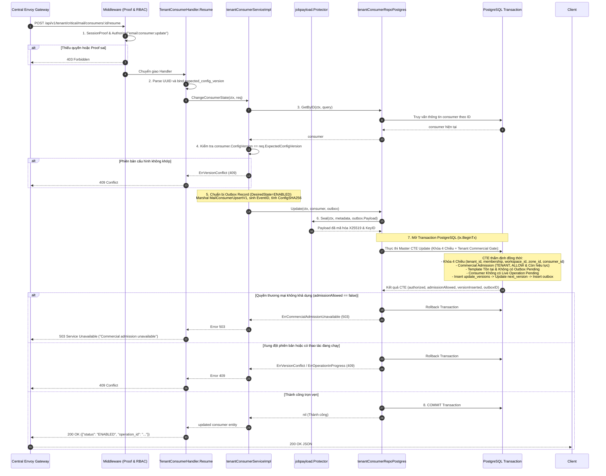
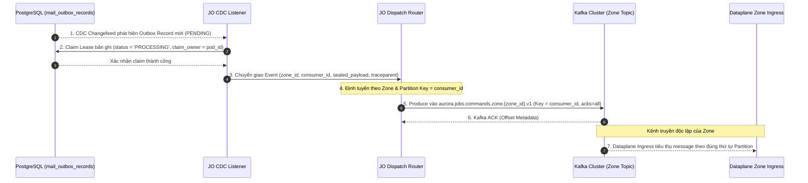
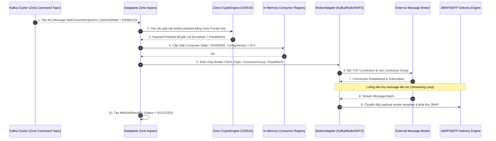
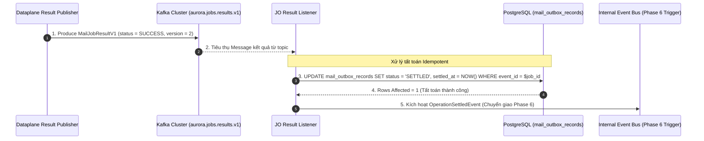
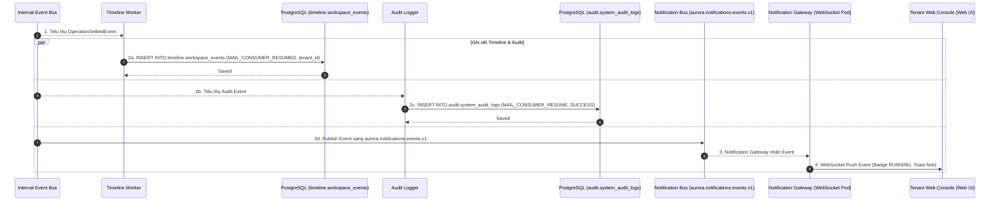

# Tenant Mail Consumer Resume — Master God View

Workflow này là **Source of Truth (SoT) duy nhất** quản lý toàn bộ quy trình kích hoạt/tiếp tục (`Resume`) một Mail Consumer doanh nghiệp/tổ chức (Tenant Mail Consumer) trong hệ thống Aurora:
- Tiếp nhận yêu cầu mở lại luồng tiêu thụ message từ giao diện Web Console của Tenant hoặc Backend SDK qua route trung lập `POST /api/v1/mail/consumers/:id/resume`.
- Phân giải phiên làm việc, kiểm tra bằng chứng phiên (`Session Proof`), xác minh tư cách thành viên tổ chức (`Active Tenant Membership`), chống tấn công replay và rewrite URL sang nhánh nội bộ `/api/v1/tenant/critical/mail/consumers/:id/resume` tại vùng biên ACR ExtAuthz.
- Xử lý toàn bộ logic nghiệp vụ tại Controlplane: thẩm định quyền hạn RBAC `email:consumer:update`, xác thực cấu hình hiện tại, chuẩn hóa Protobuf `MailConsumerUpsertV1` (`DesiredState = ENABLED`), niêm phong mã hóa payload Outbox bằng X25519 (`jobpayload.Protector`), và thực thi giao dịch CTE nguyên tử (CTE-First) trên PostgreSQL với **Khóa Thẩm Quyền 4 Chiều kết hợp Tenant Commercial Admission Gate**.
- Job Orchestrator (JO) quét Outbox qua CDC Changefeed, xử lý hàng đợi phân tán chống tranh chấp, định tuyến theo `ZoneID` và phát lệnh vào Kafka Zone Topic với Partition Key = `consumer_id`.
- Dataplane tại Zone tiêu thụ lệnh từ Kafka, giải mã mật mã X25519 bằng Zone Private Key, kết nối TCP tới Broker nguồn (Kafka/Redis/NATS/RabbitMQ) theo `SourceConfigEnvelope`, gia nhập Consumer Group, khởi chạy worker pool song song (`Parallelism`) và chuyển giao message sang JMAP/SMTP Delivery Engine.
- Dataplane đóng gói bản tin kết quả Protobuf `MailJobResultV1`, đẩy sang Kafka Result Topic; Job Orchestrator Result Listener tiêu thụ và thực hiện tất toán nguyên tử (`status = 'SETTLED'`) trên PostgreSQL, sau đó chuyển giao sang Phase 6.
- Nhánh Timeline & Notification thực hiện lưu trữ dòng thời gian sự kiện (`timeline.workspace_events`), ghi nhật ký kiểm toán an ninh (`audit.system_audit_logs`) và đẩy thông báo thời gian thực (Real-time Notification qua WebSocket/SSE) tới giao diện Web Console của Tenant.

---

## 🏛️ API-Scope Contract & Boundary Matrix

| Ranh giới (Boundary) | Thẩm quyền xác thực (Authority) | Trạng thái bền vững (Durable State) |
|---|---|---|
| **Client Browser / SDK** | Phiên đăng nhập Cookie `aurora_session`, Header Proof `X-Session-Proof` | Không lưu trữ (Ephemeral in-memory) |
| **Envoy / ACR ExtAuthz** | Xác thực Session Token, Session Proof, Tenant Membership, Rate Limit, Route Rewrite | Auth Redis (`iam:session:{id}`), Rate Limit Sliding Window |
| **Controlplane Mail Service** | Kiểm tra quyền RBAC `email:consumer:update`, Admission Check, CTE-First Tx | PostgreSQL (`mail.commercial_admission_projection`, `mail.tenant_mail_consumers`, `mail.mail_outbox_records`) |
| **Job Orchestrator (JO)** | Bắt sự kiện CDC, định tuyến phân vùng Kafka, tất toán Outbox | PostgreSQL (`status = 'SETTLED'`), Kafka Dispatcher |
| **Timeline & Audit Worker** | Lưu vết lịch sử Tenant Workspace và kiểm toán an ninh tổ chức | PostgreSQL (`timeline.workspace_events`, `audit.system_audit_logs`) |
| **Notification Gateway** | Chuyển giao Real-time Event tới WebSocket/SSE Client của Tenant | Ephemeral WebSocket Connections |
| **Dataplane (Zone Worker)** | Kết nối Broker (Kafka/Redis/NATS/RabbitMQ), khởi chạy Consumer Instance | Broker Consumer Group, JMAP/SMTP Delivery Engine |

---

## 🔑 Key & Transport Contract Table

| Khóa / Bảng / Kênh truyền | Vị trí lưu trữ | Thao tác (Operation) | Chủ sở hữu & Ràng buộc bất biến (Owner & Invariant) |
|---|---|---|---|
| `mail.commercial_admission_projection` | PostgreSQL (Mail DB) | `SELECT decision WHERE owner_id=$tenant_id AND owner_type='TENANT'` | Chiếu quyết định thương mại từ Cost; `ALLOW` và `effective_at <= NOW() < valid_until`. |
| `hierarchy.tenant_memberships` | PostgreSQL (Hierarchy DB) | `SELECT 1 WHERE tenant_id=$tenant_id AND user_id=$actor_id AND status='active'` | Xác nhận tư cách thành viên hợp lệ và còn hoạt động trong Tenant. |
| `hierarchy.tenant_workspaces` | PostgreSQL (Hierarchy DB) | `SELECT 1 WHERE id=$workspace_id AND zone_id=$zone_id AND tenant_id=$tenant_id` | Ranh giới chủ quyền Workspace thuộc Tenant và Zone vật lý. |
| `mail.tenant_mail_templates` | PostgreSQL (Mail DB) | `SELECT id ... FOR KEY SHARE` | Khóa chia sẻ Template; ngăn chặn việc resume consumer trỏ vào template đang bị xóa. |
| `mail.tenant_mail_consumers` | PostgreSQL (Mail DB) | `SELECT config_version FOR UPDATE` & `UPDATE next_config_version` | Khóa độc quyền bản ghi consumer để ngăn ngừa xung đột phiên bản (Optimistic Concurrency). |
| `mail.tenant_mail_consumer_update_versions` | PostgreSQL (Mail DB) | `INSERT (desired_state='ENABLED')` | Lưu lịch sử phiên bản cấu hình mong muốn chuyển sang kích hoạt (`ENABLED`). |
| `mail.mail_outbox_records` | PostgreSQL (Mail DB) | `INSERT (job_topic='mail.consumer.upsert', status='PENDING')` & `UPDATE SETTLED` | Bản ghi Outbox chứa Protobuf `MailConsumerUpsertV1` đã mã hóa niêm phong X25519. |
| `aurora.jobs.commands.zone.{zone_id}.v1` | Kafka Topic | `Publish` bởi Job Orchestrator | Kênh phát lệnh At-least-once tới Dataplane Zone mục tiêu (Key = `consumer_id`). |
| `aurora.jobs.results.v1` | Kafka Topic | `Publish` bởi Dataplane | Kết quả thực thi từ Zone Dataplane để JO cập nhật trạng thái outbox sang `SETTLED`. |
| `aurora.notifications.events.v1` | Kafka Topic | `Publish` bởi Job Orchestrator | Kênh phát sự kiện realtime cho Notification Gateway và Timeline Worker. |
| `timeline.workspace_events` | PostgreSQL (Timeline DB) | `INSERT` bởi Timeline Worker | Lưu trữ dòng thời gian hiển thị lịch sử hoạt động của Tenant Workspace trên UI. |
| `audit.system_audit_logs` | PostgreSQL (Audit DB) | `INSERT` bởi Audit Logger | Lưu vết kiểm toán bảo mật phục vụ Compliance và Security Audit tổ chức. |

---

## 🌐 Phase 1 — Client → Central Envoy → ACR ExtAuthz Admission

### 1. Phase 1 Input Contract

#### HTTP Request từ Client (Browser / SDK)
- **Method & Path**: `POST /api/v1/mail/consumers/0194f83a-8b1e-7d34-92c1-382a1d820001/resume`
- **Headers**:
  - `Cookie: aurora_session=<session_jwt>`
  - `X-Session-Proof: <proof_hash>`
  - `X-Client-Device-ID: <device_uuid>`
  - `Content-Type: application/json`
- **JSON Request Body**:
  ```json
  {
    "expected_config_version": 2
  }
  ```

### 2. Phase 1 Processing & Local Output Contract

- **Envoy $\to$ ACR**: Envoy gửi `CheckRequest` chứa đầy đủ method, path, headers và JSON body sang ACR ExtAuthz Service.
- **ACR Kiểm tra & Phân quyền Biên**:
  1. Xác thực tính hợp lệ của Cookie `aurora_session` và giải mã định danh User `user_id`.
  2. Xác thực tính hợp lệ của Header `X-Session-Proof` chống chiếm quyền điều khiển phiên (Session Hijacking).
  3. **Xác minh Tenant Authority**: Kiểm tra quan hệ thành viên hoạt động (`Active Tenant Membership`) của user đối với Tenant được yêu cầu.
  4. Kiểm tra hạn mức Rate Limit theo `(user_id, tenant_id, IP, device_id)`. Vượt ngưỡng $\to$ Trả về **Local 429 Too Many Requests**.
  5. **Path Rewrite**: Chuyển đổi đường dẫn công khai trung lập thành đường dẫn nội bộ nhánh Tenant:
     `POST /api/v1/mail/consumers/:id/resume` $\to$ `POST /api/v1/tenant/critical/mail/consumers/:id/resume`
  6. **Header Injection (Trusted Context)**:
     - `x-user-id: <actor_user_uuid>`
     - `x-tenant-id: <tenant_uuid>` (Trích xuất từ tenant context đã xác minh)
     - `x-workspace-id: <workspace_uuid>`
     - `x-zone-id: <zone_uuid>`
     - Loại bỏ toàn bộ header giả mạo từ client.
- **Forward sang Controlplane**: Chuyển tiếp request đã rewrite và inject headers sang Controlplane Mail cluster.



---

## ⚡ Phase 2 — Controlplane Processing & Atomic PostgreSQL CTE Mutation

Toàn bộ quy trình tiếp nhận, thẩm định RBAC, so khớp phiên bản, kiểm tra quyết định thương mại của Tenant và thực thi giao dịch CTE được xử lý nguyên tử tại Controlplane:

### 1. Khóa Thẩm Quyền 4 Chiều trong CTE (4-Dimension Authority Locking)

Mọi thao tác truy vấn và biến đổi trạng thái trong CTE bắt buộc phải xác lập và kiểm tra đồng thời trên **4 chiều thẩm quyền cô lập của Tenant**:

| Chiều thẩm quyền (Dimension) | Nguồn trích xuất (Source) | Ràng buộc kiểm tra trong PostgreSQL (CTE Condition) | Mục đích bảo mật (Security Invariant) |
|---|---|---|---|
| **1. Tenant ID & Membership** | Trusted Header `x-tenant-id` & `x-user-id` | `hierarchy.tenant_memberships.tenant_id = $tenant_id AND user_id = $actor_id AND status = 'active'` | Ngăn chặn việc thao tác tài nguyên khi user không còn là thành viên active của Tenant. |
| **2. Workspace ID** | Trusted Header `x-workspace-id` | `hierarchy.tenant_workspaces.id = $workspace_id AND tenant_id = $tenant_id` | Ranh giới cô lập không gian làm việc của Tenant. |
| **3. Zone ID** | Trusted Header `x-zone-id` | `hierarchy.tenant_workspaces.zone_id = $zone_id` | Bảo đảm tài nguyên thuộc đúng Zone của Workspace. |
| **4. Consumer ID** | Path Param `:id` (UUID) | `mail.tenant_mail_consumers.id = $consumer_id` | Khóa độc quyền đúng dòng Consumer (`FOR UPDATE`). |

### 2. Bảng Ánh Xạ Lỗi Taxonomy (Taxonomy Error Mapping Table)

Khi câu lệnh CTE không chèn được bản ghi (`versionInserted == false`), tầng Repository phân loại kết quả và ánh xạ chính xác sang lỗi Taxonomy:

| Điều kiện CTE thất bại (Condition) | Mã lỗi Taxonomy (Domain Error) | HTTP Status | Thông điệp phản hồi Client (Client Response) |
|---|---|---|---|
| `!authorized \|\| currentVersion == 0` | `mailTaxonomy.ErrConsumerNotFound` | `404 Not Found` | Consumer không tồn tại hoặc User không có tư cách thành viên active trong Tenant. |
| `!template_available` | `mailTaxonomy.ErrTemplateNotFound` | `404 Not Found` | Template liên kết không tồn tại trong Tenant Workspace hoặc đã bị xóa. |
| `template_operation \|\| live_operation` | `mailTaxonomy.ErrOperationInProgress` | `409 Conflict` | Đang có một tác vụ Outbox dở dang chưa hoàn tất cho Consumer hoặc Template này. |
| `current_version != expected` | `mailTaxonomy.ErrVersionConflict` | `409 Conflict` | Xung đột phiên bản cấu hình (Optimistic Concurrency Control). |
| **`DesiredState == 'ENABLED' && !admission_allowed`** | `mailTaxonomy.ErrCommercialAdmissionUnavailable` | **`503 Service Unavailable`** | **Quyền thương mại của Tenant (`Commercial Admission`) chưa sẵn sàng hoặc đã hết hạn.** |



---

## 🚀 Phase 3 — Job Orchestrator CDC Outbox Dispatch

Phase 3 chịu trách nhiệm tiếp nhận sự kiện Outbox từ cơ sở dữ liệu, định tuyến lệnh theo vùng hạ tầng và đảm bảo chuyển giao tin cậy theo thứ tự nghiêm ngặt (**At-least-once Strictly-Ordered Dispatch**) sang Zone Dataplane:

### 1. Bắt sự kiện CDC & Quản lý Hàng đợi (CDC Capture & Queue Processing)
- **CDC Event Capture**: Job Orchestrator CDC Listener theo dõi changefeed trên bảng `mail.mail_outbox_records`, phát hiện ngay lập tức các bản ghi Outbox mới được commit ở trạng thái `PENDING`.
- **Phân tải Worker & Claim Lease**:
  - Các Job Orchestrator Worker Pod tranh chấp và nhận batch bản ghi outbox an toàn qua cơ chế lock phân tán (`SKIP LOCKED`), ngăn ngừa hoàn toàn double-dispatch.
  - Cập nhật trạng thái bản ghi sang `PROCESSING`, gắn nhãn `claim_owner` và thời điểm `claimed_at`.
- **Xử lý sự cố & Tự động Claim lại (Crash Recovery & Auto-Claim)**:
  - Nếu worker pod gặp sự cố hoặc timeout trong lúc phát lệnh sang Kafka, sau khoảng thời gian thuê (`claimed_at > 60s`), các worker khác sẽ tự động claim lại bản ghi để tái gửi.
  - Giới hạn thử lại tối đa (`max_retries = 5`); vượt quá số lần retry sẽ chuyển sang trạng thái `DEAD_LETTER` và kích hoạt cảnh báo hệ thống.

### 2. Chiến lược Định tuyến & Phân vùng Kafka (Routing & Partitioning Strategy)
- **Định tuyến theo Zone vật lý**:
  - Router trích xuất `zone_id` từ metadata bản ghi và điều hướng lệnh chính xác vào Kafka Topic của Zone mục tiêu: `aurora.jobs.commands.zone.{zone_id}.v1`.
  - Tuyệt đối không gửi chéo vùng; mỗi Zone sở hữu topic và phân vùng cách ly độc lập.
- **Phân vùng nghiêm ngặt theo thực thể (Partitioning Strategy)**:
  - **Partition Key = `consumer_id`**: Đảm bảo tất cả các sự kiện thay đổi vòng đời (Create $\to$ Resume $\to$ Update $\to$ Pause $\to$ Delete) của **cùng một Consumer** luôn được phân bổ vào **cùng một Kafka Partition duy nhất**, loại bỏ hoàn toàn tình trạng Out-of-Order Execution tại Dataplane.
- **Tính toàn vẹn & Niêm phong Mật mã (Wire Security & Invariants)**:
  - Kafka Producer sử dụng cấu hình `acks = all`, `enable.idempotence = true` và `max.in.flight.requests.per.connection = 1`.
  - Payload được bảo vệ nguyên vẹn dưới dạng mã hóa X25519; JO đóng vai trò Zero-Knowledge Relay và không thể giải mã hay sửa đổi nội dung cấu hình nhạy cảm.



---

## ⚙️ Phase 4 — Dataplane Stream Execution & Broker Streaming

Phase 4 chịu trách nhiệm kích hoạt luồng kết nối TCP thực tế tới Message Broker, tham gia Consumer Group và khởi chạy tiến trình đọc - render template:

### 1. Tiếp nhận Message & Giải mã Phong ấn Mật mã (Ingress & X25519 Decryption)
- **Ingress Consumption**: Dataplane Zone Ingress Worker tiêu thụ message từ topic `aurora.jobs.commands.zone.{zone_id}.v1`.
- **Giải mã X25519**: Trích xuất payload đã mã hóa, chuyển qua `CryptoEngine` để giải mã bằng Zone Private Key $\to$ Phục hồi Protobuf `MailConsumerUpsertV1` (`DesiredState = ENABLED`).
- **Hàng rào Khử trùng lặp**: So khớp `ConfigVersion` với trạng thái in-memory; loại bỏ các message lạc hậu mà không thực thi lại.

### 2. Quản lý Vòng đời Adapter & Khởi chạy Streaming Loop (Broker Connection & Dispatch)
- **Kết nối Broker & Join Consumer Group**:
  - `BrokerAdapter` đọc cấu hình `SourceType` (Kafka/Redis/NATS/RabbitMQ) và giải mã thông tin kết nối từ `SourceConfigEnvelope`.
  - Thiết lập kết nối TCP socket an toàn tới Broker cụ thể, đăng ký `consumer_group` và subscribe vào `topic`.
- **Khởi chạy Worker Pool & Pipeline Render**:
  - Khởi tạo `Parallelism` goroutine worker chuyên trách kéo batch message từ Broker.
  - Mỗi message được decode payload, chuyển giao sang `TemplateRenderingEngine` để merge dữ liệu với template đã gán và đẩy vào `JMAPDeliveryEngine` để gửi email.
- **Chuẩn bị kết quả thực thi**:
  - Đóng gói bản tin `MailJobResultV1` (`job_id = event_id`, `resource_id = consumer_id`, `status = SUCCESS`, `observed_config_version`).



---

## 🏁 Phase 5 — Dataplane Result Reporting & Job Orchestrator Settlement

Phase 5 chịu trách nhiệm hoàn tất vòng đời của tác vụ phân tán: Dataplane báo cáo trạng thái kích hoạt streaming thành công về kênh kết quả tập trung, và Job Orchestrator thực hiện tất toán nguyên tử trên Outbox table:

### 1. Đóng gói Bản tin Báo cáo Kết quả (Result Packaging & Wire Schema)
- **Dataplane Result Publisher**: Đóng gói Protobuf `MailJobResultV1` với các trường dữ liệu tiêu chuẩn:
  - `job_id`: Khóa ngoại liên kết chính xác với `event_id` ban đầu trong `mail.mail_outbox_records`.
  - `resource_id`: Định danh `consumer_id`.
  - `status`: `JOB_STATUS_SUCCESS` (hoặc `JOB_STATUS_FAILED` nếu xảy ra lỗi kết nối Broker).
  - `observed_config_version`: Phiên bản cấu hình thực tế đã được kích hoạt (`expected_config_version`).
  - `settled_timestamp`: Thời điểm hoàn tất tại Zone (ISO 8601 UTC).
- **Phát tin lên Kafka Topic kết quả**:
  - Topic: `aurora.jobs.results.v1` (Topic chung toàn hệ thống).
  - Partition Key: `consumer_id`.

### 2. Quy trình Tất toán Outbox & Xử lý Phân nhánh Trạng thái (Idempotent Settlement & State Branching)
- **Job Orchestrator Result Listener** tiêu thụ message từ Kafka `aurora.jobs.results.v1`:
  - **Nhánh `status == SUCCESS`**:
    ```sql
    UPDATE mail.mail_outbox_records
    SET status = 'SETTLED',
        settled_at = NOW(),
        retry_count = retry_count
    WHERE event_id = $job_id
      AND status IN ('PENDING', 'PROCESSING');
    ```
    - Chuyển trạng thái hoạt động thực tế (`operational_status`) của consumer sang `ACTIVE_RUNNING`.
    - **Gọi chuyển giao sang Phase 6**: Kích hoạt phát tán sự kiện hoàn tất `OperationSettledEvent` sang Event Bus nội bộ.
  - **Nhánh `status == FAILED`**:
    ```sql
    UPDATE mail.mail_outbox_records
    SET status = 'FAILED',
        settled_at = NOW(),
        error_details = $error_message
    WHERE event_id = $job_id
      AND status IN ('PENDING', 'PROCESSING');
    ```
    - Chuyển `operational_status` sang `DEGRADED` (Broker Unreachable / Auth Error).
- **Bảo đảm Idempotency**: Nếu kết quả gửi về nhiều lần (do Dataplane retry), câu lệnh SQL chỉ tác động khi bản ghi chưa ở trạng thái `SETTLED` (`RowsAffected == 0` $\to$ Bỏ qua an toàn).



---

## 📡 Phase 6 — Timeline Projection, Audit Log & Real-time Notification Dispatch

Phase 6 chịu trách nhiệm phân tán các tác động phụ sau khi tất toán: cập nhật dòng thời gian Tenant Workspace, lưu vết kiểm toán và đẩy thông báo thời gian thực xuống trình duyệt của người dùng thuộc Tenant:

### 1. Lưu trữ Dòng thời gian & Kiểm toán An ninh (Timeline & Audit Persistence)
- **Timeline Worker**:
  - Tiêu thụ `OperationSettledEvent` và chèn bản ghi vào bảng `timeline.workspace_events`:
    ```sql
    INSERT INTO timeline.workspace_events (
        id, workspace_id, actor_id, event_type, entity_type, entity_id, payload, created_at
    ) VALUES (
        gen_random_uuid(), $workspace_id, $actor_user_id, 'MAIL_CONSUMER_RESUMED', 'mail_consumer', $consumer_id,
        jsonb_build_object('status', 'RUNNING', 'config_version', 2, 'tenant_id', $tenant_id), NOW()
    );
    ```
- **Audit Logger**:
  - Ghi bản ghi bất biến vào `audit.system_audit_logs`:
    `INSERT INTO audit.system_audit_logs (actor_id, tenant_id, action, resource_type, resource_id, status, created_at) VALUES ($actor_user_id, $tenant_id, 'MAIL_CONSUMER_RESUME', 'mail_consumer', $consumer_id, 'SUCCESS', NOW());`

### 2. Kênh truyền Real-time & Định tuyến WebSocket (Notification Dispatch & Client Routing)
- **Phát Event sang Notification Bus**:
  - JO đẩy bản tin thông báo vào topic `aurora.notifications.events.v1`:
    ```json
    {
      "event_type": "MAIL_CONSUMER_RESUMED",
      "tenant_id": "<tenant_uuid>",
      "workspace_id": "<workspace_uuid>",
      "actor_id": "<actor_user_uuid>",
      "consumer_id": "<consumer_uuid>",
      "status": "RUNNING",
      "config_version": 2,
      "settled_at": "2026-08-26T18:50:00Z"
    }
    ```
- **Notification Gateway & WebSocket Delivery**:
  - `Notification Gateway` tra cứu danh sách Active Session của các thành viên thuộc Tenant Workspace trong Redis (`ws:sessions:tenant:{tenant_id}`).
  - Đẩy thông điệp realtime qua kết nối WebSocket/SSE đang mở tới Web Console của Tenant để cập nhật Badge `RUNNING` và hiển thị Toast Notification ("Tenant consumer resumed and actively streaming").



---

## 🛡️ Exhaustive Failure and Security Rules Matrix

| Tình huống ngoại lệ (Failure Condition) | Hành vi thực tế của hệ thống (Actual System Behavior) | Cơ chế phục hồi (Recovery Mechanism) |
|---|---|---|
| **Tenant chưa nạp tiền hoặc bị khóa thanh toán** | CTE kiểm tra `commercial_admission_projection` thấy `ALLOW` không tồn tại cho `(tenant_id, 'TENANT')` $\to$ Không chèn bản ghi version và outbox, trả về `503 Service Unavailable` (`ErrCommercialAdmissionUnavailable`). | Quản trị viên Tenant hoàn tất thanh toán nợ cước $\to$ Cost Manager phát event cập nhật projection sang `ALLOW` $\to$ Cho phép Resume lại. |
| **Quyền thương mại hết hạn đúng lúc Resume (TOCTOU)** | Do kiểm tra trực tiếp trong CTE cùng lúc với UPDATE (`effective_at <= NOW() < valid_until`), hệ thống ngăn chặn hoàn toàn race condition $\to$ Giao dịch tự động fail closed. | Không bao giờ có tình trạng Resume thành công mà không có quyền thương mại hợp lệ. |
| **Nhiều thành viên bấm Resume đồng thời (Concurrent Race)** | `target` CTE sử dụng `FOR UPDATE` trên dòng consumer. Request đầu tiên tăng `next_config_version`; request thứ hai thấy `config_version` không khớp $\to$ Trả về `409 Conflict` (`ErrVersionConflict`). | UI nhận lỗi 409 và làm mới trạng thái hiển thị phiên bản mới nhất. |
| **User bị gỡ khỏi Tenant trước khi request tới DB** | CTE kiểm tra `tenant_memberships` không tìm thấy bản ghi `active` $\to$ Trả về `404 Not Found` (`ErrConsumerNotFound`). | Ngăn chặn hành vi can thiệp trái phép tài nguyên Tenant sau khi bị thu hồi quyền. |
| **Template đang bị chỉnh sửa hoặc phát hành dở dang** | CTE kiểm tra thấy có bản ghi `mail_outbox_records` của `template_id` ở trạng thái `PENDING`/`PROCESSING` $\to$ Trả về `409 Conflict` (`ErrOperationInProgress`). | Người dùng đợi vài giây cho template publish hoàn tất rồi bấm Resume lại. |
| **Mạng chập chờn khi gửi lệnh sang Dataplane** | Bản ghi trong `mail_outbox_records` vẫn ở trạng thái `PENDING`. | Job Orchestrator tự động quét lại (AutoClaim) và phát lại lệnh sau khoảng thời gian `idle` (60s). |

---

## Code map

### Phase 1 — Client Entry, Central Envoy & ACR ExtAuthz
- **ACR ExtAuthz Filter & Route Rewriting**: `acr/src/gateway/ext_authz.rs`
- **ACR Session Proof & Tenant Membership Verifier**: `acr/src/auth/proof.rs`

### Phase 2 — Controlplane Processing & Atomic PostgreSQL CTE Mutation
- **HTTP Route Registration**: `controlplane/internal/mail/route.go` (`POST /api/v1/tenant/critical/mail/consumers/:id/resume`)
- **HTTP Handler**: `controlplane/internal/mail/transport/http/handler/tenant_consumer_handler.go` (`Resume`)
- **Domain Service**: `controlplane/internal/mail/service/tenant_consumer_service_impl.go` (`ChangeConsumerState`, `UpdateConsumer`)
- **Taxonomy Errors**: `controlplane/internal/mail/taxonomy/errors.go` (`ErrCommercialAdmissionUnavailable`, `ErrVersionConflict`, `ErrConsumerNotFound`)
- **SQL Repository & CTE Master**: `controlplane/internal/mail/repository/tenant_consumer_repo_impl.go` (`Update`)
- **X25519 Payload Protector**: `controlplane/internal/security/job_payload.go` (`Seal`)
- **Protobuf Wire Schema**: `controlplane/internal/mail/transport/rpc/proto/` (`MailConsumerUpsertV1`)

### Phase 3 — Job Orchestrator CDC Outbox Dispatch
- **Job Orchestrator Changefeed Worker**: `job-orchestrator/src/workers/outbox_listener.rs`
- **Job Orchestrator Partition Dispatcher**: `job-orchestrator/src/dispatcher/kafka_producer.rs`

### Phase 4 — Dataplane Stream Execution & Broker Streaming
- **Dataplane Zone Ingress Consumer**: `dataplane/src/mail/ingress/command_consumer.rs`
- **Dataplane Zone Crypto Engine**: `dataplane/src/crypto/zone_payload.rs`
- **Dataplane In-Memory Consumer Registry**: `dataplane/src/mail/registry/consumer_state.rs`
- **Dataplane Stream Broker Adapter**: `dataplane/src/mail/broker/consumer.rs`
- **Dataplane Delivery Engine**: `dataplane/src/mail/engine/delivery.rs`

### Phase 5 — Dataplane Result Reporting & Job Orchestrator Settlement
- **Dataplane Result Publisher**: `dataplane/src/mail/broker/reporter.rs`
- **Job Orchestrator Result Settler**: `job-orchestrator/src/workers/result_listener.rs`

### Phase 6 — Timeline Projection, Audit Log & Real-time Notification Dispatch
- **Timeline Projection Worker**: `controlplane/internal/timeline/worker/event_listener.go`
- **Audit Logger**: `controlplane/internal/audit/service/audit_logger.go`
- **Notification Event Publisher**: `job-orchestrator/src/notifier/event_publisher.rs`
- **Realtime Notification Gateway**: `notification-hub/src/gateway/ws_server.rs`
