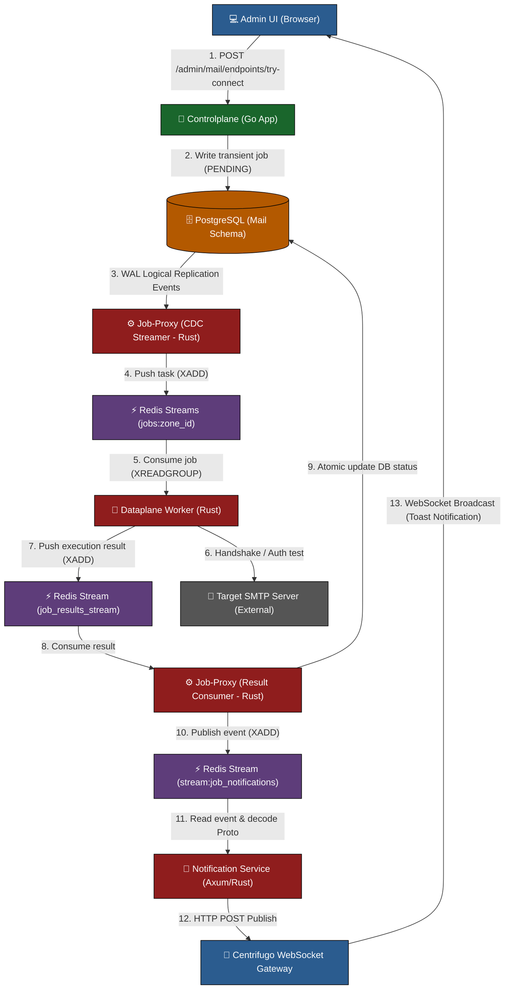
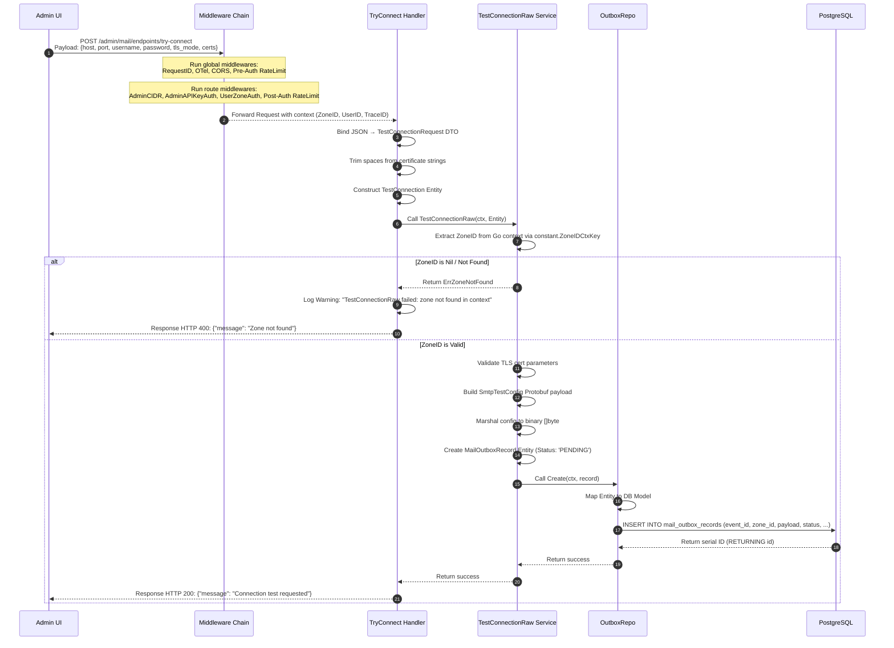
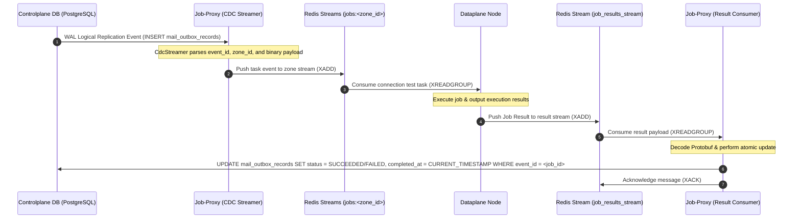
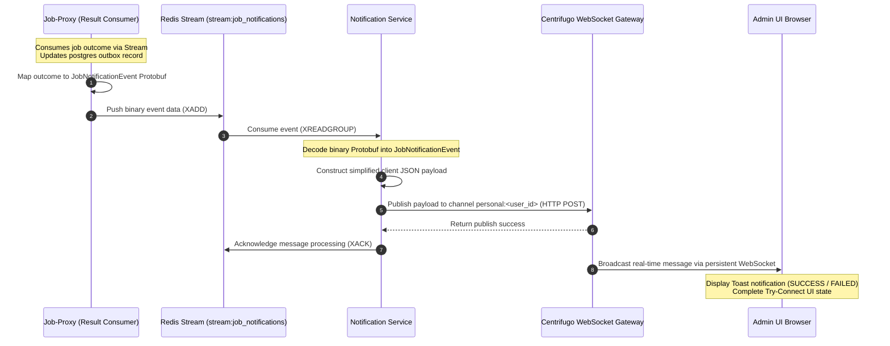
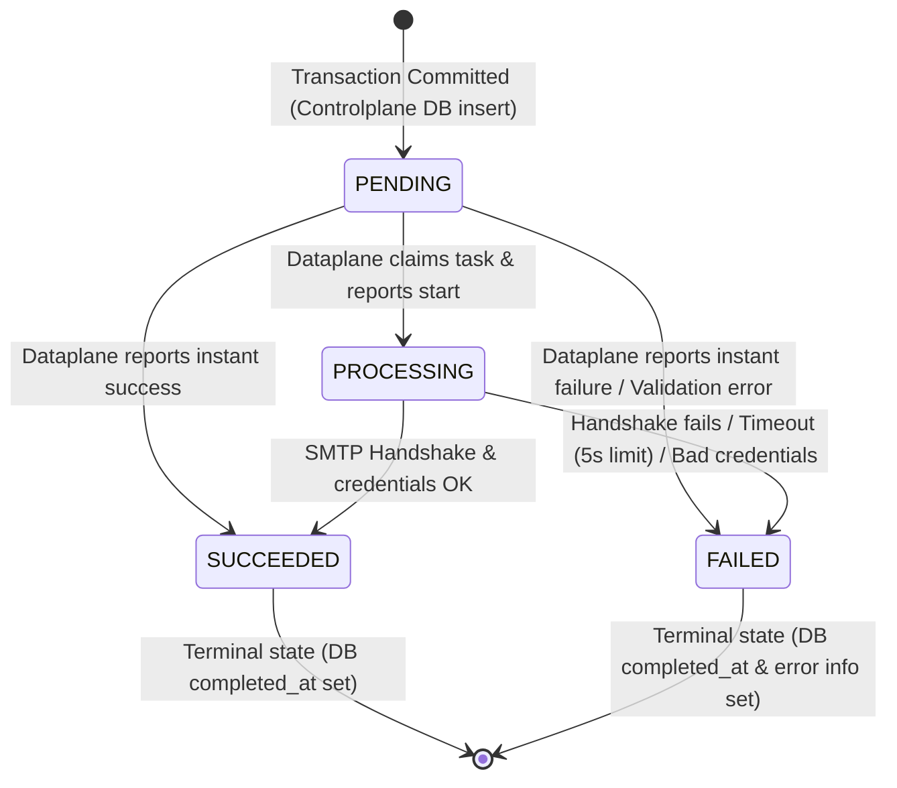
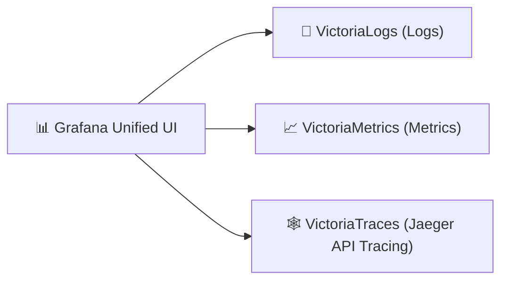

<!-- markdownlint-disable MD033 -->
# Outbound Email System - Try Connect Workflow God View

> [!NOTE]
> This document serves as the **Source of Truth (SoT) / God View** for the "Try Connect" feature.
> Any code must be compliant with this document.

---

## <a id="intro"></a>🗺️ 1. Giới Thiệu

### 👥 Tài Liệu Này Dành Cho Ai?

Tài liệu này được biên soạn đặc biệt cho **USA (Ultimate System Administrator)** và SRE (Site Reliability Engineer) chịu trách nhiệm vận hành, giám sát, cấu hình và khắc phục sự cố hệ thống phân hệ gửi Email Outbound ở môi trường Cloud-Native & HA (High Availability).

### ❓ Tính Năng "Try Connect" Là Gì?

**Try Connect** là một tính năng kiểm tra trực tiếp (on-the-fly validation) cấu hình SMTP Server (bao gồm IP/Host, Port, Credentials, TLS Mode, CA/Client Certificates) tại zone đích trước khi lưu thông tin này thành các bản ghi Mail Endpoints chính thức trong cơ sở dữ liệu.

### 🎯 Tính Năng Này Làm Gì?

- Tiếp nhận thông số SMTP tạm thời từ UI, kiểm tra tính hợp lệ cấu trúc của DTO và chứng chỉ.
- Tạo một transactional Outbox job lưu trong PostgreSQL DB.
- Trích xuất sự kiện phi chặn (non-blocking) qua PostgreSQL Logical Replication (CDC) và vận chuyển sang Redis Streams.
- Phân phối việc thực thi đến worker Dataplane nằm trong Zone đích để thực hiện bắt tay mạng (SMTP handshake/auth test) thực tế.
- Trả về kết quả qua Pub/Sub và Centrifugo WebSockets để cập nhật giao diện Admin UI tức thời bằng Toast Notifications.

### 📍 Tính Năng Này Hoạt Động Ở Đâu?

Tính năng này hoạt động xuyên suốt các biên công nghệ:

1. **Frontend (Browser Client)**: `admin-ui/src/pages/mail/NewMailEndpoint.tsx`
2. **Controlplane (Go API)**: `controlplane/internal/mail/transport/http/handler/endpoint_handler.go`
3. **Database (PostgreSQL)**: Bảng `mail_outbox_records` thuộc schema `mail`.
4. **CDC & Inbound Consumer (Rust)**: Tiến trình `job-proxy` chạy ngầm.
5. **Broker Transport (Redis)**: Redis Streams (`jobs:<zone_id>` và `job_results_stream`).
6. **Dataplane Executor (Rust)**: Tiến trình `dataplane` chạy ở các Zone cụ thể.
7. **Real-Time Notification (Rust & Go)**: Dịch vụ `notification-service` và Centrifugo gateway.

---

### 📂 Mục Lục (Table of Contents)

- [1. Giới Thiệu Dành Cho USA & Mục Lục](#intro)
- [2. Sơ Đồ Hệ Thống & Ranh Giới Phase (Topology & Phase Boundaries)](#topology)
- [3. Chi Tiết Thực Thi Nghiệp Vụ & Ánh Xạ (Implementation Details)](#details)
- [4. State Machine Của Job (Job State Machine)](#state-machine)
- [5. Xử Lý Race Condition Theo Từng Phase (Race Condition Mitigation)](#race-condition)
- [6. Giám Sát Và Truy Vết - Grafana Runbook (Telemetry & Grafana Queries)](#telemetry)

---

## <a id="topology"></a>🏛️ 2. Sơ Đồ Hệ Thống & Ranh Giới Phase (Topology & Phase Boundaries)

### 🗺️ High-Level System Topology



---

### 🚧 Ranh Giới Và Ràng Buộc Các Phase (Phase Boundaries)

#### Phase 1: Ingestion & Outbox Persistence

- **Ranh giới (Boundary)**: Từ Admin UI Browser gửi qua mạng WAN/LAN đến HTTP Gateway của Controlplane (Go).
- **Đầu vào (Inputs)**: JSON body chứa cấu hình SMTP tạm thời (`host`, `port`, `username`, `password`, `tls_mode`, `ca_cert_pem`, `client_cert_pem`, `client_key_pem`) kèm header cookie định danh và CSRF token.
- **Đầu ra (Outputs)**: Bản ghi PostgreSQL `mail_outbox_records` được commit thành công với trạng thái `PENDING`, trả về HTTP 200 `{"message": "Connection test requested"}` ngay lập tức.
- **Ràng buộc & Giới hạn (Controls & Limits)**:
  - Phải vượt qua các Gateway Middleware (IP whitelist AdminCIDR, AdminAPIKeyAuth, UserZoneAuth, rate-limits Pre và Post Auth).
  - Không cho phép gọi SMTP trực tiếp từ Controlplane (cô lập tài nguyên).
  - Mã hóa certs thô và serialize sang Protobuf nhị phân để lưu vào cột `BYTEA` Postgres.
- **Mã nguồn thực thi (Code Callsites & Implementation)**:
  - **Kích hoạt từ Giao diện**: [NewMailEndpoint.tsx](file:///home/phucle/Desktop/New/admin-ui/src/pages/mail/NewMailEndpoint.tsx) $\rightarrow$ Hàm `tryConnect` (~L144-L180) gửi request POST đi.
  - **Tầng Gateways & Global Middlewares**: [app.go](file:///home/phucle/Desktop/New/controlplane/internal/app/app.go) $\rightarrow$ Cấu trúc `App` (~L244-L256) thiết lập Gin Engine và các global middlewares.
  - **Định tuyến Route**: [route.go](file:///home/phucle/Desktop/New/controlplane/internal/mail/route.go) $\rightarrow$ Hàm `RegisterRoutes` (~L170-L177) binding API path và áp dụng route-specific middlewares.
  - **Bộ Xử Lý HTTP (Handler)**: [endpoint_handler.go](file:///home/phucle/Desktop/New/controlplane/internal/mail/transport/http/handler/endpoint_handler.go) $\rightarrow$ Phương thức `TryConnect` (~L354-L407) phân tích JSON body và DTO validation.
  - **Tầng Nghiệp Vụ (Service)**: [endpoint_service_impl.go](file:///home/phucle/Desktop/New/controlplane/internal/mail/service/endpoint_service_impl.go) $\rightarrow$ Hàm `TestConnectionRaw` (~L364-L449) kiểm tra TLS, serialize sang Protobuf và chuẩn bị cấu trúc Entity Outbox.
  - **Tầng Lưu Trữ (Repository)**: [outbox_repo_postgres.go](file:///home/phucle/Desktop/New/controlplane/internal/mail/repository/postgres/outbox_repo_postgres.go) $\rightarrow$ Phương thức `Create` (~L59-L82) thực hiện ghi transaction xuống Postgres.

#### Phase 2: Logical Replication & Transport

- **Ranh giới (Boundary)**: Từ Database Postgres Engine qua tiến trình logic `job-proxy` (Rust) đến cụm Redis Cluster.
- **Đầu vào (Inputs)**: Luồng WAL binary từ Postgres logical replication slot sử dụng plugin decode `pgoutput`.
- **Đầu ra (Outputs)**: Job payload được đẩy thành công vào Redis Stream `jobs:<zone_id>` qua lệnh `XADD`.
- **Ràng buộc & Giới hạn (Controls & Limits)**:
  - CDC Streamer chạy bất đồng bộ ngoài transaction của Go.
  - Phải đảm bảo nguyên tắc **At-Least-Once**: Chỉ cập nhật applied LSN lên Postgres *sau khi* ghi nhận thành công từ Redis Stream.
  - Concurrency limit: Chỉ duy nhất một node Job-Proxy được kết nối tích cực vào logical replication slot tại một thời điểm (cơ chế Single Active Consumer của Postgres).
- **Mã nguồn thực thi (Code Callsites & Implementation)**:
  - **CDC Streamer**: [mod.rs (CDC)](file:///home/phucle/Desktop/New/job-proxy/src/cdc/mod.rs) $\rightarrow$ Hàm `run_replication_stream` (~L54-L155) quản lý luồng CDC, lắng nghe sự kiện WAL và đẩy vào Redis Stream.

#### Phase 3: Dataplane Execution & Lease Locking

- **Ranh giới (Boundary)**: Từ Redis Stream hàng đợi công việc của Zone đến tiến trình `dataplane` chạy trong mạng Zone cô lập, bắt tay ra ngoài internet/VPN đến Mail Server đích.
- **Đầu vào (Inputs)**: XREADGROUP nhận job payload nhị phân và `trace_id`.
- **Đầu ra (Outputs)**: Kết quả thực thi nhị phân đẩy vào Redis Stream `job_results_stream`.
- **Ràng buộc & Giới hạn (Controls & Limits)**:
  - **Admission Control**: Kiểm tra số worker hiện tại có vượt ngưỡng `max_workers` hay không trước khi kéo task.
  - **Distributed Lease Lock**: Phải chiếm hữu thành công lock `locks:job:<job_id>` trên Redis nội bộ để ngăn cản việc chạy trùng lặp ở cụm HA.
  - **Security isolation**: Không sử dụng System Root Certificates (`CertificateStore::None`). Chỉ tin tưởng CA cert đính kèm của client.
  - **Thread-Protection**: Khóa cứng timeout kết nối SMTP là 5 giây trong thư viện `lettre`. Tổng thời hạn thực thi tối đa được giám sát bởi Watchdog (max execution limit) là 90 giây.
- **Mã nguồn thực thi (Code Callsites & Implementation)**:
  - **Dataplane Job Runner**: [runner.rs](file:///home/phucle/Desktop/New/dataplane/src/job_lifecycle/runner.rs) $\rightarrow$ Hàm `run_job` (~L43-L211) quản lý vòng đời chạy tác vụ ở Dataplane, kiểm tra Worker pool admission, giành Distributed Lock và gửi kết quả về Redis.
  - **SMTP Handshake Executor**: [test_connection.rs](file:///home/phucle/Desktop/New/dataplane/src/executor/mail/test_connection.rs) $\rightarrow$ Phương thức `execute` (~L58-L248) thực thi logic bắt tay SMTP thực tế, cấu hình TLS/mTLS, và giới hạn kết nối 5s.

#### Phase 4: Feedback Callback & Notification

- **Ranh giới (Boundary)**: Từ Redis Stream kết quả qua `job-proxy` cập nhật Postgres DB, đẩy thông báo sang `notification-service`, Centrifugo WebSocket Gateway và trả lại Toast thông báo lên Admin UI Browser.
- **Đầu vào (Inputs)**: Tin nhắn kết quả từ Redis `job_results_stream`.
- **Đầu ra (Outputs)**: Trạng thái PostgreSQL đổi thành `SUCCEEDED` hoặc `FAILED`, Centrifugo WebSocket broadcast tin nhắn đến kênh `personal:<user_id>`, UI hiển thị Toast và mở khóa trạng thái chờ của form.
- **Ràng buộc & Giới hạn (Controls & Limits)**:
  - Cập nhật database Postgres bắt buộc sử dụng cập nhật có điều kiện (Atomic State Constraints) để tránh ghi đè kết quả cũ.
  - Phân tách payload thông báo sang định dạng nhị phân Protobuf (`JobNotificationEvent`) để tiết kiệm băng thông Redis trước khi chuyển đổi sang JSON ở tầng `notification-service`.
- **Mã nguồn thực thi (Code Callsites & Implementation)**:
  - **Result Consumer (DB Sync)**: [consumer.rs](file:///home/phucle/Desktop/New/job-proxy/src/result_consumer/consumer.rs) $\rightarrow$ Hàm `process_result` (~L179-L320) nhận kết quả, cập nhật DB nguyên tử và trigger thông báo.
  - **Notification Publisher**: [notifier.rs](file:///home/phucle/Desktop/New/job-proxy/src/result_consumer/notifier.rs) $\rightarrow$ Hàm `notify_realtime` đóng gói `JobNotificationEvent` gửi sang Redis notification stream.

---

## <a id="details"></a>🔍 3. Chi Tiết Thực Thi Nghiệp Vụ & Ánh Xạ (Implementation Details)

Giữ nguyên đặc tả gọi hàm, cấu hình middleware, sequence chi tiết và schema database để đảm bảo tính kỹ thuật nhất quán.

### 🛡️ Middleware Chain & Context Injections (Controlplane)

📌 **Mã nguồn kiểm soát tại:** [app.go](file:///home/phucle/Desktop/New/controlplane/internal/app/app.go) & [route.go](file:///home/phucle/Desktop/New/controlplane/internal/mail/route.go)

Before reaching the `TryConnect` HTTP Handler, a request goes through a strict multi-layer security and telemetry chain.

#### 1. Global Middleware (defined in `controlplane/internal/app/app.go`)

| Middleware | Purpose / Action | Context Injections |
| :--- | :--- | :--- |
| **`gin.Recovery()`** | Prevents server crashes by catching panics and returning a `500 Internal Server Error`. | None |
| **`middleware.RequestID()`** | Extracts or generates a unique correlation ID: (1) Reads Envoy edge `X-Request-ID`, (2) Falls back to W3C `traceparent` Trace ID, (3) Falls back to generated UUID. | **Gin**: `c.Set("request_id", reqID)`; **HTTP Header**: `X-Request-ID: reqID` |
| **`middleware.OTelTraceContext(...)`** | Integrates OpenTelemetry tracing. Extracts span parent context from headers and starts a child span. | **Go Context**: `c.Request.Context()` is updated with the OTel Span context. |
| **`middleware.PrometheusHTTPMetrics(...)`** | Measures HTTP request count, latency, and active inflight count at global scope. | None |
| **`middleware.CookieOriginGuard(...)`** | CSRF prevention. Checks request `Origin` or `Referer` headers against allowed domain hosts. | None |
| **`middleware.RateLimitPreAuth(...)`** | Defends edge computing resources from DDoS. Checks IP token bucket before heavy parsing. | None |
| **`middleware.AccessLog()`** | Logs transaction data (URI, method, duration, client IP, Request ID) at log termination. | None |
| **`middleware.AdminXSSI()`** | Prevents Cross-Site Site Inclusion by prepending `)]}',\n` to JSON responses. | None |

#### 2. Route-specific Middleware (defined in `controlplane/internal/mail/route.go`)

| Middleware | Purpose / Action | Context Injections |
| :--- | :--- | :--- |
| **`middleware.AdminCIDR()`** | Evaluates client IP against compiled allowed CIDRs / static IP whitelist. Fail-Closed. | None |
| **`middleware.AdminAPIKeyAuth()`** | Performs session cookie verification: (1) Decodes JWT from `admin_api_token` candidate key rotation keys, (2) Checks session access secret hash in L2 Redis cache. | **Gin & Go Context**: `constant.ContextKeyUserID` ("user_id") -> `claims.Subject` (Value: `"sre"`); **HTTP Header**: `X-Session-Expires-In` |
| **`middleware.UserZoneAuth()`** | Multi-tenancy isolation. (1) Extracts `zone_code` cookie, (2) Queries L1 `"zone_by_code"` loader to resolve UUID, (3) Compares claims Zone ID with resolved Zone ID. | **Go Context**: `constant.ZoneIDCtxKey` -> resolved `uuid.UUID` (injected via `ContextWithZoneID`) |
| **`middleware.RateLimitPostAuth(...)`** | Anti-probing rate limit based on identity key: `path + clientIP + user_id / access_key`. | None |

---

### 🔄 End-to-End Sequence (Phase 1 Ingestion)

📌 **Kích hoạt từ:** [NewMailEndpoint.tsx](file:///home/phucle/Desktop/New/admin-ui/src/pages/mail/NewMailEndpoint.tsx) qua [endpoint_handler.go](file:///home/phucle/Desktop/New/controlplane/internal/mail/transport/http/handler/endpoint_handler.go) $\rightarrow$ [endpoint_service_impl.go](file:///home/phucle/Desktop/New/controlplane/internal/mail/service/endpoint_service_impl.go) $\rightarrow$ [outbox_repo_postgres.go](file:///home/phucle/Desktop/New/controlplane/internal/mail/repository/postgres/outbox_repo_postgres.go)



---

### 📊 Database Schema & Field Mappings

📌 **Đặc tả Schema:** [000004_mail_outbox.up.sql](file:///home/phucle/Desktop/New/controlplane/internal/mail/migrations/000004_mail_outbox.up.sql) $\leftrightarrow$ **Ánh xạ Struct & Query SQL:** [outbox_repo_postgres.go](file:///home/phucle/Desktop/New/controlplane/internal/mail/repository/postgres/outbox_repo_postgres.go)

The transient connection test job is written to the `mail_outbox_records` table under the mail module schema. The fields are mapped as follows:

| DTO Field / Context Source | Entity / Protobuf Field | DB Model Field (`db` Tag) | Database Column |
| :--- | :--- | :--- | :--- |
| Generated `uuid.NewV7()` | `EventID` | `EventID` (`event_id`) | `event_id` (UUID) |
| `ctx.Value(constant.ZoneIDCtxKey)` | `ZoneID` | `ZoneID` (`zone_id`) | `zone_id` (UUID) |
| Static String | `JobTopic` (`"mail.test_connection"`) | `JobTopic` (`job_topic`) | `job_topic` |
| Form DTO Params | `SmtpTestConfig` Protobuf payload | `Payload` (`payload`) | `payload` |
| `ctx.Value(ContextKeyUserID)` | `UserID` | `UserID` (`user_id`) | `user_id` |
| Static Enum | `OutboxStatusPending` | `Status` (`status`) | `status` |
| Static Version | `JobVersion` (`1`) | `JobVersion` (`job_version`) | `job_version` |
| Static Identifier | `ResourceID` (`"transient_test"`) | `ResourceID` (`resource_id`) | `resource_id` |
| Static Schema | `PayloadSchemaVersion` (`1`) | `PayloadSchemaVersion` (`payload_schema_version`) | `payload_schema_version` |
| `trace.SpanContextFromContext` | `TraceID` | `TraceID` (`trace_id`) | `trace_id` (BYTEA, 16 bytes raw binary) |
| Static Timeout Option | `Idle` (`90`) | `Idle` (`idle`) | `idle` (nullable) |
| System Time (when completed) | `CompletedAt` | `CompletedAt` (`completed_at`) | `completed_at` (nullable) |
| Dataplane Error (on failure) | `ErrorCode` | `ErrorCode` (`error_code`) | `error_code` (nullable) |
| Dataplane Error Msg (on failure) | `ErrorMessage` | `ErrorMessage` (`error_message`) | `error_message` (nullable) |

---

### 🔄 Phase 2: Job Lifecycle (CDC & Dataplane Execution)

📌 **Mã nguồn CDC:** [mod.rs (CDC)](file:///home/phucle/Desktop/New/job-proxy/src/cdc/mod.rs) $\rightarrow$ **Dataplane Runner:** [runner.rs](file:///home/phucle/Desktop/New/dataplane/src/job_lifecycle/runner.rs) $\rightarrow$ **Bắt tay SMTP:** [test_connection.rs](file:///home/phucle/Desktop/New/dataplane/src/executor/mail/test_connection.rs) $\rightarrow$ **Result Consumer:** [consumer.rs](file:///home/phucle/Desktop/New/job-proxy/src/result_consumer/consumer.rs)



---

### 🔄 Phase 4: Real-time Notification Flow (End-to-End Callback to UI Client)

📌 **Mã nguồn phản hồi:** [consumer.rs](file:///home/phucle/Desktop/New/job-proxy/src/result_consumer/consumer.rs) $\rightarrow$ [notifier.rs](file:///home/phucle/Desktop/New/job-proxy/src/result_consumer/notifier.rs) $\rightarrow$ **Axum notification:** `notification-service/` $\rightarrow$ **WebSocket:** Admin UI



---

## <a id="state-machine"></a>📊 4. State Machine Của Job (Job State Machine)

Trạng thái tác vụ của `mail_outbox_records` được đồng bộ hóa nghiêm ngặt từ lúc sinh ra cho đến khi kết thúc.

### ⚙️ Biểu Đồ Chuyển Đổi Trạng Thái (State Transition Diagram)



### 📋 Bảng Chuyển Trạng Thái (State Transition Matrix)

| Source State | Event (Trigger) | Target State | Action / Executed By | Conditional Guard / DB constraint |
| :--- | :--- | :--- | :--- | :--- |
| **None** | `TestConnectionRaw` called | **`PENDING`** | INSERT query by Controlplane | None (Initial state) |
| **`PENDING`** | Job runner begins execution | **`PROCESSING`** | UPDATE by `ResultConsumer` | `WHERE status IN ('PENDING', 'PROCESSING')` |
| **`PENDING`** / **`PROCESSING`** | SMTP Handshake success | **`SUCCEEDED`** | UPDATE by `ResultConsumer` | `WHERE status IN ('PENDING', 'PROCESSING')` |
| **`PENDING`** / **`PROCESSING`** | SMTP Handshake error / Network timeout | **`FAILED`** | UPDATE by `ResultConsumer` | `WHERE status IN ('PENDING', 'PROCESSING')` |
| **`SUCCEEDED`** | Late execution result | **`SUCCEEDED`** | Skip DB Update (No-op) | Match fails, returns 0 rows updated |
| **`FAILED`** | Late execution result | **`FAILED`** | Skip DB Update (No-op) | Match fails, returns 0 rows updated |

---

## <a id="race-condition"></a>⚡ 5. Xử Lý Race Condition Theo Từng Phase (Race Condition Mitigation)

Để đảm bảo tính bền vững của dữ liệu và vận hành an toàn trong hệ thống phân tán, các trường hợp xung đột (Race Condition) được xử lý triệt để tại từng phase:

### 1. Phase 1: Ingestion & Outbox Persistence

- **Xung đột: Gửi Yêu Cầu Liên Tục (Connection Test Spamming / DDoS)**
  - *Rủi ro*: Một SRE/User (hoặc bot) spam liên tục nút "Connection Test" gây tràn ngập hàng đợi và quá tải database.
  - *Giải pháp*: Tích hợp middleware `RateLimitPreAuth` (dựa trên IP) và `RateLimitPostAuth` (dựa trên `path + clientIP + user_id`) tại API Gateway của Controlplane.
- **Xung đột: Trùng lặp định danh Event (Duplicate ID Collision)**
  - *Rủi ro*: Tạo trùng ID khi gửi đồng thời gây lỗi Unique Constraint ở DB.
  - *Giải pháp*: Sử dụng `uuid.NewV7()` tạo khóa chính dạng UUID tự tăng theo thời gian, đảm bảo tính duy nhất tuyệt đối và hỗ trợ sắp xếp thứ tự ghi tối ưu.

### 2. Phase 2: Logical Replication & Transport

- **Xung đột: CDC Reconnect Replay & Lặp Tin Nhắn (Duplicate WAL delivery)**
  - *Rủi ro*: Khi Job-Proxy bị restart đột ngột, replication slot có thể replay lại các bản ghi WAL chưa được ACK LSN trước đó, dẫn đến việc đẩy lặp một job vào Redis Stream.
  - *Giải pháp*: ID của job (`event_id`) được giữ nguyên trong payload truyền lên Redis. Khi Dataplane Worker nhận job, khóa phân phối Redis sẽ đóng vai trò như một màng lọc khử trùng lặp (de-duplication filter).

### 3. Phase 3: Dataplane Execution & Lease Locking

- **Xung đột: Tranh Chấp Thực Thi Song Song (Double Execution)**
  - *Rủi ro*: Trong cụm HA, hai node Dataplane cùng kéo một job từ Redis Stream cùng một lúc và chạy handshake đồng thời, dẫn đến kết quả sai lệch và tốn tài nguyên.
  - *Giải pháp*: Dataplane phải chiếm hữu khóa phân phối `locks:job:<job_id>` trên Redis nội bộ bằng lệnh `SETNX` với TTL mặc định ban đầu là 30 giây trước khi thực thi. Trong lúc job chạy bình thường, một tiến trình ngầm Watchdog định kỳ mỗi 10 giây sẽ tự động gia hạn (renew) khóa này lên lại 30 giây (auto-renewal lease). Nếu không chiếm được khóa ban đầu, task sẽ bị bỏ qua lập tức.
- **Xung đột: Worker Sập Giữa Chừng (Orphan Worker Crash)**
  - *Rủi ro*: Worker đang kết nối SMTP thì bị crash (OOM, Hardware failure) làm cho khóa phân phối bị treo và trạng thái DB mãi mãi ở `PROCESSING`.
  - *Giải pháp*: Khóa phân phối Redis có cấu hình TTL tự động giải phóng (mặc định 30 giây). Nếu Worker bị sập, watchdog dừng hoạt động, khóa sẽ tự giải phóng sau tối đa 30 giây, cho phép hệ thống thu hồi hoặc chạy lại một cách an toàn mà không bị treo vĩnh viễn.

### 4. Phase 4: Feedback Callback & Notification

- **Xung đột: Ghi Đè Trạng Thái Cũ Do Độ Trễ Mạng (Stale State Update Overwrite)**
  - *Rủi ro*: Kết quả chạy thử lại thành công (SUCCEEDED) được cập nhật xong, nhưng gói tin báo lỗi mạng (FAILED) của lần chạy thứ nhất do trễ mạng bây giờ mới đến DB, ghi đè và làm sai lệch trạng thái cuối cùng.
  - *Giải pháp*: Mệnh đề SQL UPDATE trong `ResultConsumer` của Job-Proxy sử dụng điều kiện ràng buộc trạng thái:
    `WHERE event_id = $1 AND status IN ('PENDING', 'PROCESSING', 'PUBLISHED')`.
    Khi bản ghi đã chuyển sang trạng thái cuối cùng (`SUCCEEDED` / `FAILED`), câu lệnh UPDATE muộn màng sẽ trả về `0 rows affected` và bị bỏ qua.

---

## <a id="telemetry"></a>📡 6. Giám Sát Và Truy Vết - Grafana Runbook (Telemetry & VictoriaMetrics Stack)

Khi xảy ra sự cố trong luồng Try Connect, USA/SRE sử dụng các chỉ số, nhật ký và vết thực thi thông qua Grafana kết nối tới hệ sinh thái VictoriaMetrics (VictoriaMetrics, VictoriaLogs, VictoriaTraces) để xác định nguyên nhân gốc rễ.



Dưới đây là sơ đồ chi tiết mô tả luồng di chuyển, chuyển đổi (giữa raw binary bytes và hex string), lưu trữ và kế thừa của `trace_id` xuyên suốt các thành phần hệ thống:

```mermaid
graph TD
    %% Định nghĩa các lớp màu sắc dễ phân biệt
    classDef step fill:#1e1e24,stroke:#3b3b4f,stroke-width:1px,color:#e0e0e0;
    classDef highlight fill:#1a233a,stroke:#268bd2,stroke-width:2px,color:#268bd2;
    classDef database fill:#142217,stroke:#2aa198,stroke-width:1px,color:#2aa198;
    classDef queue fill:#281829,stroke:#d33682,stroke-width:1px,color:#d33682;

    subgraph SG_CP ["⚙️ Controlplane"]
        Start(["🛡️ Envoy Proxy"]) -->|"1. HTTP Req + traceparent"| CP_OTel["OTel HTTP Middleware"]:::step
        CP_OTel -->|"2. Inject SpanContext"| CP_SVC["endpoint_service_impl.go"]:::step
    end

    subgraph SG_DB_CDC ["💾 Storage & CDC"]
        CP_SVC -->|"3. Convert raw bytes"| DB_Write[("PostgreSQL: outbox_records")]:::database
        DB_Write -->|"4. BYTEA format"| WAL_Event{{"WAL Event"}}:::step
        WAL_Event -->|"5. logical replication"| JP_CDC["Job-Proxy CDC (mod.rs)"]:::step
    end

    subgraph SG_QUEUE_JOBS ["📥 jobs:zone Broker"]
        JP_CDC -->|"6. Raw binary"| Redis_Job[("Redis Stream: jobs:zone")]:::queue
    end

    subgraph SG_DP ["🚀 Dataplane Worker"]
        Redis_Job -->|"7. XREADGROUP"| DP_Query["Ingestion (query.rs)"]:::step
        DP_Query -->|"8. Hex string"| DP_Runner["Job Runner"]:::step
        DP_Runner -->|"9. Thread-Local Scope"| DP_Exec["Workload Executor"]:::step
        DP_Exec -->|"10. Inherit context"| DP_Reporter["Reporter (result.rs)"]:::step
    end

    subgraph SG_QUEUE_RES ["📤 job_results Broker"]
        DP_Reporter -->|"11. Protobuf bytes"| Redis_Res[("Redis Stream: job_results")]:::queue
    end

    subgraph SG_CONSUMER ["🔄 Result & Notification"]
        Redis_Res -->|"12. XREADGROUP"| JP_Consumer["Result Consumer"]:::step
        JP_Consumer -->|"13. UPDATE DB status"| DB_Update[("PostgreSQL: UPDATE outbox")]:::database
        DB_Update -->|"14. RETURNING trace_id"| JP_Notifier["Notifier"]:::step
        JP_Notifier -->|"15. WS Broadcast"| UI_WS(["WS Client / UI Browser"]):::highlight
    end

    class Start highlight;
```



### 📋 Bản đồ phân bố trường `trace_id` trong hệ thống

- **PostgreSQL**: Cột `trace_id` thuộc bảng `mail.mail_outbox_records` có kiểu dữ liệu là **`BYTEA`** (lưu trữ nhị phân 16-byte tối ưu).

- **Redis Stream (`jobs:<zone_id>`)**: Lưu dưới dạng cặp key-value thô, trường `"trace_id"` chứa **mảng bytes nhị phân 16-byte thô** (đẩy trực tiếp qua driver Redis).
- **Redis Stream (`job_results_stream`)**: Nằm bên trong gói tin nhị phân Protobuf (`JobExecutionResultProto`), trường `trace_id` định dạng **`bytes`** (được mã hóa/giải mã cực nhanh bằng thư viện `prost`).
- **Dataplane Memory / Logger**: Được lưu trữ dưới dạng chuỗi **Hex string 32 ký tự** trong Thread-Local Variable (`CURRENT_TRACE_ID`) của Tokio task, tự động đính kèm vào mọi Span của OpenTelemetry và dòng ghi nhật ký (`Logger::job_log`).
- **UI Browser Client**: Nhận chuỗi **Hex string 32 ký tự** qua WebSocket từ Centrifugo để đối chiếu logs hoặc hiển thị chi tiết vết gỡ lỗi.

### 🔍 Hướng dẫn trích xuất và truy vấn theo Trace ID (Trace ID Extraction & Query Guide)

Để theo vết (trace) lỗi hệ thống một cách hiệu quả, USA/SRE thực hiện theo các bước sau để lấy Trace ID và thực thi truy vấn trên Grafana:

#### 1. Phân biệt Trace ID và Request ID

- **Trace ID (Định danh vết thực thi)**: Chuỗi hex 32 ký tự (W3C standard), dùng để liên kết dòng vết xử lý phân tán qua các hệ thống microservices (Controlplane, Job-Proxy, Dataplane).

- **Request ID (Định danh yêu cầu HTTP)**: Chuỗi UUID được Envoy gán vào header phản hồi `X-Request-ID` để theo dõi vòng đời của một yêu cầu HTTP riêng lẻ tại Edge API Gateway.

> [!WARNING]
> **Trace ID và Request ID là hai giá trị khác nhau**. Để tìm kiếm dấu vết phân tán (Spans/Gantt Chart) trên VictoriaTraces hoặc logs tập trung qua các container khác nhau, bạn phải dùng **Trace ID**.

#### 2. Lấy thông tin Trace ID ở đâu?

- **Từ Database (Postgres)**: Truy vấn cột `trace_id` của bảng outbox bằng SQL. Vì cột `trace_id` được lưu dưới dạng nhị phân (`BYTEA`), hãy dùng hàm `encode` để lấy ra chuỗi hex 32 ký tự sạch sẽ:

    ```sql
    SELECT event_id, encode(trace_id, 'hex') AS trace_id, status 
    FROM mail.mail_outbox_records 
    WHERE user_id = 'e2e-user-...' 
    ORDER BY id DESC LIMIT 1;
    ```

- **Từ logs của Controlplane**: Khi tìm thấy log lỗi của Controlplane theo `Request ID` (hoặc `X-Request-ID`), thông tin JSON của dòng log đó sẽ hiển thị trường `trace_id` tương ứng.

#### 3. Truy vấn dấu vết logs (VictoriaLogs)

Sau khi có được `trace_id`, dán vào thanh tìm kiếm Logs của Grafana (sử dụng ngôn ngữ **LogsQL**):

```sql
# Tìm kiếm toàn bộ log sinh ra ở tất cả các container tham gia xử lý job này
container_name:~"controlplane-dev-.*|aurora-job-proxy|dataplane-.*" AND "trace_id" AND "<trace_id>"
```

> [!NOTE]
> Nhờ cơ chế lưu trữ ngữ cảnh Task-Local (`CURRENT_TRACE_ID`) tại Dataplane và OTel Middleware tại Controlplane, mọi dòng log ghi nhận trong luồng xử lý của Job này sẽ được tự động gắn kèm `"trace_id":"<trace_id>"`, giúp gom đầy đủ nhật ký mà không bị thất lạc.

#### 4. Truy vết sơ đồ Gantt-chart Spans (VictoriaTraces / Jaeger)

- Mở Panel **Explore** trên Grafana, lựa chọn Data Source là **VictoriaTraces** (hoặc Jaeger).

- Chọn chế độ tìm kiếm bằng **Trace ID** và điền chuỗi hex 32 ký tự vào.
- Nhấn **Run Query** để trực quan hóa toàn bộ dòng thời gian xử lý (Gantt Chart) từ Controlplane $\rightarrow$ Job-Proxy $\rightarrow$ Dataplane thực thi handshake mạng $\rightarrow$ cập nhật kết quả.

---

### 📝 1. Logs (VictoriaLogs)

USA có thể truy vấn các dòng log tương ứng với từng giai đoạn xử lý bằng ngôn ngữ **LogsQL** của VictoriaLogs:

#### Truy vết toàn bộ vòng đời của một Request thông qua Trace ID

```sql
# Tìm kiếm tất cả logs liên quan đến một trace_id cụ thể qua các container chính
container_name:~"controlplane-dev-.*|aurora-job-proxy|dataplane-.*" AND "trace_id" AND "<trace_id>"
```

#### Logs tại Controlplane (Phase 1)

Tìm kiếm các request kết nối thử lỗi hoặc quá tải rate-limit:

```sql
# Lọc logs lỗi hoặc cảnh báo liên quan đến try-connect tại controlplane
container_name:~"controlplane-dev-.*" AND "try-connect" AND (error OR fail OR "rate limit")
```

#### Logs tại Job-Proxy CDC (Phase 2 & 4)

Theo dõi quá trình bắt sự kiện WAL từ Postgres và đẩy sang Redis Stream:

```sql
# Lọc log ccdc đẩy job thành công vào Redis Stream
container_name: "aurora-job-proxy" AND "cdc.push_success"
```

Theo dõi quá trình cập nhật database PostgreSQL từ kết quả Dataplane:

```sql
# Lọc log cập nhật DB từ kết quả xử lý
container_name: "aurora-job-proxy" AND "result_consumer.update"
```

#### Logs tại Dataplane (Phase 3)

Theo dõi quá trình bắt tay SMTP mạng thực tế:

```sql
# Lọc log thực thi SMTP handshake của dataplane workers
container_name:~"dataplane-.*" AND "executor.mail.test_connection"
```

---

### 📈 2. Metrics (VictoriaMetrics / Prometheus Compatible)

USA cấu hình các Dashboard Grafana sử dụng ngôn ngữ **PromQL** để theo dõi hiệu năng hệ thống theo thời gian thực (truy vấn trực tiếp từ VictoriaMetrics):

#### Tốc độ đọc WAL và đẩy CDC từ Postgres

```promql
# Tốc độ đọc WAL (chỉ số phản ánh hoạt động CDC)
sum(rate(job_proxy_wal_records_read_total[5m]))
```

#### Tỉ lệ đẩy tác vụ thành công sang Redis Stream

```promql
# Tỉ lệ đẩy job thành công vào stream
sum(rate(job_proxy_stream_jobs_pushed_total[5m]))
```

#### Độ lệch (Lag) hàng đợi công việc theo từng Zone

```promql
# Độ dài hàng đợi Redis Stream đang chờ xử lý
job_proxy_queue_len
```

```promql
# Số lượng tin nhắn chưa được ACK (Pending) trong consumer group
job_proxy_pending_len
```

```promql
# Độ lệch xử lý thực tế đo tại Dataplane
dataplane_stream_lag
```

#### Tải xử lý của Dataplane Worker

```promql
# Số lượng worker đang chạy đồng thời tại mỗi Zone
dataplane_active_connections_count
```

```promql
# Tổng số lượng tác vụ đã xử lý phân loại theo trạng thái (SUCCEEDED / FAILED)
sum(rate(dataplane_jobs_processed_total[5m])) by (zone_id, status)
```

#### Biểu đồ độ trễ bắt tay mạng SMTP (SMTP Handshake Latency)

```promql
# Độ trễ thực thi 95th percentile của SMTP Handshake
histogram_quantile(0.95, sum(rate(dataplane_job_execution_latency_seconds_bucket[5m])) by (le, zone_id, job_topic))
```

#### Tỉ lệ gửi thông báo thời gian thực thành công

```promql
# Số lượng thông báo Centrifugo đẩy thành công
sum(rate(job_proxy_notifications_sent_total[5m]))
```

---

### 🕸️ 3. Tracing (VictoriaTraces / Jaeger)

Để chẩn đoán nút thắt hiệu năng (bottleneck) hoặc lỗi kết nối, USA/SRE sử dụng **Trace ID** để truy vấn trong **VictoriaTraces** thông qua Grafana datasource kiểu **Jaeger** (tương thích API Jaeger).

#### Quy trình Truy vết Trace

1. **Truy vấn bằng Trace ID**:
   - Sao chép `trace_id` (hoặc `request_id` tương ứng) từ logs của VictoriaLogs.
   - Dán vào ô tìm kiếm **Trace ID** của Jaeger Datasource trên Grafana.
2. **Truy vấn bằng Tags**:
   - Có thể lọc các trace bị lỗi bằng cách tìm kiếm theo service name `aurora-dataplane` và tag `error=true`.

#### Cấu trúc các Span hiển thị trong dòng thời gian (Trace Visualization)

```text
[HTTP POST /admin/mail/endpoints/try-connect] (Controlplane Gateway - Go)
  |
  +-- [cdc.push.mail.test_connection] (Job-Proxy CDC Extractor - Rust)
        |
        +-- [job.mail.test_connection] (Dataplane SMTP Handshaker - Rust)
              |
              +-- [lettre::smtp::connect] (Handshake & EHLO socket test)
              |
              +-- [result.notify.mail.test_connection] (Job-Proxy Result Consumer - Rust)
                    |
                    +-- [centrifugo::publish] (Broadcast to Centrifugo WebSocket Gateway)
```

- Nếu span `lettre::smtp::connect` hiển thị lỗi màu đỏ: Lỗi do cấu hình SMTP sai hoặc firewall tại Zone đó chặn cổng (25, 465, 587).
- Nếu khoảng cách thời gian giữa `cdc.push` và `job.mail` lớn: Hệ thống đang bị nghẽn (Stream lag) ở Redis Stream hoặc Dataplane Worker bị quá tải (backpressure).
- Nếu thiếu span `result.notify`: Job-Proxy Result Consumer hoặc Notification Service đang gặp sự cố kết nối Redis.
