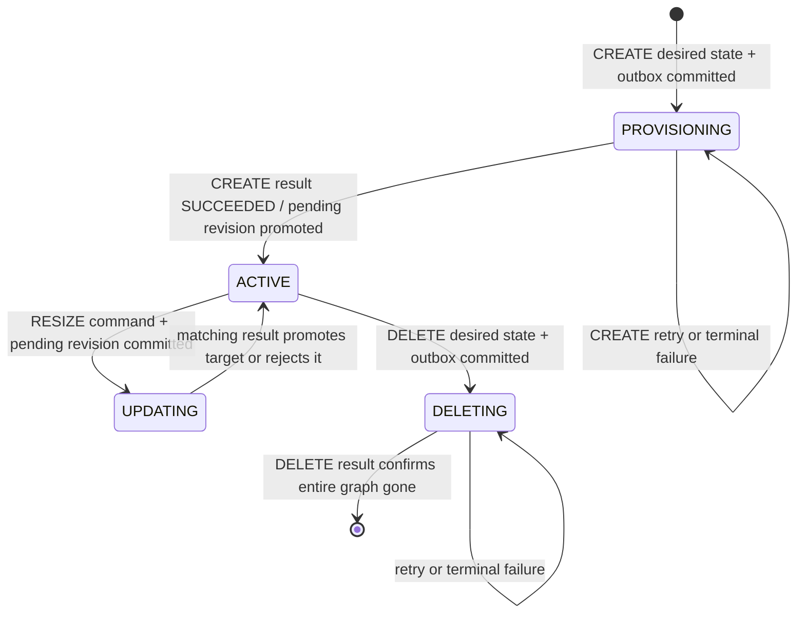
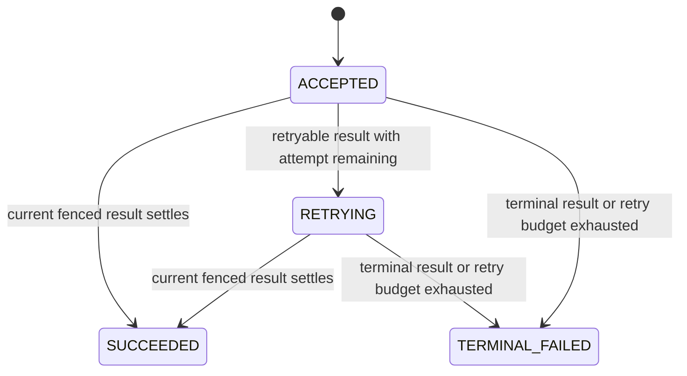
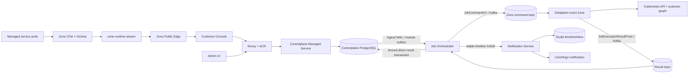
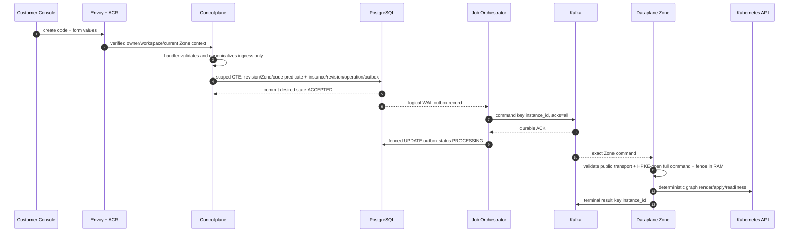

# Managed Service Lifecycle — God View

> [!IMPORTANT]
> Đây là Source of Truth end-to-end cho Managed Service Platform V1. Control
> header bên dưới ghi rõ phase nào đã ship; phần workflow tương lai không phải
> bằng chứng Kafka route hay Kubernetes executor đã được enable.
>
> Khi code, schema hay deployment mâu thuẫn với tài liệu này, dừng thay đổi và
> sửa God View/contract trước. Không suy luận runtime behavior từ module shell.

## API scope and edge-routing contract

Customer lifecycle request dùng neutral API trước edge. Sau Trinity verification,
ACR chọn verified personal hoặc concrete tenant context, rewrite internal target
thành `/api/v1/personal/**` hoặc `/api/v1/tenant/**`, overwrite `:path` và set
`x-original-path`; browser gọi trực tiếp owner prefix bị từ chối. Personal
`user_role` hoặc tenant `membership_role` authorizer kiểm tra permission và
required level trước handler, rồi repository rechecks durable owner/workspace/
Zone binding. Đây không phải `/me` self-user route; SRE catalog routes theo
contract admin riêng và không được suy diễn thành customer owner branch.

## 0. Control header

| Thuộc tính | Contract |
| --- | --- |
| Trạng thái | P00–P07 core shipped: durable JO command dispatch, Zone Dataplane execution/result producer, direct personal/tenant settlement, hard-delete fence và terminal timeline projection; safe connection output và full fault-suite integration còn gated |
| Business SoT | Controlplane PostgreSQL: system catalog, personal/tenant single lifecycle state, immutable revision, operation, deletion fence và outbox |
| Durable transport | PostgreSQL outbox/WAL → Job Orchestrator → Kafka → Dataplane Zone → Kafka result → JO/Controlplane settle |
| Runtime executor | Dataplane đúng Zone gọi Kubernetes API; Controlplane không có Kubernetes credential/client |
| Delivery | At-least-once; ordering chỉ theo `instance_id`; external fence là `instance_id + operation_id + generation` |
| Customer completion | Durable Controlplane operation/API và một Notification timeline row; không dùng NATS runtime hay apply ACK |
| Telemetry | Zone OTel → VictoriaMetrics/VictoriaLogs → generic `zone-runtime-stream` → Zone Public Edge; read-only, eventual; Managed Service adapter first |
| Canonical inner protobuf | `proto/managed_service.proto` được freeze ở P00 và generate từ root này tại P01 |
| Related SoT | [Central–Zone transport](../../architecture/CENTRAL_ZONE_TRANSPORT.md), [Notification timeline](../notification/user_timeline_god_view.md), [Dataplane telemetry](../../dataplane/TELEMETRY.md), [Zone Public Edge](../../architecture/ZONE_EDGE.md) |

## 1. Scope và boundary không được vượt qua

Managed Service cho phép SRE publish catalog service và immutable blueprint;
customer tạo desired state trong workspace hiện tại; Dataplane render graph Kubernetes
đúng Zone. Một `ManagedServiceInstance` là graph nhiều component, không phải một raw
Kubernetes object do customer gửi.

V1 **không** bao gồm arbitrary Helm/raw YAML runner, Kubernetes dashboard, billing/
quota, customer-selected Zone, secret Vault Zone, arbitrary Secret read-back,
module-specific runtime gateway, NATS runtime protocol hoặc gateway thứ ba. Generic
Zone Runtime Stream là platform read-plane riêng, Managed Service chỉ là adapter đầu tiên.
SRE bootstrap cluster-scoped
operator/CRD là platform concern ngoài customer instance graph.

Boundary bắt buộc:

* Browser/Admin UI chỉ đi Envoy/ACR và public API/edge stream; không kết nối database,
  broker, Vault hay Kubernetes.
* Envoy/ACR strip internal header do client gửi, verify session/critical proof và inject
  trusted context. Controlplane không tự diễn giải SRE role/level tại admin catalog
  route; trusted actor chỉ dùng audit và thiếu context phải fail-close.
* Controlplane sở hữu catalog, owner/workspace/Zone binding, desired state và durable
  operation; nó không render YAML, decrypt parameter, publish Kafka trực tiếp hoặc gọi
  Kubernetes.
* JO là durable WAL/CDC-to-Kafka bridge và deterministic result settler. Nó chỉ áp
  dụng terminal result khớp toàn bộ durable fence trong một transaction được cấp
  quyền hẹp; JO không tạo business aggregate, không có Zone KV credential và không
  tự suy luận lifecycle từ runtime/telemetry.
* Dataplane chỉ thực thi command đã route đúng Zone. Nó không tin client identity,
  owner, workspace hay permission và không có CP PostgreSQL/Auth-State/Shared L2 Redis
  credential.

## 2. Canonical vocabulary, ownership và identity

| Object | Owner | Ý nghĩa immutable/mutable |
| --- | --- | --- |
| `ServiceCategory` | System/SRE catalog | Nhóm hiển thị catalog; không có owner/workspace/Zone |
| `ServiceDefinition` | System/SRE catalog | Loại managed service, ví dụ Apache Kafka |
| `ServiceVersion` | System/SRE catalog | Phiên bản application SRE hỗ trợ |
| `ServiceBlueprint` | System/SRE catalog | Blueprint line của một version |
| `BlueprintRevision` | System/SRE catalog | YAML, input/UI/output/component contract immutable sau publish |
| `ManagedServiceInstance` | Personal hoặc tenant workspace | Desired lifecycle customer-facing; giữ active/pending revision head |
| `InstanceRevision` | Cùng ownership với instance | Snapshot config ciphertext + pinned blueprint artifact; immutable |
| `ManagedServiceOperation` | Cùng ownership với instance | Một execution CREATE/RESIZE/DELETE với fence/generation riêng |
| Outbox/fence | Controlplane module transport/evidence | Không là aggregate owner; retention kéo dài hơn Kafka replay window |

Catalog table là system table, không có prefix `sre_` và không có `owner_id`,
`owner_type`, `workspace_id` hay `zone_id`. SRE actor chỉ là audit provenance như
`published_by`/`retired_by`.

Customer aggregate dùng hai physical branch tách biệt. Personal branch snapshot
`user_id`; tenant branch snapshot `tenant_id`; không có bảng customer polymorphic chung
hay generic repository chọn owner type. Mỗi workflow vẫn là một handler method → một
service method → một repository method trong branch tương ứng.

`ManagedServiceInstance.code` là lowercase DNS-label immutable, tối đa 35 ký tự, và là
Kubernetes workload-name base. `name` chỉ là display metadata, được phép đổi mà không
đổi render identity. Create uniqueness là `(workspace_id, code)` kết hợp canonical
create intent: trùng intent trả instance/CREATE operation hiện có; intent khác trả
stable conflict. Không dùng HTTP `Idempotency-Key`.

Namespace do Dataplane tạo, không nhận từ client/template:

```text
aur-ms-{p|t}-{base32lower(owner_uuid_bytes || workspace_uuid_bytes)}
```

DP inject protected owner/workspace/instance/revision/render-hash annotations và internal
instance/component labels. Owner/workspace không là traffic label V1; customer parameter,
template và workload không được ghi đè metadata protected.

## 3. Lifecycle state machine

`ManagedServiceInstance` là resource lâu dài; `ManagedServiceOperation` là một lần
thực thi thay đổi resource. Instance chỉ có một cột lifecycle `state`; runtime health
không được chiếu ngược vào Controlplane mà được đọc từ Zone Runtime Stream.

| Aggregate | States | Invariant |
| --- | --- | --- |
| Instance lifecycle | `PROVISIONING`, `ACTIVE`, `UPDATING`, `DELETING` | Mỗi instance có tối đa một operation non-terminal; state chuyển tiếp là lời hứa durable của CP |
| Operation status | `ACCEPTED`, `RETRYING`, `SUCCEEDED`, `TERMINAL_FAILED` | `DISPATCHING`/`RUNNING` chỉ còn để đọc dữ liệu cũ; Kafka ACK không phải operation transition |





Create terminal failure giữ instance `PROVISIONING`. Resize terminal failure chuyển
`UPDATING -> ACTIVE`, clear pending revision, giữ active revision cũ và lưu target revision làm evidence. Delete
terminal failure giữ instance `DELETING`; không rollback mù về `ACTIVE`. Manual retry
reuse operation/generation/event/exact ciphertext và tăng `delivery_epoch`; không tạo
operation/generation mới. Automatic delivery retry giữ operation/generation/revision
cũ, chỉ tăng outer attempt.

## 4. Authoritative topology và durable completion path



Kafka is durable transport, not the business database. PostgreSQL aggregate mutation
and outbox insert commit in one transaction before JO sees WAL. JO only advances LSN
after Kafka `acks=all`; a crash after broker ACK before LSN checkpoint intentionally
redelivers an idempotent command.

P05 activates the JO command registry for
`MANAGED_SERVICE/managed_service.instance.execute`; P06 activates its Zone Dataplane
consumer/executor. JO re-reads the authoritative
outbox fence, forwards the exact `ProtectedPayloadV1` bytes, marks only the matching
outbox row `PROCESSING` through a separate Vault/PostgreSQL capability and then advances
LSN. DP rejects source/Zone cross-wire before HPKE open, validates the authenticated
inner command before Kubernetes and publishes a terminal result only after readiness or
bounded failure. P07 now admits that result route and settles the matching personal or
tenant outbox/object/operation transaction using event, generation, attempt and
delivery-epoch fences.

Managed Service V1 has no NATS subject, no Redis Pub/Sub runtime envelope and no
`runtime:<user_id>` channel. Terminal customer lifecycle is not inferred from
Kubernetes API ACK, pod RAM, OTel, Victoria, NATS or Centrifugo; it is settled only by
the current durable outbox/object/operation result transaction. A bounded JO reconciler
resets only stale PENDING/PROCESSING markers; WAL/CDC remains the sole command
redispatch path. The V1 Dataplane result carries no safe connection fields, and no
connection projection/read route is exposed from Controlplane.

## Critical customer mutation boundary

Catalog and instance reads, including rename-only metadata, stay on the neutral
read/metadata routes. Instance create, resize, delete and operation retry use
`/api/v1/critical/managed-services/**`. ACR consumes a session proof bound to
the exact method, public path and raw request body, then rewrites only to
`/api/v1/personal/critical/managed-services/**` or
`/api/v1/tenant/critical/managed-services/**` from verified session context.
Controlplane runs `RequireSessionProof` before the owner authorizer; replayed
cookie material cannot create or change a billable Zone command.

## 5. Admin catalog lifecycle

Admin catalog routes are registered under:

```text
/admin/managed-services/catalog/*
/admin/critical/managed-services/catalog/*
```

Normal catalog route is gated by Envoy/ACR admin policy and only carries safe reads plus
category/definition/version metadata create/update. Category/definition/version state
transitions and every blueprint/draft/validate/publish/retire/delete operation exist
only below `/critical/`; there is no normal mirror. ACR verifies/consumes a proof bound
to method, path and body. Controlplane only checks the injected proof marker/challenge
ID and fails closed if absent; it does not parse proof cryptography or re-run RBAC.

Catalog draft can change. Publish atomically validates artifact/schema/UI contract,
canonicalizes and hashes it, writes audit provenance and switches only the default
pointer. Published `BlueprintRevision` is immutable. Retire is allowed only under
durable predicate; critical proof does not bypass a pinned published revision, FK guard
or in-use operation. SRE template owns the relationship between input schema key and
`!aurora/param` tag; Controlplane may validate allowed tag location but must not
enumerate parameter keys or create a schema-to-tag binding table.

HTTP handlers never generate catalog, draft or audit-event UUIDs. They only parse
client/trusted transport input and map it to a workflow entity with system-generated
fields left empty. The corresponding service assigns every missing resource/audit UUID
before its single repository call and preserves any already assigned UUID so internal
redelivery keeps the same identity. The repository then commits catalog mutation and
audit provenance in its atomic CTE; it does not receive transport-generated audit IDs.

### 5.1 Customer catalog discovery and form contract

Console/SDK only uses the neutral customer surface:

```text
GET /api/v1/managed-services/catalog
GET /api/v1/managed-services/catalog/versions/:version_id
```

After session verification ACR rewrites those paths to the separately
implemented `/api/v1/personal/...` or `/api/v1/tenant/...` Controlplane route.
The verified Trinity tenant context is the only branch selector; UI code never
constructs an owner prefix, and direct client calls to either internal prefix
are denied.

Every route requires the five-level `managed-service:catalog:read` permission.
Owner/workspace/Zone are never accepted from path, query or body. The handler consumes
typed trusted context; one personal or tenant repository statement verifies the
durable workspace/Zone binding and returns only active category/definition/blueprint,
`AVAILABLE` version and current `PUBLISHED` revision whose validation receipt still
matches its row/bundle/contract hash. Personal and tenant SQL are physically separate.
All four routes use the shared `pkg/apires` envelope: success is `{data,message}`
and failures are `{error,message}` with stable workflow taxonomy. Managed Service
handlers do not write `c.JSON` directly.

`zone_selector` V1 is exactly `{"mode":"all"}` or
`{"mode":"allow_list","zone_ids":[...]}`. `capability_requirement` V1 is exactly
`{"all_of":[...]}` using the bounded `hierarchy.zone_service_type` vocabulary. Catalog
eligibility reads `zone_services.desired_state=true`; operational `actual_state`,
health and capacity do not become catalog SoT. Selector/capability internals, YAML,
component contract and audit provenance never leave the customer API.
The `managed_service` capability is the mandatory Zone admission gate for this
module. Every personal/tenant catalog and version-detail query first requires its
Zone row to have `managed_service` enabled; revision-specific `all_of` requirements
are evaluated afterwards. A Zone without it is ineligible even when Kubernetes
itself is available. In V1 this capability is static desired state, not a health
signal and not an input to Zone draining.

Version detail returns the exact revision ID/hash plus `input_schema` and `ui_schema`.
The optional `expected_revision_id` is a read fence: a switched default returns
`CATALOG_STALE`, never an automatic form migration. Platform Form Contract V1 remains
a flat typed map. UI contract uses the finite widget registry `TEXT`, `TEXTAREA`,
`NUMBER`, `SWITCH`, `SELECT`, `RADIO`, `TOKEN_LIST`, `MULTI_SELECT`; unknown or
type-incompatible widgets fail publish validation and fail closed again in Console.

Responses are `private, no-store`; Console memory queries are fenced by auth generation,
personal/tenant mode, Zone, workspace and revision. Parameter draft is React memory
only and becomes unreachable when any fence changes. Catalog list uses a bounded
maximum page of 100 with an opaque keyset cursor; Console fetches subsequent pages
explicitly instead of issuing one unbounded request. P03 has no customer mutation,
outbox, Kafka/NATS/Redis route or Kubernetes side effect. P04 must recheck catalog,
default revision and Zone predicates atomically before accepting desired state.

### 5.2 Customer instance and operation reads

P04 exposes personal/tenant list/detail for instances and their operations under
`/api/v1/{personal|tenant}/managed-services/instances/*`. Every route requires
`managed-service:instance:read` and derives owner, workspace and current Zone only from
the verified typed context. Personal SQL can touch only physical personal tables;
tenant SQL can touch only physical tenant tables and must predicate tenant, workspace
and Zone identity in the same statement.

The projection returns one lifecycle `state`, pinned active/pending revisions and
sanitized operation errors, but never selects or
serializes protected command bytes, canonical input, input hash, desired-spec hash or create
intent hash. Responses are `private, no-store` and use bounded opaque keyset cursors.
Runtime health/output belongs to the Zone Runtime Stream API and is not persisted in
`personal_managed_service_instances` or `tenant_managed_service_instances`.

Resize, rename, delete and retry workflows exist as independent personal/tenant slices;
there is no generic configuration or runtime-metadata patch. Rename uses optimistic
`metadata_version` and never changes code, generation, revision heads or outbox. Customer
cannot mutate protected labels/annotations. Instance detail returns the derived
namespace, service names and stable pod selectors for customer-authored NetworkPolicy.
P07 registers customer create/rename/resize/delete/retry after the protected command
path and direct settlement gate. Reads require `managed-service:instance:read`; mutation
requires `managed-service:instance:write`, with personal/tenant scope still derived from
trusted context and rechecked in the workflow-local CTE.

## 6. Customer create path



Trong deployment hiện tại, sequence chạy qua DP HPKE-open, Kubernetes readiness/delete,
Kafka terminal result producer và JO direct-settlement CTE. Outbox `PROCESSING` chỉ là
dispatch acknowledgement; business completion chỉ xuất hiện sau transaction settle đã
commit ở Controlplane. Nếu Redis notification lỗi sau khi transaction settle, JO không
commit offset Managed Service để Kafka redelivery sửa projection timeline.

The handler validates path/query/body/schema/type/range/size and canonicalizes the flat
parameter map. It derives owner/workspace/Zone from verified context; client does not
send trusted routing/ownership. Service/repository receive normalized workflow entity
and do not parse DTO, repeat HTTP validation or nil-check injected dependencies.

The creation CTE locks in fixed order:

```text
workspace FOR KEY SHARE → instance FOR UPDATE → revision/operation
```

It atomically checks the trusted workspace/Zone binding and current catalog revision,
serializes code intent, serializes the full inner command, HPKE-seals the complete byte
payload, then persists the same protected bytes/key ID in immutable instance revision +
CREATE operation + outbox.
`ACCEPTED` means desired state is durable; it never means Kubernetes is ready.

Failure semantics:

* Crash before commit: nothing is accepted or dispatched.
* Crash after commit before JO reads WAL: WAL replay dispatches the durable outbox.
* Crash after Kafka ACK before LSN: duplicate exact command is safe at DP fence.
* Kafka/JO unavailable: desired state remains `ACCEPTED`; no CP direct
  producer fallback exists.
* DP timeout/Zone outage: result/reconcile/retry process owns recovery; CP does not
  attempt Kubernetes execution.

## 7. Customer update and delete paths

### 7.1 Resize

Resize requires expected active generation. It creates a new immutable
`InstanceRevision`, target generation and RESIZE operation/outbox and changes the one
instance state from `ACTIVE` to `UPDATING` in one CTE. Existing active revision remains
serving until the matching current result succeeds. Only fields
declared by the published SRE resize capability are accepted; arbitrary configuration,
template, component graph or Kubernetes spec patches are rejected. A same target desired
hash returns the non-terminal operation; a different target while one is active returns
conflict.

Result success promotes exactly the pending revision. Terminal resize failure clears
only the pending head. Automatic retry uses the same operation/generation/revision;
manual retry reuses operation/generation/event/exact ciphertext and increments the outer
`delivery_epoch` so direct result fencing cannot collide with the previous attempt cycle.

### 7.2 Delete

Delete changes durable desired state to `DELETING`, creates DELETE operation/outbox and
keeps the aggregate until Dataplane confirms every graph component/finalizer is gone.
Repeated delete returns the same pending DELETE operation. DP delete order is workload
→ wait finalizer/gone → service → network policy. It never deletes a shared workspace
namespace.

On terminal delete failure, CP retains `DELETING` + evidence/fence and emits a terminal
timeline update. On success, one CTE writes durable deletion fence then hard-deletes
instance/revision record. Fence/operation/result evidence remains until at least the
maximum command/result/DLQ retention plus safety margin, so stale delivery cannot
resurrect a deleted graph. Code may later be reused by a new instance UUID.

## 8. Transport contract and ordering

Managed Service uses generic platform topics only:

| Direction | Topic | Kafka key | Producer → consumer |
| --- | --- | --- |
| Command | `aurora.jobs.commands.zone.<zone_uuid>.v1` | `instance_id` | JO → Dataplane of that Zone |
| Result | `aurora.jobs.results.v1` | `instance_id` | Dataplane → JO |
| Poison record | `aurora.jobs.dlq.v1` | DLQ `event_id` | DP/JO → SRE tooling |

Outer command is existing `aurora.transport.v1.JobCommandV1`:

```text
job_id                    = command_event_id
job_version               = 1
attempt                   = 0..4
job_topic                 = managed_service.instance.execute
source_domain             = MANAGED_SERVICE
resource_id               = instance_id
target_zone_id            = trusted outbox Zone
payload_schema_version    = 1
payload                   = serialized ProtectedPayloadV1 containing ManagedServiceCommandV1 bytes
payload_encoding          = HPKE_X25519_HKDF_SHA256_AES_256_GCM
```

Outer result is existing `job_lifecycle.JobExecutionResultProto`:

```text
job_id                    = source_command_event_id
job_topic/source_domain   = exact Managed Service source route
attempt                   = exact source attempt
result_status             = SUCCEEDED or FAILED
result_payload            = ManagedServiceResultV1 bytes
result_payload_schema_version = 1
```

`RETRYABLE_FAILURE` versus `TERMINAL_FAILURE` belongs to the inner result; both map to
outer `FAILED`. V1 emits terminal results only; it does not emit outer `PROCESSING`.
The canonical inner wire registry, fixed field numbers, reserved ranges and P01
generation rule live in [proto/README.md](../../proto/README.md).

Producer, broker and consumer enforce a 1,000,000-byte total record/payload ceiling.
Every UUID is 16 raw bytes; schema version, route, Zone, source event, all revision/hash
fences and trace context are validated before side effect. Malformed/oversize/cross-Zone
record is quarantined/DLQ without raw payload. Stale but well-formed result is ignored
with sanitized metric/audit and never overwrites a newer lifecycle/revision fence.
Durable command DLQ chỉ dùng taxonomy `COMMAND_CONTRACT_INVALID`,
`COMMAND_ZONE_MISMATCH` hoặc `COMMAND_HASH_MISMATCH`; detailed parser/crypto code chỉ ở
log/trace local có redaction.

## 9. Dataplane execution contract

Phần này là contract P06. DP xác nhận đúng cặp route/source và outer Zone fence,
HPKE-open toàn bộ payload, validate inner command, render YAML AST, gọi Kubernetes
đúng Zone và phát terminal result. Generic retry scheduler chỉ đổi outer `attempt`/
trace context, giữ nguyên ciphertext, `job_id`, `resource_id`, Zone và
`delivery_epoch`. P07 đã mở JO result admission và direct durable settlement.

DP validates outer public protection metadata and Zone/topic binding, HPKE-opens the complete
payload, then validates inner Protobuf, command/result route, schema version, command event,
revision/bundle/component/input/desired hashes, parameter-value digest, size and fence
`instance_id + operation_id + generation` before Kubernetes side effect. Outer `attempt`
and `delivery_epoch` do not form a new external idempotency key and are not duplicated
inside the protected command. Automatic retry changes only attempt; manual retry increments
only delivery epoch while preserving the exact ciphertext.

The only supported YAML AST tags are exact typed `!aurora/param <name>` and
`!aurora/component <id>`. There is no text interpolation, loop, include or function.
`apiVersion`, `kind`, whole metadata, namespace, protected metadata and generated name
cannot be parameters. Missing typed value, incompatible YAML node or invalid rendered
YAML returns terminal `SRE_TEMPLATE_INPUT_MISMATCH`; no empty fallback or endless retry.

DP materializes the Zone-bound full protected command for one execution in memory. It sends the
decoded values to Kubernetes according to SRE static YAML and then forgets them. It
does not write plaintext parameter, rendered manifest, database name/password or Secret
value to CP DB, Redis, NATS, Zone KV, Kafka result, disk, log or notification. Kubernetes
is the durable runtime materialization boundary.

Customer objects must be namespaced. Zone executor ServiceAccount/RBAC plus pinned
revision capability profile limits static `apiVersion`/`kind`; CP does not use a Kind
allow-list. DP discovery/dry-run checks Zone API then uses server-side apply with a
fixed field manager. It may force same-instance protected ownership only; a foreign
marker is terminal `K8S_OWNERSHIP_CONFLICT`. Partial apply has no blind rollback;
reconcile retries the exact desired hash/fence or returns an error taxonomy.

Success requires every component's static readiness rule/deadline, not apply ACK.
V1 default graph applies network policy → service → workload and deletes reverse,
though a published revision may declare a different explicit component order/rule.

## 10. Result settlement, retry, reconciliation và timeline

Dataplane sends one terminal `ManagedServiceResultV1`: unique result event, source
command event, all fences/hashes, outcome taxonomy, bounded sanitized message and only
SRE-declared-safe observed output. It must not include raw parameter, rendered YAML,
Secret, token or provider payload.

The current V1 command does not carry the safe-output schema to Dataplane, therefore
P06 emits an empty `safe_observed_output`. Deterministic namespace, service names and
protected selectors come from the Controlplane detail projection; Dataplane must not
guess an undeclared output contract.

JO result settlement is one Controlplane PostgreSQL CTE/transaction:

```text
lock scoped outbox + instance + operation
  → verify source event + Zone + operation + generation + delivery epoch + exact attempt + revision + hashes
  → mutate the resource lifecycle/pinned revision first
  → update operation and outbox terminal state only when that resource CTE returned a row
```

Only current fence may change lifecycle. Duplicate result converges through the
outbox status/current-operation predicates; no result inbox or second result SoT is
created. A stale attempt/generation/source event is not a terminal failure and cannot
mutate lifecycle state or revision heads. Malformed result is quarantine/DLQ data, not stale data.

Retry budget is exactly five deliveries, outer attempts `0..4`. Generic Dataplane job runtime
backs off with `30s`, `2m`, `10m`, `30m` plus jitter, republishes the exact committed
ciphertext with `attempt+1`, then settles the original Kafka record. CP/JO do not create a
new outbox event or reconstruct a command from hidden plaintext. Attempt 4 retryable failure
becomes terminal.

After durable Kafka ACK, JO updates the outbox and may emit one `PROCESSING` timeline
event. After the same PostgreSQL transaction settles terminal state, JO emits
`SUCCESS` or `FAILED`. All events use
`notification_id = command_event_id`, preserve original creation timestamp and
update the same Scylla row with monotonic
`status_version=delivery_epoch*2+rank`; attempt/status never creates another customer
timeline item. Notification/Redis stream failure is observable and
retried by that path but never rolls back business settlement.

Reconciler is bounded and deterministically jittered per JO replica. PostgreSQL
`FOR UPDATE SKIP LOCKED` is the HA claim/fence: it resets only stale
PENDING/PROCESSING markers, then existing WAL/CDC republishes the exact protected
command. It cannot publish Kafka directly, create revision, promote/rollback desired
state, resurrect hard-deleted aggregate or poll every resource continuously.

## 11. Error taxonomy and failure disposition

| Taxonomy | Disposition |
| --- | --- |
| `SRE_TEMPLATE_INPUT_MISMATCH` | Terminal; SRE must publish corrected revision/config |
| `K8S_APPLY_REJECTED` | Terminal when static manifest/RBAC/schema invalid |
| `K8S_OWNERSHIP_CONFLICT` | Terminal; never adopt foreign object |
| `JOB_PROTECTED_PAYLOAD_INVALID` / `JOB_PROTECTED_PAYLOAD_AUTH_FAILED` | Terminal sanitized DLQ; no Kubernetes side effect |
| `JOB_PROTECTED_PAYLOAD_KEY_UNAVAILABLE` | Retryable deployment/readiness fault; offset remains uncommitted and Dataplane exits fail-safe |
| `K8S_API_UNAVAILABLE` | Retryable within budget |
| `K8S_CAPACITY_PENDING` | Retryable while static readiness/Zone policy permits |
| `K8S_READINESS_DEADLINE_EXCEEDED` | Revision policy determines terminal or retryable outcome |
| malformed schema/route/Zone/hash | Quarantine/DLQ; no side effect and no infinite retry |
| stale result fence | Ignore + sanitized metric/audit; no lifecycle mutation |

DLQ publish must be durable before source Kafka offset/checkpoint advances. DLQ diagnostic
holds error code, source topic/partition/offset, payload length and SHA-256 only; it
never carries raw ciphertext, plaintext command, template or parameter data.

## 12. Security, encryption and observability

`zone_id` is trusted routing and protection-binding context. Hierarchy, not the Managed
Service aggregate, owns the versioned Zone public-key lifecycle. The create/resize CTE
must prove the workspace is in that Zone in the same transaction that writes desired
state; the client cannot submit or override a Zone. CP and JO never receive Zone private
material.

Platform transport now carries `ProtectedPayloadV1` for every Zone-bound outbox command.
Hierarchy holds only public X25519 metadata; each fresh Dataplane replica reports its loaded
`key_id + public-key fingerprint`, and Controlplane admits a key only after the report's
all-replica intersection is fresh. Instance revision/outbox pin exact ciphertext, key ID and
digest; retirement rejects retained Storage/Mail/Hypervisor/Managed Service references after
the decrypt-only drain window. Managed Service customer mutation is enabled only because
its P04 CTE writes those exact fields atomically and P07 now settles the full current
fence; no future path may reintroduce nested parameter encryption or plaintext persistence.

SRE decides through YAML whether a parameter becomes CRD/spec/ConfigMap/Kubernetes
Secret or an operator-generated value. Platform does not classify input as `secret`,
`generated` or `literal`; literal `v1/Secret.data`/`stringData` is rejected at publish
to stop catalog becoming a plaintext secret store.

Customer observability is strictly a Zone-local read path:

```text
Managed Service pods → Zone OTel Collector → VictoriaMetrics/VictoriaLogs
  → generic zone-runtime-stream → Zone Public Edge → Browser
```

OTel Collector overwrites workload-supplied owner/workspace/instance/component telemetry
attributes from protected Kubernetes metadata. Zone Control Edge prepares a scoped
five-minute `runtime.read` ticket; Zone Public Edge strips client-supplied scope
and allows one bounded stream. Ticket/Edge injects allowed panel/component; browser
supplies only bounded time/cursor, never raw PromQL/LogsQL, namespace, label selector
or owner/Zone identity. Stream disconnect
cancels upstream; slow metric clients coalesce and slow log clients close. This path
does not create timeline entries or mutate business state.

## 13. P00 fixture vocabulary and review gate

The reusable data contract is
[`controlplane/internal/managedservice/test/fixtures/CONTRACT.md`](../../controlplane/internal/managedservice/test/fixtures/CONTRACT.md).
It supplies stable personal/tenant/Zone/key/revision/graph/result vocabulary to CP, JO,
DP and Console tests, but does not create a shared business helper or runtime state.

P00 can exit only after these owners review this document and attached fixture/proto
registry against the cited platform God Views:

| Reviewer | Must approve |
| --- | --- |
| Controlplane architecture | desired state, ownership split, CTE/outbox and hard-delete semantics |
| JO transport | WAL checkpoint, route/key/order, retry timer, DLQ and result relay |
| Dataplane | protected-command open/render, Kubernetes graph, idempotency and graceful shutdown |
| Notification | stable timeline identity and non-rollback delivery semantics |
| Security/Zone | trusted identity, critical route, Zone binding, ACL/RBAC and observability scope |

P00 review đã freeze contract này. P05 mở JO command route/dispatcher; P06 mở Zone
Dataplane executor/result producer; P07 mở customer mutation, direct settlement,
timeline và bounded exact-command redispatch. Safe connection output và live fault
suite vẫn là release gate chưa đóng.

## Settlement retry fence revision — 2026-08-27

For both personal and tenant operations, JO accepts a DP retry attempt greater
than or equal to the recorded attempt only within the exact command event,
delivery epoch, generation, instance revision, blueprint revision, Zone and
content-hash fences. A lower attempt cannot overwrite a newer observation.
DP owns automatic attempt increments; requiring equality stranded successful
retries. The actual PostgreSQL regression test invokes both owner branches.
