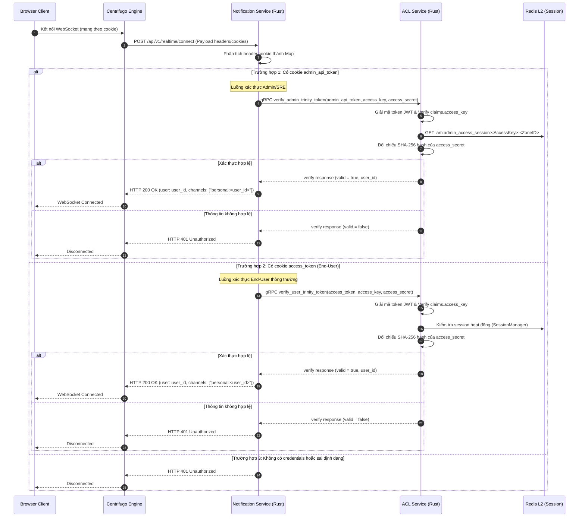

<!-- markdownlint-disable MD033 -->
# Realtime Centrifugo Connection Authentication - Workflow God View (Gateway-Centric architecture)

> [!NOTE]
> Tài liệu này đóng vai trò là **Source of Truth (SoT) / God View** cho luồng xác thực kết nối Realtime (Centrifugo Connect Authentication) của cả End-User và Admin/SRE.
> Mọi thay đổi về code liên quan đến xác thực kết nối, phân tách luồng qua cookie, distributed tracing và gọi gRPC verify trinity token đến ACL Service phải tuân thủ nghiêm ngặt đặc tả này.

---

## 🗺️ 1. Giới Thiệu

### 👥 Tài Liệu Dành Cho Ai?

Tài liệu được thiết kế cho các kỹ sư phát triển phân hệ Notification, đội ngũ chuyên viên Bảo mật và kỹ sư SRE chịu trách nhiệm đảm bảo tính khả dụng, tính HA (High Availability) và khả năng truy vết (Observability) của kết nối thời gian thực (Realtime Connection) trên môi trường Cloud-Native.

### ❓ Phân hệ Centrifugo Connect Authentication là gì?

Đây là quy trình xác thực ủy quyền kết nối (Connection Proxy) khi máy khách (Browser/Client) thực hiện thiết lập kết nối WebSocket/SSE đến cụm dịch vụ **Centrifugo Engine**.
Thay vì tự giải mã token và duy trì kết nối trực tiếp đến database/cache, Centrifugo thực hiện ủy thác kiểm tra quyền (Proxy Connect) qua giao thức HTTP POST đến **Notification Service**. Tại đây, yêu cầu sẽ được định danh, phân tách luồng bảo mật (Admin hoặc End-User) và chuyển tiếp xác thực qua kết nối mTLS gRPC tốc độ cao tới **ACL Service (Rust)**.

### 📍 Các Biên Công Nghệ Hoạt Động

- **Centrifugo Engine**: Đóng vai trò Realtime Pub/Sub Gateway, duy trì hàng ngàn kết nối WebSocket đồng thời và kích hoạt HTTP Connect Proxy đến biên `/api/v1/realtime/connect`.
- **Notification Service (Rust)**: Cung cấp API Handler `/api/v1/realtime/connect` để nhận dạng, thiết lập trace context và chuyển tiếp gRPC xác minh Trinity Token.
- **ACL Service (Rust)**: gRPC Server phục vụ xác thực các Trinity Credentials (JWT + Redis Session + Hash `access_secret`) hoàn toàn tại biên mà không làm phiền Go Controlplane.
- **Redis L2 (Runtime Sessions)**: Nơi lưu giữ thông tin session hiện tại phục vụ so khớp hash của `access_secret`.
- **OpenTelemetry Collector**: Thu thập trace và metric đo lường hiệu năng của toàn bộ luồng xác thực.

---

## 🔄 2. Sơ Đồ Kiến Trúc & Luồng Dữ Liệu (System Architecture)

```mermaid
graph TD
    classDef client fill:#332244,stroke:#8844ff,stroke-width:2px;
    classDef gateway fill:#112233,stroke:#3388ff,stroke-width:2px;
    classDef edgeService fill:#113322,stroke:#33cc88,stroke-width:2px;
    classDef storage fill:#333311,stroke:#cccc33,stroke-width:2px;

    Client["💻 Client (Browser/UI)"]:::client
    Centrifugo["⚡ Centrifugo Engine"]:::gateway
    Notification["✉️ Notification Service (Rust)"]:::edgeService
    ACL["🛡️ ACL Service (Rust)"]:::edgeService
    Redis[("⚡ Redis L2 (Session Store)")]:::storage

    Client -- "1. Yêu cầu kết nối WS/SSE" --> Centrifugo
    Centrifugo -- "2. HTTP POST proxy (Cookies/Headers)" --> Notification
    Notification -- "3. Verify Trinity Token (mTLS gRPC)" --> ACL
    ACL -- "4. Kiểm tra session & Secret Hash (L2)" --> Redis
    Notification -- "5. Response 200 OK + Channel ACL" --> Centrifugo
    Centrifugo -- "6. Thiết lập kết nối thành công" --> Client
```

---

## 🔍 3. Chi Tiết Các Nhánh Xử Lý (Processing Branches)

Mỗi khi nhận được yêu cầu kết nối từ Centrifugo, `Notification Service` sẽ trích xuất thông tin cookie để phân nhánh xử lý:

### 📌 Nhánh 1: Xác Thực Admin/SRE (Cookie `admin_api_token`)

- **Điều kiện kích hoạt**: Cookie chứa khóa `admin_api_token`.
- **Trích xuất thông tin**: Lấy bộ ba `admin_api_token`, `access_key`, và `access_secret`. Nếu thiếu bất kỳ thành phần nào, lập tức phản hồi `401 Unauthorized` và ghi access log.
- **Cuộc gọi gRPC**: Gọi đến `verify_admin_trinity_token` trên ACL Service.
- **Quy trình kiểm tra tại ACL**:
  1. Giải mã token stateless để lấy claims, so khớp `claims.access_key` với `access_key` truyền lên.
  2. Truy cập Redis L2 lấy thông tin session bằng key `iam:admin_access_session:<AccessKey>:<ZoneID>`.
  3. Băm `access_secret` thô bằng SHA-256, đối chiếu với `access_secret_hash` lưu trong session.
  4. Trả về thông tin trạng thái hợp lệ và định danh người dùng.

### 📌 Nhánh 2: Xác Thực End-User (Cookie `access_token`)

- **Điều kiện kích hoạt**: Cookie chứa khóa `access_token` và không có `admin_api_token`.
- **Trích xuất thông tin**: Lấy bộ ba `access_token`, `access_key`, và `access_secret`. Nếu thiếu, trả về `401 Unauthorized`.
- **Cuộc gọi gRPC**: Gọi đến `verify_user_trinity_token` trên ACL Service.
- **Quy trình kiểm tra tại ACL**:
  1. Giải mã token stateless, so khớp `claims.access_key` với `access_key` truyền lên.
  2. Truy cập Redis L2 lấy thông tin session bằng key `iam:user_access_session:<UserID>:<AccessKey>`.
  3. Băm `access_secret` thô bằng SHA-256, đối chiếu với `ash` lưu trong session.
  4. Trả về trạng thái hợp lệ, định danh người dùng và zone_id đang hoạt động.

### 📌 Nhánh Fallback: Trả lỗi 401 Unauthorized

- Nếu không tồn tại cả `admin_api_token` và `access_token` hoặc thông tin xác thực bị sai lệch, hệ thống từ chối trực tiếp với HTTP `401 Unauthorized` để ẩn giấu lý do chi tiết và chống tấn công brute-force/spam.

---

## 🛡️ 4. Tính HA, An Toàn Bảo Mật & Distributed Tracing

### ⚡ Thiết Kế Cloud-Native & High Availability (HA)

- **Connection Timeout**: Kết nối gRPC từ `Notification Service` đến `ACL Service` được thiết lập với cấu hình `connect_timeout` là 5 giây, `timeout` là 5 giây, và bật `tcp_keepalive` (15 giây) để ngăn chặn tháo nghẽn hoặc rò rỉ tài nguyên socket khi mạng chập chờn.
- **Lazy Connection**: Dịch vụ `Notification Service` khởi tạo kết nối gRPC dạng lazy (`connect_lazy()`), giúp tiến trình startup không bị chặn đứng nếu ACL Service chưa kịp khởi động hoặc đang cập nhật.

### 🔒 Phòng Chống Race Condition & Tấn Công Bảo Mật

- **Mảnh thứ ba Trinity**: Việc bắt buộc so khớp `access_secret` thô qua băm SHA-256 chống lại các cuộc tấn công đánh cắp cookie thông qua lỗ hổng XSS (do mảnh này có thể được bảo vệ bằng các cờ HttpOnly nghiêm ngặt).
- **Anti-Replay Attack**: So khớp chặt chẽ `claims.access_key` trong JWT (đã ký bằng Vault) với `access_key` thô từ cookie của client giúp ngăn chặn việc mạo danh hoặc phát lại phiên hoạt động cũ.

### 📈 Distributed Tracing & Giám Sát (Metrics)

- **Tracing Context**: Hệ thống trích xuất header `traceparent` từ Centrifugo (được lan truyền từ client ban đầu) thông qua W3C Trace Context.
- **gRPC metadata injection**: Bơm `traceparent` vào metadata của cuộc gọi gRPC sang ACL để duy trì một Span thống nhất trên toàn bộ kiến trúc microservices.
- **OTel Metrics & Access Logging**: Ghi nhận thời gian xử lý (latency), mã trạng thái HTTP/gRPC để đưa lên Prometheus/Grafana phục vụ công tác SRE.

---

## 🏛️ 5. Bản Đồ Tham Chiếu File Mã Nguồn (Implementation References)

- **Route Handler / Connect Endpoint**: [connect.rs](../../notification-service/src/handler/connect.rs) - Tiếp nhận HTTP POST Connect Proxy từ Centrifugo, phân tách cookie và thực hiện gRPC client calls.
- **gRPC client**: [grpc.rs](../../notification-service/src/infra/grpc.rs) - Khởi tạo gRPC client kết nối đến ACL Service và thực thi `verify_user_trinity_token` / `verify_admin_trinity_token`.
- **Dịch vụ gRPC phía ACL**: [auth.rs](../../acl/src/service/auth.rs) - Implement AuthService server lắng nghe và xác thực thông tin Trinity qua Redis và JWT.
- **Cấu hình Router**: [router.rs](../../notification-service/src/app/router.rs) - Cấu hình đường dẫn `/api/v1/realtime/connect`.
- **Cấu hình Endpoint**: [config.rs](../../notification-service/src/config.rs) - Nạp biến môi trường cho ACL gRPC endpoint và TLS certificates.
