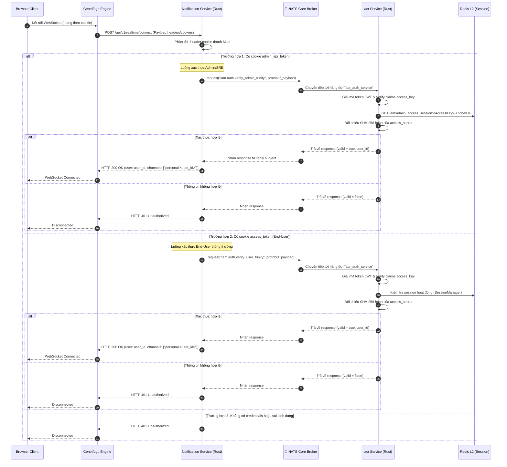

<!-- markdownlint-disable MD033 -->
# Realtime Centrifugo Connection Authentication - Workflow God View (NATS-Centric Architecture)

> [!NOTE]
> Tài liệu này đóng vai trò là **Source of Truth (SoT) / God View** cho luồng xác thực kết nối Realtime (Centrifugo Connect Authentication) của cả End-User và Admin/SRE.
> Mọi thay đổi về code liên quan đến xác thực kết nối, phân tách luồng qua cookie, distributed tracing và gọi NATS Request-Reply verify trinity token đến acr Service phải tuân thủ nghiêm ngặt đặc tả này.

---

## 🗺️ 1. Giới Thiệu

### 👥 Tài Liệu Dành Cho Ai?

Tài liệu được thiết kế cho các kỹ sư phát triển phân hệ Notification, đội ngũ chuyên viên Bảo mật và kỹ sư SRE chịu trách nhiệm đảm bảo tính khả dụng, tính HA (High Availability) và khả năng truy vết (Observability) của kết nối thời gian thực (Realtime Connection) trên môi trường Cloud-Native.

### ❓ Phân hệ Centrifugo Connect Authentication là gì?

Đây là quy trình xác thực ủy quyền kết nối (Connection Proxy) khi máy khách (Browser/Client) thực hiện thiết lập kết nối WebSocket/SSE đến cụm dịch vụ **Centrifugo Engine**.
Thay vì tự giải mã token và duy trì kết nối trực tiếp đến database/cache, Centrifugo thực hiện ủy thác kiểm tra quyền (Proxy Connect) qua giao thức HTTP POST đến **Notification Service**. Tại đây, yêu cầu sẽ được định danh, phân tách luồng bảo mật (Admin hoặc End-User) và chuyển tiếp xác thực qua hệ thống **NATS Core (Request-Reply Pattern)** tới **acr Service (Rust)**.

### 📍 Các Biên Công Nghệ Hoạt Động

- **Centrifugo Engine**: Đóng vai trò Realtime Pub/Sub Gateway, duy trì hàng ngàn kết nối WebSocket đồng thời và kích hoạt HTTP Connect Proxy đến biên `/api/v1/realtime/connect`.
- **Notification Service (Rust)**: Cung cấp API Handler `/api/v1/realtime/connect` để nhận dạng, thiết lập trace context và chuyển tiếp NATS Core Request-Reply xác minh Trinity Token.
- **acr Service (Rust)**: NATS Queue Subscriber lắng nghe trên hàng đợi `acr_auth_service` để phục vụ xác thực các Trinity Credentials (JWT + Redis Session + Hash `access_secret`) hoàn toàn tại biên.
- **Redis L2 (Runtime Sessions)**: Nơi lưu giữ thông tin session hiện tại phục vụ so khớp hash của `access_secret`.
- **OpenTelemetry Collector**: Thu thập trace và metric đo lường hiệu năng của toàn bộ luồng xác thực.

---

## 🔄 2. Sơ Đồ Kiến Trúc & Luồng Dữ Liệu (System Architecture)

```mermaid
graph TD
    classDef client fill:#332244,stroke:#8844ff,stroke-width:2px;
    classDef gateway fill:#112233,stroke:#3388ff,stroke-width:2px;
    classDef edgeService fill:#113322,stroke:#33cc88,stroke-width:2px;
    classDef storage fill:#333311,stroke:#cccc33,stroke-width:2px;
    classDef queue fill:#7c2d12,stroke:#ea580c,color:#ffffff,stroke-width:2px;

    Client["💻 Client (Browser/UI)"]:::client
    Centrifugo["⚡ Centrifugo Engine"]:::gateway
    Notification["✉️ Notification Service (Rust)"]:::edgeService
    NATS["🧲 NATS Core (Message Broker)"]:::queue
    acr["🛡️ acr Service (Rust)"]:::edgeService
    Redis[("⚡ Redis L2 (Session Store)")]:::storage

    Client -- "1. Yêu cầu kết nối WS/SSE" --> Centrifugo
    Centrifugo -- "2. HTTP POST proxy (Cookies/Headers)" --> Notification
    Notification -- "3. Request-Reply (Protobuf payload)" --> NATS
    NATS -- "4. Dispatch to queue group 'acr_auth_service'" --> acr
    acr -- "5. Kiểm tra session & Secret Hash (L2)" --> Redis
    acr -- "6. Reply (Protobuf response)" --> NATS
    NATS -- "7. Return verify result" --> Notification
    Notification -- "8. Response 200 OK + Channel 'personal:<user_id>'" --> Centrifugo
    Centrifugo -- "9. Thiết lập kết nối thành công" --> Client
```

---

## 🔍 3. Chi Tiết Các Nhánh Xử Lý (Processing Branches)

Mỗi khi nhận được yêu cầu kết nối từ Centrifugo, `Notification Service` sẽ trích xuất thông tin cookie để phân nhánh xử lý:

---

## ⚙️ 4. Chi Tiết Giao Thức NATS Request-Reply (NATS RPC)

Để thay thế gRPC truyền thống và tăng khả năng mở rộng (Scale-Out) linh hoạt, hệ thống sử dụng giao thức **NATS Request-Reply** qua Protobuf Serialization.

### 4.1 Định Nghĩa Chủ Đề (Subjects) và Ràng Buộc (Queue Groups)
- **Subject cho User**: `iam.auth.verify_user_trinity`
- **Subject cho Admin**: `iam.auth.verify_admin_trinity`
- **Queue Group**: `acr_auth_service`. Việc đăng ký queue group giúp NATS tự động phân phối tải (Load Balancing) dạng tròn (Round-Robin) tới các replicas của `acr` container, tránh tình trạng quá tải hoặc nghẽn cổ chai.

### 4.2 Cấu trúc Payload Protobuf
- **User Request**: `VerifyUserTrinityTokenRequest` chứa `access_token`, `access_key`, và `access_secret`.
- **User Response**: `VerifyUserTrinityTokenResponse` trả về cờ `valid` và thông tin `user_id`, `zone_id`.
- **Admin Request**: `VerifyAdminTrinityTokenRequest` chứa `access_token` (chính là `admin_api_token`), `access_key`, và `access_secret`.
- **Admin Response**: `VerifyAdminTrinityTokenResponse` trả về `valid`, `admin_id`.

---

## 🛡️ 5. Tính HA, An Toàn Bảo Mật & Distributed Tracing

### ⚡ Thiết Kế Cloud-Native & High Availability (HA)
- **Timeout bảo vệ**: Yêu cầu NATS Request-Reply được bọc bởi cơ chế timeout ở phía client (Notification Service) để tránh việc luồng kết nối bị treo vô hạn nếu hệ thống NATS hoặc acr service gặp sự cố gián đoạn.
- **Tính phi trạng thái (Stateless Core)**: Cả `Notification Service` và `acr` đều chạy hoàn toàn phi trạng thái, sẵn sàng co giãn (autoscaling) theo tải lượng WebSocket.

### 🔒 Phòng Chống Race Condition & Tấn Công Bảo Mật
- **Mảnh thứ ba Trinity**: Việc bắt buộc so khớp `access_secret` thô qua băm SHA-256 chống lại các cuộc tấn công đánh cắp cookie thông qua lỗ hổng XSS (do mảnh này được bảo vệ bằng các cờ HttpOnly nghiêm ngặt).
- **Anti-Replay Attack**: So khớp chặt chẽ `claims.access_key` trong JWT (đã ký bằng Vault) với `access_key` thô từ cookie của client giúp ngăn chặn việc mạo danh hoặc phát lại phiên hoạt động cũ.

### 📈 Distributed Tracing & Giám Sát (Metrics)
- **Tracing Context**: Hệ thống trích xuất header `traceparent` từ Centrifugo (được lan truyền từ client ban đầu) thông qua W3C Trace Context để đo lường độ trễ E2E.
- **OTel Metrics**: Theo dõi chi tiết số lượng cuộc gọi NATS, trạng thái thành công/thất bại và latency thông qua `record_nats_call` trong Prometheus.

---

## 🏛️ 6. Bản Đồ Tham Chiếu File Mã Nguồn (Implementation References)

- **Route Handler / Connect Endpoint**: [connect.rs](../../notification-service/src/handler/connect.rs) - Tiếp nhận HTTP POST Connect Proxy từ Centrifugo, phân tách cookie và gọi NATS.
- **User Verification Service**: [user.rs](../../notification-service/src/service/auth/user.rs) - Thực thi serialize Protobuf và gọi `nats_client.request` trên subject `iam.auth.verify_user_trinity`.
- **Admin Verification Service**: [admin.rs](../../notification-service/src/service/auth/admin.rs) - Thực thi serialize Protobuf và gọi `nats_client.request` trên subject `iam.auth.verify_admin_trinity`.
- **acr NATS Router**: [pubsub.rs](../../acr/src/transport/pubsub.rs) - Khởi tạo Queue Subscription `acr_auth_service` để nhận sự kiện, giải mã payload và phản hồi.
- **acr Session Validator**: [auth.rs](../../acr/src/service/auth.rs) - Chứa các phương thức xử lý nghiệp vụ đối chiếu Redis và giải mã JWT token.
- **Cấu hình Router**: [router.rs](../../notification-service/src/app/router.rs) - Cấu hình đường dẫn `/api/v1/realtime/connect`.
- **Cấu hình Centrifugo**: [config.json](../../controlplane/dev/centrifugo/config.json) - Cấu hình Connect Proxy Endpoint và danh sách headers được uỷ quyền.
