<!-- markdownlint-disable MD033 -->
# Realtime Centrifugo Connection Authentication - Workflow God View

> [!NOTE]
> Tài liệu này đóng vai trò là **Source of Truth (SoT) / God View** cho luồng xác thực kết nối Realtime (Centrifugo Connect Authentication) của cả End-User và Admin/SRE.
> Mọi thay đổi về code liên quan đến xác thực kết nối, phân tách luồng qua cookie, distributed tracing và Shared Redis Request-Reply verify Trinity token đến ACR phải tuân thủ đặc tả này.

---

## 🗺️ 1. Giới Thiệu

### 👥 Tài Liệu Dành Cho Ai?

Tài liệu được thiết kế cho các kỹ sư phát triển phân hệ Notification, đội ngũ chuyên viên Bảo mật và kỹ sư SRE chịu trách nhiệm đảm bảo tính khả dụng, tính HA (High Availability) và khả năng truy vết (Observability) của kết nối thời gian thực (Realtime Connection) trên môi trường Cloud-Native.

### ❓ Phân hệ Centrifugo Connect Authentication là gì?

Đây là quy trình xác thực ủy quyền kết nối (Connection Proxy) khi máy khách (Browser/Client) thực hiện thiết lập kết nối WebSocket/SSE đến cụm dịch vụ **Centrifugo Engine**.
Thay vì tự giải mã token và duy trì kết nối trực tiếp đến session store, Centrifugo ủy thác kiểm tra quyền qua HTTP POST đến **Notification Service**. Notification phân tách Admin/End-User và gọi **ACR** qua Shared L2 Redis Request-Reply. JO kết thúc NATS Core Central-Zone; Notification nhận realtime nội vùng Central qua Shared Redis Pub/Sub, tách khỏi auth request path.

### 📍 Các Biên Công Nghệ Hoạt Động

- **Centrifugo Engine**: Đóng vai trò Realtime Pub/Sub Gateway, duy trì hàng ngàn kết nối WebSocket đồng thời và kích hoạt HTTP Connect Proxy đến biên `/api/v1/realtime/connect`.
- **Notification Service (Rust)**: Cung cấp `/api/v1/realtime/connect`, parse cookie và gửi `request_id[16] || protobuf` qua Shared Redis.
- **ACR (Rust)**: Shared Redis subscriber xác thực Trinity Credentials bằng Vault + Auth-State Redis.
- **Shared L2 Redis**: Chỉ làm Pub/Sub request/reply và distributed dispatch lock nội vùng Central.
- **Auth-State Redis DB0**: Lưu session binary và hash của `access_secret`; không chia credential này cho Notification.
- **OpenTelemetry Collector**: Thu thập trace và metric đo lường hiệu năng của toàn bộ luồng xác thực.

---

## 🔄 2. Sơ Đồ Kiến Trúc & Luồng Dữ Liệu (System Architecture)

```mermaid
graph TD
    classDef client fill:#332244,stroke:#8844ff,stroke-width:2px;
    classDef gateway fill:#112233,stroke:#3388ff,stroke-width:2px;
    classDef edgeService fill:#113322,stroke:#33cc88,stroke-width:2px;
    classDef storage fill:#333311,stroke:#cccc33,stroke-width:2px;
    classDef queue fill:#7c2d12,stroke:#ea580c,color:#ffffff,stroke-width:2px;

    Client["💻 Client (Browser/UI)"]:::client
    Centrifugo["⚡ Centrifugo Engine"]:::gateway
    Notification["✉️ Notification Service (Rust)"]:::edgeService
    SharedRedis["⚡ Shared L2 Redis"]:::queue
    acr["🛡️ acr Service (Rust)"]:::edgeService
    AuthRedis[("🔐 Auth-State Redis DB0")]:::storage

    Client -- "1. Yêu cầu kết nối WS/SSE" --> Centrifugo
    Centrifugo -- "2. HTTP POST proxy (Cookies/Headers)" --> Notification
    Notification -- "3. PUBLISH request_id + Protobuf" --> SharedRedis
    SharedRedis -- "4. Fan-out; SETNX chọn một ACR" --> acr
    acr -- "5. Kiểm tra session & Secret Hash" --> AuthRedis
    acr -- "6. PUBLISH request-scoped reply" --> SharedRedis
    SharedRedis -- "7. Return verify result" --> Notification
    Notification -- "8. Response 200 OK + Channel 'personal:<user_id>'" --> Centrifugo
    Centrifugo -- "9. Thiết lập kết nối thành công" --> Client
```



---

## 🔍 3. Chi Tiết Các Nhánh Xử Lý (Processing Branches)

Mỗi khi nhận được yêu cầu kết nối từ Centrifugo, `Notification Service` sẽ trích xuất thông tin cookie để phân nhánh xử lý:

```mermaid
sequenceDiagram
    autonumber
    participant UI as Browser Client
    participant CF as Centrifugo Engine
    participant NS as Notification Service (Rust)
    participant SharedRedis as Shared L2 Redis
    participant acr as acr Service (Rust)
    participant AuthRedis as Auth-State Redis DB0

    UI->>CF: Kết nối WebSocket (mang theo cookie)
    CF->>NS: POST /api/v1/realtime/connect (Payload headers/cookies)
    NS->>NS: Phân tích header cookie thành Map

    alt Trường hợp 1: Có cookie admin_api_token
        Note over NS: Luồng xác thực Admin/SRE
        NS->>SharedRedis: SUB reply.request_id; PUBLISH request_id[16] + protobuf
        SharedRedis->>acr: Fan-out iam.auth.verify_admin_trinity
        acr->>SharedRedis: SETNX dispatch lock by request_id
        acr->>acr: Giải mã token JWT & Verify claims.access_key
        acr->>AuthRedis: GET iam:admin_access_session:<AccessKey>:<ZoneID>
        acr->>acr: Đối chiếu SHA-256 hash của access_secret
        alt Xác thực hợp lệ
            acr-->>SharedRedis: Reply request-scoped (valid = true, admin_id)
            SharedRedis-->>NS: Nhận response
            NS-->>CF: HTTP 200 OK (user: user_id, channels: ["personal:<user_id>"])
            CF-->>UI: WebSocket Connected
        else Thông tin không hợp lệ
            acr-->>SharedRedis: Reply request-scoped (valid = false)
            SharedRedis-->>NS: Nhận response
            NS-->>CF: HTTP 401 Unauthorized
            CF-->>UI: Disconnected
        end

    else Trường hợp 2: Có cookie access_token (End-User)
        Note over NS: Luồng xác thực End-User thông thường
        NS->>SharedRedis: SUB reply.request_id; PUBLISH request_id[16] + protobuf
        SharedRedis->>acr: Fan-out iam.auth.verify_user_trinity
        acr->>SharedRedis: SETNX dispatch lock by request_id
        acr->>acr: Giải mã token JWT & Verify claims.access_key
        acr->>AuthRedis: Kiểm tra session hoạt động (SessionManager)
        acr->>acr: Đối chiếu SHA-256 hash của access_secret
        alt Xác thực hợp lệ
            acr-->>SharedRedis: Trả request-scoped response (valid = true, user_id)
            SharedRedis-->>NS: Nhận response
            NS-->>CF: HTTP 200 OK (user: user_id, channels: ["personal:<user_id>"])
            CF-->>UI: WebSocket Connected
        else Thông tin không hợp lệ
            acr-->>SharedRedis: Trả request-scoped response (valid = false)
            SharedRedis-->>NS: Nhận response
            NS-->>CF: HTTP 401 Unauthorized
            CF-->>UI: Disconnected
        end

    else Trường hợp 3: Không có credentials hoặc sai định dạng
        NS-->>CF: HTTP 401 Unauthorized
        CF-->>UI: Disconnected
    end
```

---

## ⚙️ 4. Chi Tiết Giao Thức Shared Redis Request-Reply

Notification duy trì một Pub/Sub reply socket cho cả pod. Mỗi request đăng ký oneshot waiter trước khi publish để không bị lost wake-up.

### 4.1 Channels và envelope

- User request: `iam.auth.verify_user_trinity`; reply prefix: `iam.auth.verify_user_trinity.reply.`
- Admin request: `iam.auth.verify_admin_trinity`; reply prefix: `iam.auth.verify_admin_trinity.reply.`
- Request bytes: UUID request ID đúng 16 bytes nối với Protobuf.
- Mọi ACR replica nhận broadcast. `SET NX iam:acr:dispatch:{channel}:{request_id}` TTL 30 giây chọn một winner.
- Notification kiểm tra subscriber count và timeout 5 giây; Redis lỗi/no subscriber/timeout đều fail-close.

### 4.2 Cấu trúc Payload Protobuf
- **User Request**: `VerifyUserTrinityTokenRequest` chứa `access_token`, `access_key`, và `access_secret`.
- **User Response**: `VerifyUserTrinityTokenResponse` trả về cờ `valid` và thông tin `user_id`, `zone_id`.
- **Admin Request**: `VerifyAdminTrinityTokenRequest` chứa `access_token` (chính là `admin_api_token`), `access_key`, và `access_secret`.
- **Admin Response**: `VerifyAdminTrinityTokenResponse` trả về `valid`, `admin_id`.

---

## 🛡️ 5. Tính HA, An Toàn Bảo Mật & Distributed Tracing

### ⚡ Thiết Kế Cloud-Native & High Availability (HA)
- **Timeout bảo vệ**: Request timeout 5 giây; không có fallback tự verify tại Notification.
- **Redis failover**: Reply router tự reconnect. Request đang bay trong reconnect window được phép timeout, client WebSocket retry tạo request ID mới.
- **HA dispatch**: ACR replicas nhận broadcast nhưng chỉ distributed-lock winner chạm Auth Redis/Vault.
- **Tính phi trạng thái (Stateless Core)**: Cả `Notification Service` và `acr` đều chạy hoàn toàn phi trạng thái, sẵn sàng co giãn (autoscaling) theo tải lượng WebSocket.

### 🔒 Phòng Chống Race Condition & Tấn Công Bảo Mật
- **Mảnh thứ ba Trinity**: Việc bắt buộc so khớp `access_secret` thô qua băm SHA-256 chống lại các cuộc tấn công đánh cắp cookie thông qua lỗ hổng XSS (do mảnh này được bảo vệ bằng các cờ HttpOnly nghiêm ngặt).
- **Anti-Replay Attack**: So khớp chặt chẽ `claims.access_key` trong JWT (đã ký bằng Vault) với `access_key` thô từ cookie của client giúp ngăn chặn việc mạo danh hoặc phát lại phiên hoạt động cũ.

### 📈 Distributed Tracing & Giám Sát (Metrics)
- **Tracing Context**: Hệ thống trích xuất header `traceparent` từ Centrifugo (được lan truyền từ client ban đầu) thông qua W3C Trace Context để đo lường độ trễ E2E.
- **OTel Metrics**: Auth call dùng `notification_shared_redis_calls_total` và `notification_shared_redis_call_duration_seconds`; realtime listener nội vùng Central dùng metric Shared Redis. Label phải thuộc tập hữu hạn theo [Telemetry God View](telemetry_god_view.md).

---

## 🏛️ 6. Bản Đồ Tham Chiếu File Mã Nguồn (Implementation References)

- **Route Handler / Connect Endpoint**: [connect.rs](../../notification-service/src/handler/connect.rs).
- **Notification Shared Redis Bus**: [shared_redis.rs](../../notification-service/src/infra/shared_redis.rs).
- **User/Admin Verification Service**: [user.rs](../../notification-service/src/service/auth/user.rs), [admin.rs](../../notification-service/src/service/auth/admin.rs).
- **ACR Shared Redis Router**: [redis.rs](../../acr/src/transport/redis.rs).
- **ACR Session Validator**: [verify.rs](../../acr/src/user/verify.rs), [verify.rs](../../acr/src/sre/verify.rs).
- **Cấu hình Router**: [router.rs](../../notification-service/src/app/router.rs) - Cấu hình đường dẫn `/api/v1/realtime/connect`.
- **Cấu hình Centrifugo**: [config.json](../../controlplane/dev/centrifugo/config.json) - Cấu hình Connect Proxy Endpoint và danh sách headers được uỷ quyền.
