# Notification Service Runtime Topology God View

> Source of Truth cho ownership, lifecycle và failure semantics của
> Notification Service. Service này là realtime delivery boundary; nó không
> sở hữu business state và không kết nối NATS, PostgreSQL, Vault hoặc Zone KV.

## Topology

```mermaid
flowchart LR
    CF["Centrifugo"] -->|POST connect| HTTP["inbound/connect"]
    HTTP --> AUTH["application/auth"]
    AUTH -->|request/reply| RB["infra/redis/auth_bus"]
    RB -->|Shared Redis Pub/Sub| ACR["ACR"]

    JO["Job Orchestrator"] -->|XADD durable notification| JS["Shared Redis Stream"]
    JS --> STREAM["inbound/job_stream"]
    STREAM --> JOB["application/job_notifications"]

    JO2["JO / Central producers"] -->|soft-state publish| PS["Shared Redis Pub/Sub"]
    PS --> REALTIME["inbound/realtime_pubsub"]
    REALTIME --> RUNTIME["application/runtime_updates"]

    JOB --> PORT["RealtimePublisher port"]
    RUNTIME --> PORT
    PORT -->|jobs:<user_id>| JC["jobs channel"]
    PORT -->|runtime:<user_id>| RC["runtime channel"]
    JC --> CF
    RC --> CF
```

## Ownership boundaries

- `inbound/connect.rs` chỉ parse bounded HTTP input, lấy cookie/header đã được
  Centrifugo forward và map application result thành HTTP response.
- `application/auth.rs` quyết định admin/user credential flow và channel grant.
  Nó không biết Redis command hay Centrifugo HTTP.
- `application/job_notifications.rs` owns durable job notification delivery.
  It publishes only to `jobs:{user_id}`.
- `application/runtime_updates.rs` validates soft-state payloads and publishes
  only to `runtime:{user_id}`.
  Job và runtime đi ra hai channel độc lập; service không quyết định job result
  hoặc resource ownership.
- `infra/redis/auth_bus.rs` sở hữu Shared Redis auth request/reply và reply
  router. Request waiter có giới hạn; timeout là fail-closed.
- `infra/centrifugo.rs` là adapter duy nhất giữ Centrifugo API credential.
- `inbound/job_stream.rs` sở hữu PEL/XCLAIM, ordering, ACK/XDEL và consumer
  reconnect. Đây là at-least-once; crash sau publish trước ACK có thể tạo
  duplicate, nên `notification_id` phải ổn định.
- `inbound/realtime_pubsub.rs` chỉ xử lý soft-state wake-up. Disconnect có thể
  mất message; snapshot/API authoritative phải phục hồi trạng thái.

## Lifecycle và HA

- `app/bootstrap.rs` tạo dependency graph và giữ các task handle.
- Reply router, job Stream consumer và realtime Pub/Sub consumer đều nhận
  cancellation watch channel.
- Startup thiếu Redis/Centrifugo/OTel endpoint bắt buộc sẽ fail-fast; không có
  fake endpoint hoặc fallback credential.
- Shutdown dừng inbound workers sau khi HTTP drain, chờ bounded timeout, rồi
  abort task còn treo. OTel flush diễn ra sau runtime drain trong `main`.
- Reconnect dùng bounded exponential backoff; không tạo một task detached
  không thể quan sát.

## Security và observability invariants

- Không log raw cookie, token, request body, Centrifugo API key hoặc customer
  payload chưa allowlist.
- User/admin ID phải là UUID trước khi tạo `jobs:<user_id>` và `runtime:<user_id>`.
- Connect body bị giới hạn 64 KiB; realtime envelope bị giới hạn 256 KiB.
- Metrics dùng label tập hữu hạn; telemetry failure không chặn delivery path.
- Notification Service không trở thành business SoT: Redis Stream/PubSub chỉ là
  transport/delivery buffer, còn business state thuộc producer và Controlplane.
