# Notification Service Runtime Topology God View

> Source of Truth cho ownership, lifecycle và failure semantics của
> Notification Service. Service này không sở hữu business aggregate, nhưng sở
> hữu durable self-user timeline trong ScyllaDB và không kết nối NATS,
> PostgreSQL, Vault hoặc Zone KV.

## Topology

```mermaid
flowchart LR
    CF["Centrifugo"] -->|POST connect| HTTP["inbound/connect"]
    HTTP --> AUTH["application/auth"]
    AUTH -->|request/reply| RB["infra/redis/auth_bus"]
    RB -->|Shared Redis Pub/Sub| ACR["ACR"]

    JO["Job Orchestrator"] -->|XADD durable job notification| JS["Shared Redis Stream"]
    JS --> STREAM["inbound/job_stream"]
    STREAM --> JOB["application/job_notifications"]
    ACTOR["ACR / Central producers"] -->|XADD protobuf activity| AS["Shared Redis activity stream"]
    AS --> ASTREAM["inbound/activity_stream"]
    ASTREAM --> ACT["timeline/activity"]

    JO2["JO / Central producers"] -->|soft-state publish| PS["Shared Redis Pub/Sub"]
    PS --> REALTIME["inbound/realtime_pubsub"]
    REALTIME --> RUNTIME["application/runtime_updates"]

    JOB --> PORT["RealtimePublisher port"]
    RUNTIME --> PORT
    JOB --> STORE["Scylla timeline + inbox projections"]
    ACT --> STORE
    STORE --> API["/api/v1/me/activities + /notifications"]
    PORT -->|notifications:<user_id>| JC["notifications channel"]
    PORT -->|runtime:<user_id>| RC["runtime channel"]
    JC --> CF
    RC --> CF
```

## Ownership boundaries

- `inbound/connect.rs` chỉ parse bounded HTTP input, lấy cookie/header đã được
  Centrifugo forward và map application result thành HTTP response.
- `application/auth.rs` quyết định admin/user credential flow và channel grant.
  Nó không biết Redis command hay Centrifugo HTTP.
- `application/job_notifications.rs` owns durable job notification delivery:
  it writes Scylla activity/inbox projections before publishing only to
  `notifications:{user_id}`. Với Managed Service, một operation có một stable
  timeline identity: `PROCESSING` tạo projection, terminal result update cùng
  identity và không tạo activity/inbox mới theo status hay attempt.
- `inbound/activity_stream.rs` owns self-user activity ingestion. It persists
  history only; it never publishes every audit event to Centrifugo.
- `application/runtime_updates.rs` validates soft-state payloads and publishes
  only to `runtime:{user_id}`.
  Job và runtime đi ra hai channel độc lập; service không quyết định job result
  hoặc resource ownership.
- `infra/redis/auth_bus.rs` sở hữu Shared Redis auth request/reply và reply
  router. Request waiter có giới hạn; timeout là fail-closed.
- `infra/centrifugo.rs` là adapter duy nhất giữ Centrifugo API credential.
- `inbound/job_stream.rs` và `inbound/activity_stream.rs` sở hữu PEL/XCLAIM,
  ordering, ACK/XDEL và reconnect. Đây là at-least-once; activity poison
  records được ghi quarantine metadata trước ACK, không sao chép raw payload.
- Scylla writes converge theo `(user_id, month_bucket, occurred_at, event_id)`
  và `(user_id, month_bucket, created_at, notification_id)`. Job terminal event
  của Managed Service giữ `created_at`/`occurred_at` từ `PROCESSING`, chỉ upsert
  mutable status fields với `status_version` monotonic và không xóa `read_at`.
  A crash giữa projections giữ Redis entry pending để repair.
- `inbound/realtime_pubsub.rs` chỉ xử lý soft-state wake-up. Disconnect có thể
  mất message; snapshot/API authoritative phải phục hồi trạng thái.

### Managed Service boundary — no customer runtime relay

Managed Service không thêm `RealtimeKind`, Redis Pub/Sub producer hay
`runtime:<user_id>` channel vào Notification Service. V1 không có Dataplane/JO NATS
runtime protocol cho Managed Service; nó không được relay sang Notification,
Centrifugo, Zone Public Edge hoặc Browser.

Customer-facing runtime logs/metrics/events là Zone-local Victoria read path qua
generic `zone-runtime-stream` và Zone Public Edge, nằm ngoài Notification topology.
`PROCESSING → SUCCESS|FAILED` vẫn là job notification durable path duy nhất: JO XADD
`stream:{job_notifications}`, Notification upsert cùng một Scylla timeline/inbox
identity, rồi publish `notifications:<user_id>`. Đây là business completion; Victoria
stream không tạo, sửa hoặc xác nhận timeline/operation state.

## Lifecycle và HA

- `app/bootstrap.rs` tạo dependency graph và giữ các task handle.
- Reply router, job Stream consumer và realtime Pub/Sub consumer đều nhận
  cancellation watch channel.
- Startup thiếu Redis/Centrifugo/Scylla/OTel endpoint bắt buộc sẽ fail-fast;
  không có fake endpoint hoặc fallback credential. Schema auto-create chỉ dành
  cho dev; production đặt `SCYLLA_AUTO_SCHEMA=false`.
- Shutdown dừng inbound workers sau khi HTTP drain, chờ bounded timeout, rồi
  abort task còn treo. OTel flush diễn ra sau runtime drain trong `main`.
- Reconnect dùng bounded exponential backoff; không tạo một task detached
  không thể quan sát.

## Security và observability invariants

- Không log raw cookie, token, request body, Centrifugo API key hoặc customer
  payload chưa allowlist.
- User/admin ID phải là UUID trước khi tạo `notifications:<user_id>` và
  `runtime:<user_id>`. API timeline không nhận `user_id` từ client.
- Connect body bị giới hạn 64 KiB; realtime envelope bị giới hạn 256 KiB.
- Metrics dùng label tập hữu hạn; telemetry failure không chặn delivery path.
- Notification Service không trở thành business aggregate SoT: Scylla chỉ lưu
  immutable self-user history/inbox projections; Redis Stream/PubSub là
  transport/delivery buffer, còn business state thuộc producer và Controlplane.
