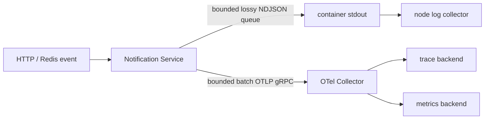

# Notification Telemetry God View

> Source of Truth cho đường log, trace và metric của Notification Service. Telemetry
> là diagnostic path; không được trở thành command path hoặc durable business state.

## Topology

- Log chỉ ghi một lần ra `stdout` dưới dạng NDJSON thật. Node collector chịu trách
  nhiệm vận chuyển; ứng dụng không đồng thời export OTLP Logs để tránh duplicate.
- Trace và metric đi OTLP gRPC. Collector chậm hoặc mất kết nối không được chặn
  request, Redis consumer hay Centrifugo publish.
- Mỗi process boot có `service.instance.id` mới. Resource chung gồm
  `service.namespace`, `service.name`, `service.version`,
  `deployment.environment.name`, `host.name`, `process.pid` và Central scope.

## Performance, backpressure và failure semantics

- Log writer dùng queue hữu hạn, mặc định 16,384 dòng, lossy khi đầy. Drop được
  ghi nhận bằng `notification_telemetry_events_total{signal="log",outcome="dropped"}`.
- Warn/error lặp cùng operation được rate-limit bằng bảng atomic hữu hạn; số bị
  chặn có outcome `suppressed`. Không có mutex hay map tăng không giới hạn trên
  đường request/job.
- Message/error/route có giới hạn byte và luôn được JSON serializer escape. Không
  log toàn bộ `Config`, credential, cookie, token, plaintext secret hoặc raw envelope.
- Default filter giữ dependency ở `warn` và service ở `APP_LOG_LEVEL`; access log
  có contract riêng nên không nhân đôi toàn bộ Tower/hyper INFO event ra stdout.
- Batch trace mặc định queue 8,192, batch 512, delay 500 ms, một exporter đồng
  thời và timeout 5 giây. Queue đầy được phép mất trace, không backpressure workload.
- Root trace dùng parent-based ratio sampling mặc định 10%; quyết định sampled
  của remote parent luôn được bảo toàn. Có thể tune bằng environment nhưng không
  thêm business ID vào metric label.
- Metric label được normalize thành tập hữu hạn. Route động, status code chính
  xác và payload/customer/resource ID không được dùng làm metric dimension.

## Shutdown và HA

`TelemetryGuard` sống trong `main`. SIGINT/SIGTERM dừng nhận request, đợi Axum
drain, sau đó flush trace/metric với timeout hữu hạn và cuối cùng mới đóng log
writer. Mỗi replica có pipeline độc lập; không có distributed lock và không có
cross-pod shared memory trong observability.

Observability exporter lỗi là fail-open đối với business traffic và phát log
rate-limited. Health/trace/metric có thể mất hoặc stale; không được dùng để xác
nhận durable completion, cấp quyền hoặc tính tiền.

## Known implementation debt ngoài telemetry core

- Connect input hiện được parse bằng bounded Axum JSON extraction trong
  `inbound/connect.rs`; payload/cookie/token không được ghi raw ra log.
- Connect, Redis Stream, Redis Pub/Sub và Centrifugo đều dùng OTel `Context`
  chuẩn; không còn task-local trace compatibility state trên hot path.

## Environment contract

| Variable | Default | Boundary |
|---|---:|---:|
| `APP_LOG_BUFFERED_LINES` | 16384 | 1024..262144 |
| `APP_LOG_MAX_FIELD_BYTES` | 16384 | 256..262144 |
| `APP_LOG_WARN_RATE_LIMIT_MS` | 1000 | 0..60000 |
| `OTEL_TRACE_SAMPLE_RATIO` | 0.10 | 0..1 |
| `OTEL_TRACE_MAX_QUEUE_SIZE` | 8192 | 512..262144 |
| `OTEL_TRACE_MAX_EXPORT_BATCH_SIZE` | 512 | 1..queue |
| `OTEL_TRACE_SCHEDULED_DELAY_MS` | 500 | 50..10000 |
| `OTEL_EXPORT_TIMEOUT_SECS` | 5 | 1..30 |
| `OTEL_METRIC_EXPORT_INTERVAL_SECS` | 15 | 5..300 |

## Implementation references

- Runtime ownership: `notification-service/src/observability/mod.rs`
- NDJSON hot path: `notification-service/src/observability/logs.rs`
- W3C propagation and span helpers: `notification-service/src/observability/traces.rs`
- Low-cardinality instruments: `notification-service/src/observability/metrics.rs`
- Graceful shutdown owner: `notification-service/src/main.rs`
