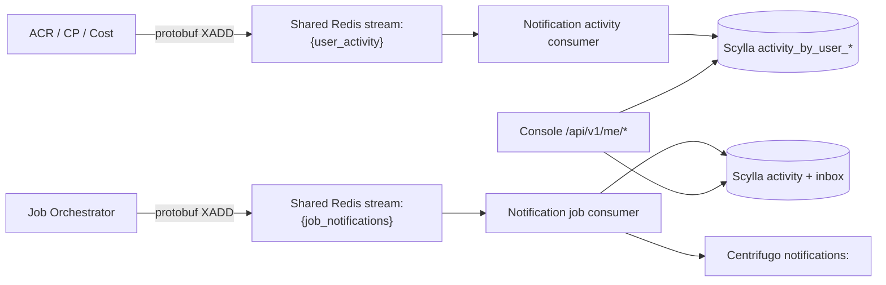

# User Timeline and Notification History God View

> Source of Truth cho lịch sử hành vi self-user và job notification. Đây là
> projection phục vụ Console; không phải IAM, billing hay resource aggregate SoT.

## API scope and edge-routing contract

Timeline API là `/me` self-user flow. ACR derives the sole subject from verified
`x-user-id`, preserves `/api/v1/me/**`, does not set `x-original-path`, and
never rewrites to `/personal` or `/tenant`. Controlplane does not run a
permission/level owner authorizer; storage queries are constrained by that
verified user ID. Critical self endpoints, if added, require session proof at
ACR without changing this route or authority rule.

## Hai luồng, hai durability boundary

- `user_activity` ghi lịch sử hành vi như login, password change, resource
  mutation hoặc top-up. Mặc định chỉ lưu Scylla, không bắn Centrifugo.
- `job_notifications` ghi activity và notification inbox trước khi publish
  realtime. `notification_id` là stable UUID bắt buộc, duplicate publish sau
  crash phải converge idempotent.
- `hypervisor.vm.delete` chỉ được JO enqueue sau khi provider deletion đã được
  xác nhận và transaction xóa VM row đã commit. Enqueue lỗi giữ Kafka result
  chưa settle; Notification Service persist activity + inbox theo durable
  `actor_user_id` mà Controlplane đã pin từ verified session, rồi mới publish
  `notifications:<user_id>` qua Centrifugo.
- Managed Service result events dùng immutable `command_event_id` làm
  `notification_id`: `PROCESSING` tạo record, `SUCCESS`/`FAILED` update cùng record;
  status hay attempt không tạo record mới.
- Runtime read không đi qua Notification Service hoặc Centrifugo. Browser xin
  assertion ngắn hạn tại ACR rồi gọi trực tiếp Zone Public Edge; Zone kiểm tra
  assertion/replay trước khi stream SSE. `PROCESSING → SUCCESS|FAILED` ở đây chỉ
  là timeline durable và `notifications:<user_id>` wake-up của module.

## Scylla model

- Activity partition: `((user_id, month_bucket), occurred_at DESC, event_id DESC)`.
- Category query dùng projection `activity_by_user_category_month`.
- Inbox partition: `((user_id, month_bucket), created_at DESC, notification_id DESC)`.
- Với Managed Service timeline, `occurred_at`/`created_at` được pin tại event
  `PROCESSING` và dùng lại cho terminal update, nên primary key luôn là cùng row.
- Managed Service `status_version = delivery_epoch * 2 + rank`, với PROCESSING rank
  1 và terminal rank 2. Scylla dùng explicit write timestamp
  `created_at_micros + status_version`; vì vậy pending Redis entry hoặc delivery epoch
  cũ đến muộn không thể hạ terminal/newer-retry row. Update không ghi đè inbox
  `read_at`.
- Managed Service Centrifugo payload dùng `notification_id=command_event_id` làm
  stable timeline identity, cùng `status_version`, `operation_id` và `resource_id`.
  Console fence theo `(notification_id, status_version)`, nhận event như wake-up rồi
  rehydrate API authoritative; status/attempt không tạo browser timeline item mới.
- TTL bị giới hạn bằng config; TWCS giới hạn tombstone/compaction cost.
- API cursor chứa month, timestamp và id; predicate tuple giữ ordering khi nhiều
  event cùng millisecond và scan tháng cũ theo budget.
- `inbox_state_by_user.read_before` hỗ trợ mark-all mà không cần rewrite toàn bộ
  partitions.

## Security and failure semantics

- Timeline API chỉ lấy subject từ `x-user-id` đã được ACR xác minh và overwrite;
  client không được chọn `user_id`. Centrifugo connect là workflow khác: handler
  chuyển cookie tới `ConnectAuthorizer`, fail closed khi ACR từ chối, unavailable
  hoặc trả reply sai protocol, và chỉ cấp `notifications:<user_id>`.
- Activity metadata bị giới hạn 16 KiB và không được chứa token, secret hoặc
  raw customer payload.
- Redis consumer ACK chỉ sau Scylla durability; lỗi dependency giữ PEL để retry.
  Managed Service terminal upsert thắng write timestamp của PROCESSING để entry cũ
  hoặc result stale không ghi đè terminal state. Poison contract của cả job/activity
  được quarantine
  metadata-only trước ACK, tại `stream:{job_notifications_quarantine}` và
  `stream:{user_activity_quarantine}`.
- Activity producers dùng capacity guard `XLEN < 100000`, không `XTRIM` hoặc
  `MAXLEN` trên stream có thể còn PEL. Khi đầy, producer ghi lỗi và không làm
  hỏng business transaction; đây là backpressure có chủ đích cần alert.
- Scylla outage làm activity/job pending và API trả `503`; runtime read trực tiếp
  tại Zone không được biến thành durable queue của Notification Service.
- HA replicas không dùng distributed lock cho Scylla writes; duplicate event
  convergence dựa trên primary key và retry at-least-once.

## Contract and implementation

- `proto/notification/activity/v1/user_activity.proto`
- `notification-service/src/repo/timeline.rs`
- `notification-service/src/repo/notification.rs`
- `notification-service/src/service/{activity,notification,job_notifications}.rs`
- `notification-service/src/transport/stream/{activity_stream,job_stream}.rs`
- `notification-service/src/infra/scylla/schema.rs`
- `notification-service/src/transport/http_handler/timeline.rs`
