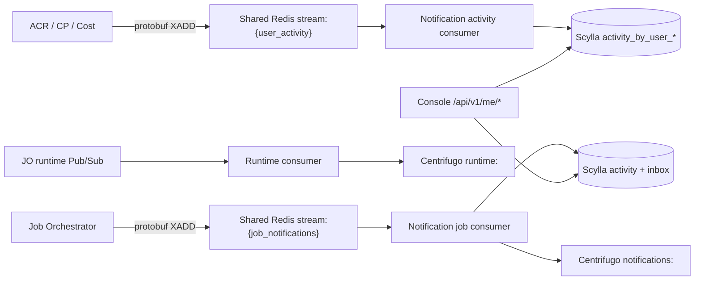

# User Timeline and Notification History God View

> Source of Truth cho lịch sử hành vi self-user và job notification. Đây là
> projection phục vụ Console; không phải IAM, billing hay resource aggregate SoT.

## Hai luồng, hai durability boundary

- `user_activity` ghi lịch sử hành vi như login, password change, resource
  mutation hoặc top-up. Mặc định chỉ lưu Scylla, không bắn Centrifugo.
- `job_notifications` ghi activity và notification inbox trước khi publish
  realtime. `notification_id` là stable UUID bắt buộc, duplicate publish sau
  crash phải converge idempotent.
- Managed Service result events dùng một `notification_id` UUIDv5 theo
  `operation_id`: `PROCESSING` tạo record, `SUCCESS`/`FAILED` update cùng record;
  status hay attempt không tạo record mới.
- `runtime` là soft-state Pub/Sub, không ghi Scylla và có thể mất khi subscriber
  reconnect; UI rehydrate API authoritative khi có, hoặc hiển thị stale tới update
  kế tiếp. Managed Service V1 không có runtime snapshot, Pub/Sub envelope hay
  `runtime:<actor_user_id>` channel; `PROCESSING → SUCCESS|FAILED` là timeline
  durable duy nhất của module.

## Scylla model

- Activity partition: `((user_id, month_bucket), occurred_at DESC, event_id DESC)`.
- Category query dùng projection `activity_by_user_category_month`.
- Inbox partition: `((user_id, month_bucket), created_at DESC, notification_id DESC)`.
- Với Managed Service timeline, `occurred_at`/`created_at` được pin tại event
  `PROCESSING` và dùng lại cho terminal update, nên primary key luôn là cùng row.
- Managed Service `status_version` monotonic; `updated_at`, outcome/severity/
  title/summary mutable. Terminal update không được ghi đè inbox `read_at`.
- Managed Service Centrifugo payload dùng `notification_id` UUIDv5(operation_id) làm
  stable timeline identity, cùng `status_version`, `operation_id` và `resource_id`.
  Console fence theo `(notification_id, status_version)` rồi rehydrate API; không
  dedupe chỉ operation ID hoặc tạo browser timeline mới theo status/attempt.
- TTL bị giới hạn bằng config; TWCS giới hạn tombstone/compaction cost.
- API cursor chứa month, timestamp và id; predicate tuple giữ ordering khi nhiều
  event cùng millisecond và scan tháng cũ theo budget.
- `inbox_state_by_user.read_before` hỗ trợ mark-all mà không cần rewrite toàn bộ
  partitions.

## Security and failure semantics

- API derive principal solely from the verified cookie; client không truyền
  `user_id`.
- Activity metadata bị giới hạn 16 KiB và không được chứa token, secret hoặc
  raw customer payload.
- Redis consumer ACK chỉ sau Scylla durability; lỗi dependency giữ PEL để retry.
  Managed Service terminal upsert từ chối status version cũ để `PROCESSING` hoặc
  result stale không ghi đè terminal state. Poison contract của cả job/activity
  được quarantine
  metadata-only trước ACK, tại `stream:{job_notifications_quarantine}` và
  `stream:{user_activity_quarantine}`.
- Activity producers dùng capacity guard `XLEN < 100000`, không `XTRIM` hoặc
  `MAXLEN` trên stream có thể còn PEL. Khi đầy, producer ghi lỗi và không làm
  hỏng business transaction; đây là backpressure có chủ đích cần alert.
- Scylla outage làm activity/job pending và API trả `503`; không làm runtime
  Pub/Sub bị biến thành durable queue.
- HA replicas không dùng distributed lock cho Scylla writes; duplicate event
  convergence dựa trên primary key và retry at-least-once.

## Contract and implementation

- `notification-service/proto/user_activity.proto`
- `notification-service/src/contract/activity.rs`
- `notification-service/src/inbound/activity_stream.rs`
- `notification-service/src/infra/scylla/schema.rs`
- `notification-service/src/infra/scylla/store.rs`
- `notification-service/src/api/timeline.rs`
