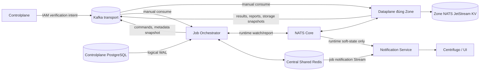
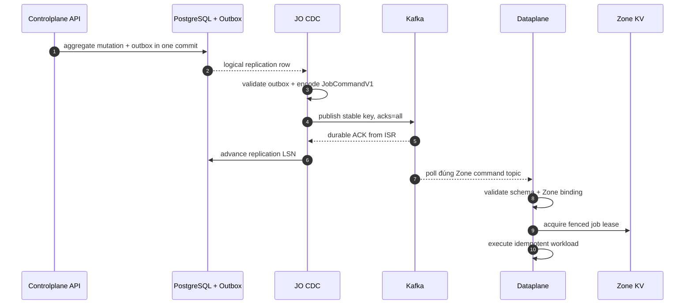
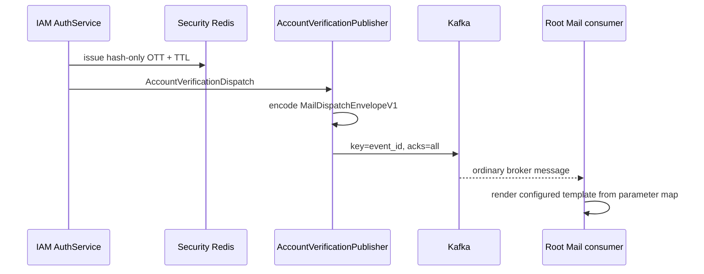

# Kafka Transport Plane — God View

> [!IMPORTANT]
> Đây là Source of Truth cho durable transport giữa Controlplane, Job Orchestrator và Dataplane.
> Kafka thay hoàn toàn Redis Job và chỉ là durable transport plane. NATS Core chở soft-state
> Central↔Zone; NATS JetStream KV là database riêng của từng Zone. Dataplane không kết nối Redis.

## 0. Control header

| Thuộc tính | Contract |
|---|---|
| Broker | Kafka transport cluster, KRaft |
| Dev topology | 3 combined broker/controller, replication factor `3`, min ISR `2` |
| Wire format | Protobuf binary; không dùng JSON cho command/result/report |
| Delivery | At-least-once |
| Producer | Stable key, idempotent producer, `acks=all`, zstd, bounded retry |
| Consumer | Manual offset commit |
| Poison data | Publish `DeadLetterRecordV1` thành công rồi mới commit source offset |
| Zone runtime database | NATS JetStream KV riêng Zone; Kafka không thay KV |
| Soft runtime watch | NATS Core + pod memory; Shared Redis chỉ nằm phía Central |

## 1. Physical topology và trust boundary



Connection rules:

- ACR không kết nối Kafka. ACR chỉ gọi IAM qua security boundary hiện có.
- IAM service không import Kafka hay Protobuf; nó gọi `AccountVerificationPublisher`.
- Controlplane không consume runtime command topics và không kết nối Zone KV.
- JO có PostgreSQL/WAL, Kafka, NATS Core và bounded Shared Redis; không có Zone KV credential.
- Dataplane có Kafka, NATS Core và KV của đúng Zone; không có Redis hoặc CP PostgreSQL credential.
- Không tồn tại shared platform command topic. Mọi runtime command phải có UUID Zone hợp lệ;
  JO publish vào topic per-Zone và fail-closed với route `platform`, `global`, rỗng hoặc nil UUID.
- Kafka ACL production phải tách principal, producer topic và consumer group. Dataplane Zone A không được
  subscribe command/metadata topic của Zone B.

## 2. Topic catalogue

Prefix mặc định là `aurora`.

| Topic | Key | Producer | Consumer | Policy |
|---|---|---|---|---|
| `aurora.jobs.commands.zone.<zone_uuid>.v1` | `job_id` | JO | DP trong Zone | 6+ partitions, delete retention |
| `aurora.jobs.results.v1` | `job_id` | DP | JO | 12+ partitions, delete retention |
| `aurora.jobs.dlq.v1` | DLQ `event_id` | DP/JO | SRE tooling | delete retention dài |
| `aurora.zone.metadata.queries.v1` | `zone_id` | DP | JO | delete retention |
| `aurora.zone.metadata.<zone_uuid>.v1` | `zone_id` | JO | DP trong Zone | 1 partition, `cleanup.policy=compact` |
| `aurora.zone.reports.v1` | `zone_id` | DP | JO | delete retention |
| `aurora.storage.sizes.v1` | `zone_id` | DP | JO | delete retention |
| `aurora.iam.account-verification.v1` | mail `event_id` | Controlplane IAM adapter | Root-owned ordinary Mail consumer | delete retention |

Topic phải được provision trước. `auto.create.topics.enable=false` để typo không tạo topology mới.
Per-Zone metadata topic dùng một partition vì record là full aggregate snapshot và key chỉ có một Zone.

## 3. Wire contracts

`platform_transport.proto` phải byte-identical giữa Dataplane và JO:

- `JobCommandV1`
- `ZoneMetadataQueryV1`
- `ZoneMetadataSnapshotV1`
- `StorageBucketSizesSnapshotV1`
- `DeadLetterRecordV1`

`job_result.proto`, `zone_report.proto` và `mail_runtime.proto` phải giữ wire compatibility giữa producer/consumer.
Internal verification mail dùng `MailDispatchEnvelopeV1`; logical parameter vẫn là flat map cho `{{placeholder}}`,
nhưng Kafka payload là Protobuf binary.

Validation trước side effect:

- UUID binary đúng 16 bytes.
- schema version đúng version consumer hỗ trợ.
- `job_topic`, `source_domain`, `resource_id` không rỗng.
- topic Zone và `target_zone_id` phải khớp Zone cấu hình.
- report key và payload `zone_id` phải trùng.
- timestamp/deadline phải nằm trong cửa sổ cho phép.
- payload size phải bị chặn tại producer/consumer/broker.

## 4. Command path: PostgreSQL WAL → JO → Kafka



Crash windows:

- JO chết trước broker ACK: LSN chưa advance, WAL replay.
- JO chết sau ACK trước LSN advance: duplicate `JobCommandV1`; stable `job_id` và executor idempotency xử lý.
- Kafka ACK không thay PostgreSQL commit. Outbox được tạo cùng business transaction trước CDC.

Reconciler JO vẫn dùng Cache Redis cho bounded lock/generation/checkpoint. Sau lock, từng small batch được
publish Kafka với cùng version/hash. Lock không làm Kafka exactly-once; generation/version fence mới chặn stale apply.

## 5. Dataplane execution, retry và contiguous commit

Mỗi DP consumer group dùng manual commit và rebalance epoch:

1. Register `(epoch, topic, partition, offset)` trước khi dispatch.
2. Validate size/schema/version/Zone/W3C/workload-owner route. Poison command → durable DLQ chỉ mang
   sanitized diagnostic + payload byte length/SHA-256, không mang raw command → terminal settle.
3. Acquire `lease.job.<sha256(job_id)>` trong Zone Coordination KV.
4. Nếu lease đang do replica khác giữ, republish cùng command/key bằng `acks=all`, rồi settle original.
5. Watchdog giữ lease trong phase `Preparing`; sau khi PROCESSING publish resolve mới bắt deadline
   `Executing`, rồi chuyển `Completing` khi external executor kết thúc.
6. Thành công/thất bại terminal: publish `JobExecutionResultProto` durable.
7. Transient retry: publish command mới với `attempt+1`, bounded backoff/jitter, rồi settle original.
8. Offset serialize/commit theo partition đến highest contiguous terminal record trong cùng assignment
   epoch. Sparse Kafka offset được hỗ trợ; intake dừng fetch khi cửa sổ unsettled đạt `4 × Ready workers`.

Completion từ assignment cũ không được commit assignment mới. Rebalance listener tăng epoch khi
partition assigned/revoked/lost; stale completion giữ source offset uncommitted.

External side effect vẫn phải có idempotency key. Kafka idempotent producer chỉ chống duplicate do producer retry
trong producer session, không tạo exactly-once xuyên PostgreSQL/Kafka/MinIO/Proxmox/JMAP.

## 6. Result path: Dataplane → Kafka → JO

```mermaid
sequenceDiagram
    participant DP as Dataplane
    participant K as Kafka results
    participant JO as JO result consumer
    participant PG as PostgreSQL
    participant R as Shared L2 Redis
    participant NS as Notification Service

    DP->>K: PROCESSING/terminal Protobuf, acks=all
    K-->>JO: manual poll
    JO->>JO: strict decode/validation
    JO->>PG: guarded result transaction
    JO->>R: bounded job notification Stream when required
    JO->>K: commit offset
    R-->>NS: consumer-group delivery; ACK after Centrifugo 2xx
```

- Poison result được DLQ rồi mới commit.
- Transient DB/Shared Redis failure dừng listener trước khi record offset cao hơn được commit.
- Supervisor/Kubernetes restart replay từ committed offset.
- Result transaction phải idempotent theo `job_id`, topic, attempt và terminal fence.

## 7. Zone metadata, report và storage-size paths

Zone metadata:

- JO CDC hoặc query listener đọc full authoritative Zone aggregate.
- JO publish `ZoneMetadataSnapshotV1` vào compacted per-Zone topic với key `zone_id`.
- DP cold start/reconciler publish `ZoneMetadataQueryV1` khi cần repair.
- DP validate Zone binding, project full snapshot vào `AURORA_ZONE_CONFIG`, rồi commit Kafka offset.
- Invalid snapshot được durable DLQ trước commit; KV failure để offset chưa settle.

Zone report:

- DP lease holder tổng hợp health + Kafka lag đo từ chính consumer group.
- DP publish `ZoneReport` lên `aurora.zone.reports.v1`.
- JO chỉ commit sau DB/state-machine side effects. Stale lag không được tự động đổi Zone state.

Storage size:

- DP scanner publish `StorageBucketSizesSnapshotV1`.
- JO cập nhật business read model và publish Billing/UI event.
- Partial/transient side-effect failure dừng consumer, không commit vượt snapshot lỗi.

## 8. IAM verification intent



IAM không biết Zone, consumer, template, sender hoặc Stalwart. ACR không kết nối Kafka.
Registration identity commit xảy ra trước publish; publish là best-effort, pending-login resend là recovery.

## 9. HA, failure và security matrix

| Case | Guard | Kết quả |
|---|---|---|
| Mất một broker dev/prod 3 node | RF=3, min ISR=2, `acks=all` | Durable publish tiếp tục nếu còn ISR quorum |
| Mất quorum | Producer không nhận ACK | Không settle source/không advance LSN |
| Poison Protobuf | Strict validation + DLQ | Không chạy side effect; source commit sau DLQ ACK |
| Command/payload quá lớn | DP giới hạn 1 MiB/1,000,000 bytes; DLQ bỏ raw payload và giữ length/SHA-256 | Không memory/secret-amplify poison record; source chỉ settle sau DLQ ACK |
| Record thấp transient fail | Listener fail/restart | Không commit record cao hơn |
| Consumer rebalance khi task đang chạy | Assignment epoch fence | Completion cũ không commit owner mới |
| Zone command cross-wire | Topic + `target_zone_id` + ACL | DLQ/fail-close |
| Metadata event cũ | Full snapshot + compacted topic + KV CAS | Duplicate/stale no-op |
| Cache Redis mất | Durable Kafka không bị mất | Reconciler/watch suy giảm; job transport vẫn durable |
| NATS Core realtime mất | Kafka command/result vẫn tồn tại | Runtime soft state mất sample; heartbeat/watch kế tiếp phục hồi |

Security production:

- TLS/mTLS hoặc SASL over TLS; plaintext chỉ cho isolated dev Compose.
- Mail Kafka adapter chỉ chấp nhận plaintext khi deployment đặt rõ
  `MAIL_STREAM_ALLOW_PLAINTEXT_KAFKA=true`; mặc định production là `false`.
- Broker ACL giới hạn exact topic và consumer group.
- Không log payload, credential, OTT hoặc customer template.
- Không ghi customer broker credential vào Kafka platform envelope.
- Kafka UI dev là read-only; production phải đặt sau SSO/RBAC hoặc không deploy.

## 10. Deployment và observability

Dev Compose:

- `kafka-1..3` chạy KRaft combined mode.
- `kafka-init` tạo topic idempotently.
- `kafka-ui` tại port `18080`, read-only.
- Không còn `redis-job` service/volume/dependency.

Production:

- Dùng managed Kafka hoặc operator với broker/controller placement phân failure domain.
- Topic/ACL/retention là declarative infrastructure, không để application tự tạo.
- Alert theo under-replicated partitions, offline partitions, ISR shrink, produce error/latency,
  consumer lag/staleness, DLQ rate và oldest unprocessed age.
- JO dùng `job_orchestrator_kafka_operations_total{operation,outcome}` và
  `job_orchestrator_kafka_operation_duration_seconds{operation}` cho mọi logical publish/commit;
  metric không gắn raw topic per-Zone, Zone UUID hoặc job ID.
- Không dùng resource ID, email, workspace hoặc Zone UUID làm metric label có cardinality không giới hạn.

## 11. Code map

| Trách nhiệm | File |
|---|---|
| CP producer | `controlplane/infra/kafka/kafka.go` |
| IAM outbound port | `controlplane/internal/iam/domain/service/auth_service.go` |
| IAM Kafka adapter | `controlplane/internal/iam/transport/pubsub/account_verification_publisher.go` |
| JO transport | `job-orchestrator/src/infra/kafka.rs` |
| JO WAL publisher | `job-orchestrator/src/cdc/mod.rs` |
| JO result consumer | `job-orchestrator/src/job_result/consumer.rs` |
| DP transport/settlement | `dataplane/src/infra/kafka.rs` |
| DP command intake | `dataplane/src/job_runtime/intake.rs` |
| DP result/retry | `dataplane/src/job_runtime/{execution,completion}.rs` |
| Shared contracts | `dataplane/proto/platform_transport.proto`, `job-orchestrator/proto/platform_transport.proto` |
| Dev topology | `controlplane/docker-compose.dev.yml` |
