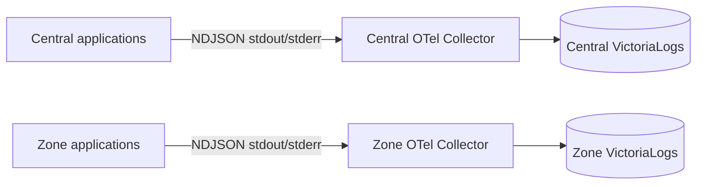

# Platform Structured Logging God View

> Source of Truth cho contract log chung của Central và Zone. Tài liệu này chỉ
> định nghĩa diagnostic path; không biến VictoriaLogs hay OTel Collector thành
> business state, command transport, authorization proof hoặc billing input.

## Topology



Central và Zone dùng backend, checkpoint và exporter queue độc lập. Không thêm
`platform_scope`, `zone_code` hoặc customer identity để giả lập phân vùng đã được
deployment boundary bảo đảm. Docker development cùng tail host log path chỉ là
giới hạn local: Central loại Dataplane, Zone chỉ nhận `aurora-dataplane` hoặc
reviewed Zone Edge schema trước khi export.

## Stream contract

Mỗi VictoriaLogs backend dùng đúng một stream field:

```text
{service_name="<bounded service identity>"}
```

`container_id`, pod/node name, `service_instance_id`, `trace_id`, `operation_id`,
actor/tenant/workspace/resource ID, Kafka coordinates và `op` là searchable
attributes khi có, không phải stream dimensions. Log không xác định được application
identity được đưa vào một bounded quarantine stream `service_name=infra`; không derive
stream từ container hash.

## Canonical record

Field bắt buộc cho platform application log:

| Field | Contract |
|---|---|
| `service_name` | Stable application identity |
| `service_version` | Immutable build/release identity; development dùng `dev` hoặc package version |
| `service_instance_id` | Process incarnation; không dùng làm stream field |
| `op` | Bounded static operation từ code path |
| `event_code` | Bounded stable event taxonomy |
| `severity_text` / `severity_number` | Một canonical OTel severity pair |
| `_msg` | Human diagnostic body sau collector normalization |

Các field sau chỉ được emit khi event thực sự có giá trị:

- `trace_id`, `span_id` từ active OTel context;
- `operation_id` cho stable business operation và `event_id` cho stable message;
- `actor_id`, `tenant_id`, `workspace_id`, `resource_id` sau verified boundary;
- `result`, `reason`, retry/fencing và transport coordinates tại transition tương ứng.

Không emit empty string, `unknown`, `-1`, synthetic zero hoặc default `false` để giữ
schema phẳng. Collector xóa legacy sentinel trong rolling-upgrade window. Một event
không lặp `service.name`, `service_name`, `aurora.component` hay nhiều level field.

## Correlation semantics

`trace_id` nối log với distributed trace hiện hành. `span_id` định vị đúng span.
`operation_id` vẫn ổn định qua retry/reconcile khi trace có thể đổi hoặc đã hết
retention. `event_id` là message identity cho delivery at-least-once. Ba identity
này không thay thế nhau và không tạo exactly-once semantics.

`actor_id` là user UUID, `sre` hoặc `system`; không cần `actor_type`. Tenant/workspace/
resource identity chỉ xuất hiện ở business boundary cần trả lời ai đang thao tác với
cái gì. Dependency poll, heartbeat và hot loop không nhân lại ownership context.

## Security and failure semantics

- Không log token, cookie, Authorization, credential, plaintext secret, protected
  payload hoặc raw customer body. Error/message phải bounded, escaped và redacted.
- Logger queue và Collector exporter queue hữu hạn. Application không block durable
  DB/Kafka/Zone side effect vì observability backpressure.
- Collector/Victoria failure làm log unavailable hoặc dropped; không rollback business
  transaction và không xác nhận thành công/thất bại cho workflow.
- Successful poll, health check, heartbeat và no-change reconcile không được tạo log
  volume liên tục. Warning/error lặp phải bounded rate-limit/sampling và có metric drop.
- Pod restart tạo `service_instance_id` mới nhưng không tạo Victoria stream mới.

## Implementation boundaries

- Go HTTP middleware chỉ tin actor/tenant/workspace context đã được Envoy/ACR strip và
  inject lại; client header cùng tên không phải source tin cậy.
- ACR dùng active OTel context cho trace/span; authorization decision chỉ log outcome và
  generic reason, không log session proof.
- JO/Dataplane giữ Kafka/fencing context ở typed fields và collector loại legacy default.
- Notification log writer giữ bounded queue; trace/metric export vẫn đi OTLP độc lập.
- Collector normalize severity và body một lần trước khi ghi VictoriaLogs.
