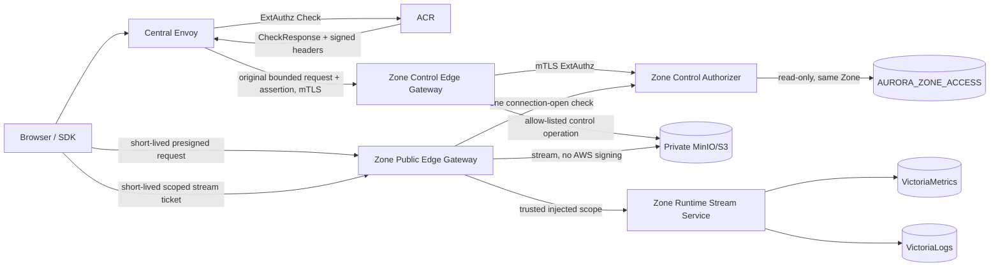

# Zone Public Edge Gateway and Zone Control Edge Gateway — God View

> [!IMPORTANT]
> This document is the topology and trust-boundary Source of Truth for HTTP
> traffic entering an Aurora Zone. The only edge topology names are
> `Zone Public Edge Gateway` and `Zone Control Edge Gateway`.

## 1. Components and ownership

| Component | Exposure | Owns | Must not own |
|---|---|---|---|
| Zone Public Edge Gateway | Public DNS/TLS | Streaming, connection limits, public route allow-list | Business authorization, Zone KV, Central assertion keys |
| Zone Control Edge Gateway | Private network and Central Envoy mTLS only | Private route allow-list, bounded bodies, ExtAuthz, upstream routing | Business ownership, Kafka job execution, arbitrary dynamic proxy |
| Zone Control Authorizer | Zone-private mTLS gRPC | Assertion verification, capability policy, Zone access-record matching | Gateway routing, Central business data, S3/Proxmox credentials |
| Zone Runtime Stream Service | Zone-private; only named Edge routes reach it | Read-only Victoria query shaping and bounded stream delivery for all runtime modules | Business authorization, Zone KV, Central assertion keys, Kafka/NATS/PostgreSQL/Vault |
| ACR | Central ExtAuthz | Trinity verification and Vault-signed Zone control assertion | Zone KV or Zone infrastructure access |
| Dataplane | Exact Zone | Durable command execution and Zone access projection | HTTP authorization for each browser request |

The gateway names refer to Envoy deployments. `zone-control-authorizer` and the
Rust subproject `zone-runtime-stream` is a service, deliberately not
named or deployed as gateways.

## 2. Topology



Docker development materializes this boundary as two independent Compose
projects: `dev/central/compose.yml` and `dev/zone/compose.yml`. The Zone
project has its own OTel Collector and VictoriaMetrics/VictoriaLogs/
VictoriaTraces volumes. Only Kafka transport and NATS Core attach to the shared
`aurora-dev-transport` network. Zone-internal networks are segmented again:
Dataplane/Zone KV/infrastructure, telemetry ingestion, Victoria read,
Public-Edge storage and Public-Edge runtime are separate. Vì vậy
`zone-runtime-stream` chỉ resolve Zone Victoria và đúng Public Edge path; nó
không có route tới Dataplane, Zone KV, MinIO, Stalwart, OTel ingestion hoặc
Central transport.
This local shared network models reachability only; production must enforce the
same boundary again with mTLS identity, broker ACL and NetworkPolicy.

ACR never sends the HTTP request itself. Central Envoy receives ACR's
ExtAuthz response, overwrites internal headers and forwards the original
request.

## 3. Zone Public Edge Gateway

- Public DNS/TLS; provider DDoS protection and connection/rate limits terminate
  here.
- Handles large upload/download bodies and explicitly approved long-lived
  connections. It does not call ACR or Zone Control Authorizer per byte.
- A named runtime stream route calls the same Zone Control Authorizer once
  at connection open. The route strips the browser ticket and all client-supplied
  scope headers, then forwards only trusted injected scope to its named upstream.
  The maximum stream lifetime cannot exceed ticket expiry.
- Preserves the raw path/query required by SigV4 and never logs the request
  path/query or authorization material.
- Strips all `x-aurora-*`, Trinity cookie, CSRF and device headers.
- Does not AWS-sign a request. MinIO validates the short-lived presigned
  signature.
- Has egress only to the explicitly routed public data/observability service and
  DNS. It cannot reach Dataplane, Proxmox, Victoria directly or Zone NATS KV.
- Automatic upstream retries are disabled for streamed requests. Multipart
  clients retry parts using stable part identity.
- Listener/upstream buffers are bounded per connection; downstream and MinIO
  backpressure propagates instead of creating an unbounded upload queue.
- Public TLS accepts HTTP/2 and HTTP/1.1; the private Central-to-Control hop
  uses HTTP/2 while MinIO remains an explicit HTTP/1.1 upstream.

## 4. Zone Control Edge Gateway

- Has no public DNS. A Zone overlay exposes it through a private service or
  private load balancer reachable only by Central Envoy.
- Requires a client certificate issued to the Central Envoy workload identity.
- Accepts `/zone-control/v1/*`; every capability is still explicitly
  allow-listed in both ACR and the Zone route table.
- Uses `failure_mode_allow=false` and mTLS when calling
  `zone-control-authorizer`.
- Buffers at most 64 KiB for request binding. Object/image bytes never use this
  path.
- Does not automatically retry routed mutations. Client retries receive a new
  assertion and reuse downstream idempotency semantics.
- Storage list/head/tag/bulk operations are AWS-signed by an upstream filter
  after route/path rewrite. The private gateway uses a dedicated, narrowly
  scoped Zone-local MinIO identity; its credential never reaches Central or a
  browser. Public Edge never has this credential.
- Durable resource creation/import still uses PostgreSQL outbox → JO → Kafka →
  Dataplane. Zone Control Edge does not replace Kafka with synchronous HTTP.

## 5. Generic public Zone Runtime Stream (staged platform path)

Managed Service, Hypervisor, Mail and Storage runtime telemetry reuse the two
existing gateways. Managed Service is the first adapter; no module gets a
workflow-specific gateway and browser runtime never routes through NATS, JO,
Shared Redis, Notification Service or Centrifugo.

```text
Browser
  → Central assertion/ticket preparation through Zone Control Edge
  → short-lived opaque scope ticket
  → Zone Public Edge
  → one Zone Control Authorizer check
  → zone-runtime-stream
  → VictoriaMetrics / VictoriaLogs in the same Zone
```

The preparation capability is generic `runtime.read`, not a Managed Service
specific security principal. Ticket TTL và maximum stream lifetime đều là 5 phút. Nó
bind target Zone, actor, auth generation, owner, workspace, resource/instance,
permitted component/panel set, method/path, policy revision, `jti` và expiry. Zone
Public Edge is opaque to ticket signing material. At stream open it
delegates validation to Zone Control Authorizer, which compares the ticket/assertion
with the matching Zone access projection and injects the verified scope. The Rust
service receives no Central cookie, caller identity header, Zone access handle or
ticket; it only trusts the injected scope from the Edge.

The public ticket is a distinct assertion audience
`zone-public-edge-gateway` with capability `runtime.read`; a
`zone-control-edge-gateway` assertion is never accepted by Public Edge. Both profiles
use the same versioned Central public-key rotation, but the authorizer is the only
Zone process that verifies them. This keeps Public Edge free of assertion keys and
prevents a private control assertion from being replayed as a public stream ticket.

The browser request has a fixed route shape. The verified ticket/Edge injects bounded
`panel_id` and optional allowed component; browser input is limited to a bounded time
range and `Last-Event-ID` cursor. It cannot provide PromQL, LogsQL, metric name,
label selector, namespace, owner/workspace/Zone/instance ID or an upstream URL. The
service derives a fixed Victoria query from panel policy and appends enforced
telemetry filters. The ticket is read-only: replay can at most open another bounded
stream, so connection/rate/duration quotas are the replay harm boundary rather than
a false distributed exactly-once claim.

## 6. Zone control assertion v1

ACR signs the base64url-encoded JSON bytes using the dedicated asymmetric Vault
Transit key. Zones receive overlapping versioned public keys only.

```text
schema_version = 1
issuer         = "aurora-acr"
audience       = "zone-control-edge-gateway"
capability     = "storage.object"
jti            = UUID for this assertion
operation_id   = UUID propagated to downstream telemetry/idempotency
access_session_id
binding_hash
actor_id
resource_id
resource_name
workspace_id
zone_id
action
method
path_hash
body_hash
scope
policy_revision
issued_at
expires_at
key_id
```

Internal headers are:

```text
x-aurora-control-assertion
x-aurora-control-signature
x-aurora-control-key-id
```

Central Envoy/ACR overwrites client copies. Zone Control Authorizer removes the
assertion, signature, key ID and opaque access-session header before upstream
routing.

## 7. Authorization and replay semantics

1. ACR authenticates the Central session and loads the short-lived Central
   access record from Auth-State Redis.
2. ACR checks actor, Zone, action, resource path, expiry and policy revision.
3. ACR signs a request-bound assertion using method, raw path/query and body
   hashes.
4. Zone Control Authorizer verifies signature/key/audience/issuer/schema/time,
   exact Zone and capability.
5. It compares the assertion with the matching `AURORA_ZONE_ACCESS` record and
   denies missing, expired, stale or conflicting scope. A non-empty
   `key_prefix` requires ListBucket to carry exactly one decoded `prefix`
   inside that scope; missing, duplicate or malformed prefixes fail closed.
   The query allow-list is ListObjectsV2-only, so S3 subresources such as ACL,
   policy, version and multipart-upload listing cannot inherit `ListBucket`.
   Object-version query/body semantics are denied until a separate versioned
   capability and policy are defined.
   Read operations require an empty body; reviewed mutation bodies remain
   bounded to 64 KiB and are hashed into the assertion.
6. ExtAuthz injects trusted resource/capability/action/operation metadata and
   removes security headers before the upstream call.

The in-process `jti` cache is only a replay shield within one replica. It is
not a distributed exactly-once boundary. Direct mutations must be idempotent
for the same payload and `operation_id`; usage delivery and Cost inbox must
deduplicate the same operation. A future non-idempotent capability must add a
durable/CAS outcome record before it is allow-listed.

## 8. HA, backpressure and failure semantics

- Public Edge, Control Edge and Control Authorizer are separate Deployments,
  identities, PDBs and HPA targets with at least three replicas in production.
- `zone-runtime-stream` is a separate Deployment/identity/HPA target. It has
  read-only egress solely to the Zone Victoria endpoints; it has no route or
  credential to Dataplane, Kafka, NATS, Redis, Zone KV, Kubernetes API or Vault.
- Envoy workloads use a currently supported patch line. Production overlays
  mirror, scan and pin the approved image digest rather than tracking a floating
  tag.
- Public Edge scales primarily on connections/bandwidth; CPU HPA is only a
  baseline until custom metrics are wired. Control Edge scales on request
  pressure and authorizer latency.
- Observability streams have bounded per-connection query/byte/in-flight budgets.
  Metrics may coalesce for a slow downstream; logs tail is cancelled/closed rather
  than queued without bound. A client disconnect cancels the Victoria request. Ticket
  expiry or auth/workspace/Zone/instance/policy scope change closes the stream; client
  must acquire a new ticket before reconnect.
- Authorizer rejects work above its bounded in-flight semaphore. Envoy has
  bounded pending requests/connections and fails closed on overload.
- ACR assigns `/zone-control/v1/*` an isolated pre/post-auth rate-limit
  namespace so generic API traffic cannot consume the same Vault-signing
  budget.
- Dependency, projection-not-ready and overload failures return retryable 503
  without automatic proxy retry. Forged, expired or scope-mismatched requests
  return 403.
- The Zone access watch cache is bounded. Cache miss performs a bounded direct
  KV read; corrupt/missing/KV-timeout state denies the request.
- Watch reconnect uses bounded exponential backoff with jitter and changes
  readiness to false until the watch is restored.
- Public Edge outage stops public transfers. Control Edge outage stops new
  control operations/tickets; already issued presigned transfers continue only
  until their TTL.
- Public Edge, Authorizer, stream service or Victoria outage rejects/terminates the
  runtime stream with a retryable error; it cannot produce a synthetic
  resource `READY`/`SUCCESS` state or affect a durable operation.
- Graceful shutdown removes readiness, stops new checks, drains Envoy
  connections and leaves access records to their bounded TTL.
- No component claims exactly-once across Central, broker, gateway and S3.

## 9. Routing and multi-Zone gate

The checked-in Central Envoy cluster is a single-Zone base template targeting
`zone-z1`. Production must render one allow-listed private cluster per active
Zone through CDS/xDS and route only from the Zone ID already verified by ACR.
Client-provided host, cluster, `zone_id` or routing header must never select an
arbitrary upstream.

Until private DNS/mTLS identities and allow-listed multi-Zone CDS are
provisioned, the Zone control route remains staged and must fail closed.

## 10. Observability

- Both Envoy gateways emit structured JSON access logs without cookies,
  assertions, S3 authorization or presigned query strings.
- Zone Control Authorizer exposes `/health/live`, `/health/ready` and bounded
  Prometheus metrics for OTel Collector scraping on its private telemetry port.
- Fixed-bucket check latency, in-flight work, outcome, cache, KV failure and
  watch-restart metrics cover the hot authorization path without resource IDs.
- Metrics have fixed-cardinality outcome labels only; actor, session, bucket,
  object key and `operation_id` are not metric labels.
- Observability is diagnostic. It is not billing evidence or durable operation
  completion.
- The stream service emits only fixed-cardinality health/query/outcome metrics;
  customer scope, ticket, raw Victoria query, log line and metric sample are never
  access-log fields or metric labels.

## 11. Deployment source map

| Concern | Source |
|---|---|
| Public Envoy configuration | `zone-public-edge-gateway/envoy.yaml` |
| Public workload boundary | `k8s/zone-public-edge-gateway.yaml` |
| Control Envoy configuration | `zone-control-edge-gateway/envoy.yaml` |
| Control workload boundary | `k8s/zone-control-edge-gateway.yaml` |
| Rust authorizer | `zone-control-edge-gateway/authorizer/src/` |
| Authorizer workload boundary | `k8s/zone-control-authorizer.yaml` |
| Zone Runtime Stream service | `zone-runtime-stream/` (Rust subproject; Managed Service adapter first) |
| Zone Runtime Stream workload boundary | `k8s/zone-runtime-stream.yaml` (internal only; public route gated) |
| Central assertion producer | `acr/src/storage/control_assertion.rs` |
| Central private route | `dev/central/envoy/routes/https_routes.yaml` |
| Zone access projection | `dataplane/src/infra/zone_kv.rs` |
