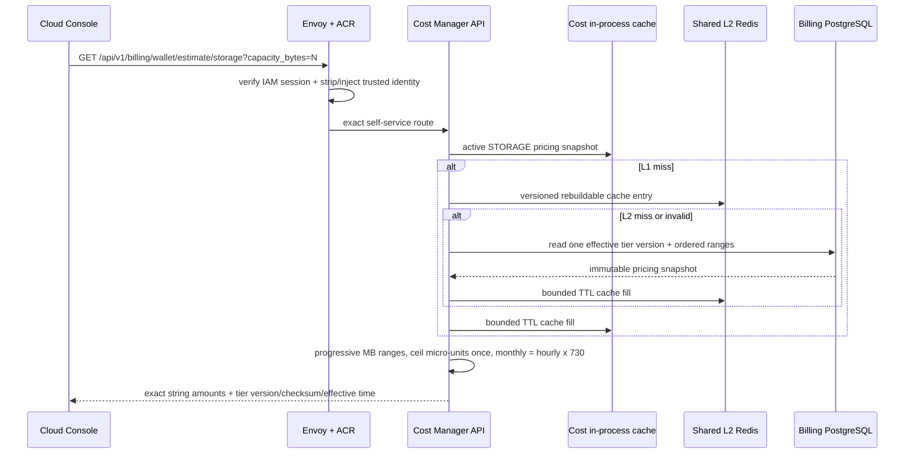
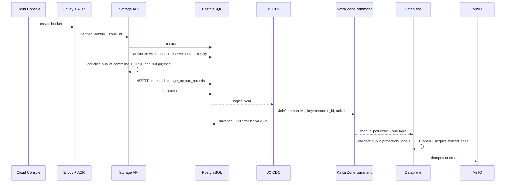
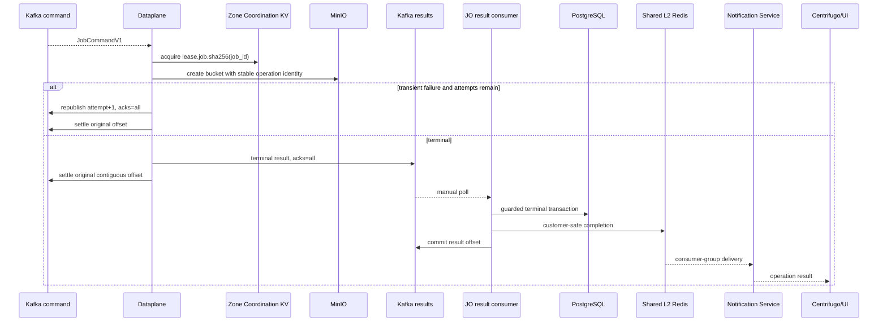

# Storage Bucket Creation — God View

> [!IMPORTANT]
> Đây là Source of Truth cho create bucket asynchronous lifecycle. PostgreSQL/outbox là business boundary,
> Central Kafka là durable job/result transport, Dataplane đúng Zone mới gọi MinIO.
> Ownership/Billing event nằm tại
> [`resource_ownership_god_view.md`](../billing/resource_ownership_god_view.md).

## 0. Contract

| Thuộc tính | Contract |
|---|---|
| Public mutation | Personal và Tenant route/service/repository riêng |
| Business SoT | CP PostgreSQL storage aggregate + `storage_outbox_records` |
| Command | `JobCommandV1` trên `aurora.jobs.commands.zone.<zone_id>.v1` |
| Result | `JobExecutionResultProto` trên `aurora.jobs.results.v1` |
| Executor | Dataplane Storage trong đúng Zone |
| Delivery | At-least-once; manual contiguous Kafka commit |
| UI completion | Shared L2 Redis Stream → Notification → Centrifugo |
| Billing ownership | Durable lifecycle event sau create/delete terminal success |

## 0.1. Read-only storage estimate

Trước khi submit create mutation, Cloud Console lấy estimate từ Cost Manager thay vì tự giữ
bảng giá hoặc công thức billing trong browser.

Invariants:

- Estimate là read-only hint; không reserve/debit wallet, không ghi ledger và không xác nhận create bucket.
- Billing PostgreSQL vẫn là pricing SoT. L1/L2 chỉ là cache rebuildable; cache miss/invalid phải quay về một
  effective tier snapshot duy nhất, không ghép ranges từ nhiều version.
- Pricing publish phát một cache-invalidation hint riêng; TTL là safety net khi Pub/Sub hint bị mất. Hint không
  tham gia durable activation/ledger transaction.
- `/api/v1/billing/wallet` dùng IAM session thường của Cloud Console; ACR chỉ dùng Billing alias cho Cost authority
  (`/billing/tiers`, `/billing/critical/*`, `/billing/auth/*`). Browser không gửi `owner_id`, tier, unit price hoặc
  Cost credential. Envoy route prefix `/api/v1/billing/` phải nằm trước generic Controlplane `/api/` route.
- Final charge vẫn dựa trên metered usage và immutable tier version do billing run pin. Estimate có thể stale
  trong bounded cache window và không được dùng là ledger evidence.

## 1. Create transaction

Invariant:

- Client không tự quyết định `owner_id`, `owner_type`, workspace hoặc Zone.
- CP cross-check identity + workspace ownership trước transaction.
- Outbox `zone_id UUID` là trusted routing snapshot.
- Aggregate mutation/reservation và outbox insert cùng commit.
- Không publish Kafka trước commit.
- Bucket identifier/resource ID ổn định qua retry.

## 2. Command envelope

`JobCommandV1` bắt buộc có:

- 16-byte `job_id`;
- job/version/attempt;
- exact `job_topic`;
- `source_domain=STORAGE`;
- stable `resource_id`;
- serialized `ProtectedPayloadV1` with `payload_encoding=HPKE_X25519_HKDF_SHA256_AES_256_GCM`;
- trace ID;
- `target_zone_id`;
- `transport_schema_version=1`.

JO chọn topic từ trusted outbox Zone và chỉ validate public protection metadata; exact ciphertext
được forward byte-for-byte. Dataplane so sánh topic Zone với `target_zone_id`/`ZONE_ID`, HPKE-open
trước khi decode bucket payload. Cross-wire/auth/poison command đi sanitized DLQ rồi mới settle.

## 3. Execution, retry và result

Result consumer không commit offset cao hơn nếu record thấp hơn gặp transient DB/Shared Redis failure. Poison result
đi DLQ trước commit. Duplicate terminal result là no-op theo job/topic/attempt/terminal guards.

## 4. Create/delete resource-first semantics

- Create: CP row/outbox tồn tại trước; DP create infrastructure; terminal FAILED xóa candidate/resource row theo
  exact resource ID nếu workflow quy định create chưa thành công.
- Update: versioning/COW chỉ dùng khi resource có mutable projected configuration.
- Delete: CP không hard-delete business row trước. DP xóa physical bucket trước; JO hard-delete CP record chỉ sau
  terminal success.
- Delete FAILED giữ record để người dùng/SRE retry.
- Không dùng `deleted_at` giả cho physical connection lifecycle nếu workflow đã khóa hard-delete.

## 5. Ownership/Billing event

Sau create/delete `SUCCEEDED`, JO transaction:

1. lock exact result/outbox;
2. resolve owner/resource/Zone từ authoritative `storage_outbox_records`;
3. update operation terminal state;
4. commit; chính storage outbox row với `ownership_published_at=NULL` là recovery marker;
5. fast-path `XADD + WAITAOF` vào Shared Redis ownership stream;
6. mark `ownership_published_at`, hoặc để recovery worker retry nếu Redis lỗi;
7. Cost Manager consumer group ghi Billing inbox/projection rồi `XACK + XDEL`.

Không query Controlplane DB trong charging path. Event chỉ được publish sau transaction commit.

## 6. Failure/race matrix

| Case | Guard |
|---|---|
| CP commit, pod chết | WAL/outbox replay |
| JO Kafka ACK, chết trước LSN | Duplicate command, stable job ID |
| Two DP replicas | Kafka group + Zone lease/fencing |
| Lease contention | Republish durable trước settle original |
| DP side effect xong, chết trước result | Kafka replay + idempotent executor |
| Result DB transaction fail | Result offset không commit |
| Notification fail | Best-effort drop + metric; UI query authoritative API |
| Ownership Redis fail | Existing storage outbox row giữ pending; bounded recovery retry |
| Cross-Zone command | topic + target Zone + ACL → DLQ |
| Delete/create same identity race | DB lock/version/resource ID guard |

## 7. Security

- Internal headers từ public client bị strip/reinject ở edge; backend không tin client-supplied owner/Zone.
- Kafka production dùng TLS/mTLS hoặc SASL over TLS và ACL theo exact Zone topic/group.
- Dataplane Zone A không có credential Zone B.
- S3 credential chỉ ở Dataplane Zone secret scope; không nằm trong Kafka payload/log.
- Bucket name/resource ID validate trước outbox và trước executor.

## 8. Code map

- `controlplane/internal/storage/`: handler/service/repository/outbox.
- `job-orchestrator/src/changefeed/worker.rs`: WAL → Kafka command.
- `dataplane/src/job_runtime/intake.rs`: command intake và Zone validation.
- `dataplane/src/executor/storage/bucket.rs`: physical executor.
- `dataplane/src/job_runtime/execution.rs` + `completion.rs`: lease, retry/result/settlement.
- `job-orchestrator/src/results/worker.rs`: result manual consumer.
- `job-orchestrator/src/results/storage/`: terminal transaction/lifecycle relay.
