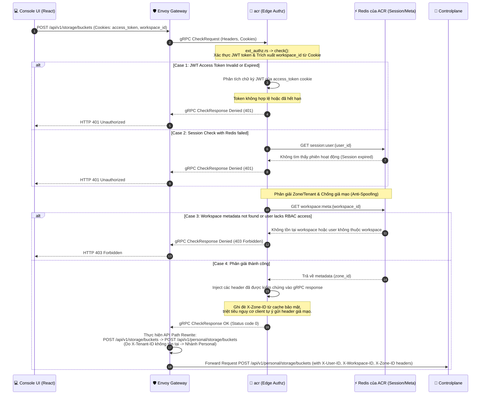
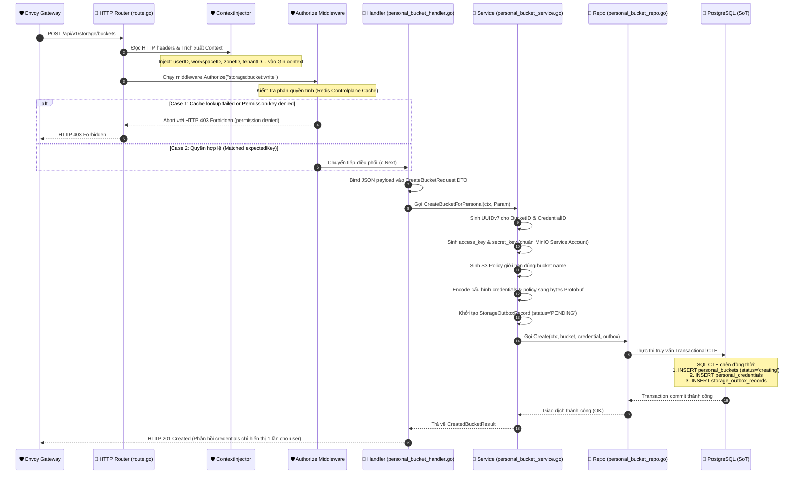
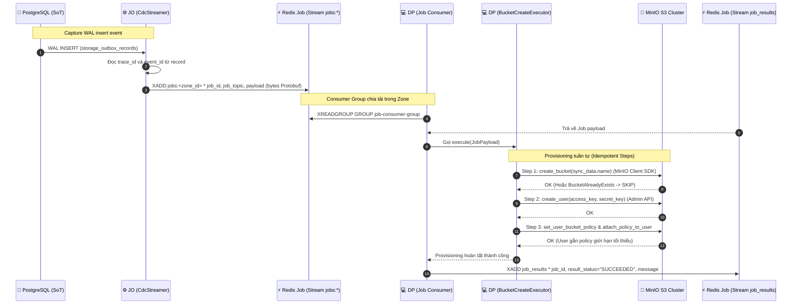
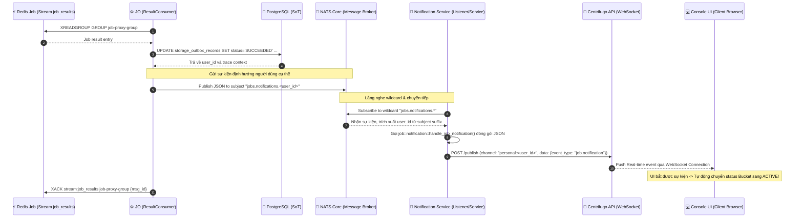
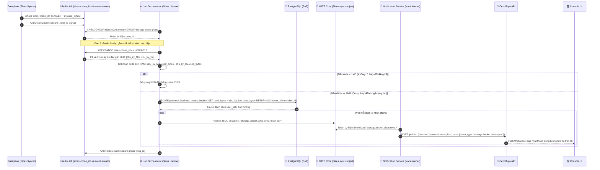

# Bucket Creation — God View (Master SoT)

> [!IMPORTANT]
> Tài liệu này là **Source of Truth (SoT) duy nhất** cho toàn bộ vòng đời và luồng xử lý đồng bộ Tạo Bucket (Bucket Creation) trong phân hệ Storage.
> **Mọi thay đổi** liên quan đến: cơ chế Outbox CTE, CDC logic, provisioning MinIO, S3 policy, đồng bộ trạng thái, thông báo real-time qua NATS/Centrifugo **đều phải tham chiếu và cập nhật** file này trước.

---

## Mục Lục

1. [Tổng Quan Kiến Trúc & Chuỗi Nhân Quả](#1-tổng-quan-kiến-trúc--chuỗi-nhân-quả)
2. [Database Schema & Outbox Contracts](#2-database-schema--outbox-contracts)
3. [Bucket Status State Machine](#3-bucket-status-state-machine)
4. [Luồng Tạo Bucket Chi Tiết — End-to-End](#4-luồng-tạo-bucket-chi-tiết--end-to-end)
   - [Phase 1: Envoy and ACR (Xác thực người dùng tại Biên)](#phase-1-envoy-and-acr-xác-thực-người-dùng-tại-biên)
   - [Phase 2: Controlplane Processor (Lớp xử lý nghiệp vụ & Ghi nhận Outbox)](#phase-2-controlplane-processor-lớp-xử-lý-nghiệp-vụ--ghi-nhận-outbox)
   - [Phase 3: CDC to Dataplane & Dataplane Processing](#phase-3-cdc-to-dataplane--dataplane-processing)
   - [Phase 4: Write-back & User Notification](#phase-4-write-back--user-notification)
5. [Cơ Chế Đảm Bảo Idempotency (Tính Không Đổi)](#5-cơ-chế-đảm-bảo-idempotency-tính-không-đổi)
6. [Bảo Vệ Race Condition & HA Guards](#6-bảo-vệ-race-condition--ha-guards)
7. [Observability (Giám Sát Vận Hành)](#7-observability-giám-sát-vận-hành)
8. [Danh Sách Keys (Redis & NATS)](#8-danh-sách-keys-redis--nats)
9. [Tham Chiếu Code Toàn Hệ Thống](#9-tham-chiếu-code-toàn-hệ-thống)

---

## 1. Tổng Quan Kiến Trúc & Chuỗi Nhân Quả

Luồng tạo Bucket vận hành thông qua mô hình **Transactional Outbox** kết hợp **CDC (Change Data Capture)** để đảm bảo tính nhất quán dữ liệu giữa Controlplane và Dataplane (MinIO):

```mermaid
flowchart TD
    classDef ui fill:#1e3a8a,stroke:#3b82f6,color:#ffffff,stroke-width:2px;
    classDef cp fill:#1f2937,stroke:#9ca3af,color:#ffffff,stroke-width:2px;
    classDef db fill:#5b21b6,stroke:#8b5cf6,color:#ffffff,stroke-width:2px;
    classDef queue fill:#7c2d12,stroke:#ea580c,color:#ffffff,stroke-width:2px;
    classDef dp fill:#064e3b,stroke:#10b981,color:#ffffff,stroke-width:2px;
    classDef ns fill:#831843,stroke:#ec4899,color:#ffffff,stroke-width:2px;
    classDef billing fill:#1c4f1c,stroke:#22c55e,color:#ffffff,stroke-width:2px;

    UI["💻 Console UI (React)"]:::ui
    Envoy["🛡️ Envoy Gateway"]:::ui
    ACR["🔐 acr (Edge Authz)"]:::ui
    CP["🚀 Controlplane API (Go)"]:::cp
    PG_WAL["💾 PostgreSQL WAL"]:::db
    JO_CDC["⚙️ Job Orchestrator (CdcStreamer)"]:::cp
    Redis_Job["⚡ Redis Job Stream (jobs:zone_id)"]:::queue
    DP_Consumer["💻 Dataplane (Job Consumer)"]:::dp
    MinIO["💾 MinIO Cluster"]:::dp
    Redis_Res["⚡ Redis Job Stream (job_results)"]:::queue
    JO_Res["⚙️ Job Orchestrator (ResultConsumer)"]:::cp
    PG_DB["💾 Controlplane DB (Outbox + Lifecycle Event)"]:::db
    JO_Relay["⚙️ Job Orchestrator (LifecycleRelay)"]:::cp
    JS["🚀 NATS JetStream"]:::queue
    CM_Consumer["💰 Cost Manager (LifecycleConsumer)"]:::billing
    Billing_DB["💾 Billing DB (Ownership Projection)"]:::billing
    NATS["🧲 NATS Core (User Notification)"]:::queue
    NS_Listener["📡 Notification Service"]:::ns
    Centri["📡 Centrifugo (WebSocket)"]:::ns

    UI -->|1. HTTP POST /api/v1/storage/buckets| Envoy
    Envoy -->|2. gRPC CheckRequest| ACR
    ACR -->|3. gRPC CheckResponse OK| Envoy
    Envoy -->|4. Forward with Headers| CP
    CP -->|5. Transactional CTE (bucket + outbox)| PG_WAL
    PG_WAL -->|6. WAL Logical Replication| JO_CDC
    JO_CDC -->|7. Push Job| Redis_Job
    Redis_Job -->|8. XREADGROUP| DP_Consumer
    DP_Consumer -->|9. Provision Bucket/User/Policy| MinIO
    DP_Consumer -->|10. Push Result| Redis_Res
    Redis_Res -->|11. XREADGROUP| JO_Res
    JO_Res -->|12. TX: UPDATE outbox SUCCEEDED + INSERT lifecycle event UNPUBLISHED| PG_DB
    JO_Relay -->|13. Poll UNPUBLISHED → Publish Protobuf| JS
    JS -->|14. Deliver lifecycle event| CM_Consumer
    CM_Consumer -->|15. TX: inbox + ownership projection + credential binding| Billing_DB
    JO_Res -->|16. Publish JSON notification| NATS
    NATS -->|17. Consume| NS_Listener
    NS_Listener -->|18. POST /publish| Centri
    Centri -->|19. WebSocket push| UI
```

---

## 2. Database Schema & Outbox Contracts

### 2.1 Bảng Dữ Liệu Storage
- **CSDL SoT**: [`000001_storage_tables.up.sql`](../../controlplane/internal/storage/migrations/000001_storage_tables.up.sql)
- **Bảng `personal_buckets`**: Lưu trữ cấu hình và hạn mức của Bucket cá nhân.
- **Bảng `personal_credentials`**: Lưu thông tin Service Account MinIO tương ứng (Access Key, encrypted Secret Key, Policy).

### 2.2 Bảng Outbox `storage_outbox_records`
- **CSDL SoT**: [`000002_storage_outbox.up.sql`](../../controlplane/internal/storage/migrations/000002_storage_outbox.up.sql)
- Đảm bảo cơ chế tin cậy gửi tin: Job chỉ được tạo khi giao dịch ghi thông tin Bucket thành công.

| Trường | Kiểu dữ liệu | Ý nghĩa / Ràng buộc |
|:---|:---|:---|
| **`event_id`** | `UUID` | Khóa chính duy nhất đại diện cho Job ID |
| **`routing_scope`** | `VARCHAR(100)` | Phạm vi định tuyến: định dạng `zone:<zone_id>` để JO route đúng Redis Job của zone đó |
| **`job_topic`** | `VARCHAR(100)` | Tên loại Job, ví dụ: `storage.bucket.create` |
| **`payload`** | `BYTEA` | Payload chứa cấu hình đồng bộ mã hóa dạng Protobuf (`storageproto.BucketSync`) |
| **`status`** | `VARCHAR(50)` | Trạng thái Job: `PENDING`, `PROCESSING`, `SUCCEEDED`, `FAILED` |
| **`resource_id`** | `VARCHAR(64)` | ID của Bucket được tạo (Khóa ngoại logic) |
| **`trace_id`** | `BYTEA` | Trace Parent Context để đồng bộ Distributed Tracing (Zipkin/Tempo) |

---

## 3. Bucket Status — DEPRECATED

> [!WARNING]
> Bucket **không có `status` column** kể từ migration `000003_drop_bucket_status`. Bảng `personal_buckets` và `tenant_buckets` không có vòng đời trạng thái nữa.
> Bucket tồn tại trong DB = đang active. Khi create job FAILED, Job Orchestrator DELETE record khỏi DB (clean rollback cho retry).
> Tham chiếu ownership event pipeline tại [`resource_ownership_god_view.md`](../billing/resource_ownership_god_view.md).

---

## 3.1 Provisioning Job Outbox State Machine

```
PENDING
  │
  ▼ (Dataplane nhận job)
PROCESSING
  │
  ├──[Thành công]──► SUCCEEDED  (completed_at được set; record giữ 30 ngày)
  │                              ↳ Trong cùng TX: INSERT lifecycle event UNPUBLISHED
  │
  └──[Thất bại]───► FAILED      (completed_at + error_code + error_message được set)
                                 ↳ Create FAILED: DELETE bucket record (allow retry với cùng tên)
                                 ↳ Delete/Resize FAILED: giữ nguyên resource
```

> [!IMPORTANT]
> Outbox record **không bao giờ bị DELETE** khi job SUCCEEDED. Record được UPDATE thành SUCCEEDED và giữ lại 30 ngày để audit và recovery.
> Retry SUCCEEDED là no-op — guard bởi `WHERE status IN ('PENDING', 'PROCESSING')`.

Provisioning outbox không overload một identity cho hai mục đích:

- `owner_id UUID` + `owner_type PERSONAL|TENANT`: payer được lifecycle event chuyển sang Billing.
- `actor_user_id UUID NULL`: user thực hiện request, chỉ dùng notification và audit.

Repository phải derive/verify owner từ bucket/workspace trong DB. Mọi result handler giữ contract
resolution ổn định `(actor_user_id, job_topic, trace_id, resource_id)`; payer không nằm trong contract notification này.

---

## 4. Luồng Tạo Bucket Chi Tiết — End-to-End

### Phase 1: Envoy and ACR (Xác thực người dùng & Phân giải ngữ cảnh tại Biên)

Khi người dùng gửi yêu cầu tạo bucket, Envoy Gateway nhận yêu cầu từ Console UI và chuyển tiếp gRPC Auth Check sang cụm bảo mật `acr` (Edge Authz). 

> [!IMPORTANT]
> **Quy tắc bảo mật biên (Zero-Trust Edge)**:
> Client (Console UI) tuyệt đối **không tự ý chèn bất kỳ HTTP Headers nào** như `X-Workspace-ID` hay `X-Zone-ID` khi gửi request. Việc tự ý chèn header bị cấm để tránh spoofing/bypass. 
> Tất cả các thông tin định danh và ngữ cảnh đều phải được `acr` tự động trích xuất trực tiếp từ **Cookies** (`access_token`, `workspace_id`) gửi kèm trong request của trình duyệt. Sau đó, `acr` sẽ phân giải, xác thực chữ ký, và Envoy mới tự động tiêm (inject) các header an toàn này vào upstream.

#### A. Sơ đồ trình tự xác thực & phân giải ngữ cảnh (Sequence Diagram)


#### B. Danh sách Cookies nhận dạng từ Client (Received Cookies)
ACR tiếp nhận và phân tích bộ cookie từ trình duyệt (Client Browser) gửi lên bao gồm các thành phần xác thực (Trinity Token), ngữ cảnh giao diện, và trạng thái làm việc:

| Tên Cookie | Kiểu dữ liệu | Phạm vi bảo mật | Vai trò / Mục đích |
|:---|:---|:---|:---|
| **`access_token`** | `JWT String` | HttpOnly, Secure, SameSite=Strict | Mảnh thứ nhất của bộ ba Trinity: Chứa chữ ký số mật mã của IAM, mang các định danh claims (`sub`, `role`, `lvl`, `tenant_id`, `zone_id`) và `access_key`. |
| **`access_key`** | `UUIDv7 String` | Secure, SameSite=Strict | Mảnh thứ hai của bộ ba Trinity: Định danh phiên làm việc, dùng làm khóa phiên để tra cứu dữ liệu session runtime tại Redis của ACR. |
| **`access_secret`** | `Secure String` | HttpOnly, Secure, SameSite=Strict | Mảnh thứ ba của bộ ba Trinity: Khóa bí mật thô giúp chống lại các cuộc tấn công đánh cắp phiên qua XSS. |
| **`refresh_token`** | `Opaque String` | HttpOnly, Secure, SameSite=Strict | Token dài hạn dùng để cấp lại bộ ba Trinity mới khi `access_token` hết hạn. |
| **`workspace_id`** | `UUID String` | Secure, SameSite=Strict | Lưu ID của Workspace hiện tại mà người dùng đang thao tác trên Console UI. |
| **`zone_code`** | `VARCHAR String` | Secure, SameSite=Strict | Mã vùng địa lý active hiện tại (ví dụ: `vn-han-1`), do ACR thiết lập sau khi đăng nhập để Console UI đồng bộ ngữ cảnh. |

#### C. Bảng các Headers chuyển tiếp về Controlplane (Forwarded Headers)
Envoy chèn các HTTP headers bảo mật tuyệt đối đáng tin cậy đã qua xác thực của `acr` trước khi chuyển tiếp yêu cầu:

| Tên Header | Nguồn gốc phân giải | Vai trò bảo mật đối với Controlplane |
|:---|:---|:---|
| **`X-User-Id`** | Trích xuất từ JWT `access_token` | Xác minh quyền sở hữu tài nguyên trực tiếp ở lớp DB |
| **`X-Workspace-Id`** | Client gửi lên $\rightarrow$ Được `acr` đối chiếu RBAC | Giới hạn bucket thuộc về workspace này |
| **`X-Zone-Id`** | Phân giải từ metadata workspace trong cache `acr` | Xác định cụm MinIO vật lý thực hiện provisioning (Chống giả mạo vùng) |
| **`X-Tenant-ID`** | *Vắng mặt* | Không tồn tại đối với luồng Personal Bucket |
| **`X-Request-Id`** | Envoy sinh tự động | Truy vết log đồng bộ (correlation-id) |
| **`traceparent`** | OTel Tracer | Phục vụ Distributed Tracing |

#### D. Cơ chế viết lại đường dẫn API (Envoy API Path Rewriting)
Để Console UI không cần xử lý phân luồng phức tạp ở phía client, UI luôn gửi yêu cầu tạo bucket về đường dẫn chung:
`POST /api/v1/storage/buckets`

Khi Envoy Gateway nhận phản hồi gRPC OK từ `acr`:
- Envoy kiểm tra sự hiện diện của header `X-Tenant-ID`.
- Do đây là luồng **Personal**, header `X-Tenant-ID` vắng mặt.
- Envoy thực thi rewrite rule: **viết lại URI** của request thành `/api/v1/personal/storage/buckets` trước khi chuyển tiếp yêu cầu đến cụm dịch vụ Controlplane.

---

### Phase 2: Controlplane Processor (Lớp xử lý nghiệp vụ, Middleware & Ghi nhận Outbox)

Controlplane tiếp nhận yêu cầu từ Envoy và thực thi nghiệp vụ thông qua một chuỗi các lớp trừu tượng khép kín nhằm đảm bảo tính toàn vẹn của giao dịch.

#### A. Sơ đồ trình tự xử lý các lớp & Middleware (Sequence Diagram)


#### B. Quy trình kiểm tra phân quyền của Authorize Middleware
Trước khi yêu cầu chạm tới Handler, `middleware.Authorize("storage:bucket:write", module.L1Registry, "*")` tiến hành kiểm tra RBAC tĩnh dựa trên thông tin phiên hoạt động đã nạp sẵn trong Gin Context:

1. **Trích xuất Context**: Đọc `userID`, `roleID`, `workspaceID`, `tenantID` và `username` (nếu là phân hệ cá nhân) từ context đã được `ContextInjector` chuẩn bị trước.
2. **Truy vấn Cache Engine (Redis Controlplane)**:
   - **Nhánh Cá nhân (Personal)**: Sử dụng tham số `userID` truy vấn trong namespace `"user_role"` của `L1Registry` (`cacheEngine.GetOrLoad`).
   - **Nhánh Doanh nghiệp (Tenant)**: Sử dụng cặp `roleID:tenantID` truy vấn trong namespace `"tenant_role"`.
   - Kết quả trả về là một `*iamproto.RoleEntry` chứa danh sách các quyền dạng tĩnh đã gộp (aggregated permissions).
3. **Xây dựng Expected Permission Key (Quyền mong đợi)**:
   - Middleware đối chiếu quyền bằng cách sinh mã dự kiến gồm 5 phần:
     - `expectedKey` = `<username | tenantID>:<workspaceID>:storage:bucket:write`
     - `wildcardExpectedKey` = `<username | tenantID>:*:storage:bucket:write` (đại diện cho quyền quản trị platform-wide trên mọi workspace).
4. **Đối chiếu và Quy Trình Ra Quyết Định**:
   - Duyệt qua danh sách `permissions` của `RoleEntry` (hệ thống tự động chuẩn hóa chuỗi UUID rỗng về `*` để so khớp).
   - Nếu tìm thấy bất kỳ mã quyền nào khớp với `expectedKey` hoặc `wildcardExpectedKey`, middleware sẽ gọi `c.Next()` cho phép tiếp tục luồng xử lý.
   - Nếu không khớp, trả về ngay lập tức HTTP `403 Forbidden` và `c.Abort()` để bảo vệ an toàn API.

---

### Phase 3: CDC to Dataplane & Dataplane Processing

Giai đoạn truyền tải bất đồng bộ (Asynchronous Delivery) qua hệ thống CDC để thực thi provisioning vật lý trên Dataplane.

#### A. Sơ đồ trình tự CDC & Provisioning (Sequence Diagram)


---

### Phase 4: Write-back & User Notification

Giai đoạn phản hồi trạng thái thực thi về Database Controlplane và phân phối tín hiệu real-time tới giao diện người dùng.

#### A. Sơ đồ trình tự Write-back & Push WebSocket (Sequence Diagram)


#### B. Cơ chế Cập nhật Dung lượng (Write-Back) & Đồng bộ Real-Time bằng giải thuật 2 Bản Tin Gần Nhất
Để tối ưu hóa hiệu năng cơ sở dữ liệu và bảo đảm hoạt động thông suốt trong môi trường **Active-Active High Availability (HA)**, luồng đo đạc dung lượng (bucket sizes update) sử dụng thuật toán so sánh delta trực tiếp trên RAM thay vì query Database:



1. **Ghi đè giới hạn trên Redis (MAXLEN ~ 2)**: Dataplane chỉ đẩy dung lượng đo được vào Redis Job `sizes:<zone_id>` với tùy chọn `MAXLEN ~ 2` (hoặc `MAXLEN ~ 3` dự phòng) nhằm khống chế dung lượng bộ nhớ RAM trên Redis không tăng vô hạn.
2. **Tính toán Delta Không Trạng Thế (Stateless In-Memory Compare)**: Khi có tín hiệu zone_id từ `sizes:event-stream`, replica JO chạy lệnh `XREVRANGE sizes:<zone_id> + - COUNT 2` để lấy 2 chu kỳ đo gần nhất. Việc so sánh hiệu số dung lượng trực tiếp trên bộ nhớ RAM giúp loại bỏ hoàn toàn lệnh `SELECT` đọc CSDL PostgreSQL trước khi viết, bảo vệ an toàn cho DB SoT trong môi trường HA Active-Active.
3. **Cập nhật Postgres Tinh Gọn (RETURNING CTE)**: Khi và chỉ khi hiệu số dung lượng $\ge 1\text{MB}$ (1,048,576 bytes), JO mới thực thi lệnh `UPDATE` Postgres và dùng trực tiếp mệnh đề `RETURNING` để lấy danh sách User IDs cần đồng bộ, triệt tiêu các câu lệnh truy vấn đọc phụ.

---

## 5. Cơ Chế Đảm Bảo Idempotency (Tính Không Đổi)

Vì hệ thống vận hành bất đồng bộ và có cơ chế tự động thử lại khi gặp lỗi kết nối (retry network), toàn bộ các bước tại Dataplane bắt buộc phải thiết kế **idempotent**:

* **Idempotent Step 1 (MinIO Bucket)**:
  - Nếu bucket đã tồn tại, MinIO API trả về lỗi `BucketAlreadyExists` hoặc `BucketAlreadyOwnedByYou`.
  - [`BucketCreateExecutor`](../../dataplane/src/executor/storage/bucket.rs#L75) bắt các chuỗi lỗi này và xử lý như một ca **Thành Công** (SKIP), không trả lỗi để tránh làm nghẽn tiến trình retry.
* **Idempotent Step 2 (MinIO User)**:
  - Lệnh tạo user của MinIO Admin API là ghi đè (upsert). Nếu user đã tồn tại, gọi lại lệnh này chỉ cập nhật lại thông tin secret key, hoạt động an toàn.
* **Idempotent Step 3 (MinIO Policy)**:
  - Ghi đè policy JSON và gán lại vào user luôn cho ra một kết quả nhất quán duy nhất.

---

## 6. Bảo Vệ Race Condition & HA Guards

* **Tránh trùng lặp xử lý (HA Active-Active)**:
  - Sử dụng hàng đợi Redis Stream kết hợp **Consumer Group** (`storage-sizes-group` và `job-proxy-group`). Mỗi tin nhắn job hoặc kết quả chỉ được giao cho duy nhất 1 Pod replica xử lý tại một thời điểm, tránh ghi đè dữ liệu trạng thái.
* **Chống Spam IOPS (Throttled Write)**:
  - JO sử dụng cơ chế so sánh dung lượng trực tiếp trên RAM (tính delta dung lượng thông qua `XREVRANGE` so sánh in-memory giữa 2 chu kỳ gần nhất). Chỉ thực hiện truy vấn `UPDATE` PostgreSQL khi có sự thay đổi thực sự lớn hơn hoặc bằng 1MB.

---

## 7. Observability (Giám Sát Vận Hành)

### 7.1 Logs
Hệ thống sử dụng Structured Log để dễ dàng truy vết và tìm kiếm trong Kibana/Grafana Loki. Danh sách các mã Operation (`op`) cốt lõi:

| Mã Operation (`op`) | Thành phần | Vị trí định nghĩa | Ý nghĩa / Mục tiêu giám sát |
|:---|:---|:---|:---|
| **`storage.personal_bucket.create`** | Controlplane | [`personal_bucket_handler.go`](../../controlplane/internal/storage/transport/http/handler/personal_bucket_handler.go#L36) | Bắt đầu tiếp nhận request tạo Personal Bucket từ HTTP Client |
| **`auth.authorize`** | Controlplane | [`authorize.go`](../../controlplane/internal/http/middleware/authorize.go#L43) | Ghi nhận hoạt động kiểm tra quyền RBAC tĩnh |
| **`cdc.run`** | Job Orchestrator | [`cdc/mod.rs`](../../job-orchestrator/src/cdc/mod.rs#L64) | Trạng thái vòng lặp lắng nghe WAL Logical Replication |
| **`cdc.insert`** | Job Orchestrator | [`cdc/mod.rs`](../../job-orchestrator/src/cdc/mod.rs#L258) | Nhận sự kiện chèn dòng outbox từ WAL và phân phối job |
| **`storage.bucket.create`** | Dataplane | [`bucket.rs`](../../dataplane/src/executor/storage/bucket.rs#L25) | Ghi nhận chi tiết 3 bước provisioning vật lý trên cụm MinIO |
| **`result_consumer.run`** | Job Orchestrator | [`consumer.rs`](../../job-orchestrator/src/result_consumer/consumer.rs#L29) | Vòng lặp nhận kết quả từ Redis và cập nhật database |
| **`realtime.connect`** | Notification | [`connect.rs`](../../notification-service/src/handler/connect.rs#L22) | Kiểm tra session cookies khi Centrifugo WebSockets kết nối |
| **`realtime.job_notification`** | Notification | [`job/notification.rs`](../../notification-service/src/service/job/notification.rs#L5) | Gửi payload cập nhật trạng thái job sang Centrifugo |

### 7.2 Metrics
Toàn bộ hệ thống đẩy (push model) các metric đo lường OpenTelemetry trực tiếp về OTel Collector. Danh sách các metric liên quan trực tiếp đến luồng Storage Bucket:

| Thành phần | Tên Metric | Loại | Ý nghĩa / Mục tiêu đo lường | Vị trí định nghĩa |
|:---|:---|:---|:---|:---|
| **Controlplane** | `aurora_http_requests_total` | Counter | Tổng số HTTP requests đã xử lý (phân nhãn theo `method`, `route`, `status`) | [`observability/metrics.go#L123`](../../controlplane/internal/observability/metrics.go#L123) |
| **Controlplane** | `aurora_http_request_duration_seconds` | Histogram | Biểu đồ tần suất độ trễ xử lý HTTP request | [`observability/metrics.go#L133`](../../controlplane/internal/observability/metrics.go#L133) |
| **Controlplane** | `aurora_dependency_duration_seconds` | Histogram | Độ trễ truy vấn các dependency bên ngoài (CSDL Postgres, Redis của Controlplane, v.v.) | [`observability/metrics.go#L150`](../../controlplane/internal/observability/metrics.go#L150) |
| **Job Orchestrator** | `job_proxy_wal_records_read_total` | Counter | Tổng số sự kiện outbox đã đọc từ WAL logical replication | [`observability/metrics.rs#L38`](../../job-orchestrator/src/observability/metrics.rs#L38) |
| **Job Orchestrator** | `job_proxy_stream_jobs_pushed_total` | Counter | Tổng số job đã đẩy thành công sang Redis Job vùng | [`observability/metrics.rs#L47`](../../job-orchestrator/src/observability/metrics.rs#L47) |
| **Job Orchestrator** | `job_proxy_results_consumed_total` | Counter | Tổng số tin nhắn kết quả của Dataplane đã tiêu thụ | [`observability/metrics.rs#L58`](../../job-orchestrator/src/observability/metrics.rs#L58) |
| **Job Orchestrator** | `job_proxy_notifications_sent_total` | Counter | Tổng số thông báo real-time đã gửi đi | [`observability/metrics.rs#L67`](../../job-orchestrator/src/observability/metrics.rs#L67) |
| **Job Orchestrator** | `job_proxy_queue_len` | Gauge | Số lượng job đang nằm chờ trong hàng đợi Redis Job `jobs:*` | [`observability/metrics.rs#L78`](../../job-orchestrator/src/observability/metrics.rs#L78) |
| **Job Orchestrator** | `job_proxy_pending_len` | Gauge | Số lượng job chưa được ACK trong Consumer Group | [`observability/metrics.rs#L87`](../../job-orchestrator/src/observability/metrics.rs#L87) |
| **Notification** | `notification_nats_calls_total` | Counter | Tổng số yêu cầu truy vấn thông tin (request-reply) gửi sang NATS Core | [`observability/metrics.rs#L53`](../../notification-service/src/observability/metrics.rs#L53) |
| **Notification** | `notification_nats_events_total` | Counter | Tổng số lượng sự kiện thông báo đã kéo từ NATS Core | [`observability/metrics.rs#L71`](../../notification-service/src/observability/metrics.rs#L71) |
| **Notification** | `notification_centrifugo_publishes_total` | Counter | Tổng số lượng sự kiện đã đẩy thành công sang Centrifugo Gateway | [`observability/metrics.rs#L80`](../../notification-service/src/observability/metrics.rs#L80) |
| **Notification** | `notification_delivered_event_lag_seconds` | Histogram | Độ trễ xử lý thông báo E2E (Từ lúc tạo Outbox record đến khi Centrifugo push) | [`observability/metrics.rs#L89`](../../notification-service/src/observability/metrics.rs#L89) |

### 7.3 Tracing
Hệ thống sử dụng OpenTelemetry Tracing kết hợp W3C Context Propagation để đồng bộ vết cuộc gọi phân tán giữa các thành phần độc lập:

| Bước luồng | Hành động (Span / Context Action) | Cơ chế truyền tải (Propagation Mechanism) | Vị trí định nghĩa |
|:---|:---|:---|:---|
| **1. Khởi tạo Context** | Trích xuất `traceparent` (Envoy sinh hoặc nhận từ client) và khởi tạo trace context cha. | HTTP Header `traceparent` | [`observability.go`](../../controlplane/internal/http/middleware/observability.go#L20) |
| **2. Ghi nhận Outbox** | Lưu trữ byte thô của trace context (Trace ID) vào cơ sở dữ liệu khi commit transaction. | SQL Database Column `trace_id` | [`personal_bucket_repo.go`](../../controlplane/internal/storage/repository/personal_bucket_repo.go#L43) |
| **3. Capture & Publish** | Đọc WAL event, khôi phục trace context cha bằng `OtelTracer::parse_traceparent` và mở Span con `cdc.push.storage.bucket.create`. | PostgreSQL Logical Replication WAL $\rightarrow$ Redis Job | [`cdc/mod.rs`](../../job-orchestrator/src/cdc/mod.rs#L285) |
| **4. Dataplane Execution**| Nhận job, trích xuất `trace_parent` để khôi phục context và chạy executor dưới Span con `dataplane.execute.storage.bucket.create`. | Redis Job Parameter `trace_parent` | [`consumer.rs`](../../dataplane/src/job_lifecycle/consumer.rs) & [`bucket.rs`](../../dataplane/src/executor/storage/bucket.rs#L24) |
| **5. Notify & Delivery** | Nhận kết quả từ Redis Job, mở Span con `result.notify.storage.bucket.create`, bắn JSON sang NATS, chuyển tiếp WebSocket qua Centrifugo. | Redis Job `job_results` $\rightarrow$ NATS Core Subject $\rightarrow$ HTTP POST API Centrifugo | [`consumer.rs`](../../job-orchestrator/src/result_consumer/consumer.rs#L339) & [`notification.rs`](../../notification-service/src/service/job/notification.rs) |
| **6. Xuất Dữ Liệu Trace** | Các agent tự động đẩy (push) tất cả dữ liệu Spans đã hoàn thành về cụm OpenTelemetry Collector tập trung. | gRPC/HTTP Protobuf OTLP Exporter (Port `4317`) | [`otel.rs`](../../job-orchestrator/src/observability/otel.rs#L26) |

---

## 8. Danh Sách Keys (Redis & NATS)

Để đảm bảo tính nhất quán tuyệt đối và tránh key collision (xung đột khóa) trong môi trường phân tán HA, danh sách khóa và kênh truyền thông được quy chuẩn cụ thể theo các thực thể Redis chuyên trách:

### 8.1 Redis Instance Keys

| Thực thể Redis | Tên Key / Pattern | Loại dữ liệu | Mô tả / Ý nghĩa |
|:---|:---|:---|:---|
| **Redis Job** | `jobs:<zone_id>` | Stream | Hàng đợi công việc bất đồng bộ gửi xuống Dataplane của zone (ví dụ: `jobs:vn-han-1`). |
| **Redis Job** | `job_results` | Stream | Hàng đợi tập trung nhận kết quả phản hồi từ Dataplane của toàn bộ các zone gửi về JO. |
| **Redis Job** | `sizes:<zone_id>` | Stream | Hàng đợi cập nhật dung lượng đo đạc từ Dataplane (giới hạn độ dài `MAXLEN ~ 2`). |
| **Redis Job** | `sizes:event-stream` | Stream | Kênh phát tín hiệu có đo đạc dung lượng mới tại zone_id cụ thể để JO trigger đọc `XREVRANGE`. |
| **Redis Internal Zone** | `infra:zone:metadata` | Hash | Lưu trữ cấu hình zone (như `status` và `service:storage`). Dataplane đọc tệp metadata này để quyết định có chạy quét dung lượng hay không. |
| **Redis của ACR** | `session:user:{user_id}` | String | Cache thông tin phiên làm việc đã xác thực của người dùng. |
| **Redis của ACR** | `workspace:meta:{workspace_id}` | Hash | Cache cấu hình của Workspace (`zone_id`, `tenant_id`,...) giúp ACR xác thực chống giả mạo. |
| **Redis của ACR** | `user_role:{user_id}` | Hash | Cache aggregated Static Permissions (`*iamproto.RoleEntry`) cho người dùng cá nhân. |
| **Redis Controlplane** | `tenant_role:{role_id}:{tenant_id}` | Hash | Cache aggregated Static Permissions (`*iamproto.RoleEntry`) cho khách hàng doanh nghiệp. |
| **Redis Controlplane** | `cache:storage:*` | String/Hash | Cache dữ liệu cấu hình tạm thời của storage service layer để tránh truy cập DB SoT trực tiếp. |

### 8.2 NATS Core Subjects

| Chủ đề (Subject) | Hành vi (Pub/Sub) | Định dạng Payload | Mô tả / Ý nghĩa |
|:---|:---|:---|:---|
| **`jobs.notifications.<user_id>`** | Pub: JO Result Consumer<br/>Sub: NS Bridge Listener | JSON | Phát tín hiệu trạng thái Job (thành công/thất bại) real-time của người dùng cụ thể. |
| **`storage.bucket.sizes.sync.<user_id>`** | Pub: JO Sizes Listener<br/>Sub: NS Bridge Listener | JSON | Phát tín hiệu cập nhật dung lượng sử dụng của bucket real-time cho giao diện người dùng. |

---

## 9. Tham Chiếu Code Toàn Hệ Thống

| Tệp tin | Vị trí định nghĩa | Vai trò trong luồng |
|:---|:---|:---|
| **SQL Migrations** | [`000001_storage_tables.up.sql`](../../controlplane/internal/storage/migrations/000001_storage_tables.up.sql) | Schema lưu trữ Bucket và Credentials |
| **Outbox Schema** | [`000002_storage_outbox.up.sql`](../../controlplane/internal/storage/migrations/000002_storage_outbox.up.sql) | Bảng outbox trung gian phục vụ CDC |
| **Drop Status** | [`000003_drop_bucket_status.up.sql`](../../controlplane/internal/storage/migrations/000003_drop_bucket_status.up.sql) | Xóa bucket status column (deprecated) |
| **Lifecycle Outbox** | [`000004_lifecycle_outbox.up.sql`](../../controlplane/internal/storage/migrations/000004_lifecycle_outbox.up.sql) | Bảng lifecycle event outbox phục vụ JetStream relay |
| **Retention Index** | [`000005_outbox_retention_index.up.sql`](../../controlplane/internal/storage/migrations/000005_outbox_retention_index.up.sql) | Index phục vụ cleanup job 30 ngày |
| **Proto Contract** | [`proto/resource_ownership.proto`](../../job-orchestrator/proto/resource_ownership.proto) | Contract Protobuf ResourceOwnershipChangedV1 |
| **Lifecycle DB** | [`db/lifecycle.rs`](../../job-orchestrator/src/reverse_provider/storage/db/lifecycle.rs) | Hàm insert_resource_created/deleted |
| **Bucket Resolve** | [`db/bucket.rs`](../../job-orchestrator/src/reverse_provider/storage/db/bucket.rs) | resolve_bucket_creation/deletion + lifecycle insert |
| **Lifecycle Relay** | [`lifecycle_relay/relay.rs`](../../job-orchestrator/src/lifecycle_relay/relay.rs) | Claim lease → JetStream publish → PubAck → UPDATE |
| **Go Controller** | [`personal_bucket_handler.go`](../../controlplane/internal/storage/transport/http/handler/personal_bucket_handler.go#L36) | Endpoint tiếp nhận request tạo Bucket |
| **Go Service** | [`personal_bucket_service.go`](../../controlplane/internal/storage/service/personal_bucket_service.go#L44) | Tạo credentials và lưu Outbox Transaction |
| **Go Repository** | [`personal_bucket_repo.go`](../../controlplane/internal/storage/repository/personal_bucket_repo.go#L43) | Thực thi 3-way CTE insert nguyên tử |
| **JO CDC Engine** | [`CdcStreamer`](../../job-orchestrator/src/cdc/mod.rs#L250) | Đọc WAL event outbox và phân phối vào Redis |
| **DP Executor** | [`BucketCreateExecutor`](../../dataplane/src/executor/storage/bucket.rs#L20) | Provisioning vật lý MinIO (Bucket, User, Policy) |
| **JO Result Sync** | [`ResultConsumer`](../../job-orchestrator/src/job_result/consumer.rs#L27) | Cập nhật DB outbox và phát lifecycle event |
| **Billing Inbox** | [`000007_ownership_inbox.up.sql`](../../cost-manager/api/migrations/000007_ownership_inbox.up.sql) | Inbox idempotency + projection head table |
| **Billing Consumer** | [`lifecycle_consumer.go`](../../cost-manager/api/internal/service/lifecycle_consumer.go) | JetStream consumer → ownership projection |
| **God View Pipeline** | [`resource_ownership_god_view.md`](../billing/resource_ownership_god_view.md) | SoT cho ownership event pipeline |
| **NS Bridge Listener** | [`NatsListener`](../../notification-service/src/listener.rs) | Lắng nghe NATS, dispatch qua service tương ứng |
| **NS Storage Service** | [`job/notification.rs`](../../notification-service/src/service/job/notification.rs) | Push real-time event sang Centrifugo WebSocket |
