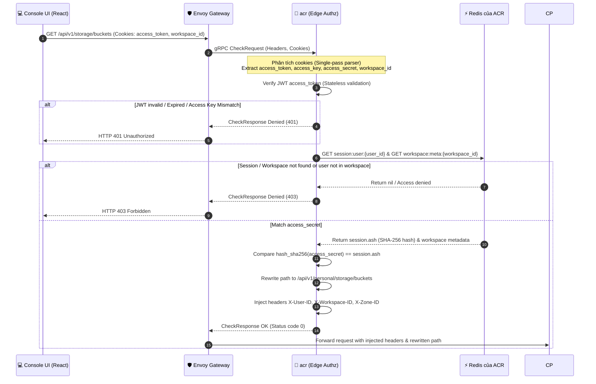
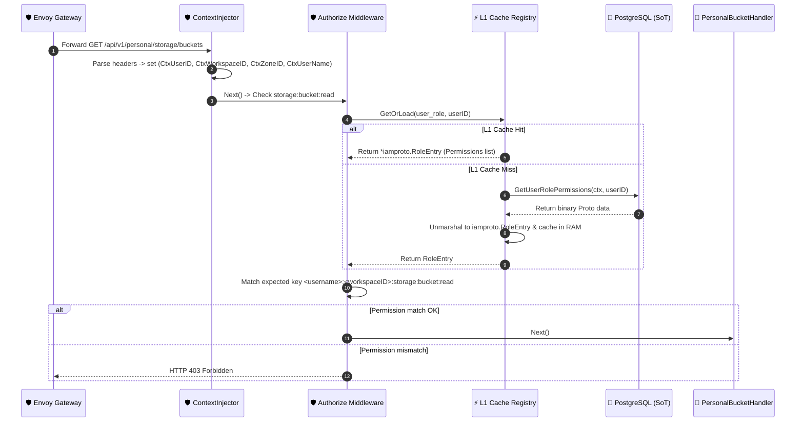
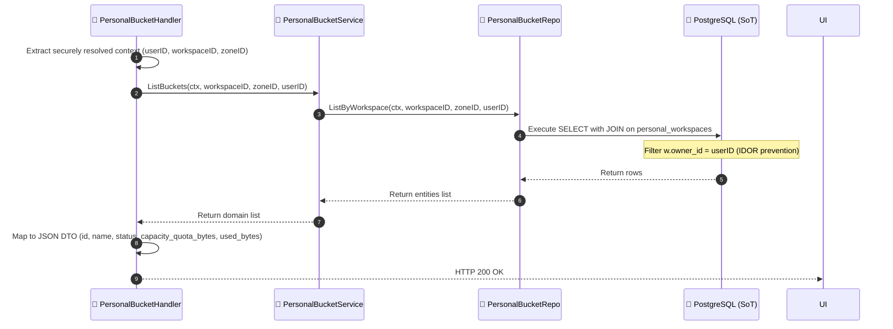
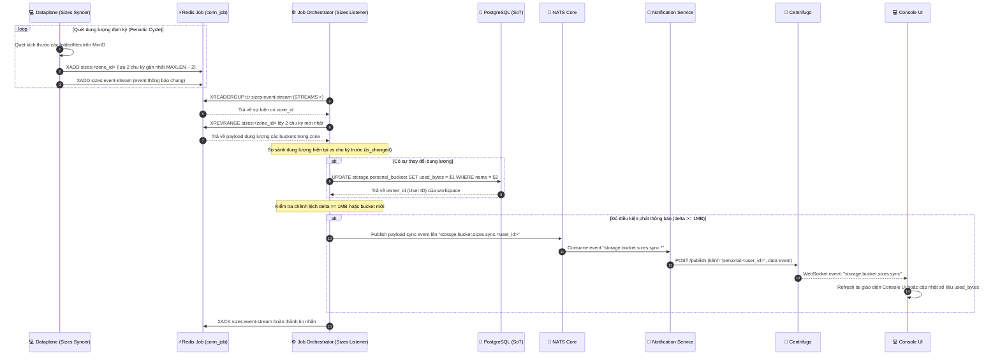

# Bucket Listing — God View (Master SoT)

> [!IMPORTANT]
> Tài liệu này là **Source of Truth (SoT) duy nhất** cho toàn bộ vòng đời và luồng xử lý truy vấn Liệt Kê Bucket (Bucket Listing) trong phân hệ Storage của người dùng cá nhân.
> **Mọi thay đổi** liên quan đến: API Gateway route, path rewrite logic, Authorize Middleware (RBAC L1/L2 Cache Registry), CSDL PostgreSQL query, cơ chế đồng bộ dung lượng (`used_bytes`) bất đồng bộ từ Dataplane, và Observability **đều phải tham chiếu và cập nhật** tệp này trước.

---

## Mục Lục

1. [Tổng Quan Kiến Trúc & Chuỗi Nhân Quả](#1-tổng-quan-kiến-trúc--chuỗi-nhân-quả)
2. [Cơ Chế Chống Lỗi IDOR (Insecure Direct Object Reference)](#2-cơ-chế-chống-lỗi-idor-insecure-direct-object-reference)
3. [Database Query Contract & Join Schema](#3-database-query-contract--join-schema)
4. [Luồng Liệt Kê Bucket Chi Tiết — End-to-End](#4-luồng-liệt-kê-bucket-chi-tiết--end-to-end)
   - [Phase 1: Envoy and ACR (Xác thực người dùng tại Biên & Path Rewrite)](#phase-1-envoy-and-acr-xác-thực-người-dùng-tại-biên--path-rewrite)
   - [Phase 2: Controlplane Processing (Middleware & RBAC L1/L2 Cache)](#phase-2-controlplane-processing-middleware--rbac-l1l2-cache)
   - [Phase 3: Database Query Execution (Thực thi truy vấn PostgreSQL)](#phase-3-database-query-execution-thực-thi-truy-vấn-postgresql)
   - [Phase 4: Asynchronous Used Bytes Synchronization (Chu kỳ đồng bộ dung lượng ngầm)](#phase-4-asynchronous-used-bytes-synchronization-chu-kỳ-đồng-bộ-dung-lượng-ngầm)
5. [Bảo Vệ Tải & HA Guards](#5-bảo-vệ-tải--ha-guards)
6. [Observability (Giám Sát Vận Hành)](#6-observability-giám-sát-vận-hành)
7. [Danh Sách Keys (Redis & NATS)](#7-danh-sách-keys-redis--nats)
8. [Tham Chiếu Code Toàn Hệ Thống](#8-tham-chiếu-code-toàn-hệ-thống)

---

## 1. Tổng Quan Kiến Trúc & Chuỗi Nhân Quả

Luồng **Liệt Kê Bucket (List Bucket)** của người dùng cá nhân (Personal) vận hành thông qua hai trục kiến trúc song song:
1. **Trục Đọc Đồng Bộ (Synchronous Read API Path)**: Đi từ Client UI $\to$ Envoy/ACR (Xác thực) $\to$ Controlplane (RBAC L1/L2 Cache) $\to$ PostgreSQL SoT.
2. **Trục Đồng Bộ Dung Lượng Bất Đồng Bộ (Asynchronous Used Bytes Sync Path)**: Dataplane quét dung lượng định kỳ $\to$ Đẩy lên Redis Stream $\to$ Job Orchestrator tiêu thụ và cập nhật ngược lại Postgres SoT $\to$ Phát tín hiệu qua NATS & Centrifugo để Console UI cập nhật real-time.

```mermaid
flowchart TD
    classDef ui fill:#1e3a8a,stroke:#3b82f6,color:#ffffff,stroke-width:2px;
    classDef cp fill:#1f2937,stroke:#9ca3af,color:#ffffff,stroke-width:2px;
    classDef db fill:#5b21b6,stroke:#8b5cf6,color:#ffffff,stroke-width:2px;
    classDef queue fill:#7c2d12,stroke:#ea580c,color:#ffffff,stroke-width:2px;
    classDef dp fill:#064e3b,stroke:#10b981,color:#ffffff,stroke-width:2px;

    %% Trục Đọc Đồng Bộ (API Path)
    UI["💻 Console UI (React)"]:::ui
    Envoy["🛡️ Envoy Gateway"]:::ui
    ACR["🔐 acr (Edge Authz)"]:::ui
    CP["🚀 Controlplane API (Go)"]:::cp
    PG_DB["💾 PostgreSQL SoT (Storage DB)"]:::db

    UI -->|1. GET /api/v1/storage/buckets| Envoy
    Envoy -->|2. gRPC CheckRequest| ACR
    ACR -->|3. Validate Cookies & Session| ACR
    ACR -->|4. gRPC CheckResponse OK| Envoy
    Envoy -->|5. Rewrite path & Forward| CP
    CP -->|6. Authorize check (L1 Cache Miss -> DB Loader)| CP
    CP -->|7. Query SELECT (JOIN personal_workspaces)| PG_DB
    PG_DB -->|8. Return rows| CP
    CP -->|9. HTTP 200 OK| Envoy
    Envoy -->|10. Return JSON List| UI

    %% Trục Đồng Bộ Dung Lượng Bất Đồng Bộ (Background Sync)
    DP_Syncer["💻 Dataplane (Sizes Syncer)"]:::dp
    Redis_Job["⚡ Redis Job Stream (sizes:event-stream)"]:::queue
    JO_Listener["⚙️ Job Orchestrator (Sizes Listener)"]:::cp
    NATS["🧲 NATS Core"]:::queue
    NS_Listener["📡 Notification Service"]:::ui
    Centri["📡 Centrifugo (WS Gateway)"]:::ui

    DP_Syncer -->|A. Periodic Scan & XADD| Redis_Job
    Redis_Job -->|B. Read Stream event| JO_Listener
    JO_Listener -->|C. UPDATE storage.personal_buckets SET used_bytes| PG_DB
    JO_Listener -->|D. Publish size delta >= 1MB| NATS
    NATS -->|E. Consume sync.* event| NS_Listener
    NS_Listener -->|F. POST /publish| Centri
    Centri -.->|G. Push WebSocket event| UI
```

---

## 2. Cơ Chế Chống Lỗi IDOR (Insecure Direct Object Reference)

Để ngăn ngừa triệt để lỗ hổng IDOR (nơi một người dùng có thể dự đoán hoặc thay đổi tham số ID của người khác để liệt kê trái phép tài nguyên không thuộc về mình), hệ thống thực thi mô hình bảo mật 3 lớp chặt chẽ:

### Lớp 1: Triệt tiêu tham số Client-supplied (Chống Spoofing tại Gateway)
- Client (Console UI) **không được phép** chèn các thông tin như `X-User-ID`, `X-Workspace-ID`, hay `X-Zone-ID` vào HTTP Headers của request.
- Nếu client tự gửi các headers này, Envoy Gateway cấu hình Ext Authz sẽ lọc bỏ và ghi đè hoàn toàn bằng các headers được sinh ra từ kết quả xác thực đáng tin cậy của dịch vụ `acr` (Edge Authz).

### Lớp 2: Ràng buộc danh tính tĩnh tại Edge Authz (`acr`)
- `acr` phân tích Token JWT từ cookie `access_token` để lấy định danh thực tế của người dùng đăng nhập (`uid`).
- `acr` lấy `workspace_id` từ cookie của trình duyệt, sau đó truy vấn Metadata Cache trên Redis của ACR (`workspace:meta:{workspace_id}`) để xác thực:
  1. Workspace này thực sự tồn tại trên hệ thống.
  2. Người dùng `uid` thực sự thuộc về workspace này và có quyền truy cập.
- `acr` tự động phân giải `zone_id` của workspace và trả về cho Envoy inject vào request. Client không thể tự gửi `zone_id` giả mạo để đọc chéo phân vùng vật lý.

### Lớp 3: Đối chiếu quyền hạn Workspace & Database Join (PostgreSQL)
1. **Kiểm tra quyền tĩnh theo Workspace**: Authorize Middleware tại Controlplane thực hiện đối chiếu quyền của user nạp từ cache registry. Khoá đối chiếu bắt buộc phải khớp định dạng `<username>:<workspaceID>:storage:bucket:read`. Nếu kẻ tấn công thay đổi cookie `workspace_id` sang một ID ngẫu nhiên, L1 Cache Registry sẽ không tìm thấy quyền tương ứng cho workspace đó trong danh sách aggregated permissions của user và trả về `403 Forbidden` ngay lập tức.
2. **Database JOIN Constraint**: Tại tầng lưu trữ (Repository), câu lệnh SQL không tin tưởng các tham số ID truyền vào một cách độc lập mà thực thi một phép nối ràng buộc quan hệ sở hữu:
   - Query nối bảng `storage.personal_buckets` với `hierarchy.personal_workspaces` qua điều kiện `b.workspace_id = w.id`.
   - Bộ lọc khóa: `w.owner_id = $3` (trong đó `$3` bắt buộc là `userID` trích xuất từ JWT token đã kiểm chứng chữ ký số).
   - **Hệ quả bảo mật**: Nếu kẻ tấn công vượt qua được các tầng trên bằng cách nhập một `workspace_id` hợp lệ của người khác, điều kiện `w.owner_id = $3` sẽ ép phép JOIN trả về kết quả rỗng (0 dòng) do kẻ tấn công không phải chủ sở hữu (`owner_id`) của workspace đó.

---

## 3. Database Query Contract & Join Schema

* **CSDL SoT**: [`000001_storage_tables.up.sql`](../../controlplane/internal/storage/migrations/000001_storage_tables.up.sql)
* **SQL Query Contract**:
```sql
SELECT b.id, b.name, b.status, b.capacity_quota_bytes, b.used_bytes, b.created_at, b.updated_at
FROM storage.personal_buckets b
JOIN hierarchy.personal_workspaces w ON b.workspace_id = w.id
WHERE b.workspace_id = $1 AND b.zone_id = $2 AND w.owner_id = $3 AND w.zone_id = $2
ORDER BY b.created_at DESC;
```

### Chi tiết tham số Binding:
- **`$1`**: Securely injected `X-Workspace-ID` (Trích xuất từ cookie trình duyệt).
- **`$2`**: Securely injected `X-Zone-ID` (ACR tự phân giải từ cấu hình workspace, không dùng zone client gửi).
- **`$3`**: Securely injected `X-User-ID` (Stateless Claims từ JWT Token đã được xác thực chữ ký mật mã).

---

## 4. Luồng Liệt Kê Bucket Chi Tiết — End-to-End

### Phase 1: Envoy and ACR (Xác thực người dùng tại Biên & Path Rewrite)

Yêu cầu lấy danh sách bucket của người dùng sẽ đi qua cổng bảo mật biên để phân giải vùng và viết lại URI đường dẫn API.

#### A. Sơ đồ trình tự xử lý (Sequence Diagram)


#### B. Danh sách Cookies nhận dạng từ Client (Received Cookies)
ACR tiếp nhận và phân tích bộ cookie từ trình duyệt (Client Browser) gửi lên bao gồm các thành phần xác thực (Trinity Token), ngữ cảnh giao diện, và trạng thái làm việc:

| Tên Cookie | Kiểu dữ liệu | Phạm vi bảo mật | Vai trò / Mục đích |
|:---|:---|:---|:---|
| **`access_token`** | `JWT String` | HttpOnly, Secure, SameSite=Strict | Mảnh thứ nhất của bộ ba Trinity: Chứa chữ ký số mật mã của IAM, mang các định danh claims (`sub`, `role`, `lvl`, `tenant_id`, `zone_id`) và `access_key`. |
| **`access_key`** | `UUIDv7 String` | Secure, SameSite=Strict | Mảnh thứ hai của bộ ba Trinity: Định danh phiên làm việc, dùng làm khóa phiên để tra cứu dữ liệu session runtime tại Redis của ACR. |
| **`access_secret`** | `Secure String` | HttpOnly, Secure, SameSite=Strict | Mảnh thứ ba của bộ ba Trinity: Khóa bí mật thô giúp chống lại các cuộc tấn công đánh cắp phiên qua XSS. |
| **`refresh_token`** | `Opaque String` | HttpOnly, Secure, SameSite=Strict | Token dài hạn dùng để cấp lại bộ ba Trinity mới khi `access_token` hết hạn. |
| **`workspace_id`** | `UUID String` | Secure, SameSite=Strict | Lưu ID của Workspace hiện tại mà người dùng đang thao tác trên Console UI. |
| **`zone_code`** | `VARCHAR String` | Secure, SameSite=Strict | Mã vùng địa lý active hiện tại (ví dụ: `vn-han-1`), do ACR thiết lập sau khi đăng nhập để Console UI đồng bộ ngữ cảnh. |

#### C. Bảng các Headers chuyển tiếp về Controlplane (Forwarded Headers)
Envoy chèn các HTTP headers bảo mật tuyệt đối đáng tin cậy đã qua xác thực của `acr` trước khi chuyển tiếp yêu cầu:

| Tên Header | Nguồn gốc phân giải | Vai trò bảo mật đối với Controlplane |
|:---|:---|:---|
| **`X-User-Id`** | Trích xuất từ JWT `access_token` | Xác minh quyền sở hữu tài nguyên trực tiếp ở lớp DB |
| **`X-Workspace-Id`** | Client gửi lên $\rightarrow$ Được `acr` đối chiếu RBAC | Giới hạn bucket thuộc về workspace này |
| **`X-Zone-Id`** | Phân giải từ metadata workspace trong cache `acr` | Xác định vùng địa lý chứa bucket vật lý |
| **`X-User-Level`** | Trích xuất từ JWT `access_token` | Định nghĩa level phân cấp tài khoản người dùng (Root=0, User=8) |
| **`X-User-Name`** | Trích xuất từ JWT `access_token` | Tên tài khoản, dùng để map Expected Permission Key |
| **`X-User-Role-ID`** | Trích xuất từ JWT `access_token` | ID của Role hiện tại để load permissions |
| **`X-Client-Device-ID`** | Envoy trích xuất từ Headers | Định danh ID thiết bị kết nối của client |
| **`X-Tenant-ID`** | *Vắng mặt* | Không tồn tại đối với luồng Personal Bucket |
| **`X-Request-Id`** | Envoy sinh tự động | Truy vết log đồng bộ (correlation-id) |
| **`traceparent`** | OTel Tracer | Phục vụ Distributed Tracing |
| **`x-original-path`** | Envoy trích xuất ban đầu | Ghi nhận endpoint gốc (`/api/v1/storage/buckets`) trước khi rewrite |

---

### Phase 2: Controlplane Processing (Middleware & RBAC L1/L2 Cache)

Khi yêu cầu viết lại chạm tới Controlplane REST API, hệ thống tiến hành kiểm tra phân quyền RBAC và thực thi truy vấn.

#### A. Sơ đồ trình tự xử lý (Sequence Diagram)


---

### Phase 3: Database Query Execution (Thực thi truy vấn PostgreSQL)

#### A. Sơ đồ trình tự xử lý (Sequence Diagram)


---

### Phase 4: Asynchronous Used Bytes Synchronization (Chu kỳ đồng bộ dung lượng ngầm)

Trường `used_bytes` (dung lượng đã sử dụng) của bucket không được Controlplane tính toán đồng bộ theo từng request để đảm bảo hiệu năng. Nó được đồng bộ ngầm thông qua chu kỳ quét bất đồng bộ sau:



---

## 5. Bảo Vệ Tải & HA Guards

Do luồng Liệt kê Bucket thực hiện đọc trực tiếp từ Database PostgreSQL, hệ thống áp dụng các quy chuẩn bảo vệ để tránh quá tải CSDL trong môi trường HA Active-Active:

1. **Giới hạn Timeout chặt chẽ**: Toàn bộ luồng từ Handler đến Repository được bọc bởi `context.WithTimeout(..., 5*time.Second)` đảm bảo các truy vấn nghẽn mạng hoặc khóa DB bị giải phóng sớm, không gây treo tài nguyên container.
2. **Cô lập theo Zone**: Lệnh query lọc chính xác theo `zone_id`. Điều này giúp cô lập phạm vi quét index của database và sẵn sàng cho việc phân tách cơ sở dữ liệu (sharding) theo vùng địa lý trong tương lai.

---

## 6. Observability (Giám Sát Vận Hành)

### 6.1 Logs
Hệ thống sử dụng Structured Log để dễ dàng truy vết và tìm kiếm trong Kibana/Grafana Loki. Danh sách các mã Operation (`op`) cốt lõi:

| Mã Operation (`op`) | Thành phần | Vị trí định nghĩa | Ý nghĩa / Mục tiêu giám sát |
|:---|:---|:---|:---|
| **`storage.personal_bucket.list`** | Controlplane | [`personal_bucket_handler.go`](../../controlplane/internal/storage/transport/http/handler/personal_bucket_handler.go#L150) | Tiếp nhận yêu cầu lấy danh sách bucket của người dùng |
| **`auth.authorize`** | Controlplane | [`authorize.go`](../../controlplane/internal/http/middleware/authorize.go#L43) | Kiểm tra quyền tĩnh đọc bucket `storage:bucket:read` |
| **`ext_authz.path_rewrite`** | ACR | [`ext_authz.rs`](../../acr/src/service/ext_authz.rs#L919) | Ghi nhận chi tiết rewrite đường dẫn từ biên của Envoy |
| **`storage_listener.db_write`** | Job Orchestrator | [`listener.rs`](../../job-orchestrator/src/reverse_provider/storage/listener.rs#L224) | Ghi nhận sự kiện cập nhật thành công dung lượng bucket vào Postgres |

### 6.2 Metrics
Toàn bộ hệ thống đẩy (push model) các metric đo lường OpenTelemetry trực tiếp về OTel Collector. Danh sách các metric liên quan trực tiếp đến luồng Read Storage Bucket:

| Tên Metric | Loại | Ý nghĩa / Mục tiêu đo lường | Vị trí định nghĩa |
|:---|:---|:---|:---|
| `aurora_http_requests_total` | Counter | Tổng số HTTP requests đã xử lý (phân nhãn theo `method`, `route`, `status`) | [`observability/metrics.go#L123`](../../controlplane/internal/observability/metrics.go#L123) |
| `aurora_http_request_duration_seconds` | Histogram | Biểu đồ tần suất độ trễ xử lý HTTP request (bao gồm API List Bucket) | [`observability/metrics.go#L133`](../../controlplane/internal/observability/metrics.go#L133) |
| `aurora_dependency_duration_seconds` | Histogram | Độ trễ truy vấn PostgreSQL SELECT | [`observability/metrics.go#L150`](../../controlplane/internal/observability/metrics.go#L150) |

### 6.3 Tracing
Hệ thống sử dụng OpenTelemetry Tracing kết hợp W3C Context Propagation để đồng bộ vết cuộc gọi phân tán giữa các thành phần độc lập:

| Bước luồng | Hành động (Span / Context Action) | Cơ chế truyền tải (Propagation Mechanism) | Vị trí định nghĩa |
|:---|:---|:---|:---|
| **1. Khởi tạo Context** | Envoy sinh hoặc nhận `traceparent` từ browser và truyền tải sang Controlplane | HTTP Header `traceparent` | [`observability.go`](../../controlplane/internal/http/middleware/observability.go#L20) |
| **2. Thực thi SELECT** | Mở Span con `db.query:select.personal_buckets` đo đạc thời gian DB phản hồi | Context Go | [`personal_bucket_repo.go`](../../controlplane/internal/storage/repository/personal_bucket_repo.go#L193) |

---

## 7. Danh Sách Keys (Redis & NATS)

Để đảm bảo tính nhất quán tuyệt đối và tránh key collision (xung đột khóa) trong môi trường phân tán HA, danh sách khóa liên quan đến luồng đọc được quy chuẩn cụ thể:

### 7.1 Redis Instance Keys

| Thực thể Redis | Tên Key / Pattern | Loại dữ liệu | Mô tả / Ý nghĩa |
|:---|:---|:---|:---|
| **Redis của ACR** | `session:user:{user_id}` | String | Cache thông tin phiên làm việc đã xác thực của người dùng. |
| **Redis của ACR** | `workspace:meta:{workspace_id}` | Hash | Cache cấu hình của Workspace (`zone_id`, `tenant_id`,...) giúp ACR xác thực chống gia mạo. |
| **Redis của ACR** | `user_role:{user_id}` | Hash | Cache aggregated Static Permissions (`*iamproto.RoleEntry`) cho người dùng cá nhân. |
| **Redis Job** | `sizes:{zone_id}` | Stream | Lưu trữ dữ liệu quét dung lượng bucket các chu kỳ (giới hạn MAXLEN ~ 2). |
| **Redis Job** | `sizes:event-stream` | Stream | Stream thông báo chung khi có chu kỳ quét dung lượng mới hoàn thành ở Zone. |

### 7.2 NATS Subjects

| Tên NATS Subject | Publisher | Subscriber | Mô tả / Ý nghĩa |
|:---|:---|:---|:---|
| **`storage.bucket.sizes.sync.<user_id>`** | Job Orchestrator | Notification Service | Bắn tín hiệu thay đổi dung lượng bucket (delta >= 1MB) cho user cụ thể. |

---

## 8. Tham Chiếu Code Toàn Hệ Thống

| Tệp tin | Vị trí định nghĩa | Vai trò trong luồng |
|:---|:---|:---|
| **SQL Migrations** | [`000001_storage_tables.up.sql`](../../controlplane/internal/storage/migrations/000001_storage_tables.up.sql) | Schema lưu trữ Bucket |
| **Go Route** | [`route.go`](../../controlplane/internal/storage/route.go#L34) | Khai báo route GET `/storage/buckets` |
| **Go Controller** | [`personal_bucket_handler.go`](../../controlplane/internal/storage/transport/http/handler/personal_bucket_handler.go#L150) | Endpoint tiếp nhận request list Buckets |
| **Go Service** | [`personal_bucket_service.go`](../../controlplane/internal/storage/service/personal_bucket_service.go#L157) | Điều phối luồng và gọi Repo |
| **Go Repository** | [`personal_bucket_repo.go`](../../controlplane/internal/storage/repository/personal_bucket_repo.go#L184) | Thực thi SELECT truy vấn dữ liệu có JOIN |
| **Rust Gateway Authz** | [`ext_authz.rs`](../../acr/src/service/ext_authz.rs#L859) | Phân tích và rewrite path, inject headers an toàn |
| **Rust Session Verifier** | [`verifier.rs`](../../acr/src/service/session/verifier.rs#L107) | Xác thực chữ ký và băm SHA-256 `access_secret` tại Edge |
| **Rust Dataplane Scanner** | [`sizes_syncer.rs`](../../dataplane/src/executor/storage/sizes_syncer.rs#L188) | Quét dung lượng MinIO và đẩy lên Redis Stream |
| **Rust JO Listener** | [`listener.rs`](../../job-orchestrator/src/reverse_provider/storage/listener.rs#L20) | Tiêu thụ Redis Stream, cập nhật CSDL PostgreSQL và bắn NATS |
| **Go NATS Handler** | [`sizes_handler.go`](../../controlplane/internal/storage/transport/pubsub/handler/sizes_handler.go#L46) | Queue subscriber đồng bộ dung lượng trong Controlplane |
| **Rust NS Listener** | [`listener.rs`](../../notification-service/src/listener.rs#L57) | Subscribe NATS sync event và publish qua Centrifugo WebSocket |
