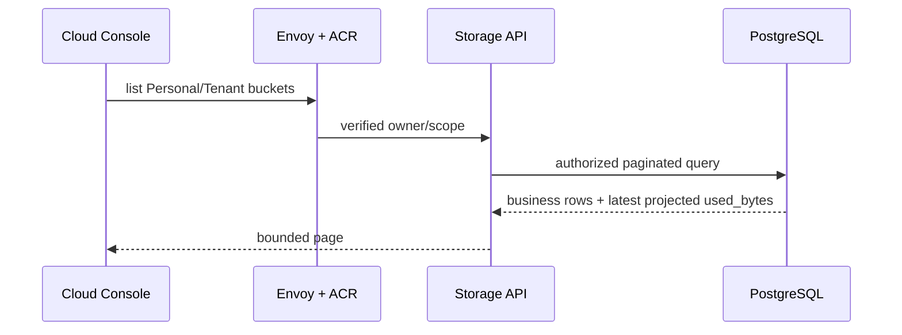
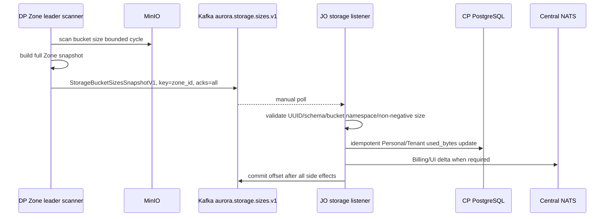

# Storage Bucket List and Size Projection — God View

> [!IMPORTANT]
> Bucket catalogue/ownership là business data trong PostgreSQL. Dynamic size được Dataplane đo và phát
> `StorageBucketSizesSnapshotV1` qua Central Kafka; không còn Redis size streams.

## 0. Read path

Personal và Tenant dùng handler/service/repository entity riêng. Client không gửi authoritative owner.
Query phải page/cursor bounded; không load toàn bộ workspace.

## 1. Size measurement path

Snapshot fields:

- 16-byte event ID;
- 16-byte Zone ID;
- observation timestamp;
- repeated `{bucket_name, size_bytes}`;
- schema version `1`.

## 2. Correctness

- Scanner chạy trong stable Zone leader session; current-owner check và leader fencing chỉ cho một
  full snapshot authoritative.
- Kafka key is Zone ID; producer uses `acks=all`.
- JO uses `IS DISTINCT FROM` in PostgreSQL, so replay is idempotent without an unbounded per-Zone RAM snapshot.
- Poison snapshot is durable DLQ then commit.
- DB failure stops the partition before a higher offset can commit. Shared Redis notification failure is
  best-effort because PostgreSQL is already authoritative and the UI can refetch.
- Duplicate snapshot/update is safe.
- Out-of-order business update must use observation/version fence in repository where historical ordering matters.
- Dynamic scanner state/history is not persisted in Zone KV or a mail-style history table.

## 3. Billing boundary

Bucket snapshot chỉ cập nhật Controlplane `used_bytes` phục vụ authorized list API. Nó không phát
usage event sang Cost. Cost Manager projects ownership riêng và tính usage từ ClickHouse theo
`storage_usage_billing_god_view.md`; charging path không query Controlplane DB.

## 4. Failure matrix

| Failure | Behavior |
|---|---|
| MinIO scan fails | Không publish partial authoritative snapshot |
| Kafka quorum fails | Snapshot not ACKed; scanner retries next bounded cycle |
| JO DB failure | Offset uncommitted; listener restart/replay |
| Shared Redis notification failure after DB update | Commit Kafka; UI refetch authoritative API |
| Poison bucket namespace/negative bytes | DLQ before commit |
| DP leader dies | `lease.zone.leader` expires; leader mới tiếp tục scan |

## 5. Code map

- `dataplane/src/leader/infra/storage.rs`: leader-only storage health, customer bucket-size scan và Kafka publish.
- `job-orchestrator/src/storage_usage/worker.rs`: validate/update/notify/commit.
- `job-orchestrator/src/storage_usage/store.rs`: idempotent Personal/Tenant size update.
- `controlplane/internal/storage/`: authorized list API.
- `contracts/proto/platform_transport.proto`: `StorageBucketSizesSnapshotV1`.
