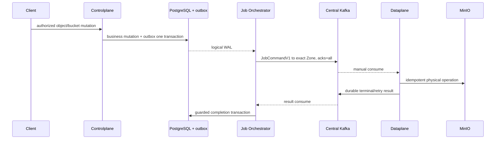

# Storage Object Management — God View

> [!IMPORTANT]
> Object/bucket mutations use the same PostgreSQL outbox → JO WAL → Central Kafka → Dataplane Zone →
> Kafka result lifecycle defined in
> [`bucket_creation_god_view.md`](bucket_creation_god_view.md).

## 1. Boundary

- Browser/SDK calls Envoy public route; ACR validates identity/session proof.
- Controlplane owns authorization, ownership and business metadata.
- JO owns CDC dispatch/result routing, not business authorization.
- Dataplane owns physical MinIO operation in the selected Zone.
- Cost receives projected `owner_id + owner_type`; it never queries CP DB in charging path.

## 2. Generic mutation sequence

## 3. Invariant

- `job_id`, resource ID, Zone and schema are immutable for an attempt chain.
- Retry increments attempt and publishes durable retry before settling original.
- Poison command/result goes DLQ before commit.
- Rebalance epoch and contiguous settlement prevent stale/high offset commits.
- Physical delete precedes business hard-delete.
- External MinIO operation requires stable idempotency semantics.
- Plaintext infrastructure credential never enters Kafka or PostgreSQL business payload.

## 4. Size/read model

Bucket size is a separate periodic snapshot workflow documented in
[`bucket_list_god_view.md`](bucket_list_god_view.md). It uses
`aurora.storage.sizes.v1`, not command/result topics and not Redis Streams.

## 5. References

- Platform transport: [`kafka_platform_transport_god_view.md`](../platform/kafka_platform_transport_god_view.md)
- Bucket create/delete: [`bucket_creation_god_view.md`](bucket_creation_god_view.md)
- Bucket list/size: [`bucket_list_god_view.md`](bucket_list_god_view.md)
- Ownership: [`resource_ownership_god_view.md`](../billing/resource_ownership_god_view.md)
