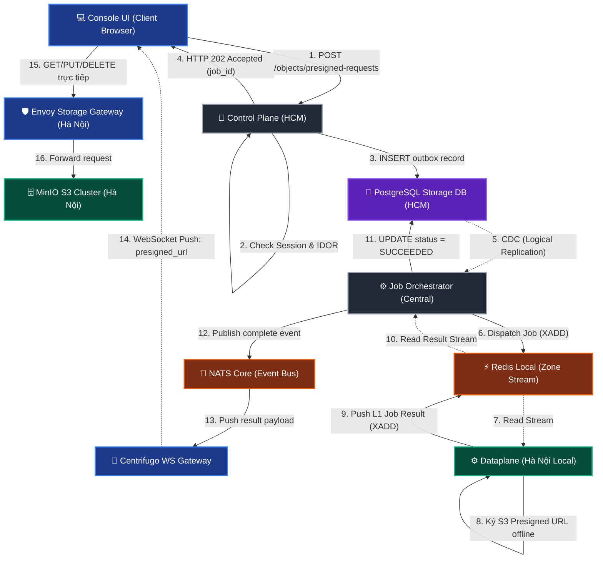

# Storage Object Management (List & Presigned URLs) — God View (Master SoT)

> [!IMPORTANT]
> Tài liệu này là **Source of Truth (SoT) duy nhất** cho toàn bộ vòng đời và luồng xử lý truy vấn duyệt đối tượng (Object Browsing via Presigned List) và tạo Presigned URL cho các thao tác (Upload/Download/Delete) trong phân hệ Storage.
> **Mọi thay đổi** liên quan đến: API Gateway route, cấu trúc Outbox table, cơ chế CDC của Job Orchestrator, thuật toán ký của Dataplane local zone, và Observability **đều phải tham chiếu và cập nhật** tệp này trước.

---

## Mục Lục

1. [Tổng Quan Kiến Trúc & Chuỗi Nhân Quả](#1-tổng-quan-kiến-trúc--chuỗi-nhân-quả)
2. [Cơ Chế Chống Lỗi IDOR & Bảo Mật Khoá Ký](#2-cơ-chế-chống-lỗi-idor--bảo-mật-khoá-ký)
3. [Database Query Contract & Outbox Schema](#3-database-query-contract--outbox-schema)
4. [Luồng Kỹ Thuật Chi Tiết — End-to-End](#4-luồng-kỹ-thuật-chi-tiết--end-to-end)
   - [Phase 1: Đăng ký Job tại Control Plane (Hồ Chí Minh)](#phase-1-đăng-ký-job-tại-control-plane-hồ-chí-minh)
   - [Phase 2: CDC & Dispatcher tại Job Orchestrator (Central)](#phase-2-cdc--dispatcher-tại-job-orchestrator-central)
   - [Phase 3: Thực thi ký tại Dataplane (Hà Nội Local)](#phase-3-thực-thi-ký-tại-dataplane-hà-nội-local)
   - [Phase 4: Nhận kết quả và Client Direct S3 Query](#phase-4-nhận-kết-quả-và-client-direct-s3-query)
5. [Bảo Vệ Tải & HA Guards](#5-bảo-vệ-tải--ha-guards)
6. [Observability (Giám Sát Vận Hành)](#6-observability-giám-sát-vận-hành)
7. [Danh Sách Keys (Redis, NATS & Centrifugo)](#7-danh-sách-keys-redis-nats--centrifugo)
8. [Tham Chiếu Code Toàn Hệ Thống](#8-tham-chiếu-code-toàn-hệ-thống)

---

## 1. Tổng Quan Kiến Trúc & Chuỗi Nhân Quả

Hệ thống quản lý đối tượng (Object Management) vận hành theo nguyên lý **phân tách địa lý** và **không kết nối trực tiếp**:
* **Control Plane (HCM)**: Không được mở kết nối trực tiếp đến MinIO Cluster (Hà Nội). Tất cả các nghiệp vụ dữ liệu thô (list, upload, download, delete) của Client đều giao tiếp trực tiếp với MinIO qua local **Envoy Storage** của zone đó.
* **Dataplane (Hà Nội)**: Là thành phần duy nhất giữ Credentials và kết nối trực tiếp với MinIO Cluster để thực hiện ký Presigned URL offline.
* **Mô hình lai (Hybrid model)**:
  1. **Xem đối tượng (List Objects)**: CP chỉ cấp 1 Presigned S3 List URL thô (wildcard, thời hạn 1 giờ) chỉ có quyền `s3:ListBucket` (không có quyền đọc/ghi file). Client gọi URL này 1 lần duy nhất để tải về toàn bộ metadata XML của bucket và tự động lọc cây thư mục (Client-side filter) trên RAM. Điều này giúp duyệt thư mục ảo với **độ trễ bằng 0ms** khi chuyển folder.
  2. **Thao tác dữ liệu (Upload / Download / Delete)**: Chỉ khi người dùng click vào Action cụ thể (tải, upload, xóa 1 file), UI mới gửi yêu cầu xin cấp Presigned URL thô cho đúng file đó thông qua Outbox Job. Điều này đảm bảo tính bảo mật tối đa (Least Privilege) trước mã độc XSS.
* **Kênh kết nối (Outbox Pipeline)**: Đồng bộ bất đồng bộ từ HCM ra Hà Nội qua PostgreSQL CDC -> Job Orchestrator -> Redis Stream, và trả kết quả ngược lại qua Redis Stream -> NATS Core -> Centrifugo Websocket thẳng về Client Browser (Bypass CP GET API).



---

## 2. Cơ Chế Chống Lỗi IDOR & Bảo Mật Khoá Ký

Để bảo vệ tuyệt đối an toàn thông tin và chống lại các cuộc tấn công đánh cắp credentials tạm thời (XSS) ở phía Client Browser:

### Lớp 1: Chống lỗi IDOR tại Control Plane (HCM)
* CP **không bao giờ** tin tưởng các tham số tên bucket vật lý hay folder path do client truyền lên.
* Client chỉ truyền lên `bucket_id` (UUID).
* CP thực hiện câu lệnh SQL JOIN bắt buộc với `hierarchy.personal_workspaces` để xác nhận User thực thi thực sự là Owner của workspace chứa bucket đó:
  ```sql
  SELECT b.name, b.zone_id 
  FROM storage.personal_buckets b
  JOIN hierarchy.personal_workspaces w ON b.workspace_id = w.id
  WHERE b.id = $1 AND w.owner_id = $2;
  ```
  Nếu không khớp, CP trả về `403 Forbidden` lập tức, không ghi Outbox Job.

### Lớp 2: Bảo mật Khoá Ký (Secret Key Protection)
* Private Key / Secret Key truy cập MinIO chỉ được lưu trữ và sử dụng **cục bộ (locally)** tại Dataplane.
* Client Browser không nhận được bất kỳ credentials thô hay token tạm thời nào (triệt tiêu rủi ro bị đọc trộm qua XSS).
* Client chỉ nhận được **Presigned URL** chứa sẵn tham số chữ ký (`X-Amz-Signature`) trong query string. Client chỉ việc gửi request HTTP thô trực tiếp đến URL đó. Không cần logic ký hay đính kèm custom headers thô ở Browser.

---

## 3. Database Query Contract & Outbox Schema

* **Bảng Outbox**: `storage_outbox_records` trong schema `storage`.
* **Khai báo các Topic Job mới**:
  1. `storage.object.presign`: Job yêu cầu Dataplane thực hiện ký Presigned URL hoặc duyệt danh sách đối tượng (được phân loại động bằng thuộc tính `action` bên trong payload).

### Contract Insert Outbox:
```sql
INSERT INTO storage.storage_outbox_records (
    event_id, routing_scope, job_topic, payload, user_id, status
) VALUES ($1, $2, $3, $4, $5, 'PENDING');
```
* **`$1`**: UUID sinh cho `transaction_id`.
* **`$2`**: `zone:<zone_id>` trích xuất từ cấu hình bucket (giới hạn định tuyến đến Dataplane local của zone đó).
* **`$3`**: `"storage.object.presign"`.
* **`$4`**: Payload Protobuf `ObjectPresignRequest` chứa metadata yêu cầu.

---

## 4. Luồng Kỹ Thuật Chi Tiết — End-to-End

### Phase 1: Đăng ký Job tại Control Plane (Hồ Chí Minh)

#### A. Phân tích chi tiết trao đổi thông tin (Protocol Specification)

```
[Client Browser] 
    |
    | (1) POST /api/v1/storage/buckets/:id/objects/presigned-requests
    | Cookies: access_token, workspace_id, etc.
    |
[Envoy Ingress Gateway]
    |
    | (2) gRPC CheckRequest (mang theo Cookies)
    |
[acr (Edge Authz)]
    |
    |-- a. Giải mã JWT 'access_token' -> lấy user_id, username, role_id
    |-- b. Đọc Redis -> lấy zone_id của workspace
    |-- c. Rewrite URI -> /api/v1/personal/storage/buckets/:id/objects/...
    |
    | (3) gRPC CheckResponse OK + Inject Headers (X-User-Id, X-Workspace-Id, X-Zone-Id, etc.)
    |
[Envoy Ingress Gateway]
    |
    | (4) Forward request kèm các Injected Headers
    |
[Control Plane (HCM) - Go]
    |
    |-- a. Auth Middleware: So khớp Permission Key
    |-- b. IDOR Check: SELECT b.name FROM storage.personal_buckets JOIN personal_workspaces ... WHERE owner_id = X-User-Id
    |-- c. Sinh transaction_id (UUID v7)
    |-- d. INSERT PENDING record vào bảng storage_outbox_records
    |
    | (5) HTTP 202 Accepted (Body: { "transaction_id": "<uuid>" })
    v
[Client Browser]
```

#### B. Payload chi tiết của request:

1. **Yêu cầu xin cấp liên kết hoặc duyệt đối tượng (Object Presigned Request)**:
   * **Client gửi**:
     * Method / URL: `POST /api/v1/storage/buckets/:id/objects/presigned-requests`
     * Body (JSON):
       ```json
       {
         "action": "list" | "upload" | "download" | "delete",
         "bucket_name": "ws-a1b2c3d4-mybucket",
         "key": "assets/images/logo.png",
         "content_type": "image/png"
       }
       ```
       *(Trường `action` nhận các giá trị: `"list"` để duyệt, `"upload"` để tải lên, `"download"` để tải về, `"delete"` để xóa. Trường `key` bắt buộc khi action khác `"list"`. Trường `content_type` tùy chọn cho `"upload"`).*
   * **Control Plane nhận**:
     * Headers: `X-User-Id`, `X-Workspace-Id`, `X-Zone-Id`, v.v.
     * Body: JSON chứa `action`, `bucket_name`, `key`, `content_type`.
     * *Lưu ý về Quota*: Control Plane đóng vai trò ủy quyền (Delegation) đơn thuần: CP chỉ kiểm tra tính hợp lệ của Session và quyền sở hữu (IDOR prevention). CP **không** thực hiện kiểm tra hoặc đặt trước (Reserve) quota tại HCM, vì MinIO local đã được cấu hình quota vật lý trên chính bucket và sẽ tự động từ chối (reject) request upload (PUT) từ Client nếu vượt quá hạn mức.
    * **Control Plane ghi Outbox Record**:
      * `job_topic`: `"storage.object.presign"`
      * `payload`: `ObjectPresignRequest` Protobuf chứa đầy đủ thông tin yêu cầu.
   * **Control Plane trả về**:
     * Status code: `202 Accepted`
     * Body (JSON): `{ "transaction_id": "6a2f3e8b-11c9-4a4b-9eef-1234567890ab" }`

---

### Phase 2: CDC & Dispatcher tại Job Orchestrator (Central)

1. **Job Orchestrator (Rust)** bắt được log replication (CDC Stream) của dòng mới chèn vào `storage.storage_outbox_records`.
2. **JO phân tích**:
   * Kiểm tra cột `status` == `'PENDING'`.
   * Đọc `routing_scope` để biết zone đích (ví dụ: `'zone:vn-han-1'`).
3. **JO chuyển tiếp (Dispatch)**:
   * JO đẩy Job thô vào Redis Stream local của zone tương ứng trên Redis Job Broker:
     `XADD storage:jobs:vn-han-1 * id <job_id> topic <job_topic> payload <binary_payload> trace_id <trace_id>`
   * Cập nhật trạng thái outbox record trong DB sang `'PROCESSING'`.

---

### Phase 3: Thực thi ký tại Dataplane (Hà Nội Local)

1. **Dataplane (Rust)** tại Hà Nội block read từ Redis Stream local:
   `XREADGROUP GROUP dp_group local_worker STREAMS storage:jobs:vn-han-1 >`
2. **DP phân giải Job**:
   * Giải mã binary payload của Job.
   * Lấy credentials truy cập MinIO được quản lý local (đã được provisioning từ trước).
3. **DP ký S3 Presigned URL (AWS Signature Version 4 offline)**:
   * **Đối với job `storage.object.list_presigned`**:
     * DP gọi MinIO/S3 Client SDK tạo Presigned GET URL cho path `/<bucket_name>`.
     * Ràng buộc ký: Chỉ định query params `list-type=2`. **Không truyền prefix/delimiter**.
     * Thiết lập thời hạn hết hạn ký (Expires) là 1 giờ.
     * URL trả về chỉ có quyền ListObjectsV2 thô, ví dụ: `https://envoy.storage.local/ws-a1b2c3d4-mybucket?list-type=2&X-Amz-Algorithm=AWS4-HMAC-SHA256&X-Amz-Credential=...&X-Amz-Date=...&X-Amz-Expires=3600&X-Amz-SignedHeaders=host&X-Amz-Signature=...`
   * **Đối với job `storage.object.presigned_url`**:
     * Dựa trên `action` yêu cầu, DP gọi SDK ký offline:
       * `"upload"` $\to$ Ký Presigned PUT URL cho object key đó.
       * `"download"` $\to$ Ký Presigned GET URL cho object key đó.
       * `"delete"` $\to$ Ký Presigned DELETE URL cho object key đó.
     * URL trả về chứa trực tiếp signature token trong query string.
4. **DP trả kết quả**:
   * DP gửi kết quả đã ký ngược lại cho `job-orchestrator` bằng cách đẩy vào Redis Stream kết quả chung:
     `XADD storage:results * job_id <job_id> status SUCCEEDED payload <result_protobuf>`

---

### Phase 4: Nhận kết quả và Client Direct S3 Query

1. **Job Orchestrator (Central)** đọc Redis Stream `storage:results`.
2. **JO xử lý**:
   * Cập nhật Postgres outbox record tương ứng: Đổi `status` thành `'SUCCEEDED'`, cập nhật `completed_at = now()`.
   * **JO phát tin nhắn (NATS Core)**:
     * Topic: `storage.job.completed.<transaction_id>`
     * Payload (JSON): Chứa dữ liệu trả về từ Dataplane:
       * Đối với list/upload/download/delete: `{ "status": "COMPLETED", "presigned_url": "https://envoy.storage.local/ws-..." }`
3. **Notification Service & Centrifugo**:
   * Dịch vụ Notification lắng nghe topic NATS `storage.job.completed.*`.
   * Nó thực hiện POST API gửi payload này sang **Centrifugo WS Gateway**:
     `POST /api/publish` -> Kênh WebSocket: `storage:result:{transaction_id}`.
4. **Console UI (React)**:
   * Client nhận được push event WebSocket từ Centrifugo:
     * Event name: `"job_completed"`
     * Payload: Chứa `presigned_url`.
   * **Thao tác truy cập trực tiếp (Bypass Control Plane)**:
     * **Với List**: UI thực hiện `GET <presigned_url>` trực tiếp lên Envoy Storage local. Envoy định tuyến đến MinIO và trả về XML. UI parse XML thành danh sách file/folder lưu vào RAM (`allObjects`).
     * **Với Upload**: UI thực hiện `PUT <presigned_url>` trực tiếp (Payload là file binary thô).
     * **Với Download**: UI chỉ việc trigger `window.open(presigned_url, '_blank')` để tải file.
     * **Với Delete**: UI thực hiện `DELETE <presigned_url>` trực tiếp.

---

## 5. Bảo Vệ Tải & HA Guards

1. **Bảo vệ tải WAN Network**: Luồng dữ liệu thô (List XML, file upload/download) đi trực tiếp từ Client tới Envoy Gateway local tại Hà Nội, không tốn băng thông đường truyền WAN liên vùng (HCM - HN) của Control Plane.
2. **Graceful Timeout**: Client UI lắng nghe Websocket tối đa 30 giây. Quá 30 giây mà mạng WAN HCM-HN bị ngắt làm chậm trễ Job, UI sẽ báo timeout và chuyển hướng sang chế độ retry.

---

## 6. Observability (Giám Sát Vận Hành)

### 6.1 Logs

| Mã Operation (`op`) | Thành phần | Vị trí | Ý nghĩa / Mục tiêu |
|:---|:---|:---|:---|
| **`storage.object.list_request`** | Controlplane | `personal_bucket_handler.go` | Tiếp nhận đăng ký job List Objects |
| **`storage.object.presigned_url_request`** | Controlplane | `personal_bucket_handler.go` | Tiếp nhận đăng ký job Presigned URL |
| **`storage.object.sign_executor`**| Dataplane | `object_signer.rs` | Ghi nhận Dataplane local ký thành công URL |
| **`storage.job.completed`**       | Job Orchestrator | `object_resolve.rs` | Ghi nhận hoàn thành vòng đời job, gửi push notification |

---

## 7. Danh Sách Keys (Redis, NATS & Centrifugo)

### 7.1 Redis Keys
* **`sizes:<zone_id>`** (Redis Job): Stream chứa dữ liệu quét dung lượng bucket.

### 7.2 NATS & Centrifugo Subjects
* NATS Topic: **`storage.job.completed.<transaction_id>`** (Job Orchestrator -> Notification Service).
* Centrifugo Kênh: **`storage:result:{transaction_id}`** (Centrifugo WS -> Client Browser).

---

## 8. Tham Chiếu Code Toàn Hệ Thống

| Tệp tin | Vị trí định nghĩa | Vai trò trong luồng |
|:---|:---|:---|
| **Go Route** | [`route.go`](../../controlplane/internal/storage/route.go) | Khai báo route đăng ký API requests |
| **Go Handler** | [`personal_bucket_handler.go`](../../controlplane/internal/storage/transport/http/handler/personal_bucket_handler.go) | Handler nhận request và ghi outbox |
| **Rust L2 Dispatcher** | [`l2_dispatcher.rs`](../../job-orchestrator/src/reverse_provider/storage/l2_dispatcher.rs) | Định tuyến kết quả job về từ Dataplane |
| **Rust L2 Resolver** | [`object_resolve.rs`](../../job-orchestrator/src/reverse_provider/storage/db/object_resolve.rs) | Cập nhật DB Outbox và bắn NATS |
| **Rust DP Signer** | [`object_signer.rs`](../../dataplane/src/executor/storage/object_signer.rs) | Thực thi ký Presigned URL local |
| **UI Component** | [`ObjectsTab.tsx`](../../cloud-console/src/app/\(console\)/storage/\[id\]/components/ObjectsTab.tsx) | UI gửi request, nhận Websocket, gọi Envoy và filter RAM |
