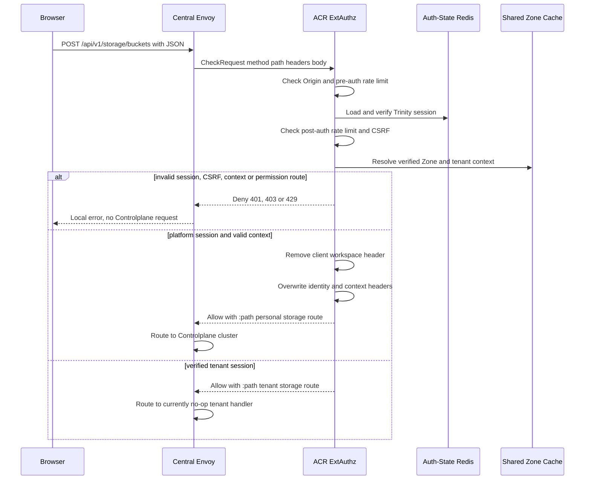
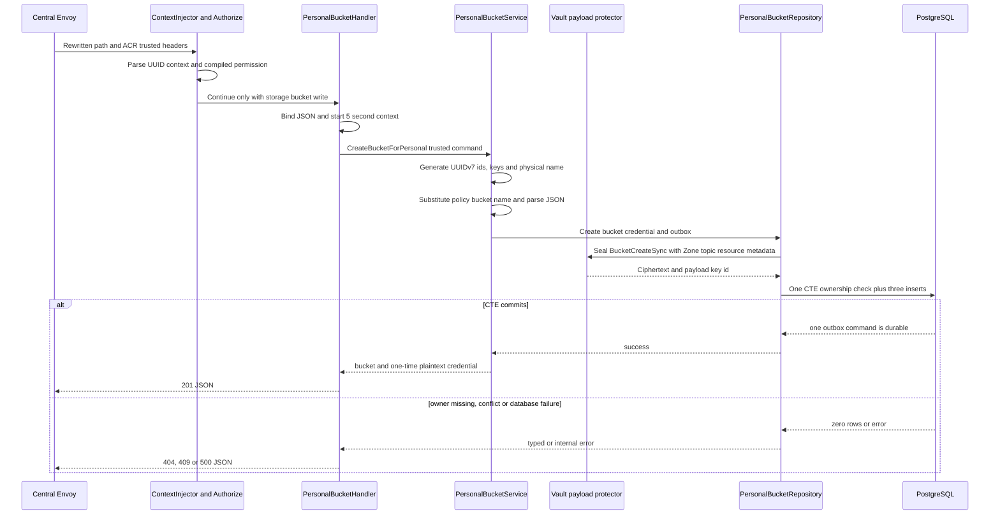
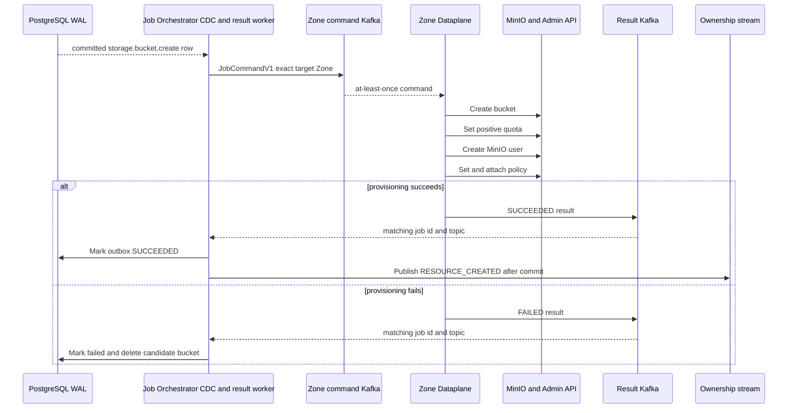
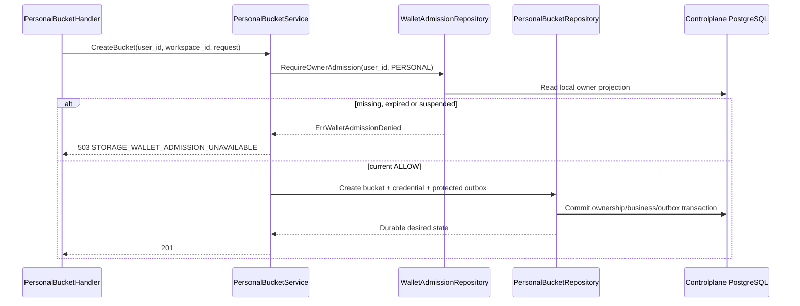

# Personal Bucket Create — God View

Tạo bucket cá nhân là một mutation owner-scoped bất đồng bộ. HTTP `201` chỉ
xác nhận Controlplane đã atomically ghi business row, bootstrap credential và
protected outbox command. Nó **không** chứng minh bucket hoặc credential đã
được MinIO provision xong.

## API-scope contract

Browser chỉ gọi neutral route `POST /api/v1/storage/buckets`. Nó không được
gọi `/personal`, gửi owner, workspace, tenant hay Zone. ACR xác thực Trinity
session, resolve Zone và tenant từ cookie/session đã kiểm chứng, rồi chỉ khi
tenant sentinel là `platform` mới rewrite path thành
`/api/v1/personal/storage/buckets`. Nhánh tenant là workflow khác và hiện
không có handler thực thi.

Controlplane dùng permission key năm bậc
`{username}:{workspace_id}:storage:bucket:write` hoặc wildcard workspace.
Required level là `*`. Repository vẫn recheck `personal_workspaces.owner_id`.
`x-workspace-id` từ browser bị ACR remove trước khi upstream và chỉ cookie
workspace đã xác minh mới được inject lại.

| Boundary | Authority | Durable state |
|---|---|---|
| Browser input | Name, quota, policy và advanced options | None |
| ACR | Trinity session, Zone, tenant branch, workspace cookie | Auth-State Redis session |
| Controlplane | Workspace ownership, bucket/credential/outbox transaction | PostgreSQL |
| JO and Dataplane | Exact outbox command and target Zone | Kafka command/result plus MinIO |

## REST input and output

### Request headers used

| Header | Use at the receiving boundary |
|---|---|
| `Cookie` | Envoy forwards it only to ACR. ACR reads Trinity access session, workspace and Zone context cookies. It is not forwarded to Controlplane as authority. |
| `Origin` | ACR allow-origin check. |
| `X-Requested-With: XMLHttpRequest` or `Sec-Fetch-Site: same-origin|same-site` | Required by ACR CSRF check for this `POST`. |
| `X-Client-Device-ID` cookie value | Pre/post-auth rate-limit dimension after ACR parses the cookie. |
| `traceparent` | Distributed trace propagation when present. |

### JSON payload

| Field | Contract at Controlplane handler |
|---|---|
| `name` | Required and trimmed. Empty is `400`. The physical name becomes `ws-{first-8-workspace-uuid}-{name}`. |
| `quota_bytes` | Accepted as `int64`; no handler-side positive range validation exists. Dataplane only applies a quota when it is positive. |
| `policy` | Required JSON. `<BUCKET_NAME>` is replaced with physical name. Create validates JSON syntax only. |
| `encrypt_enabled`, `versioning_enabled`, `object_locking_enabled`, `replication_enabled`, `legal_hold_enabled` | Required booleans. Stored and transported in the create command. |
| `retention_days`, `tags` | Passed to the create command. |

### Response headers

| Result | Headers used |
|---|---|
| Any JSON result | `Content-Type: application/json` |
| ACR session renewal, when applicable | `Set-Cookie` emitted by ACR, never by Storage handler |

### Response payload

| Status | `data` fields | Meaning |
|---|---|---|
| `201` | `bucket_id`, `bucket_name`, `credential_id`, `access_key`, `secret_key`, `policy` | Command is durable. `secret_key` is plaintext and returned only in this response. |
| `400` | `error`, `message` | Invalid JSON, empty name or invalid policy. |
| `403` | `error`, `message` | ACR session/CSRF/context failure or five-level permission denial. |
| `404` | `error`, `message` | Workspace ownership CTE produced no row. |
| `409` | `error`, `message` | Database unique conflict, mapped as bucket name conflict. |
| `500` | `error=internal_error`, `message` | Vault payload protection, PostgreSQL or another unclassified failure. |

## Key and transport contract

| Key / transport | Store | Operation | Owner and invariant |
|---|---|---|---|
| `iam:user_session:{zone}:{tenant}:{user}:{access_key}` | Auth-State Redis | ACR session lookup | Session establishes user, tenant, Zone and client proof key. |
| Workspace cookie | Browser then ACR | Read by ACR, overwrite `x-workspace-id` | Browser header is removed. Cookie is selection input, while CP permission and repository ownership remain fences. |
| `user_role:{user_id}` | Controlplane L1/cache registry | Load compiled personal permissions | `Authorize` checks exact or `*` workspace permission. |
| `storage.personal_buckets` | PostgreSQL | Insert | Business candidate. No ready/status column exists. |
| `storage.personal_credentials` | PostgreSQL | Insert access key and policy only | The secret key is intentionally not retained in this table. |
| `storage.storage_outbox_records` | PostgreSQL | Insert `storage.bucket.create` in same CTE | First durable async command boundary. Payload is HPKE-protected and has immutable `zone_id`. |
| `aurora.jobs.commands.zone.{zone_id}.v1` | Kafka | JO publishes `JobCommandV1` from WAL | At-least-once delivery. `event_id` is job id. |
| `aurora.jobs.results.v1` | Kafka | Dataplane publishes result | JO settles only the matching durable outbox row. |

## Phase 1 — Client → Envoy → ACR

ACR is the public trust boundary. Envoy sends `CheckRequest` containing exact
method/path, relevant headers and bounded body before routing to Controlplane.
ACR performs CORS, pre-auth rate limit, Trinity session verification,
post-auth rate limit, CSRF, Zone resolution and tenant resolution. It rejects
direct `/api/v1/personal/...` routes so browser cannot choose an owner branch.

For a platform session it removes client `x-workspace-id`, overwrites
`x-user-id`, `x-user-name`, `x-user-level`, `x-tenant-id=platform`,
`x-zone-id`, `x-client-device-id`, and injects the verified workspace cookie
as `x-workspace-id`. It sets `:path` to the internal personal route and adds
`x-original-path`. No credential field is interpreted by ACR.

## Phase 2 — Controlplane personal command transaction

Global `ContextInjector` parses only ACR-injected headers into Gin context.
`Authorize("storage:bucket:write", "*")` loads compiled personal role grants
and matches the workspace-scoped key. The handler gives the command a five
second deadline, binds the JSON and builds `CreatePersonalBucket` using trusted
user, workspace and Zone.

The service generates UUIDv7 bucket and credential ids, generates an access
key and plaintext secret key, derives physical bucket name, substitutes the
policy placeholder and serializes `BucketCreateSync`. Repository seals the
protobuf with job metadata before executing one CTE: verify that workspace is
owned by user, insert bucket, insert credential and insert outbox. A zero-row
CTE is `ErrNotFound`; no partial row survives.

## Phase 3 — Zone provisioning and terminal settlement

JO consumes the PostgreSQL logical changefeed, validates source/topic/version
and forwards the ciphertext byte-for-byte as `JobCommandV1` to the immutable
target Zone. Dataplane validates/open-protects the command, dispatches
`bucket.create`, creates MinIO bucket, applies positive quota, creates user,
then creates and attaches `policy-{access_key}`. It emits a Kafka result.

On `SUCCEEDED`, JO marks the outbox terminal and retains it for audit/recovery,
then publishes the derived resource ownership event. On terminal failure it
marks outbox failed and deletes the candidate personal bucket row. The schema
foreign-key cascade removes the bootstrap credential with it. User notification
is best effort after the authoritative result transaction.

## Failure and security rules

| Condition | Actual behavior |
|---|---|
| HTTP returns `201`, then Zone provisioning fails | Bootstrap secret has already been disclosed. JO removes candidate bucket and credential later; caller must treat completion notification or later read as authoritative. |
| MinIO bucket create succeeds but quota/user/policy fails | Dataplane attempts compensating deletes. Those best-effort rollbacks can themselves fail. |
| Duplicate Kafka command | Stable job id and executor side effects are intended to be retry-safe, but `create_user` does not explicitly accept an already-existing user as success. |
| Job result replay | SQL guard only settles PENDING or PROCESSING row. |
| No actor ownership in the CTE | No bucket, credential or outbox is inserted. |
| Workspace Zone differs from trusted request Zone | Create CTE checks workspace owner but does not require `personal_workspaces.zone_id == outbox.zone_id`. It can persist a bucket for one workspace with another Zone's outbox destination. This is a Zone-binding discrepancy. |
| Secret handling | Secret appears in HTTP `201` and encrypted outbox payload for Dataplane. It is not persisted in `personal_credentials`, but it must not enter logs, analytics or notification payload. |
| Client policy | Create path checks JSON syntax but does not enforce an allow-resource boundary. This differs from additional credential create and is a security discrepancy that must be resolved in code before treating supplied policy as least privilege. |

## Code map

- `controlplane/internal/storage/route.go`
- `controlplane/internal/storage/transport/http/handler/personal_bucket_handler.go`
- `controlplane/internal/storage/service/personal_bucket_service.go`
- `controlplane/internal/storage/repository/personal_bucket_repo.go`
- `job-orchestrator/src/changefeed/dispatch.rs` and `job-orchestrator/src/results/storage/bucket.rs`
- `dataplane/src/executor/storage/bucket.rs`

## Wallet admission gate

The personal owner admission projection is a local Controlplane read model. The
service requires `(owner_id=user_id, owner_type=PERSONAL)` to be effective,
unexpired and `ALLOW` before opening the bucket CTE. A missing, stale,
`SUSPEND_BILLABLE`, corrupt or unavailable projection returns
`503 STORAGE_WALLET_ADMISSION_UNAVAILABLE`; it never queries Billing inline and
never creates a bucket fail-open.

