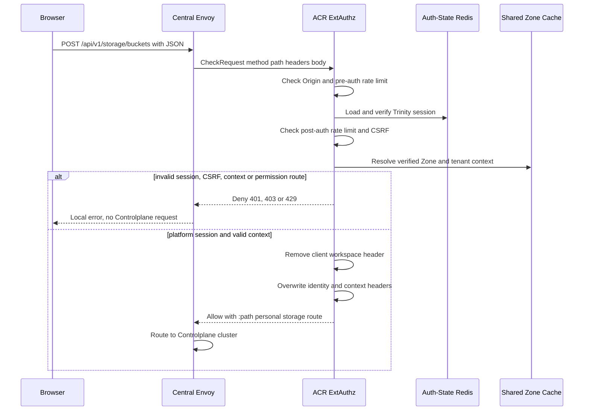
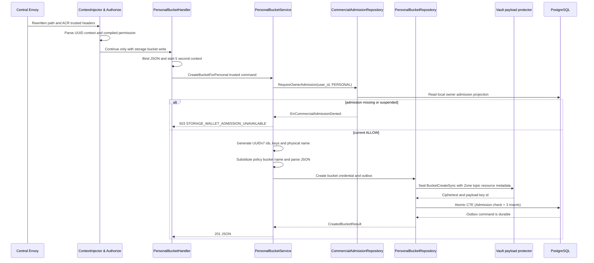
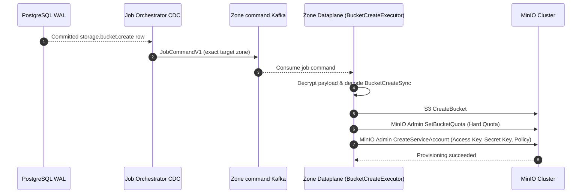
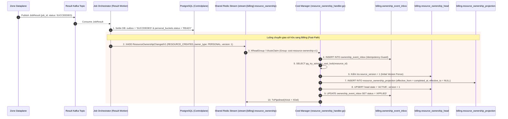
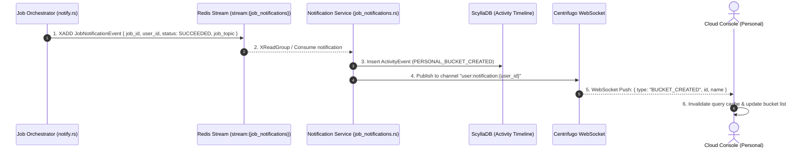
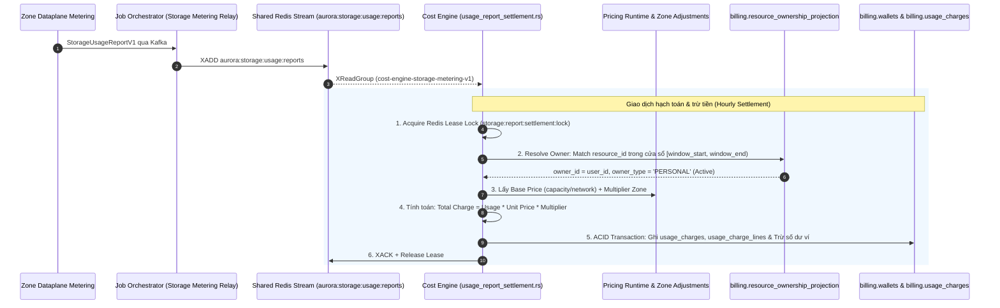

# Personal Bucket Create — God View

> **Critical-route revision (2026-08-26):** the public request is `POST /api/v1/critical/storage/buckets`; ACR consumes the session proof bound to its exact method, path and body, then rewrites only to `/api/v1/personal/critical/storage/buckets`. Controlplane runs `RequireSessionProof` before `Authorize`. Older non-critical route text below is superseded.

Tạo bucket cá nhân là một mutation owner-scoped bất đồng bộ. HTTP `201` chỉ
xác nhận Controlplane đã atomically ghi business row (`PROVISIONING`), bootstrap credential và
protected outbox command (`PENDING`). Nó **không** chứng minh bucket hoặc credential đã
được MinIO provision xong.

## API-scope contract

Browser chỉ gọi neutral route `POST /api/v1/storage/buckets`. Nó không được
gọi `/personal`, gửi owner, workspace, tenant hay Zone. ACR xác thực Trinity
session, resolve Zone và tenant từ cookie/session đã kiểm chứng, rồi chỉ khi
tenant sentinel là `platform` mới rewrite path thành
`/api/v1/personal/storage/buckets`.

Controlplane dùng permission key năm bậc
`{username}:{workspace_id}:storage:bucket:write` hoặc wildcard workspace.
Required level là `*`. Repository vẫn recheck `personal_workspaces.owner_id`.
`x-workspace-id` từ browser bị ACR remove trước khi upstream và chỉ cookie
workspace đã xác minh mới được inject lại.

| Boundary | Authority | Durable state |
|---|---|---|
| Browser input | Name, quota, policy và advanced options | None |
| ACR | Trinity session, Zone, tenant branch, workspace cookie | Auth-State Redis session |
| Controlplane | Workspace ownership, bucket/credential/outbox transaction | PostgreSQL |
| JO and Dataplane | Exact outbox command and target Zone | Kafka command/result plus MinIO |
| Cost Manager | Resource ownership event (`RESOURCE_CREATED`) | Billing PostgreSQL (`resource_ownership_projection`) |

## REST input and output

### Request headers used

| Header | Use at the receiving boundary |
|---|---|
| `Cookie` | Envoy forwards it only to ACR. ACR reads Trinity access session, workspace and Zone context cookies. It is not forwarded to Controlplane as authority. |
| `Origin` | ACR allow-origin check. |
| `X-Requested-With: XMLHttpRequest` or `Sec-Fetch-Site: same-origin|same-site` | Required by ACR CSRF check for this `POST`. |
| `X-Client-Device-ID` cookie value | Pre/post-auth rate-limit dimension after ACR parses the cookie. |
| `traceparent` | Distributed trace propagation when present. |

### JSON payload

| Field | Contract at Controlplane handler |
|---|---|
| `name` | Required and trimmed. Empty is `400`. The physical name becomes `ws-{first-8-workspace-uuid}-{name}`. |
| `quota_bytes` | Accepted as `int64`; no handler-side positive range validation exists. Dataplane only applies a quota when it is positive. |
| `policy` | Required JSON. `<BUCKET_NAME>` is replaced with physical name. Create validates JSON syntax only. |
| `encrypt_enabled`, `versioning_enabled`, `object_locking_enabled`, `replication_enabled`, `legal_hold_enabled` | Required booleans. Stored and transported in the create command. |
| `retention_days`, `tags` | Passed to the create command. |

### Response headers

| Result | Headers used |
|---|---|
| Any JSON result | `Content-Type: application/json` |
| ACR session renewal, when applicable | `Set-Cookie` emitted by ACR, never by Storage handler |

### Response payload

| Status | `data` fields | Meaning |
|---|---|---|
| `201` | `bucket_id`, `bucket_name`, `credential_id`, `access_key`, `secret_key`, `policy` | Command is durable. `secret_key` is plaintext and returned only in this response. |
| `400` | `error`, `message` | Invalid JSON, empty name or invalid policy. |
| `403` | `error`, `message` | ACR session/CSRF/context failure or five-level permission denial. |
| `404` | `error`, `message` | Workspace ownership CTE produced no row. |
| `409` | `error`, `message` | Database unique conflict, mapped as bucket name conflict. |
| `500` | `error=internal_error`, `message` | Vault payload protection, PostgreSQL or another unclassified failure. |
| `503` | `error=STORAGE_WALLET_ADMISSION_UNAVAILABLE` | Wallet admission gate suspended or unrated. |

## Key and transport contract

| Key / transport | Store | Operation | Owner and invariant |
|---|---|---|---|
| `iam:user_session:{zone}:{tenant}:{user}:{access_key}` | Auth-State Redis | ACR session lookup | Session establishes user, tenant, Zone and client proof key. |
| Workspace cookie | Browser then ACR | Read by ACR, overwrite `x-workspace-id` | Browser header is removed. Cookie is selection input, while CP permission and repository ownership remain fences. |
| `user_role:{user_id}` | Controlplane L1/cache registry | Load compiled personal permissions | `Authorize` checks exact or `*` workspace permission. |
| `storage.personal_buckets` | PostgreSQL | Insert with `status='PROVISIONING'` | In-flight candidate. Physical status transitions to `READY` upon JO settlement. |
| `storage.personal_credentials` | PostgreSQL | Insert access key and policy only | The secret key is intentionally not retained in this table. |
| `storage.storage_outbox_records` | PostgreSQL | Insert `storage.bucket.create` in same CTE | First durable async command boundary. Payload is HPKE-protected and has immutable `zone_id`. |
| `aurora.jobs.commands.zone.{zone_id}.v1` | Kafka | JO publishes `JobCommandV1` from WAL | At-least-once delivery. `event_id` is job id. |
| `aurora.jobs.results.v1` | Kafka | Dataplane publishes result | JO settles only the matching durable outbox row. |
| `stream:{billing}:resource_ownership` | Shared Redis Stream | JO publishes `ResourceOwnershipChangedV1` | Cost Manager consumes and updates `resource_ownership_projection`. |

---

## Phase 1 — Client → Envoy → ACR

ACR is the public trust boundary. Envoy sends `CheckRequest` containing exact
method/path, relevant headers and bounded body before routing to Controlplane.
ACR performs CORS, pre-auth rate limit, Trinity session verification,
post-auth rate limit, CSRF, Zone resolution and tenant resolution. It rejects
direct `/api/v1/personal/...` routes so browser cannot choose an owner branch.

For a platform session it removes client `x-workspace-id`, overwrites
`x-user-id`, `x-user-name`, `x-user-level`, `x-tenant-id=platform`,
`x-zone-id`, `x-client-device-id`, and injects the verified workspace cookie
as `x-workspace-id`. It sets `:path` to the internal personal route and adds
`x-original-path`. No credential field is interpreted by ACR.



---

## Phase 2 — Wallet Admission & Controlplane Personal Command Transaction

Global `ContextInjector` parses only ACR-injected headers into Gin context.
`Authorize("storage:bucket:write", "*")` loads compiled personal role grants
and matches the workspace-scoped key. 

Trước khi mở transaction tạo bucket, Service kiểm tra `CommercialAdmission` của `(owner_id=user_id, owner_type=PERSONAL)`:
- Nếu missing, expired hoặc `SUSPEND_BILLABLE` $\to$ trả về `503 STORAGE_WALLET_ADMISSION_UNAVAILABLE`.
- Nếu `ALLOW` $\to$ Repository mã hóa payload `BucketCreateSync` và thực thi CTE nguyên tử:
  1. Xác minh `personal_workspaces.owner_id == user_id`.
  2. Tạo dòng `personal_buckets` với trạng thái `status = 'PROVISIONING'`.
  3. Tạo dòng `personal_credentials` (lưu access_key + policy).
  4. Tạo dòng `storage_outbox_records` với `status = 'PENDING'`.



---

## Phase 3 — Outbox CDC Dispatch & Dataplane Execution

JO consumes the PostgreSQL logical changefeed, validates source/topic/version
and forwards the ciphertext byte-for-byte as `JobCommandV1` to the immutable
target Zone. Dataplane validates/open-protects the command, dispatches
`bucket.create`, creates MinIO bucket, applies positive quota, creates user,
then creates and attaches `policy-{access_key}`.



---

---

## Phase 4 — Job Settlement & Resource Ownership Handover (Billing Registry)

Ngay sau khi nhận kết quả từ Dataplane, Job Orchestrator Result Worker thực thi CTE cập nhật `personal_buckets.status = 'READY'`, chuyển outbox sang `SUCCEEDED`, và **ngay lập tức kích hoạt luồng Fast-Path đẩy sự kiện sở hữu (`RESOURCE_CREATED`) sang Cost Manager** để mở sổ theo dõi cước.



### Hop-by-Hop Contract — Phase 4

#### Hop 4.1: Zone Dataplane → Kafka Result Topic
- **Input Contract (`JobResult` Protobuf)**:
  - `job_id`: UUID (`event_id` của outbox record)
  - `job_topic`: `"storage.bucket.create"`
  - `status`: `JOB_STATUS_SUCCEEDED` / `JOB_STATUS_FAILED`
- **Topic**: `aurora.central.job_results`

#### Hop 4.2: Kafka Result → Job Orchestrator Result Worker
- **Input**: Consumed `JobResult` Protobuf.
- **Authority & Idempotency Fence**:
  - `owner_type`: `"PERSONAL"`
  - `status`: `IN ('PENDING', 'PROCESSING')` (chống replay kết quả cũ)
- **State Transition / Durable Effects**:
  - Khi `SUCCEEDED`:
    - Resource status: Cập nhật `storage.personal_buckets.status = 'READY'`.
    - Outbox settlement: `storage.storage_outbox_records` chuyển trạng thái `status = 'SUCCEEDED'`, cập nhật `completed_at = NOW()`.
  - Khi `FAILED`:
    - Candidate deletion: Xóa dòng `storage.personal_buckets` (`id = resource_id`), schema cascade tự động xóa sạch `storage.personal_credentials`.
    - Outbox settlement: `storage.storage_outbox_records` chuyển trạng thái `status = 'FAILED'`, cập nhật `completed_at = NOW()`.
- **Output Schema (`SettledOutboxRecord`)**:
  - `resource_id`: UUID (`bucket_id`)
  - `resource_name`: string (`bucket_name`)
  - `owner_id`: UUID (`user_id`)
  - `owner_type`: `"PERSONAL"`
  - `zone_id`: UUID
  - `actor_user_id`: UUID
  - `trace_id`: UUID

#### Hop 4.3: Job Orchestrator → Shared Redis Stream
- **Method / Transport**: Lua Script Atomic Check `XLEN < stream_capacity` + `XADD` + `WAITAOF(1, replica_acks, timeout)`.
- **Stream**: `stream:{billing}:resource_ownership`
- **Protobuf**: `ResourceOwnershipChangedV1`
  - `event_id`: Deterministic UUIDv5 (`ownership_event_id`).
  - `event_type`: `"RESOURCE_CREATED"`
  - `resource_type`: `"STORAGE_BUCKET"`
  - `resource_id`: `bucket_id`
  - `resource_name`: `bucket_name`
  - `owner_id`: `user_id`
  - `owner_type`: `"PERSONAL"`
  - `zone_id`: `zone_id`
  - `source_version`: `1`
  - `effective_at`: RFC3339 timestamp (`completed_at`).
  - `source_job_id`: `job_id`
- **Durability Guarantee**: `WAITAOF` đảm bảo Redis đã ghi AOF và sync replica trước khi JO cập nhật `ownership_published_at = NOW()` trong PostgreSQL.
- **Failover / Recovery**: `OwnershipRelay` chạy ngầm định kỳ quét các dòng outbox `status = 'SUCCEEDED' AND ownership_published_at IS NULL` với `FOR UPDATE SKIP LOCKED` để phát bù nếu Redis gặp sự cố.

#### Hop 4.4: Cost Manager Consumer → Billing Database
- **Consumer**: `ResourceOwnershipConsumer` (`cost-resource-ownership-v1`) đọc tin qua `XReadGroup` và `XAutoClaim` (reclaim pending sau 30s).
- **Contract Boundary Validation**: Kiểm tra kích thước payload `<= 64KB`, schema_version == 1, UUID hợp lệ, owner_type `PERSONAL`, W3C traceparent.
- **Single SQL Transaction**:
  1. `INSERT INTO billing.ownership_event_inbox` bảo đảm Idempotency.
  2. `SELECT pg_try_advisory_xact_lock(hashtextextended(resource_id, 0))` chống race condition giữa các pod.
  3. Kiểm tra `source_version == 1` trên `billing.resource_ownership_head`.
  4. Mở cửa sổ cước: `INSERT INTO billing.resource_ownership_projection (id, resource_type, resource_id, resource_name, owner_id, owner_type, zone_id, ownership_version, effective_from, source_updated_at) VALUES ($1, 'STORAGE_BUCKET', $2, $3, $4, 'PERSONAL', $5, 1, $6, NOW())`.
  5. Cập nhật `billing.resource_ownership_head` sang trạng thái `ACTIVE`.
  6. Cập nhật inbox `status = 'APPLIED'`.
- **Post-Commit Clean**: Thực thi Redis Pipeline `XACK` + `XDEL` để giải phóng RAM.

---

## Phase 5 — Timeline Projection & Realtime Client Notification

Sau khi hoàn tất chuyển giao sở hữu, Job Orchestrator đẩy sự kiện thông báo vào Redis Notification Stream để Notification Service lưu ScyllaDB và phát realtime qua Centrifugo WebSocket tới người dùng cá nhân.



### Hop-by-Hop Contract — Phase 5

#### Hop 5.1: Job Orchestrator → Redis Notification Stream
- **Input**: Struct `NotificationIntent`
- **Stream**: `stream:{job_notifications}`
- **Payload**: JSON / MsgPack `JobNotificationEvent`
  - `job_id`: UUID
  - `user_id`: UUID (`actor_user_id`)
  - `status`: `"SUCCEEDED"`
  - `job_topic`: `"storage.bucket.create"`
  - `resource_id`: `bucket_id`

#### Hop 5.2: Notification Service → ScyllaDB & Centrifugo
- **Processing**:
  - Ghi bản ghi audit `ActivityEvent` vào ScyllaDB Timeline.
  - Gọi HTTP API của Centrifugo phát tin nhắn sang channel `user:notification:{user_id}`.

#### Hop 5.3: Centrifugo → Browser Client (UI Wakeup)
- **Transport**: WebSocket Push.
- **Client Processing**: Hook `useStorageAccessSession` / TanStack Query client nhận tin, tự động làm mới danh sách bucket trên giao diện trong 0ms.

---

---

## Phase 6 — Cost Engine Hourly Settlement & Rating Initiation (Background Accounting)

Sau khi Phase 4 mở cửa sổ sở hữu (`effective_from = completed_at, effective_to = NULL`), bucket chính thức bước vào chu kỳ tính cước định kỳ hàng giờ (Hourly Rating Engine). Dataplane định kỳ quét MinIO, gửi báo cáo đo kiểm `StorageUsageReportV1` qua Kafka sang Shared Redis Stream `aurora:storage:usage:reports`. Cost Engine background consumer (`cost-engine-storage-metering-v1`) sẽ đối soát và trừ ví tiền.



### Hop-by-Hop Contract — Phase 6

#### Hop 6.1: Dataplane → Shared Redis Stream (via JO)
- **Transport**: Kafka `{prefix}.storage.usage.reports.v1` → JO Relay → Redis Stream `aurora:storage:usage:reports`.
- **Payload**: Protobuf `StorageUsageReportV1`
  - `report_id`: UUID
  - `zone_id`: UUID
  - `window_start`, `window_end`: RFC3339 timestamps (chu kỳ 1 giờ)
  - `aggregates`: Danh sách bản ghi đo lường (`storage.capacity.gb_hour`, `storage.network_in.byte`, `storage.network_out.byte`).

#### Hop 6.2: Cost Engine Ingestion & Ownership Resolution
- **Consumer**: `usage_report_settlement.rs` (`cost-engine-storage-metering-v1`).
- **Resolution SQL Fence**:
  ```sql
  SELECT owner_id, owner_type, resource_type, zone_id
  FROM billing.resource_ownership_projection
  WHERE resource_id = $1 AND resource_type = 'STORAGE_BUCKET'
    AND effective_from <= $3 AND (effective_to IS NULL OR effective_to > $2)
  LIMIT 1;
  ```
- **Invariant**: Do Phase 4 đã ghi `effective_from`, Cost Engine xác định chính xác `owner_id = user_id` và `owner_type = PERSONAL`.

#### Hop 6.3: Rating & Wallet Settlement Transaction
- **Đơn giá & Hệ số**:
  - `Base Price`: Lấy từ bảng giá gốc `billing.pricing_schedules` (theo đơn vị `GB_HOUR` hoặc `BYTE`).
  - `Zone Multiplier`: Lấy từ `billing.storage_zone_price_adjustment_versions` theo `zone_id`.
  - **Công thức**: $\text{Amount} = \text{Usage Quantity} \times \text{Base Price} \times \frac{\text{Numerator}}{\text{Denominator}}$.
- **PostgreSQL ACID Settlement**:
  1. `INSERT INTO billing.report_inbox` / `billing.line_inbox` (Idempotency).
  2. `INSERT INTO billing.usage_charges` & `billing.usage_charge_lines` (Bản ghi hóa đơn tài chính bất biến).
  3. `UPDATE billing.wallets SET balance = balance - amount, updated_at = NOW() WHERE owner_id = $1 AND owner_type = 'PERSONAL'`.

---

## Failure and security rules

| Condition | Actual behavior |
|---|---|
| HTTP returns `201`, then Zone provisioning fails | Bootstrap secret has already been disclosed. JO removes candidate bucket and credential later; caller must treat completion notification or later read as authoritative. |
| MinIO bucket create succeeds but quota/user/policy fails | Dataplane attempts compensating deletes. Those best-effort rollbacks can themselves fail. |
| Duplicate Kafka command | Stable job id and executor side effects are intended to be retry-safe, but `create_user` does not explicitly accept an already-existing user as success. |
| Job result replay | SQL guard only settles PENDING or PROCESSING row. |
| No actor ownership in the CTE | No bucket, credential or outbox is inserted. |
| Workspace Zone differs from trusted request Zone | Create CTE checks workspace owner but does not require `personal_workspaces.zone_id == outbox.zone_id`. It can persist a bucket for one workspace with another Zone's outbox destination. |
| Secret handling | Secret appears in HTTP `201` and encrypted outbox payload for Dataplane. It is not persisted in `personal_credentials`, but it must not enter logs, analytics or notification payload. |
| Ownership Stream unavailable | Backpressure / Network Timeout | Outbox record retains `ownership_published_at = NULL`; `OwnershipRelay` recovers asynchronously. |

---

## Code map

### Phase 1 — Client → Envoy → ACR
- **ACR ExtAuthz Filter & Session Validation**: `acr/src/auth/`
- **ACR Storage Route & Platform Rewrite**: `acr/src/storage/route.rs`, `acr/src/storage/control_assertion.rs`

### Phase 2 — Wallet Admission & Controlplane Mutation
- **Route Registration**: `controlplane/internal/storage/route.go`
- **HTTP Handler**: `controlplane/internal/storage/transport/http/handler/personal_bucket_handler.go` (`Create`)
- **Domain Service**: `controlplane/internal/storage/service/personal_bucket_service.go` (`CreateBucket`)
- **Commercial Admission Repository**: `controlplane/internal/storage/repository/commercial_admission_repo.go`
- **SQL Repository**: `controlplane/internal/storage/repository/personal_bucket_repo.go` (`Create`)

### Phase 3 — Outbox CDC Dispatch & Dataplane Execution
- **JO Outbox Changefeed Dispatch**: `job-orchestrator/src/changefeed/dispatch.rs`
- **Dataplane Command Executor**: `dataplane/src/executor/storage/bucket.rs`

### Phase 4 — Job Settlement & Resource Ownership Handover (Billing Registry)
- **JO Result Worker (DB Settlement)**: `job-orchestrator/src/results/storage/bucket.rs`, `job-orchestrator/src/results/apply.rs`
- **JO Ownership Fast-Path & Relay**: `job-orchestrator/src/outbox/ownership.rs`, `job-orchestrator/src/outbox/redis.rs`
- **Cost Manager Ownership Consumer**: `cost-manager/api/internal/transport/redis/handler/resource_ownership_handler.go`
- **Cost Manager Ownership Service**: `cost-manager/api/internal/service/resource_ownership_service.go`
- **Cost Manager Ownership Repository**: `cost-manager/api/internal/repository/resource_ownership_repo.go`

### Phase 5 — Timeline Projection & Realtime Client Notification
- **JO Realtime Notifier**: `job-orchestrator/src/results/notify.rs`
- **Notification Service Consumer**: `notification-service/src/application/job_notifications.rs`
- **Centrifugo WebSocket Push**: `notification-service/src/infrastructure/centrifugo.rs`
- **Cloud Console UI**: `cloud-console/src/`

### Phase 6 — Cost Engine Hourly Settlement & Rating Initiation
- **Cost Engine Settlement Worker**: `cost-manager/engine/src/service/storage/usage_report_settlement.rs`
- **Cost Engine Pricing Runtime & Lease**: `cost-manager/engine/src/engine/` (`pricing_runtime.rs`, `settlement.rs`, `lease.rs`)
- **Billing PostgreSQL Tables**: `billing.resource_ownership_projection`, `billing.usage_charges`, `billing.usage_charge_lines`, `billing.wallets`
