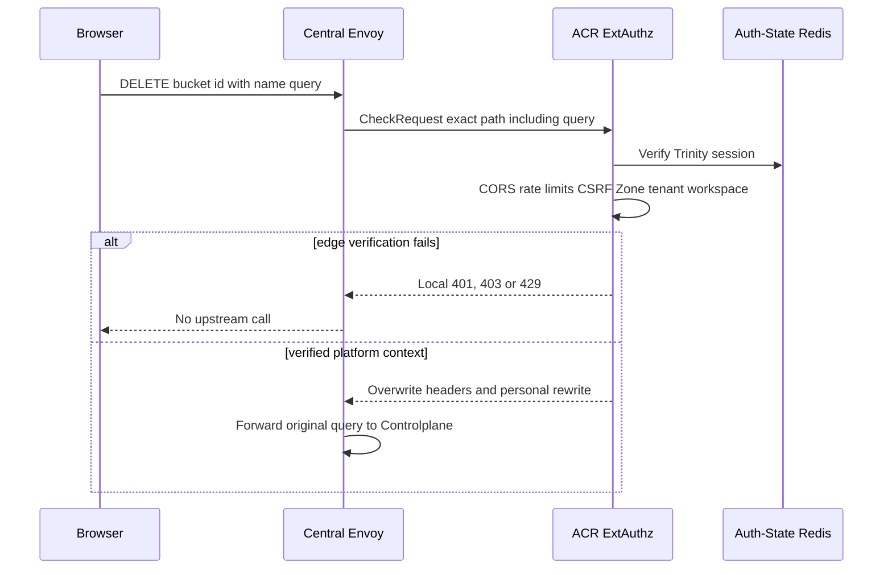
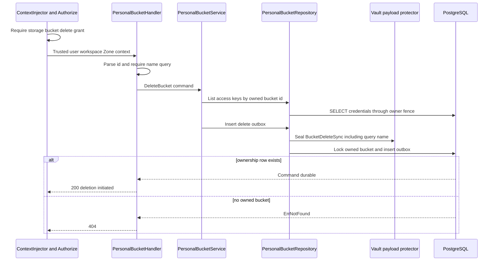
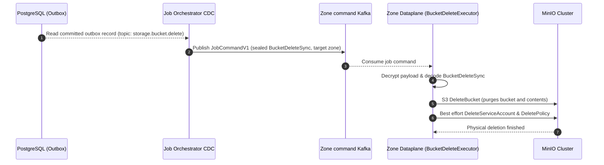
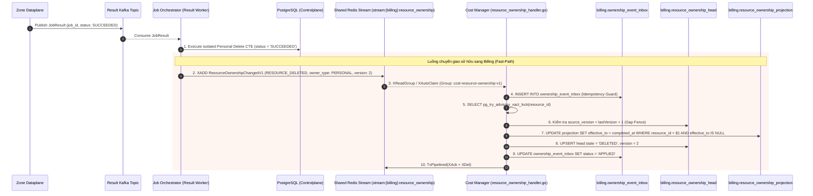
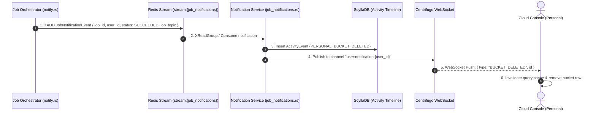
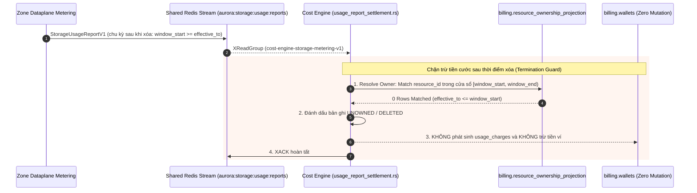

# Personal Bucket Delete — God View

> **Critical-route revision (2026-08-26):** the public request is `DELETE /api/v1/critical/storage/buckets/{bucket_id}` with no body; ACR consumes the exact session proof and rewrites only to `/api/v1/personal/critical/storage/buckets/{bucket_id}`. The bucket name is read from the owner-fenced durable row, never supplied by the browser. Controlplane runs `RequireSessionProof` before `Authorize`. Older non-critical route text below is superseded.

Bucket deletion requests irreversible Zone work. Controlplane retains the bucket
and credentials until Dataplane reports physical bucket deletion success. The
current HTTP contract has a critical name-binding discrepancy below.

## API-scope contract

Browser calls `DELETE /api/v1/storage/buckets/{bucket_id}?name={bucket_name}`.
ACR chooses personal only for a verified platform session, rewrites to the
internal personal route, and injects trusted identity/workspace/Zone context.
`Authorize` requires `storage:bucket:delete` at current workspace or wildcard.
Repository proves bucket ownership by id but does **not** prove that the client
query `name` equals the id's physical name before sealing the command.

## REST input and output

### Request headers used

| Header | Use |
|---|---|
| `Cookie` | ACR resolves Trinity user, platform branch, Zone and workspace. |
| `Origin` | CORS. |
| `X-Requested-With` or `Sec-Fetch-Site` | CSRF requirement for `DELETE`. |
| `traceparent` | Copied to outbox if valid. |

### Path and query payload

| Field | Contract |
|---|---|
| `bucket_id` | UUID. Handler rejects invalid value with `400`. |
| `name` query | Required non-empty trimmed physical name. It is used in `BucketDeleteSync` and outbox `resource_name`. It is not cross-checked against the locked bucket record. |

### Response headers

| Result | Headers |
|---|---|
| All JSON responses | `Content-Type: application/json` |

### Response payload

| Status | Payload |
|---|---|
| `200` | `data: null` and message `bucket deletion initiated` after durable outbox insert |
| `400` | Invalid UUID or missing `name` query |
| `403` | ACR, context or permission failure |
| `404` | Bucket id absent or not owned by user |
| `500` | Payload protection/database failure |

## Key and transport contract

| Store / transport | Operation | Invariant |
|---|---|---|
| Auth-State Redis session | ACR verification | Browser identity and workspace header are never upstream authority. |
| `storage.personal_credentials` | Pre-command SELECT access keys | Access keys for owned bucket are placed in encrypted delete payload. |
| `storage.personal_buckets` | Lock/ownership CTE then later delete | Must remain until successful physical deletion. |
| `storage.storage_outbox_records` | Insert `storage.bucket.delete` | Holds resource id, locked physical `resource_name`, Zone, owner and encrypted payload. The payload still contains client-supplied name. |
| Zone command/result topics | Kafka | JO and Dataplane execute at least once. |
| Ownership stream | Shared Redis stream | Derived `RESOURCE_DELETED` is published after terminal success from durable outbox metadata. |

## Phase 1 — Client → Envoy → ACR

Envoy sends raw path including query string to ACR. ACR checks CORS, rate limits,
session, CSRF, Zone and tenant. It strips caller `x-workspace-id`, overwrites
trusted context headers and rewrites neutral path to personal. It does not parse
or validate `name`; query remains intact for Controlplane.



## Phase 2 — Controlplane deletion command transaction

After permission middleware, handler parses id and requires `name`. Service first
reads access keys using bucket id plus user id. It builds
`BucketDeleteSync{Name: query_name, AccessKeys: owned_bucket_keys}` and sets
outbox Zone/workspace from ACR context. Repository HPKE-seals payload before it
locks the bucket owned by user. The CTE writes locked `bucket.name` into
outbox `resource_name`, but does not compare that locked name to ciphertext
payload. It does not delete business rows here.



## Phase 3 — Outbox CDC Dispatch & Dataplane Execution

Dataplane deletes named physical bucket first. If that succeeds, it tries to
delete each MinIO user and policy but logs and ignores cleanup errors.



---

## Phase 4 — Job Settlement & Resource Ownership Handover (Billing Registry)

Ngay sau khi nhận kết quả từ Dataplane, Job Orchestrator Result Worker thực thi CTE xóa dòng personal bucket vật lý trong PostgreSQL, chuyển outbox sang `SUCCEEDED`, và **ngay lập tức kích hoạt luồng Fast-Path đẩy sự kiện sở hữu (`RESOURCE_DELETED`) sang Cost Manager** để đóng sổ tính cước.



### Hop-by-Hop Contract — Phase 4

#### Hop 4.1: Zone Dataplane → Kafka Result Topic
- **Input Contract (`JobResult` Protobuf)**:
  - `job_id`: UUID (`event_id` của outbox record)
  - `job_topic`: `"storage.bucket.delete"`
  - `status`: `JOB_STATUS_SUCCEEDED` / `JOB_STATUS_FAILED`
- **Topic**: `aurora.central.job_results`

#### Hop 4.2: Kafka Result → Job Orchestrator Result Worker
- **Input**: Consumed `JobResult` Protobuf.
- **Authority & Idempotency Fence**:
  - `owner_type`: `"PERSONAL"`
  - `status`: `IN ('PENDING', 'PROCESSING')` (chống replay kết quả cũ)
  - `zone_id`: `<> 00000000-0000-0000-0000-000000000000`
- **State Transition / Durable Effects**:
  - Khi `SUCCEEDED`:
    - Physical deletion: Xóa dòng `storage.personal_buckets` (`id = locked.resource_id`), schema cascade tự động xóa sạch `storage.personal_credentials`.
    - Outbox settlement: `storage.storage_outbox_records` chuyển trạng thái `status = 'SUCCEEDED'`, cập nhật `completed_at = NOW()`.
  - Khi `FAILED`:
    - Khôi phục bucket: Cập nhật `storage.personal_buckets.status = 'READY'`.
    - Outbox settlement: `storage.storage_outbox_records` chuyển trạng thái `status = 'FAILED'`, cập nhật `completed_at = NOW()`.
- **Output Schema (`SettledOutboxRecord`)**:
  - `resource_id`: UUID (`bucket_id`)
  - `resource_name`: string (`bucket_name`)
  - `owner_id`: UUID (`user_id`)
  - `owner_type`: `"PERSONAL"`
  - `zone_id`: UUID
  - `actor_user_id`: UUID
  - `trace_id`: UUID

#### Hop 4.3: Job Orchestrator → Shared Redis Stream
- **Method / Transport**: Lua Script Atomic Check `XLEN < stream_capacity` + `XADD` + `WAITAOF(1, replica_acks, timeout)`.
- **Stream**: `stream:{billing}:resource_ownership`
- **Protobuf**: `ResourceOwnershipChangedV1`
  - `event_id`: Deterministic UUIDv5 (`ownership_event_id`).
  - `event_type`: `"RESOURCE_DELETED"`
  - `resource_type`: `"STORAGE_BUCKET"`
  - `resource_id`: `bucket_id`
  - `resource_name`: `bucket_name`
  - `owner_id`: `user_id`
  - `owner_type`: `"PERSONAL"`
  - `zone_id`: `zone_id`
  - `source_version`: `2`
  - `effective_at`: RFC3339 timestamp (`completed_at`).
  - `source_job_id`: `job_id`
- **Durability Guarantee**: `WAITAOF` đảm bảo Redis đã ghi AOF và sync replica trước khi JO cập nhật `ownership_published_at = NOW()` trong PostgreSQL.
- **Failover / Recovery**: `OwnershipRelay` chạy ngầm định kỳ quét các dòng outbox `status = 'SUCCEEDED' AND ownership_published_at IS NULL` với `FOR UPDATE SKIP LOCKED` để phát bù nếu Redis gặp sự cố.

#### Hop 4.4: Cost Manager Consumer → Billing Database
- **Consumer**: `ResourceOwnershipConsumer` (`cost-resource-ownership-v1`) đọc tin qua `XReadGroup` và `XAutoClaim` (reclaim pending sau 30s).
- **Contract Boundary Validation**: Kiểm tra kích thước payload `<= 64KB`, schema_version == 1, UUID hợp lệ, owner_type `PERSONAL`, W3C traceparent.
- **Single SQL Transaction**:
  1. `INSERT INTO billing.ownership_event_inbox` bảo đảm Idempotency.
  2. `SELECT pg_try_advisory_xact_lock(hashtextextended(resource_id, 0))` chống race condition giữa các pod.
  3. Kiểm tra `source_version == last_source_version + 1` trên `billing.resource_ownership_head`.
  4. Đóng cửa sổ cước: `UPDATE billing.resource_ownership_projection SET effective_to = $1 WHERE resource_id = $2 AND effective_to IS NULL`.
  5. Cập nhật `billing.resource_ownership_head` sang trạng thái `DELETED`.
  6. Cập nhật inbox `status = 'APPLIED'`.
- **Post-Commit Clean**: Thực thi Redis Pipeline `XACK` + `XDEL` để giải phóng RAM.

---

## Phase 5 — Timeline Projection & Realtime Client Notification

Sau khi hoàn tất chuyển giao sở hữu, Job Orchestrator đẩy sự kiện thông báo vào Redis Notification Stream để Notification Service lưu ScyllaDB và phát realtime qua Centrifugo WebSocket tới người dùng cá nhân.



### Hop-by-Hop Contract — Phase 5

#### Hop 5.1: Job Orchestrator → Redis Notification Stream
- **Input**: Struct `NotificationIntent`
- **Stream**: `stream:{job_notifications}`
- **Payload**: JSON / MsgPack `JobNotificationEvent`
  - `job_id`: UUID
  - `user_id`: UUID (`actor_user_id`)
  - `status`: `"SUCCEEDED"`
  - `job_topic`: `"storage.bucket.delete"`
  - `resource_id`: `bucket_id`

#### Hop 5.2: Notification Service → ScyllaDB & Centrifugo
- **Processing**:
  - Ghi bản ghi audit `ActivityEvent` vào ScyllaDB Timeline.
  - Gọi HTTP API của Centrifugo phát tin nhắn sang kênh cá nhân `user:notification:{user_id}`.

#### Hop 5.3: Centrifugo → Browser Client (UI Wakeup)
- **Transport**: WebSocket Push.
- **Client Processing**: Hook `useStorageAccessSession` / TanStack Query client nhận tin, tự động làm mới danh sách và xóa row bucket đã xóa trên giao diện trong 0ms.

---

## Phase 6 — Cost Engine Final Rating & Settlement Termination (Rating Window Closed)

Sau khi Phase 4 cập nhật `billing.resource_ownership_projection` với `effective_to = completed_at`, vòng đời tính cước của bucket cá nhân chính thức chấm dứt.



### Hop-by-Hop Contract — Phase 6

#### Hop 6.1: Prorated Final Window Settlement (Kỳ cước cuối cùng)
- Đối với chu kỳ giờ chứa mốc `completed_at` (`window_start < effective_to < window_end`):
  - Cost Engine đối soát tìm thấy bản ghi ownership có `effective_to`.
  - Cước dung lượng `storage.capacity.gb_hour` được tính theo tỉ lệ thời gian thực tế bucket tồn tại trước khi bị xóa (`effective_to - window_start`).
  - Hóa đơn cước cuối cùng được chốt và trừ vào ví cá nhân.

#### Hop 6.2: Post-Deletion Fencing & Zero Zombie Billing (Chặn cước sau khi xóa)
- Đối với tất cả các chu kỳ giờ sau thời điểm xóa (`window_start >= effective_to`):
  - **Resolution Guard**:
    ```sql
    SELECT owner_id, owner_type, resource_type, zone_id
    FROM billing.resource_ownership_projection
    WHERE resource_id = $1 AND resource_type = 'STORAGE_BUCKET'
      AND effective_from <= $3 AND (effective_to IS NULL OR effective_to > $2)
    LIMIT 1;
    ```
  - Truy vấn trả về `0 rows` vì `effective_to` đã đóng trước đó.
  - **Durable Guarantee**: Cost Engine ghi nhận trạng thái `UNOWNED` và bỏ qua, **tuyệt đối không trừ tiền ví của người dùng** cho bất kỳ metric dư thừa nào từ Dataplane.

---

## Security discrepancy and failure semantics

| Condition | Actual behavior |
|---|---|
| `name` does not belong to `bucket_id` | Owner CTE validates only id/user. Client name reaches Dataplane and can target another physical bucket. This is a critical command-binding gap. Do not treat endpoint as safe for production deletion until repository derives command name from its locked row. |
| Current selected Zone differs from target bucket Zone | Handler places current ACR Zone in outbox, while repository validates only bucket id/user. It does not bind the locked bucket Zone to command Zone, so a cross-Zone delete command can be routed to wrong Zone. |
| Bucket not empty | MinIO delete fails. JO retains Central bucket/credentials and marks operation failed. |
| Bucket delete succeeds but user/policy cleanup fails | Dataplane still returns success, so Central rows are deleted while MinIO residual users/policies may remain. |
| Result replay | Outbox status guard makes terminal settlement no-op. |
| Ownership stream unavailable | Completed outbox keeps `ownership_published_at` pending for recovery relay. It does not undo physical deletion. |

---

## Code map

### Phase 1 — Client → Envoy → ACR
- **ACR ExtAuthz Filter & Session Validation**: `acr/src/auth/`
- **ACR Storage Route & Rewrite**: `acr/src/storage/route.rs`, `acr/src/storage/control_assertion.rs`

### Phase 2 — Wallet Admission & Controlplane Mutation
- **Route Registration**: `controlplane/internal/storage/route.go`
- **HTTP Handler**: `controlplane/internal/storage/transport/http/handler/personal_bucket_handler.go` (`Delete`)
- **Domain Service**: `controlplane/internal/storage/service/personal_bucket_service.go` (`DeleteBucket`)
- **SQL Repository**: `controlplane/internal/storage/repository/personal_bucket_repo.go` (`Delete`)

### Phase 3 — Outbox CDC Dispatch & Dataplane Execution
- **JO Outbox Changefeed Dispatch**: `job-orchestrator/src/changefeed/dispatch.rs`
- **Dataplane Command Executor**: `dataplane/src/executor/storage/delete.rs`

### Phase 4 — Job Settlement & Resource Ownership Handover (Billing Registry)
- **JO Result Worker (DB Settlement)**: `job-orchestrator/src/results/storage/bucket.rs`, `job-orchestrator/src/results/apply.rs`
- **JO Ownership Fast-Path & Relay**: `job-orchestrator/src/outbox/ownership.rs`, `job-orchestrator/src/outbox/redis.rs`
- **Cost Manager Ownership Consumer**: `cost-manager/api/internal/transport/redis/handler/resource_ownership_handler.go`
- **Cost Manager Ownership Service**: `cost-manager/api/internal/service/resource_ownership_service.go`
- **Cost Manager Ownership Repository**: `cost-manager/api/internal/repository/resource_ownership_repo.go`

### Phase 5 — Timeline Projection & Realtime Client Notification
- **JO Realtime Notifier**: `job-orchestrator/src/results/notify.rs`
- **Notification Service Consumer**: `notification-service/src/application/job_notifications.rs`
- **Centrifugo WebSocket Push**: `notification-service/src/infrastructure/centrifugo.rs`
- **Cloud Console UI**: `cloud-console/src/`

### Phase 6 — Cost Engine Final Rating & Settlement Termination
- **Cost Engine Settlement Worker**: `cost-manager/engine/src/service/storage/usage_report_settlement.rs`
- **Cost Engine Pricing Runtime & Lease**: `cost-manager/engine/src/engine/` (`pricing_runtime.rs`, `settlement.rs`, `lease.rs`)
- **Billing PostgreSQL Tables**: `billing.resource_ownership_projection`, `billing.usage_charges`, `billing.usage_charge_lines`, `billing.wallets`
