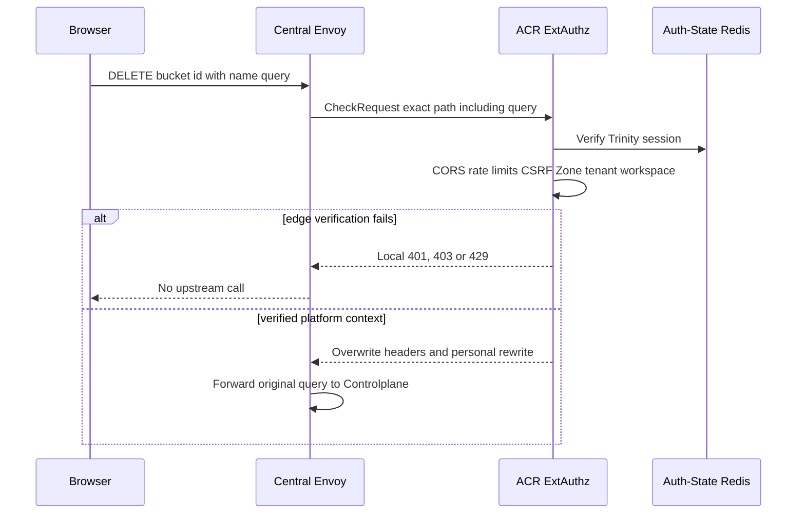
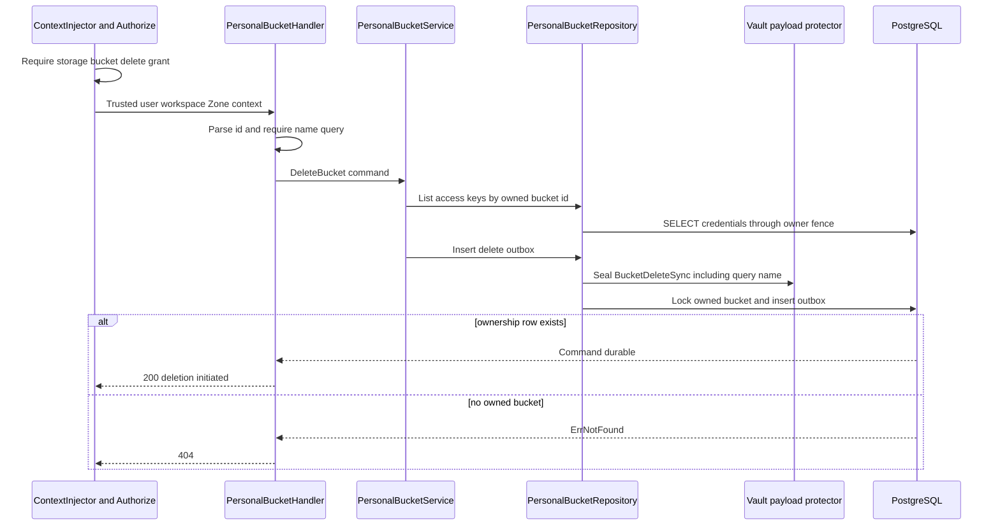
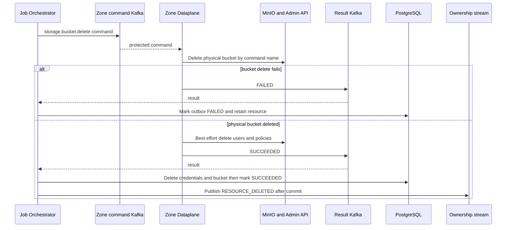

# Personal Bucket Delete — God View

Bucket deletion requests irreversible Zone work. Controlplane retains the bucket
and credentials until Dataplane reports physical bucket deletion success. The
current HTTP contract has a critical name-binding discrepancy below.

## API-scope contract

Browser calls `DELETE /api/v1/storage/buckets/{bucket_id}?name={bucket_name}`.
ACR chooses personal only for a verified platform session, rewrites to the
internal personal route, and injects trusted identity/workspace/Zone context.
`Authorize` requires `storage:bucket:delete` at current workspace or wildcard.
Repository proves bucket ownership by id but does **not** prove that the client
query `name` equals the id's physical name before sealing the command.

## REST input and output

### Request headers used

| Header | Use |
|---|---|
| `Cookie` | ACR resolves Trinity user, platform branch, Zone and workspace. |
| `Origin` | CORS. |
| `X-Requested-With` or `Sec-Fetch-Site` | CSRF requirement for `DELETE`. |
| `traceparent` | Copied to outbox if valid. |

### Path and query payload

| Field | Contract |
|---|---|
| `bucket_id` | UUID. Handler rejects invalid value with `400`. |
| `name` query | Required non-empty trimmed physical name. It is used in `BucketDeleteSync` and outbox `resource_name`. It is not cross-checked against the locked bucket record. |

### Response headers

| Result | Headers |
|---|---|
| All JSON responses | `Content-Type: application/json` |

### Response payload

| Status | Payload |
|---|---|
| `200` | `data: null` and message `bucket deletion initiated` after durable outbox insert |
| `400` | Invalid UUID or missing `name` query |
| `403` | ACR, context or permission failure |
| `404` | Bucket id absent or not owned by user |
| `500` | Payload protection/database failure |

## Key and transport contract

| Store / transport | Operation | Invariant |
|---|---|---|
| Auth-State Redis session | ACR verification | Browser identity and workspace header are never upstream authority. |
| `storage.personal_credentials` | Pre-command SELECT access keys | Access keys for owned bucket are placed in encrypted delete payload. |
| `storage.personal_buckets` | Lock/ownership CTE then later delete | Must remain until successful physical deletion. |
| `storage.storage_outbox_records` | Insert `storage.bucket.delete` | Holds resource id, locked physical `resource_name`, Zone, owner and encrypted payload. The payload still contains client-supplied name. |
| Zone command/result topics | Kafka | JO and Dataplane execute at least once. |
| Ownership stream | Shared Redis stream | Derived `RESOURCE_DELETED` is published after terminal success from durable outbox metadata. |

## Phase 1 — Client → Envoy → ACR

Envoy sends raw path including query string to ACR. ACR checks CORS, rate limits,
session, CSRF, Zone and tenant. It strips caller `x-workspace-id`, overwrites
trusted context headers and rewrites neutral path to personal. It does not parse
or validate `name`; query remains intact for Controlplane.

## Phase 2 — Controlplane deletion command transaction

After permission middleware, handler parses id and requires `name`. Service first
reads access keys using bucket id plus user id. It builds
`BucketDeleteSync{Name: query_name, AccessKeys: owned_bucket_keys}` and sets
outbox Zone/workspace from ACR context. Repository HPKE-seals payload before it
locks the bucket owned by user. The CTE writes locked `bucket.name` into
outbox `resource_name`, but does not compare that locked name to ciphertext
payload. It does not delete business rows here.

## Phase 3 — Physical delete, terminal transaction and ownership event

Dataplane deletes named physical bucket first. If that succeeds, it tries to
delete each MinIO user and policy but logs and ignores cleanup errors. On success
JO locks outbox, reads owner type/resource id/name/Zone, deletes credentials and
bucket in correct table, marks outbox SUCCEEDED, commits, then publishes
`RESOURCE_DELETED`. On failure JO marks outbox FAILED and keeps business rows.

## Security discrepancy and failure semantics

| Condition | Actual behavior |
|---|---|
| `name` does not belong to `bucket_id` | Owner CTE validates only id/user. Client name reaches Dataplane and can target another physical bucket. This is a critical command-binding gap. Do not treat endpoint as safe for production deletion until repository derives command name from its locked row. |
| Current selected Zone differs from target bucket Zone | Handler places current ACR Zone in outbox, while repository validates only bucket id/user. It does not bind the locked bucket Zone to command Zone, so a cross-Zone delete command can be routed to wrong Zone. |
| Bucket not empty | MinIO delete fails. JO retains Central bucket/credentials and marks operation failed. |
| Bucket delete succeeds but user/policy cleanup fails | Dataplane still returns success, so Central rows are deleted while MinIO residual users/policies may remain. |
| Result replay | Outbox status guard makes terminal settlement no-op. |
| Ownership stream unavailable | Completed outbox keeps `ownership_published_at` pending for recovery relay. It does not undo physical deletion. |

## Code map

- `controlplane/internal/storage/transport/http/handler/personal_bucket_handler.go`
- `controlplane/internal/storage/service/personal_bucket_service.go`
- `controlplane/internal/storage/repository/personal_bucket_repo.go`
- `dataplane/src/executor/storage/delete.rs`
- `job-orchestrator/src/results/storage/bucket.rs`
- `job-orchestrator/src/outbox/ownership.rs`
