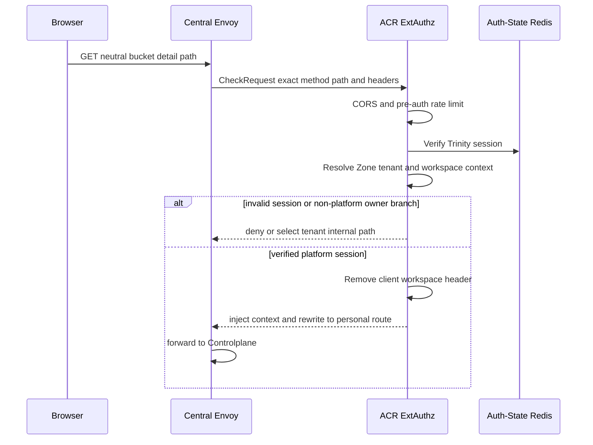
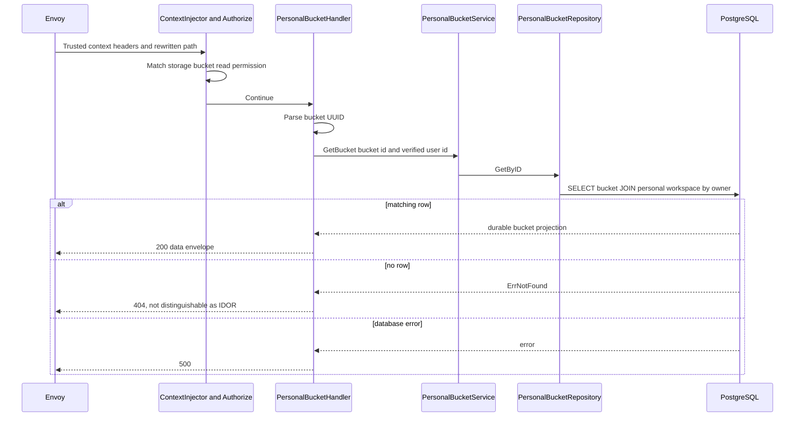

# Personal Bucket Detail Read — God View

Đây là read workflow cho một bucket id. Nó chỉ đọc PostgreSQL business state;
không gọi Dataplane hay MinIO và không thử suy luận trạng thái provision thực.

## API-scope contract

Browser gọi `GET /api/v1/storage/buckets/{bucket_id}`. ACR chọn personal chỉ
từ Trinity tenant context `platform`, rewrite nội bộ sang
`/api/v1/personal/storage/buckets/{bucket_id}`, và inject context đã kiểm
chứng. Controlplane cần permission
`{username}:{workspace_id}:storage:bucket:read` hoặc wildcard. Repository còn
join qua workspace owner, vì UUID bucket từ URL không phải authority.

## REST input and output

### Request headers used

| Header | Use |
|---|---|
| `Cookie` | ACR loads verified Trinity, workspace and Zone context. |
| `Origin` | ACR CORS check. |
| `traceparent` | Trace propagation only. |

### Path payload

| Field | Constraint |
|---|---|
| `bucket_id` | UUID parsed by handler. Invalid form is `400`. |

### Response headers

| Result | Headers |
|---|---|
| All results | `Content-Type: application/json` |

### Response payload

| Status | `data` |
|---|---|
| `200` | `id`, physical `name`, `capacity_quota_bytes`, `used_bytes`, `created_at`, `updated_at` |
| `400` | Invalid UUID error envelope |
| `403` | ACR/context/permission failure |
| `404` | Bucket absent or owned by another personal workspace |
| `500` | Storage read failure |

## Key contract

| Key / store | Operation | Invariant |
|---|---|---|
| `iam:user_session:{zone}:{tenant}:{user}:{access_key}` in Auth-State Redis | ACR read | Establishes identity before any owner rewrite. |
| Workspace cookie → `x-workspace-id` | ACR overwrite | Required by permission middleware, but repository owner join is independent of selected workspace. |
| `user_role:{user_id}` cache entry | `Authorize` load | Holds compiled personal grants. |
| `storage.personal_buckets` joined to `hierarchy.personal_workspaces` | PostgreSQL SELECT | `b.id=$1 AND w.owner_id=$2`; inaccessible bucket looks exactly like missing bucket. |

## Phase 1 — Client → Envoy → ACR

This is a standard personal, non-critical read. ACR applies CORS and the
general pre-auth rate limit, verifies the session, applies post-auth rate
limit, resolves Zone and tenant, then selects the personal route. `GET` passes
the CSRF method check. It strips a client workspace header before injecting the
cookie-derived value and overwrites all identity context headers.

## Phase 2 — Controlplane authorization and durable read

`ContextInjector` parses the trusted identity headers. `Authorize` requires
the workspace-scoped read grant before handler execution. The handler uses a
five-second request context, parses only the UUID, and calls
`PersonalBucketService.GetBucket`. The service delegates to one repository
query; it does not query Zone/MinIO because `used_bytes` is the latest
asynchronous PostgreSQL projection, not a live S3 probe.

## Failure and recovery

| Condition | Behavior |
|---|---|
| Bucket create is still pending | Row already exists after command commit, so this endpoint can show it even before MinIO succeeds. |
| Create later fails | JO removes the candidate row. A subsequent read becomes `404`. |
| Size lag | `used_bytes` remains the last accepted size snapshot. Read does not block on Zone reachability. |
| Cross-owner UUID probe | Repository returns no row and handler replies `404`. |
| Cross-workspace or cross-Zone UUID owned by same user | Repository checks owner only, not current workspace or Zone. A grant on the selected workspace can therefore read another personally owned bucket by UUID. This differs from list/names scope behavior. |
| Missing workspace cookie | ACR may authenticate user but Controlplane `Authorize` rejects because its permission key requires workspace context. |

## Code map

- `acr/src/gateway/ext_authz.rs`
- `controlplane/internal/http/middleware/authorize.go`
- `controlplane/internal/storage/transport/http/handler/personal_bucket_handler.go`
- `controlplane/internal/storage/service/personal_bucket_service.go`
- `controlplane/internal/storage/repository/personal_bucket_repo.go`
