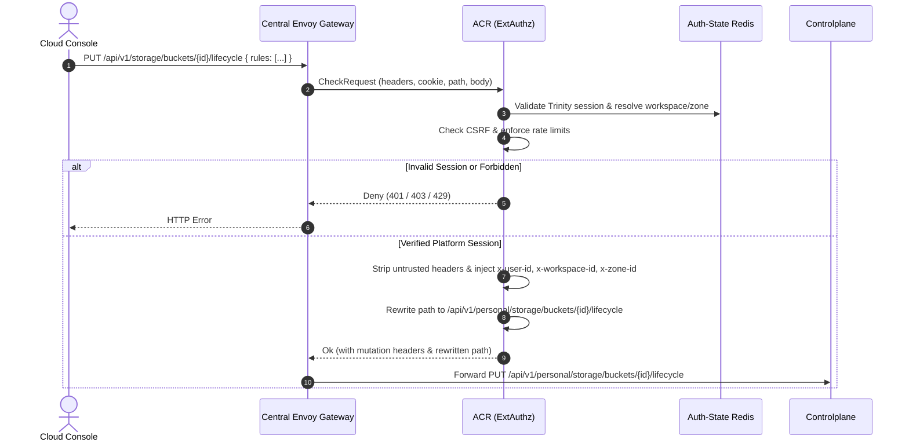
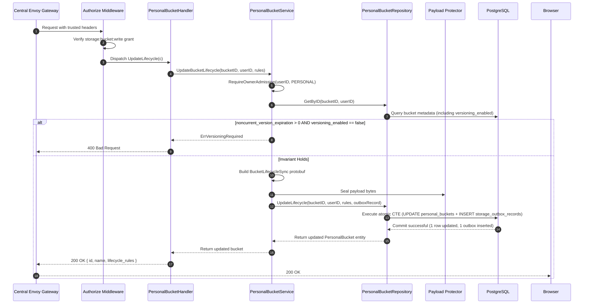
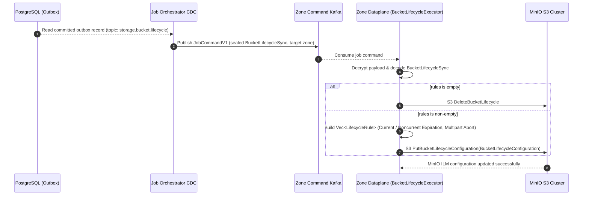
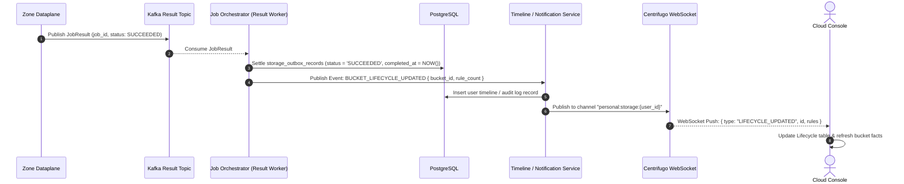

# Personal Bucket Lifecycle Update — God View

Bucket Lifecycle update is an asynchronous policy synchronization workflow.
Controlplane validates lifecycle rules (enforcing that noncurrent version expiration
requires bucket versioning to be active), persists desired rules to PostgreSQL,
and writes a sealed Zone outbox command within an atomic CTE transaction. A `200 OK`
means the desired state has been safely persisted; physical S3 ILM engine configuration
occurs asynchronously via Dataplane at the edge zone.

---

## API-scope contract

Browser calls `PUT /api/v1/storage/buckets/{bucket_id}/lifecycle`. ACR validates the
Trinity session, extracts workspace/zone authority, rewrites the path to
`/api/v1/personal/storage/buckets/{bucket_id}/lifecycle`, and injects trusted identity
headers (`x-user-id`, `x-workspace-id`, `x-zone-id`). Controlplane requires
`storage:bucket:write` permission. Repository verifies the versioning invariant, updates
the owned bucket record, and inserts a `BucketLifecycleSync` outbox job.

---

## REST input and output

### Request headers used

| Header | Use |
|---|---|
| `Cookie` | ACR derives Trinity session, Zone, and workspace context. |
| `Origin` | CORS enforcement at Envoy / ACR. |
| `X-Requested-With` or `Sec-Fetch-Site` | Required by ACR CSRF check for `PUT`. |
| `traceparent` | Injected into outbox record for distributed OpenTelemetry tracing. |

### JSON payload

```json
{
  "rules": [
    {
      "id": "rule-expire-logs",
      "enabled": true,
      "prefix": "logs/",
      "expiration_days": 30,
      "noncurrent_version_expiration_days": 14,
      "abort_incomplete_multipart_upload_days": 7
    }
  ]
}
```

| Field | Type | Contract |
|---|---|---|
| `rules` | `Array<BucketLifecycleRule>` | **Required**. Max 100 rules. Empty array deletes all lifecycle rules. |
| `rules[].id` | `string` | **Required**. Non-empty string, max 64 characters, unique per bucket. |
| `rules[].enabled` | `boolean` | **Required**. Status of the rule. |
| `rules[].prefix` | `string` | Prefix filter (e.g. `"logs/"`, or `""` for entire bucket). |
| `rules[].expiration_days` | `integer` | Expiration days for current version (`>= 0`, 0 = disabled). |
| `rules[].noncurrent_version_expiration_days` | `integer` | Expiration days for noncurrent versions (`>= 0`, 0 = disabled). **Strict Invariant: Requires `versioning_enabled == true`**. |
| `rules[].abort_incomplete_multipart_upload_days` | `integer` | Abort incomplete multipart upload days (`>= 0`, 0 = disabled). |

### Response payload

| Status | Payload | Reason |
|---|---|---|
| `200` | `{"status": "success", "data": { "id": "...", "name": "...", "lifecycle_rules": [...] }, "message": "bucket lifecycle rules updated"}` | Desired lifecycle rules committed to PostgreSQL. |
| `400` | `{"status": "error", "code": "VERSIONING_REQUIRED", "message": "noncurrent version expiration requires bucket versioning to be enabled"}` | Invariant violation: `noncurrent_version_expiration_days > 0` but bucket versioning is disabled. |
| `400` | `{"status": "error", "code": "BAD_REQUEST", "message": "invalid request body"}` | Validation error (duplicate rule ID, invalid days, etc.). |
| `401` | `{"status": "error", "code": "UNAUTHORIZED", "message": "unauthorized"}` | Missing or invalid Trinity session cookie. |
| `403` | `{"status": "error", "code": "FORBIDDEN", "message": "permission denied"}` | Missing `storage:bucket:write` permission grant. |
| `404` | `{"status": "error", "code": "NOT_FOUND", "message": "bucket not found"}` | Bucket does not exist or is not owned by the user. |
| `503` | `{"status": "error", "code": "STORAGE_WALLET_ADMISSION_UNAVAILABLE", "message": "storage billing admission is not currently available"}` | Billing / admission gate check denied. |
| `500` | `{"status": "error", "code": "INTERNAL_ERROR", "message": "internal_error"}` | Database error, payload sealing failure, or outbox insert error. |

---

## Key and transport contract

| Key / Transport | Store | Operation | Invariant |
|---|---|---|---|
| Auth-State session | Redis (Central) | Read / verify | Edge must never allow client to forge user or workspace context. |
| `storage.personal_buckets.lifecycle_rules` | PostgreSQL | Locked update | Source of truth for desired bucket lifecycle rules. |
| `storage.storage_outbox_records` | PostgreSQL | Insert | Topic `storage.bucket.lifecycle`, payload `BucketLifecycleSync`. |
| `storage.bucket.lifecycle` | Kafka (Zone Command) | At-least-once publish | Sealed binary payload dispatched to the bucket's target Zone. |
| `dataplane.job_result` | Kafka (Result) | Publish result | Dataplane returns terminal status (`SUCCEEDED` / `FAILED`). |
| Centrifugo WebSocket | Centrifugo | Publish channel | `personal:storage:{user_id}` receives live bucket lifecycle update. |

---

## Phase 1 — Client → Envoy → ACR



### Hop-by-Hop Contract — Phase 1

#### Hop 1.1: Browser → Central Envoy Gateway
- **Input**:
  - Method: `PUT`
  - URL: `/api/v1/storage/buckets/{bucket_id}/lifecycle`
  - Headers: `Cookie: trinity_session=...`, `Origin: https://console.aurora.local`, `Content-Type: application/json`, `X-Requested-With: XMLHttpRequest`
  - Body: JSON with `rules` array.
- **Output**: Forwarded verbatim as gRPC `CheckRequest` to ACR ExtAuthz filter.

#### Hop 1.2: Envoy → ACR (ExtAuthz gRPC CheckRequest)
- **Input**:
  - `envoy.service.auth.v3.CheckRequest` with full HTTP attributes (method, path, headers, client IP, raw body).
- **Processing**:
  1. Validates CORS origin against allowed console domains.
  2. Enforces IP-based and user-based rate limits.
  3. Queries Auth-State Redis with `trinity_session` key to extract `user_id`, `workspace_id`, and `zone_id`.
  4. Verifies CSRF protection header (`X-Requested-With` or `Sec-Fetch-Site`).
- **Output**:
  - On failure: gRPC `DeniedHttpResponse` with status `401 Unauthorized`, `403 Forbidden`, or `429 Too Many Requests`.
  - On success: `OkHttpResponse` containing:
    - `headers_to_remove`: `["cookie", "authorization", "x-user-id", "x-workspace-id", "x-zone-id"]`
    - `headers_to_add`: `x-user-id: {uuid}`, `x-workspace-id: {uuid}`, `x-zone-id: {uuid}`, `x-actor-type: personal`
    - `path_mutation`: rewrite `:path` to `/api/v1/personal/storage/buckets/{bucket_id}/lifecycle`.

#### Hop 1.3: Envoy → Controlplane Upstream
- **Input**:
  - `PUT /api/v1/personal/storage/buckets/{bucket_id}/lifecycle` with trusted identity headers injected by ACR and unchanged request body.
- **Output**: HTTP connection to Controlplane Go HTTP router.

---

## Phase 2 — Controlplane Desired-State Transaction



### Hop-by-Hop Contract — Phase 2

#### Hop 2.1: ContextInjector & Authorize Middleware
- **Input**: Request context containing `x-user-id`, `x-workspace-id`, `x-zone-id`.
- **Processing**: Evaluates L1 Permission Registry for action `storage:bucket:write`.
- **Output**: Enriched `context.Context` containing validated `userID`, `workspaceID`, and `zoneID`.

#### Hop 2.2: PersonalBucketHandler → PersonalBucketService
- **Input**:
  - `bucketID`: UUID parsed from URL path `:id`.
  - `userID`: UUID from trusted request context.
  - `rules`: Array of `BucketLifecycleRule` bound from JSON body `UpdateBucketLifecycleRequest`.
- **Processing**:
  1. Validates rule syntax (unique rule IDs, non-negative days, max 100 rules).
  2. Checks Commercial Admission Gate (`RequireOwnerAdmission`) for owner status `ALLOW`.
  3. Queries current bucket details (`GetByID`) to retrieve `name`, `zone_id`, and `versioning_enabled`.
  4. **Strict Invariant Verification**: If any rule has `noncurrent_version_expiration_days > 0` and `bucket.versioning_enabled == false`, returns `ErrVersioningRequired` (mapped to `400 Bad Request`).
  5. Constructs Protobuf message `BucketLifecycleSync`:
     ```protobuf
     BucketLifecycleSync {
       bucket_id: "3fa85f64-5717-4562-b3fc-2c963f66afa6",
       name: "ws-personal-user1-bucket",
       rules: [
         LifecycleRuleSync {
           id: "rule-expire-logs",
           enabled: true,
           prefix: "logs/",
           expiration_days: 30,
           noncurrent_version_expiration_days: 14,
           abort_incomplete_multipart_upload_days: 7
         }
       ]
     }
     ```
  6. Marshals protobuf and seals bytes via Vault Payload Protector (topic: `storage.bucket.lifecycle`).
  7. Prepares `StorageOutboxRecord` with `job_topic: "storage.bucket.lifecycle"`, `zone_id`, `event_id` (UUIDv7).
- **Output**: Call to `repo.UpdateLifecycle(ctx, bucketID, userID, rules, outboxRecord)`.

#### Hop 2.3: PersonalBucketRepository → PostgreSQL Atomic CTE
- **Input SQL Query**:
  ```sql
  WITH target_bucket AS (
      SELECT b.id, b.name, b.zone_id, b.versioning_enabled
      FROM storage.personal_buckets b
      JOIN hierarchy.personal_workspaces w ON b.workspace_id = w.id
      WHERE b.id = $1 AND w.user_id = $2
      FOR UPDATE OF b
  ),
  updated_bucket AS (
      UPDATE storage.personal_buckets
      SET lifecycle_rules = $3::jsonb,
          updated_at = NOW()
      WHERE id IN (SELECT id FROM target_bucket)
      RETURNING id, name, workspace_id, zone_id, capacity_quota_bytes, used_bytes, versioning_enabled, lifecycle_rules, created_at, updated_at
  ),
  inserted_outbox AS (
      INSERT INTO storage.storage_outbox_records (
          event_id, zone_id, job_topic, payload, owner_id, owner_type, actor_user_id, status, job_version, resource_id, resource_name, payload_schema_version, trace_id, idle
      )
      SELECT $4, tb.zone_id, $5, $6, $7, $8, $9, $10, 1, tb.id::text, tb.name, 1, $11, 30
      FROM target_bucket tb
  )
  SELECT id, name, workspace_id, zone_id, capacity_quota_bytes, used_bytes, versioning_enabled, lifecycle_rules, created_at, updated_at
  FROM updated_bucket;
  ```
- **Output**: Atomic commit of updated `lifecycle_rules` JSONB column and `storage_outbox_records` pending row.

#### Hop 2.4: Controlplane → Browser
- **Input**: Updated `PersonalBucket` entity.
- **Output**: HTTP `200 OK` JSON:
  ```json
  {
    "status": "success",
    "data": {
      "id": "3fa85f64-5717-4562-b3fc-2c963f66afa6",
      "name": "ws-personal-user1-bucket",
      "lifecycle_rules": [
        {
          "id": "rule-expire-logs",
          "enabled": true,
          "prefix": "logs/",
          "expiration_days": 30,
          "noncurrent_version_expiration_days": 14,
          "abort_incomplete_multipart_upload_days": 7
        }
      ]
    },
    "message": "bucket lifecycle rules updated"
  }
  ```

---

## Phase 3 — Outbox CDC Dispatch & Dataplane Execution



### Hop-by-Hop Contract — Phase 3

#### Hop 3.1: PostgreSQL WAL → Job Orchestrator CDC Engine
- **Input**: Database CDC changefeed record from `storage.storage_outbox_records` where `status = 'PENDING'` and `job_topic = 'storage.bucket.lifecycle'`.
- **Output**: Internal `JobCommandV1` containing `event_id`, `zone_id`, `payload` (ciphertext), and trace headers.

#### Hop 3.2: Job Orchestrator → Zone Command Kafka Topic
- **Input**: `JobCommandV1` partitioned by `zone_id`.
- **Topic**: `aurora.zone.{zone_id}.storage.bucket.lifecycle`
- **Output**: Message committed to Kafka broker partition.

#### Hop 3.3: Kafka → Zone Dataplane (`BucketLifecycleExecutor`)
- **Input**: Consumed Kafka record delivered to Dataplane runtime.
- **Processing**:
  1. Validates payload envelope and decrypts payload using Zone key.
  2. Decodes `storage_proto::BucketLifecycleSync`.
  3. Initializes AWS SDK S3 client configured with local MinIO cluster endpoint.
  4. If `sync_data.rules.is_empty()`:
     - Calls `s3_client.delete_bucket_lifecycle().bucket(&sync_data.name).send().await`.
  5. If `sync_data.rules` is non-empty:
     - Iterates through rules and constructs `aws_sdk_s3::types::LifecycleRule` objects:
       - `status`: `ExpirationStatus::Enabled` / `Disabled`
       - `filter`: `LifecycleRuleFilter::Prefix(rule.prefix)`
       - `expiration`: `LifecycleExpiration::builder().days(rule.expiration_days).build()` (when `expiration_days > 0`)
       - `noncurrent_version_expiration`: `NoncurrentVersionExpiration::builder().noncurrent_days(rule.noncurrent_version_expiration_days).build()` (when `noncurrent_version_expiration_days > 0`)
       - `abort_incomplete_multipart_upload`: `AbortIncompleteMultipartUpload::builder().days_after_initiation(rule.abort_incomplete_multipart_upload_days).build()` (when `abort_incomplete_multipart_upload_days > 0`)
     - Packages rules into `BucketLifecycleConfiguration`.
     - Executes S3 SDK `PutBucketLifecycleConfiguration`:
       ```rust
       s3_client.put_bucket_lifecycle_configuration()
           .bucket(&sync_data.name)
           .lifecycle_configuration(lifecycle_config)
           .send().await
       ```
- **Output**: MinIO S3 cluster updates physical ILM lifecycle configuration.

---

## Phase 4 — Job Settlement, Timeline & Realtime Notification



### Hop-by-Hop Contract — Phase 4

#### Hop 4.1: Zone Dataplane → Kafka Result Topic
- **Input**:
  - Protobuf `JobResult`:
    ```protobuf
    JobResult {
      job_id: "01916fe8-444a-714d-91b5-555e5fbdd98b",
      topic: "storage.bucket.lifecycle",
      status: JOB_STATUS_SUCCEEDED,
      result_payload: [],
      error_message: ""
    }
    ```
- **Topic**: `aurora.central.job_results`
- **Output**: Result message persisted in Kafka.

#### Hop 4.2: Kafka Result → Job Orchestrator Result Worker
- **Input**: `JobResult` consumed by Central Job Orchestrator.
- **SQL Execution**:
  ```sql
  UPDATE storage.storage_outbox_records
  SET status = 'SUCCEEDED',
      completed_at = NOW(),
      updated_at = NOW()
  WHERE event_id = $1 AND status IN ('PENDING', 'PROCESSING');
  ```
- **Output**: Outbox record transition to terminal state `SUCCEEDED`.

#### Hop 4.3: Job Orchestrator → Timeline / Notification Service
- **Input**: Internal Domain Event `STORAGE_BUCKET_LIFECYCLE_UPDATED`:
  - `user_id`: UUID
  - `bucket_id`: UUID
  - `bucket_name`: string
  - `rule_count`: int
- **Processing**: Inserts record into `user_timeline_records` table:
  - Event: `"storage.bucket.lifecycle.updated"`
  - Description: `"Updated lifecycle configuration ({rule_count} rules) for bucket {name}."`
- **Output**: Timeline database record created.

#### Hop 4.4: Timeline Service → Centrifugo WebSocket Engine
- **Input**: HTTP POST to Centrifugo Server API:
  - Endpoint: `http://centrifugo:8000/api/publish`
  - Body:
    ```json
    {
      "channel": "personal:storage:3fa85f64-5717-4562-b3fc-2c963f66afa6",
      "data": {
        "type": "BUCKET_LIFECYCLE_UPDATED",
        "bucket_id": "3fa85f64-5717-4562-b3fc-2c963f66afa6",
        "rule_count": 1,
        "timestamp": "2026-08-20T13:45:00Z"
      }
    }
    ```
- **Output**: Centrifugo broadcasts frame over active WebSocket connection.

#### Hop 4.5: Centrifugo → Browser (Cloud Console UI)
- **Input**: WebSocket frame delivered to user's browser session.
- **Processing**:
  - React hook `useBucketRealtimeSync` / TanStack Query client intercepts event.
  - Invalidates queries with key `["storage", "buckets", bucketId, "lifecycle"]`.
  - Re-renders `LifecycleTab` table with fresh rules from server.
- **Output**: Live UI state updated for the user.

---

## Failure and security rules

| Condition | Failure Semantics | Recovery / Settlement |
|---|---|---|
| Noncurrent expiration requested on non-versioned bucket | HTTP `400 Bad Request` (`ErrVersioningRequired`) | Fail-closed immediately before DB mutation. User must enable versioning first. |
| Duplicate rule ID in request | HTTP `400 Bad Request` | Request rejected in handler validation. |
| User does not own bucket | HTTP `404 Not Found` | No DB mutation or outbox insert occurs. |
| DB transaction fails | HTTP `500 Internal Error` | Transaction rolled back; outbox record is never published. |
| MinIO API temporarily unreachable | Dataplane retries with exponential backoff | If terminal failure, Dataplane reports `FAILED`; JO marks outbox `FAILED` and emits failure notification. |
| Duplicate Kafka message delivery | Idempotent S3 `PutBucketLifecycleConfiguration` execution | MinIO replaces entire lifecycle rule set idempotently. |

---

## Code map

- **God View SoT**: `god_view/storage/personal_bucket_lifecycle_update_god_view_workflow.md`
- **Protobuf Contract**: `proto/dataplane/storage_job.proto` (`BucketLifecycleSync`, `LifecycleRuleSync`)
- **Controlplane Route**: `controlplane/internal/storage/route.go`
- **Controlplane Handler**: `controlplane/internal/storage/transport/http/handler/personal_bucket_handler.go` (`UpdateLifecycle`, `GetLifecycle`)
- **Controlplane Service**: `controlplane/internal/storage/service/personal_bucket_service.go` (`UpdateBucketLifecycle`, `GetBucketLifecycle`)
- **Controlplane Repository**: `controlplane/internal/storage/repository/personal_bucket_repo.go` (`UpdateLifecycle`)
- **Dataplane Executor**: `dataplane/src/executor/storage/lifecycle.rs` (`BucketLifecycleExecutor`)
- **Dataplane Router**: `dataplane/src/executor/storage/delivery.rs` (`"bucket.lifecycle"`)
- **Cloud Console UI**: `cloud-console/src/app/(console)/storage/[id]/components/LifecycleTab.tsx`
